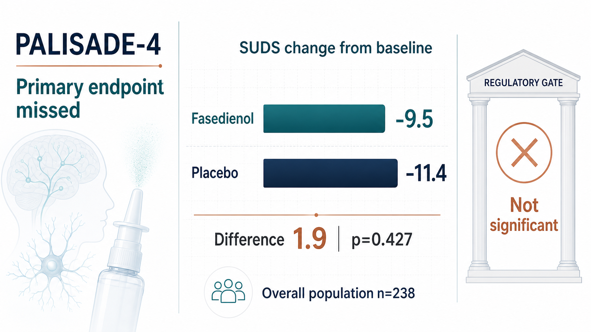
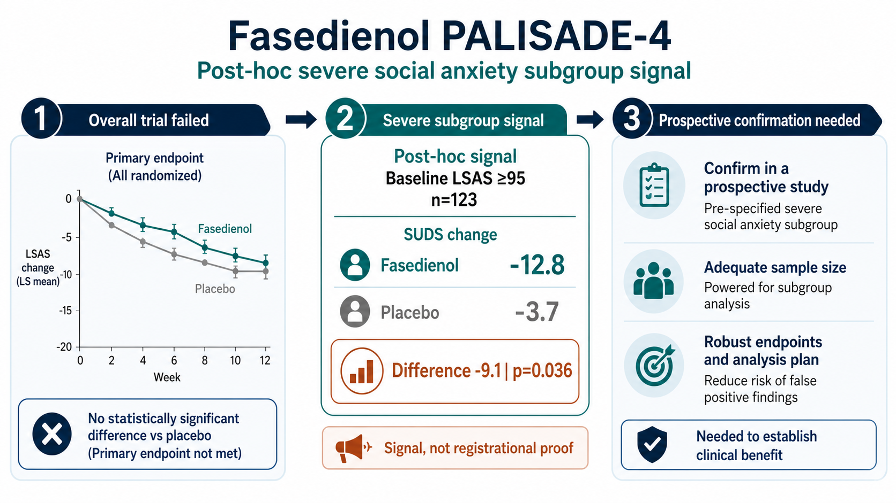
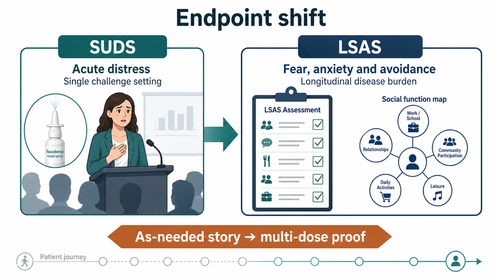
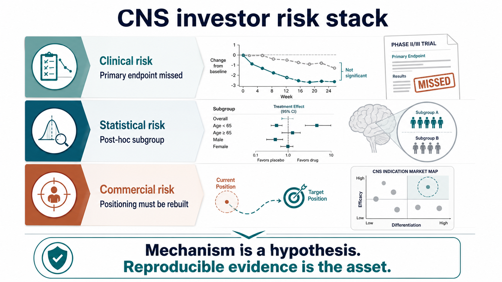

# Fasedienol's Phase 3 Brake: The Story Did Not Fail. The CNS Evidence Bar Did Its Job.

A drug is often most attractive at the moment when it is also most dangerous: the market falls in love with the story before the clinical evidence has finished asking its questions.

That is the right way to read fasedienol.

The original story was genuinely elegant. A nasal spray. A low-dose, rapid-onset approach. Not a traditional oral sedative. Not a medicine that asks patients to take a pill every day for weeks before waiting to feel a change. Fasedienol wanted to answer a real patient need: some people do not feel they need treatment every day, but they can be overwhelmed before a presentation, meeting, interview, social gathering, or performance setting.

That is why the market could like the product so easily.

It did not look like an SSRI or SNRI, where benefit often requires time and sustained use. It did not carry the obvious sedative, tolerance, and dependence baggage associated with benzodiazepines. Its proposed route was a nasal-to-neural-circuit story, designed to enter social anxiety disorder through the language of acute, as-needed, rapid relief.

But on June 30, 2026, Vistagen announced PALISADE-4 Phase 3 results, and the story was pulled back to the ground by the endpoint.

This does not mean the social anxiety market does not exist. It does not mean fasedienol has no signal at all. The more accurate lesson is harder and more useful: in CNS drug development, the most difficult problem is often not whether the mechanism sounds beautiful. It is whether the effect can be shown reliably in a disease where symptoms are subjective, placebo response can be strong, and patients are highly heterogeneous.

## 01 | Where Did PALISADE-4 Fail? The Numbers Were Direct

PALISADE-4 was a U.S. multicenter, randomized, double-blind, placebo-controlled Phase 3 trial designed to evaluate whether a single dose of intranasal fasedienol could acutely reduce anxiety symptoms in adults with social anxiety disorder during a public-speaking challenge.

The setting matters.

This was not a trial that simply sent patients home for months and then measured a long-term psychiatric scale. It created a controlled public-speaking challenge in a clinical environment, one designed to provoke social anxiety. The drug was given before the challenge, and the primary endpoint was SUDS, the Subjective Units of Distress Scale.

The result was harsh.

In the overall population of 238 patients, the least-squares mean change in SUDS was -9.5 for fasedienol and -11.4 for placebo. In other words, placebo appeared numerically better. The between-group difference was 1.9, with p=0.427. The primary endpoint was not statistically significant. Secondary endpoints also did not show a treatment difference.

For a small clinical-stage biotech company, this is the kind of readout the market does not want to see. Phase 3 is not merely concept validation. It is the core gate for a registrational path. Once the primary endpoint in the overall population misses, every remaining argument has to be reinterpreted.

Vistagen did, however, leave one important opening.

The company also reported a post-hoc analysis in patients with baseline LSAS scores of at least 95, representing a more severe social anxiety subgroup. In that group, fasedienol showed nominally statistically significant improvement on SUDS. The subgroup included 123 patients. The SUDS change was -12.8 for fasedienol and -3.7 for placebo, a difference of -9.1, with p=0.036.

Investors need to separate two sentences.

This is a signal.

It is not a victory.

The analysis was post hoc, not the trial's primary pre-specified analysis. For investors, it suggests there may still be a salvageable patient group. For regulators, it usually means a future prospective trial has to prove that group and endpoint again. Those two worlds speak in very different tones.

## 02 | The Next Step Is Not a Simple Rerun. It Is a Rewriting of the Product Position

Vistagen's press release pointed to a critical strategic direction. The company plans to discuss a potential registrational path with the FDA, possibly using a future multi-dose Phase 3 trial with LSAS as the primary endpoint, supported by data from the broader PALISADE program.

The key point is not simply that another Phase 3 trial may be needed.

The key point is that fasedienol may have to move from an acute symptom-intervention story toward a broader, longer-term social anxiety disorder treatment story.

That changes the product.

Originally, the most attractive part of fasedienol was that it looked like a tool for the moment before a social event. A patient might not want to take a daily psychiatric medicine, but may want an option before an interview, presentation, meeting, wedding, dinner, or other anxiety-provoking situation.

If the future registrational path shifts to multi-dose treatment and LSAS as the primary endpoint, fasedienol no longer lives only in the world of "spray before the event." It enters a more traditional psychiatric-drug framework.

That does not make the program impossible.

But it changes what the market is buying.

An acute as-needed product is judged on speed, convenience, safety, and confidence before a specific situation. A longer-term treatment is judged on durable efficacy, repeated use, tolerability, patient adherence, and how it compares with existing tools such as SSRIs, SNRIs, CBT, beta blockers, and benzodiazepines.

The product is not dead.

The story has changed.

## 03 | Why SUDS and LSAS Became the Center of the Debate

The most important part of this case is the endpoint.

SUDS is a measure of immediate subjective distress. It is intuitive and fits an acute public-speaking challenge. The question is direct: how anxious do you feel right now, and how intense is your distress?

The problem is inside that same strength.

Social anxiety disorder is not only one speech. It can include fear of being watched, fear of being judged, fear of making mistakes, fear of speaking to strangers, fear of eating in front of others, fear of entering certain social settings, and avoidance behavior that accumulates over time. A single challenge can provoke anxiety, but it can also be influenced by the patient's state that day, the research setting, investigator interactions, expectation effects, and placebo response.

SUDS is fast.

That is its advantage.

It is also its weakness. It captures a moment. Psychiatric commercialization usually requires more than a moment.

LSAS, the Liebowitz Social Anxiety Scale, follows a different logic. It assesses fear, anxiety, and avoidance across multiple social and performance situations. It is slower and less flashy, but closer to the question of whether the patient's overall disorder has improved.

That is why Vistagen is now talking about LSAS. If the severe subgroup truly responds better, LSAS may be better suited to capture a more stable long-term treatment effect.

The cost is that the cleanest differentiation becomes less sharp.

The market originally liked fasedienol because it was not supposed to look like traditional therapy. If the program moves back toward longer-term treatment, investors will ask harder questions. What exactly is better than existing therapy? What is the dosing pattern? How durable is the effect? How clean is the safety profile? Will physicians prescribe it? Will patients keep using it? Will payers reimburse it?

## 04 | The Mechanism Is Attractive, but CNS Drugs Still Have to Let the Clinic Speak

Fasedienol's mechanism narrative is attractive.

According to Vistagen, fasedienol is a rapid-onset investigational pherine nasal spray designed for low-microgram intranasal dosing. Its proposed mechanism involves activating peripheral nasal chemosensory neurons and engaging neural circuits connected to the olfactory bulb and the limbic amygdala system. The company has emphasized that the product is not intended to require meaningful systemic exposure or direct neuronal entry in the brain to produce a rapid, short-duration anxiolytic effect.

That is a good story.

It speaks directly to the concerns many patients have about psychiatric drugs. Will I feel sedated? Will I become dependent? Will it interact with other medicines? Do I have to wait weeks to see whether it works? Fasedienol tries to answer those concerns through a local nasal neural-circuit route and a rapid-onset product profile.

But this is the hard truth of CNS development: novelty does not exempt a drug from endpoints.

If the primary endpoint misses, the market will not automatically pay for a beautiful mechanism. If the only signal comes from a post-hoc subgroup, regulators will not automatically allow the company to skip confirmatory evidence. Psychiatric diseases are especially difficult because they often lack the kind of concrete biomarker investors are used to seeing in oncology, virology, diabetes, or cardiovascular medicine.

Patients with social anxiety are real.

Their impairment is real.

But measuring anxiety depends heavily on scales, settings, and subjective assessment. That makes endpoint selection part of the product's fate.

## 05 | The Commercial Problem: If It Is Not an Acute Rescue Tool, What Does It Become?

From a commercial perspective, the most difficult question for fasedienol is not whether Vistagen can run another trial. It is whether the next version of the story is smaller than the original one.

The acute as-needed positioning was powerful because it was easy to understand. Fasedienol could potentially avoid the slow daily-medication competition and focus on high-anxiety social moments. If successful, both physicians and patients could understand the proposition quickly: this is a tool to use before a specific event.

PALISADE-4's overall miss forces a different question.

Maybe only more severe patients have enough room to show a treatment effect.

Maybe the single public-speaking challenge is not the right trial setting.

Maybe a longer-term scale is needed.

Maybe multi-dose treatment is necessary.

Each "maybe" adds cost, time, and repositioning risk.

If fasedienol ultimately moves toward long-term treatment, it has to face existing treatment patterns. NIMH's public treatment materials for social anxiety disorder describe psychotherapy and medicines, including SSRIs, SNRIs, beta blockers, and benzodiazepines. Those tools have their own limitations, but they already exist. They are familiar, relatively cheap, and embedded in clinical practice.

For fasedienol to come back, it cannot simply say, "our mechanism is different."

It has to prove three things.

First, which patients actually benefit.

Second, whether that effect can be prospectively reproduced.

Third, whether the product positioning can connect the clinical endpoint to physician adoption, patient use, and payer willingness.

Miss any one of those, and the story will struggle to return to its original valuation height.

## 06 | Taiwan Also Has CNS Drug Stories. The Real Test Is Clinical-Design Discipline

Bringing the lens back to Taiwan, fasedienol is useful because it acts like a mirror. Taiwan does have CNS, psychiatric, and neuroscience drug-development stories. But these companies stand in different diseases, mechanisms, and clinical contexts.

They are not developing the same product as fasedienol.

They do, however, live on the same CNS drug-development map.

One example is SyneuRx.

SyneuRx's pipeline sits closer to psychiatric and neuropsychiatric pharmacology. The company's public materials describe an NMDA-related platform and development programs across central nervous system disorders, including schizophrenia, dementia, depression, treatment-resistant depression, and suicidality-related areas. Assets such as NaBen and ClozaBen are tied to DAAO inhibition and modulation of NMDA receptor function, with the aim of addressing symptoms in schizophrenia and related psychiatric disease areas.

That is different from fasedienol.

Fasedienol is a nasal, acute, social-anxiety program. SyneuRx is closer to core psychiatric disease and NMDA/glutamate biology. But both face the same investor question: in psychiatric drug development, can the company handle scale selection, patient segmentation, placebo response, and reproducibility?

Another example, in a broader neuroscience sense, is Lumosa Therapeutics.

Lumosa is not developing a social-anxiety drug, and it is not primarily a psychiatric-drug company. But its pipeline includes neuroscience. The company's public pipeline lists LT3001 in acute ischemic stroke, which shows a different CNS challenge: not anxiety scales, but treatment window, functional endpoints, bleeding risk, and acute-care execution.

The useful point is not that Taiwan has a direct fasedienol analogue.

The useful point is that Taiwan has companies touching different parts of the CNS risk map. SyneuRx sits closer to psychiatric scales and NMDA biology. Lumosa sits closer to acute neurovascular disease. Both remind investors that CNS value is not only in a mechanism diagram. It is in whether the endpoint is designed clearly enough, whether the right patients are selected, and whether the effect can be seen again in the next trial.

Fasedienol's failure gives Taiwan a mirror: every CNS company eventually has to pass through the same narrow gate.

## 07 | The Investor Lesson Is Not Simply That the Trial Failed. It Is Where the Failure Occurred.

Clinical failure is common in biotech investing.

But failures do not all mean the same thing. Some are safety failures. Some show no efficacy at all. Some are dose problems. Some are endpoint problems. Some are patient-selection problems. Some are placebo-response problems.

The value of the fasedienol case is that it exposes three layers of CNS risk at the same time.

The first layer is clinical risk: the primary endpoint in the overall population missed.

The second layer is statistical risk: a post-hoc subgroup signal exists, but it does not automatically become registrational evidence.

The third layer is commercial risk: if the product moves from an acute rescue concept to a long-term treatment concept, its differentiation must be redefined.

These three layers matter more than the simple phrase "Phase 3 failed."

The market is not only asking whether the drug can survive. It is asking whether, even if it survives, the product is still the same valuable story investors originally thought they owned.

## Conclusion | Fasedienol Was Not Abandoned by the Market. It Was Asked to Grow Up by Evidence.

Fasedienol's story is not completely over. Vistagen still plans to discuss next steps with the FDA, and it may design a future multi-dose Phase 3 trial using LSAS as the primary endpoint to test the treatment value in a more severe social anxiety population.

But the story is no longer light.

Previously, it looked like a beautiful answer: nasal spray, rapid onset, as-needed use, and a profile that might avoid some of the burdens of traditional CNS drugs.

Now it has to become a heavier answer: prospective trial design, rigorous patient segmentation, reliable endpoints, longer-term positioning, regulatory path, and commercial logic.

That is what makes CNS drug development both brutal and fascinating. The unmet need is real. The patient's suffering is real. But capital markets and regulators do not pay for need alone. They pay for reproducible evidence.

Fasedienol did not fail because the story was bad.

It reached the door and was asked to show its evidence pass.

And in CNS drug development, the door has never opened for story alone.

References:

1. Vistagen | PALISADE-4 Phase 3 topline and post-hoc data: https://www.vistagen.com/news-releases/news-release-details/vistagen-announces-topline-and-post-hoc-data-palisade-4-phase-3

2. Vistagen | Fasedienol / PH94B overview: https://www.vistagen.com/pipeline/PH94B/overview

3. ClinicalTrials.gov | NCT06615557 PALISADE-4: https://clinicaltrials.gov/study/NCT06615557

4. NIMH | Social Anxiety Disorder: What You Need to Know: https://www.nimh.nih.gov/health/publications/social-anxiety-disorder-more-than-just-shyness

5. SyneuRx | Research and CNS pipeline: https://www.syneurx.com/research/

6. Lumosa Therapeutics | Neuroscience pipeline: https://www.lumosa.com.tw/tw/pipeline/list?id=neuroscience

Disclaimer: This article is for industry research and knowledge sharing only. It is not investment advice, trading advice, medical advice, fundraising advice, or a recommendation on any individual security. Biotech and pharmaceutical investment involves clinical, regulatory, licensing, commercialization, currency, and capital-market risks. Readers should conduct their own analysis and bear their own investment responsibility. If you have anxiety or mental-health symptoms, consult a qualified medical professional.
