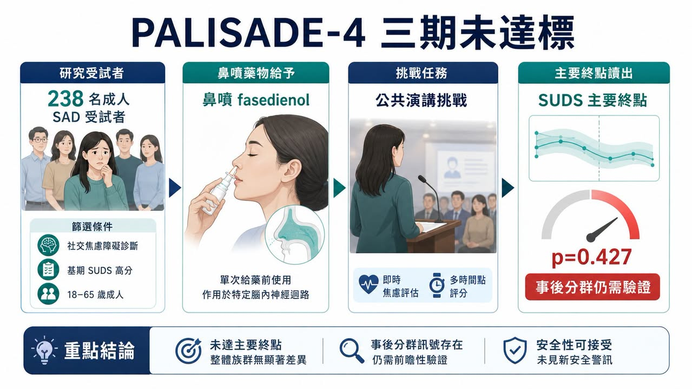
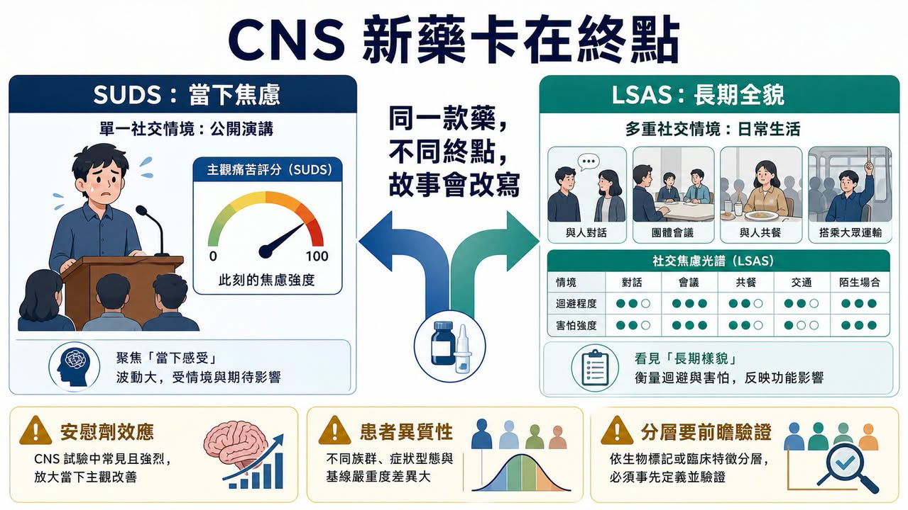
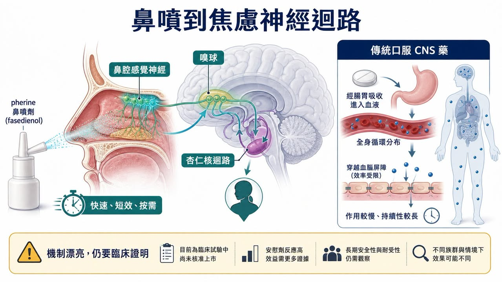

# 社恐神藥三期踩煞車：Fasedienol 不是輸在故事，而是輸在 CNS 新藥最難證明的一格

一款藥最迷人的時候，常常也是它最危險的時候：市場先愛上故事，臨床才慢慢追問證據。

真正值得看的，是 Fasedienol 這個故事原本非常漂亮：鼻噴、微量、快速起效、不是傳統口服鎮靜藥，也不是要病人每天吃好幾週才慢慢等效果。它想回答的是一個很真實的需求：有些人不是每一天都需要被治療，而是在上台、會議、面試、聚會之前，突然被社交焦慮壓住。

所以 Fasedienol 的故事很容易被市場喜歡。它不像 SSRI / SNRI 那樣需要時間堆疊，也不像 benzodiazepine 那樣天然背著鎮靜、耐受性與依賴性的陰影。它說自己走的是鼻腔到神經迴路的路徑，試圖用「急性、按需、快速」切進社交焦慮症。

但 2026 年 6 月 30 日，Vistagen 公布 PALISADE-4 三期結果後，故事被臨床終點狠狠拉回現實。

這不是說社交焦慮市場不存在，也不是說 Fasedienol 完全沒有任何訊號。更準確地說，它提醒市場一件事：CNS 新藥最難的地方，常常不是機制講不講得漂亮，而是你能不能在一個高度主觀、安慰劑效應強、病人差異很大的疾病裡，把效果穩定證明出來。

## 01｜PALISADE-4 失敗在哪裡？數字其實很直接

PALISADE-4 是一個美國多中心、隨機、雙盲、安慰劑對照的三期試驗，用來評估單次鼻噴 fasedienol 能不能在公共演講挑戰中，急性降低成人社交焦慮症患者的焦慮症狀。

這裡的場景很有意思。它不是讓病人回家吃幾個月，再看長期量表，而是在臨床環境裡設計一個會誘發焦慮的公共演講挑戰。藥物在挑戰前給，然後用 SUDS，也就是 Subjective Units of Distress Scale，作為主要終點。

結果很殘酷。

整體族群 238 人裡，fasedienol 在 SUDS 的最小平方平均變化是 -9.5，安慰劑是 -11.4。也就是說，安慰劑組改善幅度反而看起來更大。兩組差異 1.9，p=0.427，沒有統計顯著性。次要終點也沒有看到治療差異。

這種讀出對一家小型臨床階段 biotech 來說，基本就是市場最不想看到的結果。因為三期不是概念驗證，而是註冊路徑的核心門檻。只要整體族群主要終點沒有過，後面所有故事都要重新解釋。

但 Vistagen 也不是完全沒有留下伏筆。

公司同時公布了一個事後分析：在 baseline LSAS 分數 ≥95、也就是非常嚴重社交焦慮的族群中，fasedienol 在 SUDS 上出現名義統計顯著改善。這個族群 n=123，fasedienol 為 -12.8，安慰劑為 -3.7，差異 -9.1，p=0.036。

這裡要分得很清楚：這是訊號，不是勝利。

因為它是 post-hoc analysis，不是整體試驗的主要分析。對投資人來說，它代表「也許還有可以救的族群」；對監管來說，它通常還需要新的前瞻性試驗去證明。這兩個世界的語氣完全不同。

## 02｜公司下一步不是原路重跑，而是改寫定位

Vistagen 在新聞稿裡給了一個很關鍵的方向：公司計畫與 FDA 討論一條潛在註冊路徑，可能用一個未來的多劑量三期試驗，以 LSAS 作為主要終點，並用 PALISADE program 的資料作為支持。

這句話的重點不是「還要再做一個三期」而已。

真正的重點是：Fasedienol 可能要從原本的急性症狀介入，轉向社交焦慮症的整體、長期治療故事。

這對產品定位影響很大。

原本 Fasedienol 最迷人的地方，是它像一個「社交場合前的救急工具」。病人不一定想每天吃藥，但他可能想在面試、簡報、會議、婚禮、聚餐之前，有一個快速、安全、按需使用的選項。

可是如果未來註冊路徑改成多劑量、長期治療，主要終點改成 LSAS，這個產品就不再只是「上台前噴一下」的故事，而是要進入更接近傳統精神科藥物的競爭框架。

這不是不能做。

但它會改變市場對這款藥的想像。急性救急藥看的是快速、方便、按需、安全感；長期治療藥看的是穩定療效、持續服用、與既有 SSRI / SNRI、CBT、beta-blocker、benzodiazepine 等工具相比的定位。

產品沒有死，但故事變了。

## 03｜為什麼 SUDS 和 LSAS 會變成核心？

這次最值得拆的是終點。

SUDS 是一種當下主觀痛苦評分。它很直覺，適合公共演講這種急性場景：你現在有多焦慮？你現在的痛苦是幾分？

問題也在這裡。

社交焦慮症不是只有一場演講。它可能是害怕被注視、害怕被評價、害怕出錯、害怕和陌生人講話、害怕在餐桌上被看見、害怕進入某些社交場景。單一挑戰場景可以誘發焦慮，但它也很容易被當天狀態、場地、研究人員、期待心理、安慰劑反應影響。

所以 SUDS 的好處是快，壞處也是快。它抓的是一瞬間，但精神疾病的商業化通常不是只賣一瞬間。

LSAS 則是另一種邏輯。它用多個社交與表現情境，評估恐懼、焦慮與迴避。它比較慢、比較不性感，但更接近「這個病人整體是不是變好了」。

這就是為什麼 Vistagen 現在想轉向 LSAS。因為如果嚴重族群真的比較有反應，LSAS 可能更能抓到一個較穩定的長期治療訊號。

但代價是，原本那個最清楚的差異化會被稀釋。

市場本來喜歡 Fasedienol，是因為它不像傳統藥。現在如果它要回到長期治療，投資人就會問更硬的問題：它比既有治療好在哪裡？它的服用頻率、持續效果、安全性、病人依從性、給付可能性與醫師開藥意願，能不能支撐一個真正的市場？

## 04｜機制很漂亮，但 CNS 新藥最後要靠臨床說話
Fasedienol 的機制敘事確實有吸引力。

根據 Vistagen 的說法，fasedienol 是一款 rapid-onset investigational pherine nasal spray，設計為低微克劑量鼻腔給藥。它的擬作用機制，是鼻腔給藥後活化周邊鼻腔化學感覺神經受體，再連到嗅球與 limbic amygdala 相關神經迴路。公司也強調，它不需要明顯全身性分布或直接進入腦內神經元，就能達到快速、短效的抗焦慮效果。

這是一個很好講的故事。

因為精神科藥物常被病人擔心：會不會鎮靜？會不會成癮？會不會和其他藥交互作用？會不會要等好幾週才有效？Fasedienol 嘗試用鼻腔局部神經迴路這條路，避開傳統口服中樞神經藥物的部分顧慮。

可是 CNS 新藥的難處就在這裡：機制再新，最後還是要回到臨床終點。

如果主要終點沒有過，市場不會因為機制很美就自動給你估值。如果只有事後分群有訊號，監管也不會因為故事合理就自動讓你跳過確認性試驗。精神科疾病尤其如此，因為它缺少像腫瘤縮小、病毒量下降、HbA1c 改善那種比較直觀的生物標記。

社交焦慮的病人是真實存在的，但焦慮的測量高度依賴量表、場景與主觀評分。這讓每一個終點選擇都變成產品命運的一部分。

## 05｜商業困境：如果不是救急藥，它要變成什麼？
從商業角度看，Fasedienol 最麻煩的不是「還能不能做下一個試驗」，而是「下一個故事會不會比較小」。

急性按需用藥原本是一個很強的定位。它讓 Fasedienol 有機會避開每天服藥的慢性競爭，直接對準社交場合前的高焦慮瞬間。如果它成功，醫師和病人都很容易理解：這是一個在特定場合使用的工具。

但 PALISADE-4 的整體失敗，逼公司重新思考：是不是只有更嚴重的病人才有足夠空間看到效果？是不是單次公共演講挑戰不適合？是不是要用更長期的量表？是不是要做多劑量？

每一個「是不是」，都代表成本增加、時間拉長、定位改變。

如果它最後走向長期治療，就要面對既有治療格局。NIMH 對社交焦慮症的治療介紹裡，常見選項包括心理治療、藥物，藥物又包括 SSRI / SNRI、beta-blocker、benzodiazepine 等。這些工具各有缺點，但它們已經存在，也便宜，醫師熟悉，病人路徑清楚。

所以 Fasedienol 未來如果要回來，不能只說「我機制不同」。它要證明三件事：

第一，它到底對哪一群病人有效。

第二，它的效果能不能被前瞻性試驗穩定重現。

第三，它的產品定位能不能從臨床終點一路接到醫師願意開、病人願意用、支付方願意買單。

這三件事缺一個，故事都很難回到原本的高度。

## 06｜台灣也有 CNS 新藥故事，重點是看臨床設計能力
把視角拉回台灣，Fasedienol 比較像一面鏡子：台灣不是沒有 CNS、精神科或神經科學新藥公司，而是它們各自站在不同疾病、機制與臨床場景。

它們和 fasedienol 走的不是同一條路，卻在同一張 CNS 新藥地圖上。

第一個可以看的是心悅生醫 SyneuRx。

心悅的管線比較貼近精神科與神經精神藥理。公司官網把研發重點放在 NMDA 平台與多個中樞神經疾病，包含思覺失調症、失智症、憂鬱症等。像 NaBen / ClozaBen 這類管線，主軸是透過 DAAO inhibition 調節 NMDA receptor 功能，用來探索思覺失調症相關症狀；另外也有針對 depression and suicidality、treatment-resistant depression 的開發項目。

這跟 Fasedienol 不同。Fasedienol 是鼻噴、急性社交焦慮場景；心悅比較像是在精神科核心疾病裡，嘗試用 NMDA / glutamate 相關路徑補足既有治療不足。可是它們共同面對的是同一件事：精神科新藥最後都要回答量表、病人分層、安慰劑效應與臨床可重現性。

第二個可以放在更廣義神經科學新藥來看的是順天醫藥 Lumosa Therapeutics。

順天醫藥不是做社交焦慮，也不是精神科藥物公司，但它的管線裡有 neuroscience。公司官網把 LT3001 列在 Neuroscience 管線，適應症是急性缺血性中風；這讓我們看到另一種 CNS 新藥難題：不是焦慮量表，而是時間窗、臨床終點、出血風險與急性治療場景。

比較有意思的讀法是：台灣確實有公司在碰 CNS 新藥，只是疾病與路徑不同。心悅比較靠近精神科與 NMDA 路徑，順天比較靠近急性神經血管事件。它們都提醒投資人，CNS 新藥的價值不只在機制圖，也在臨床終點能不能被設計得足夠清楚、病人能不能選得足夠準、療效能不能在下一個試驗裡再被看見。

Fasedienol 的失敗，給台灣的是一面鏡子：所有想做 CNS 的公司，最後都要走過這道窄門。

## 07｜投資人最該記住的，不是失敗，而是失敗在哪一層
生技股投資裡，臨床失敗很常見。

但每一次失敗的含義不一樣。有些是安全性失敗，有些是完全沒有效果，有些是劑量不對，有些是終點沒抓到，有些是病人選錯，有些是安慰劑效應過強。

Fasedienol 這次最有價值的地方，是它讓市場看到 CNS 新藥的三層風險同時浮出來。

第一層是臨床風險：整體族群主要終點沒過。

第二層是統計風險：事後分析有訊號，但不能自動變成註冊證據。

第三層是商業風險：如果從急性救急改成長期治療，產品差異化要重新定義。

這三層加起來，比單純說「三期失敗」更重要。

因為市場不是只在問這支藥還能不能活。市場真正問的是：就算它活下來，會不會已經不是原本那個值錢的故事？

## 結語｜社恐神藥不是被市場拋棄，是被證據要求長大
Fasedienol 的故事還沒完全結束。Vistagen 仍然打算和 FDA 討論下一步，也可能設計新的多劑量三期，以 LSAS 作為主要終點，重新去證明嚴重社交焦慮族群的治療價值。

但它已經不再是原本那個輕盈的故事。

過去它像是一個漂亮的答案：鼻噴、快速、按需、避開傳統中樞神經藥物的包袱。

現在它必須變成一個更重的答案：前瞻性試驗、嚴格分層、可靠終點、長期定位、監管路徑與商業化邏輯。

這就是 CNS 新藥殘酷也迷人的地方。疾病需求是真的，病人的痛苦也是真的，但資本市場和監管不會只為真實需求付錢，它們要的是可重現的證據。

Fasedienol 不是輸在故事。

它只是走到門口，才被證據要求交出通行證。

而 CNS 新藥的門，從來都不是靠故事打開的。

參考資料：

1. Vistagen｜PALISADE-4 Phase 3 topline and post-hoc data: https://www.vistagen.com/news-releases/news-release-details/vistagen-announces-topline-and-post-hoc-data-palisade-4-phase-3

2. Vistagen｜Fasedienol / PH94B overview: https://www.vistagen.com/pipeline/PH94B/overview

3. ClinicalTrials.gov｜NCT06615557 PALISADE-4: https://clinicaltrials.gov/study/NCT06615557

4. NIMH｜Social Anxiety Disorder: What You Need to Know: https://www.nimh.nih.gov/health/publications/social-anxiety-disorder-more-than-just-shyness

5. SyneuRx｜Research and CNS pipeline: https://www.syneurx.com/research/

6. Lumosa Therapeutics｜Neuroscience pipeline: https://www.lumosa.com.tw/tw/pipeline/list?id=neuroscience

更多完整長文與產業追蹤，會整理在藥時事官網：

https://drugnews.com.tw/

免責聲明：本文僅為產業研究與公開資料整理，不構成任何投資建議、買賣建議或個股推薦。生技醫藥投資涉及臨床試驗、法規審查、授權談判、商業化、匯率與資本市場波動等多重風險，投資人應自行判斷並自負盈虧。若有焦慮或精神健康相關症狀，請諮詢合格醫療專業人員。

---

本文僅供產業研究與知識分享，不構成投資、醫療、募資或個股建議。
