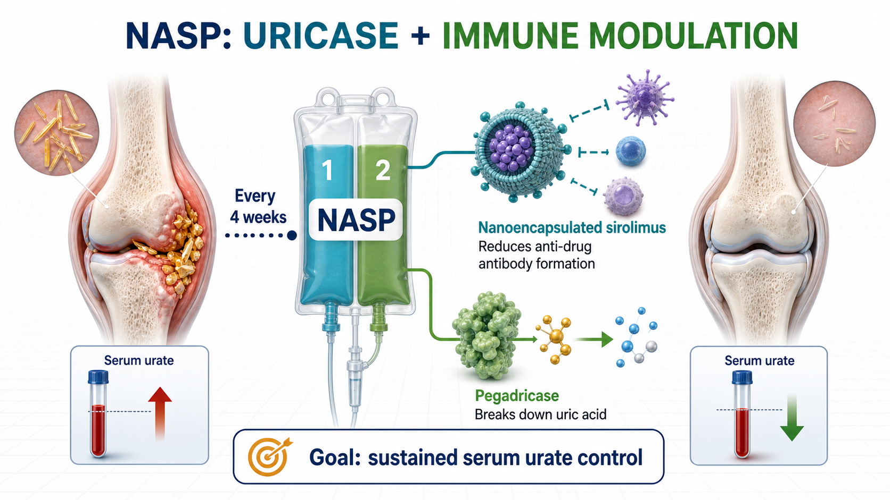
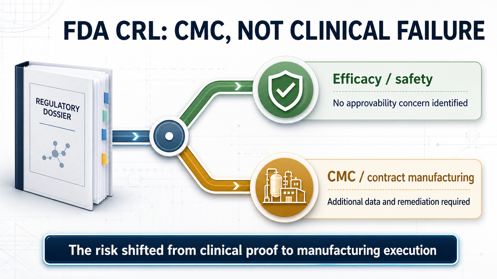
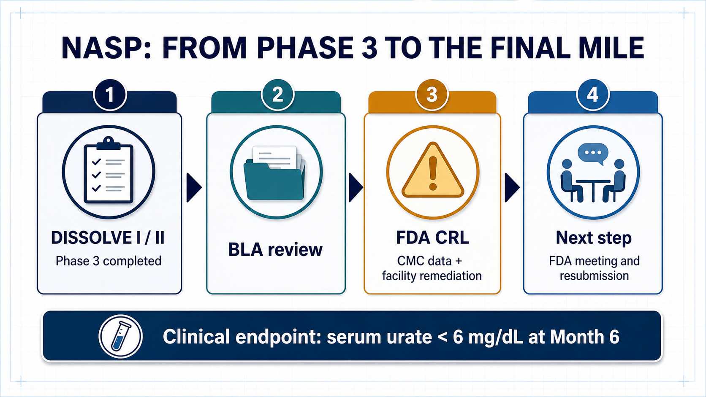
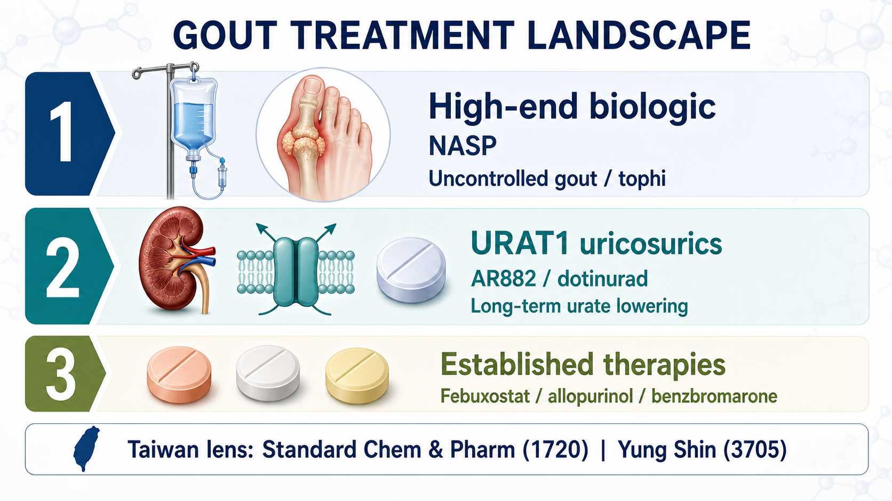

# Sobi's NASP Received an FDA CRL: The Problem Was Manufacturing Credibility, Not Efficacy

Some drugs receive an FDA Complete Response Letter because efficacy is not strong enough.

Others fail because the safety profile does not hold.

Sobi's NASP is different.

The investigational therapy for adults with uncontrolled gout received a Complete Response Letter, or CRL, from the U.S. Food and Drug Administration. At first glance, the headline is simple: the application did not win approval in this review cycle. But Sobi's disclosure makes the distinction that matters. The FDA did not identify a clinical efficacy or safety concern that affected approvability. It asked for additional information on the manufacturing control strategy for NASP's biologic component and required deficiencies at contract manufacturing facilities to be addressed.

That distinction changes how investors should read the event.

NASP was not rejected by the patients who received it. It was stopped at the final mile by chemistry, manufacturing and controls, contract manufacturing, and the quality system expected to support a commercial product.

For biotech investors, this is more revealing than the generic headline "gout drug rejected." The more complex a biologic becomes, the less likely clinical data alone are to decide its fate. By the time a product reaches the FDA's door, process control, analytical methods, quality oversight, documentation, and the management of outsourced manufacturing all become part of the drug's value.

## 01｜What Is NASP? A Gout Therapy Designed to Control Uricase Immunogenicity

Gout begins with excessive uric acid in the blood. Urate crystals accumulate in joints and other tissues, triggering inflammation, severe pain, and tophi; over time, poorly controlled disease can produce irreversible joint damage. Most patients can be managed with oral urate-lowering drugs. A smaller group, however, remains above target despite treatment and continues to experience flares or clinically significant tophi. That is the population NASP is designed to serve.

NASP is not a single-component drug.

It is a sequential, two-component infusion administered every four weeks. The regimen combines nanoencapsulated sirolimus with pegadricase, a PEGylated uricase.

Pegadricase breaks down uric acid into more soluble products that can be eliminated, allowing serum urate to fall quickly.

Nanoencapsulated sirolimus modulates the immune response, reducing the probability that patients will form anti-drug antibodies against the uricase component.

The logic is direct. Uricase can clear uric acid effectively, but a protein therapy can provoke an immune response. Once anti-drug antibodies form, efficacy may fade and the risk of infusion reactions can rise. NASP is therefore trying to solve more than the biochemical problem of excess uric acid. It is trying to make a uricase biologic remain usable in the body over time.

Its real proposition is not simply stronger urate lowering. It is immunomodulation intended to extend the durability and practicality of uricase therapy.

## 02｜Why Is There Still Room in This Market? Existing Therapy Remains Inconvenient and Immunogenic

Uncontrolled gout is not the largest metabolic market, but the unmet need is concentrated and clinically meaningful.

Sobi estimates that more than 12 million people in the United States have gout and that approximately 200,000 have uncontrolled disease. In this group, serum urate remains above 6 mg/dL despite oral urate-lowering therapy, with persistent debilitating flares and/or tophi.

These patients do not merely have a laboratory value that is slightly too high.

Long-term uncontrolled gout can damage joints irreversibly. It also sits alongside renal, cardiovascular, and metabolic comorbidities that compound the burden on quality of life. For these patients, the ability to lower serum urate consistently and keep it below target is itself a meaningful clinical outcome.

Pegloticase, marketed as KRYSTEXXA, is an important available option for chronic gout refractory to conventional therapy. But it requires an intravenous infusion every two weeks and brings immunogenicity and infusion-reaction management into the treatment process. If NASP can deliver sustained urate control every four weeks while reducing anti-drug antibody formation, its commercial position is understandable. It is not trying to replace every gout medicine. It is trying to improve the high-end treatment experience for patients whose disease remains uncontrolled.

Gout is common. Uncontrolled gout is still difficult.

Uricase is potent. Protein-drug immunogenicity is still difficult.

Clinical success does not guarantee that the manufacturing and quality system will pass review.

That is why the meaning of this CRL deserves to be unpacked.

## 03｜The FDA's Objection Was About CMC, Not Clinical Performance

A CRL is often compressed into one word by the market: failure.

But CRLs are not interchangeable. If the FDA concludes that efficacy is inadequate, the product's clinical positioning may need to be rebuilt. If a major safety concern appears, the risk-benefit profile and the asset's valuation can collapse. Sobi's announcement about NASP was more specific: the agency identified no clinical efficacy or safety concern that affected approvability.

The problem was CMC.

Chemistry, manufacturing and controls covers the product's chemical or biological process, manufacturing steps, quality controls, batch consistency, analytical methods, stability program, specifications, and regulatory documentation. CMC is critical for a conventional small molecule. It is even more central for a two-component regimen that combines a complex biologic with an immunomodulatory nanoformulation.

The FDA is not asking only whether a product was made successfully for a clinical trial.

It is asking whether every commercial batch can be made consistently after launch.

The FDA is not asking whether a contractor says the process works.

It is asking whether the sponsor's contract manufacturing facilities, quality systems, deviation management, process controls, records, and oversight can support reliable commercial supply.

This is where many early- and mid-stage biotech companies underestimate the final stage of development.

A clinical program can tell an attractive story, and investors naturally focus on P values, endpoints, response rates, and safety tables. Once a BLA or NDA enters review, however, the drug is no longer only a scientific thesis. It must also become a product that regulators can inspect, factories can reproduce, and a quality organization can defend.

Manufacturing credibility is not an operational footnote. Near approval, it becomes part of the asset itself.

## 04｜NASP's Progress Still Shows That High-End Gout Therapy Has Value

The CRL should not be read as evidence that the gout market lacks opportunity.

ClinicalTrials.gov records show that SEL-212, one of NASP's earlier development names, has completed multiple clinical studies. DISSOLVE I and DISSOLVE II were Phase 3 trials in refractory or chronic gout, with the primary efficacy analysis focused on whether serum urate could remain below 6 mg/dL at Month 6. The design points to the central value proposition in uncontrolled gout: the goal is not short-term pain relief, but sustained urate control below the treatment target.

Sobi is also not relying on NASP alone.

The company has another gout program in pozdeutinurad, previously known as AR882, an oral URAT1 inhibitor. ClinicalTrials.gov lists Phase 3 studies evaluating its serum urate-lowering effect and safety in patients with gout. Its role is different from NASP's. NASP is a high-end biologic and immune-modulation combination. Pozdeutinurad is an oral small molecule intended for a broader urate-lowering market.

Together, the programs create a two-track gout strategy.

NASP targets uncontrolled disease, tophi, and infusion-based high-end treatment.

Pozdeutinurad targets a broader population through oral long-term urate lowering.

The CRL will delay NASP's launch timeline and add the cost of resubmission, process work, and facility remediation. But if the issues remain concentrated in CMC rather than clinical efficacy or safety, the asset has not been sentenced to death.

A more accurate interpretation is that NASP has moved from clinical-development risk into manufacturing and regulatory-execution risk.

## 05｜The Biotech Investing Lesson: Do Not Evaluate the Clinic Without Evaluating the Product

Biotech investing is naturally drawn to science.

New mechanisms, new targets, new platforms, and new endpoints dominate the early narrative. The NASP case reminds the market that as a drug approaches launch, valuation shifts from "does it work?" toward "can it be manufactured reproducibly, can the facilities pass inspection, and can the system support commercial supply?"

This is one reason global pharmaceutical companies place so much weight on CDMO networks, internal manufacturing capability, quality systems, and supply-chain resilience. For biologics, antibodies, enzymes, long-acting formulations, nanoencapsulated products, and complex injectables, clinical success is an entry ticket. CMC is the ticket to market.

A small molecule may have room to reduce risk through formulation and process optimization.

A biologic depends on batch consistency, analytical capability, process understanding, and quality culture.

Outsourcing manufacturing does not outsource accountability. The sponsor remains responsible for the regulatory result.

The FDA evaluates the system, not one attractive dataset.

That is why this case is relevant well beyond Sobi. It shows how a seemingly technical manufacturing issue can change timing, cash needs, regulatory uncertainty, and ultimately the value investors assign to a late-stage asset.

## 06｜What Should Taiwan Investors Watch? The Urate-Lowering Chain From URAT1 to Established Drugs

For Taiwan investors, the case should not be reduced to manufacturing exposure alone.

Put NASP beside Sobi's oral URAT1 inhibitor pozdeutinurad and the gout market becomes a layered treatment map. Acute flares require symptomatic control. Long-term management requires serum urate to remain below target. Some patients use drugs that reduce uric acid production; others use agents that increase uric acid excretion. Only patients with truly uncontrolled disease or significant tophi are likely to progress toward uricase and high-end biologic therapy.

That is why the Taiwan reading should not begin and end with CMC.

Gout is a mature market, but hyperuricemia treatment still divides into different mechanisms, treatment intensities, and commercial positions. Mapping those routes is more useful than simply asking which listed company is connected to manufacturing.

Standard Chem & Pharm, ticker 1720, belongs near the top of the Taiwan watch list.

According to Taiwan's drug-license data, Standard Chem & Pharm is the local applicant for URECE, or dotinurad, in 0.5 mg, 1 mg, and 2 mg strengths for hyperuricemia. Dotinurad is a selective urate reabsorption inhibitor. Its commercial logic is to inhibit URAT1 and increase urinary uric acid excretion. This route is closer to the industrial direction of Sobi's oral AR882 program: both address how to lower urate more effectively in long-term chronic care.

Standard Chem & Pharm can also be viewed through its broader hyperuricemia portfolio. Taiwan's license data show products based on febuxostat, allopurinol, and benzbromarone. The company therefore has more than a single product touchpoint across chronic gout and hyperuricemia management.

Yung Shin Pharmaceutical Industrial, ticker 3705, can be evaluated through its coverage of established gout therapies. Taiwan's license data include febuxostat in 40 mg and 80 mg strengths, as well as allopurinol- and benzbromarone-related products. The investment case here is not one explosive novel-drug catalyst. It is the durability of chronic-disease products, hospital access, portfolio breadth, and long-term market coverage.

The treatment landscape is easier to read when separated into three layers.

NASP represents the high-end biologic route for uncontrolled gout.

Its potential clinical value is high, but so is its exposure to immunogenicity, infusion management, CMC execution, and facility inspection.

AR882 and dotinurad represent the oral URAT1 or uricosuric route.

They target a broader and more durable market for long-term urate control.

Febuxostat, allopurinol, and benzbromarone form the established chronic-treatment base.

That layer may not offer the most explosive story, but it sits closest to the products, channels, and prescribing structure of Taiwan's pharmaceutical companies.

The lesson for Taiwan investors is therefore broader than "manufacturing matters." It is also a warning against forcing every company into the same CDMO narrative. Within one therapeutic area, established oral drugs, newer oral mechanisms, and complex biologics each carry different risks and reward different corporate capabilities.

## Conclusion｜This CRL Exposed Manufacturing Risk at the Point Where It Matters Most

The most superficial headline is that the FDA rejected a gout drug.

The more useful question is why.

If a drug loses on efficacy, the medical hypothesis may need to be reconsidered.

If it loses on safety, the risk-benefit case may no longer hold.

If it is held back by CMC and contract manufacturing, the market has to ask a different question: can the company turn a product that worked in clinical development into a commercial product that can be made the same way, batch after batch?

That is the most practical side of biotechnology.

Science gives a product its story.

Clinical development gives it evidence.

Manufacturing and the quality system give it a chance to reach the market.

NASP is not finished. Sobi plans to meet with the FDA, determine the path toward resubmission, and work with its contract manufacturing organizations to address the deficiencies. The asset may still return to the review pathway. But the CRL has already delivered a durable lesson for investors: the more sophisticated the biologic, the less sensible it is to read only the clinical press release. The moat may be hidden in the plant, the records, the batch history, the inspection, and the quality culture.

References:

1. Sobi, [Sobi receives Complete Response Letter from FDA for NASP, nanoencapsulated sirolimus plus pegadricase](https://www.sobi.com/en/press-releases/sobi-receives-complete-response-letter-fda-nasp-nanoencapsulated-sirolimus-plus-pegadricase-2465072), June 26, 2026.
2. ClinicalTrials.gov, [DISSOLVE I, NCT04513366](https://clinicaltrials.gov/study/NCT04513366).
3. ClinicalTrials.gov, [DISSOLVE II, NCT04596540](https://clinicaltrials.gov/study/NCT04596540).
4. ClinicalTrials.gov, [COMPARE, NCT03905512](https://clinicaltrials.gov/study/NCT03905512).
5. ClinicalTrials.gov, [AR882-301, NCT06846515](https://clinicaltrials.gov/study/NCT06846515).
6. ClinicalTrials.gov, [AR882-302, NCT06439602](https://clinicaltrials.gov/study/NCT06439602).
7. DailyMed, [KRYSTEXXA (pegloticase) injection label](https://dailymed.nlm.nih.gov/dailymed/drugInfo.cfm?setid=6e566303-d93a-4130-b764-25749829aa95).
8. Taiwan Food and Drug Administration, [Active drug license dataset](https://data.gov.tw/dataset/9123).
9. PubMed, [Switching from febuxostat to dotinurad, a novel selective urate reabsorption inhibitor](https://pubmed.ncbi.nlm.nih.gov/41113711/).
10. PubMed, [Molecular mechanisms of urate transport by the native human URAT1 and its inhibition by anti-gout drugs](https://pubmed.ncbi.nlm.nih.gov/40169562/).

---

This article is for industry research and knowledge sharing only. It does not constitute investment, medical, fundraising, trading, or stock-specific advice.
