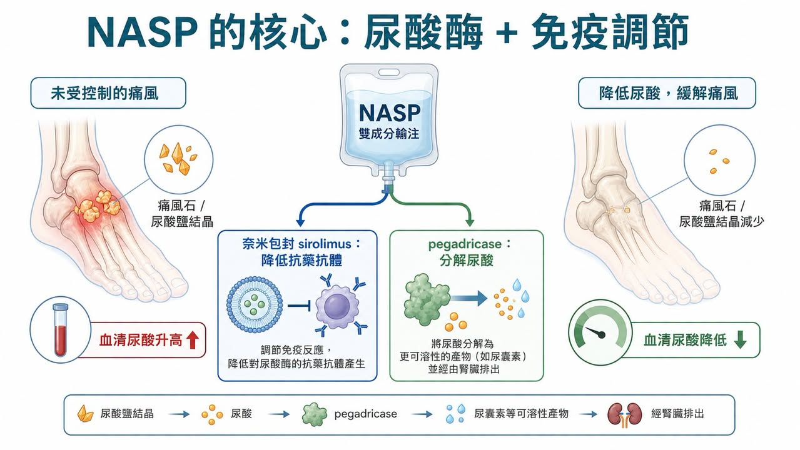
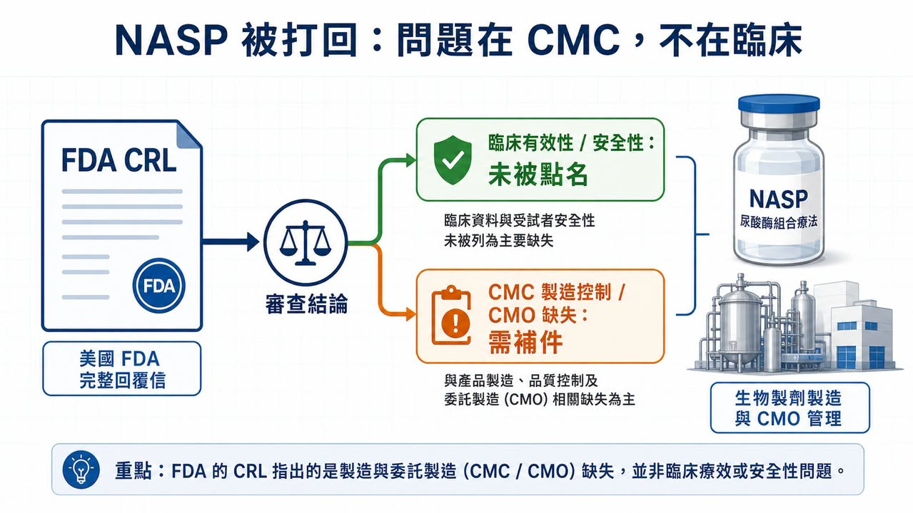
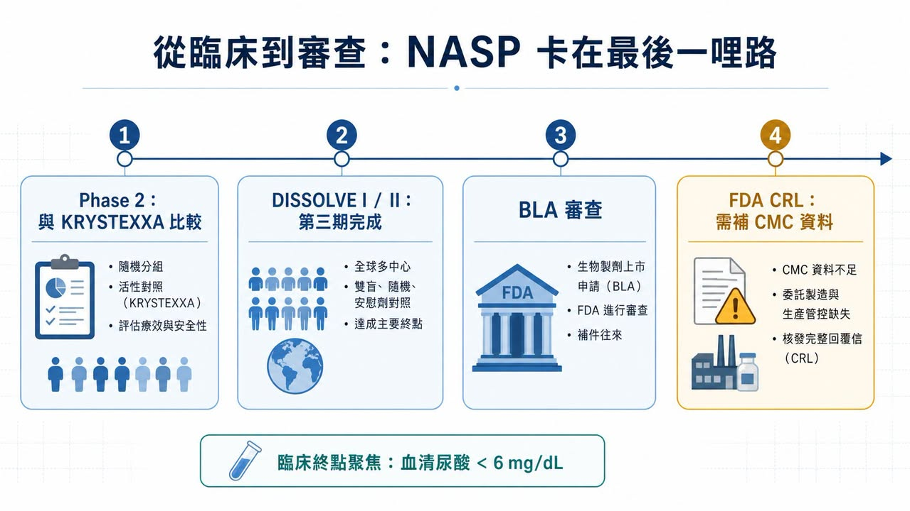
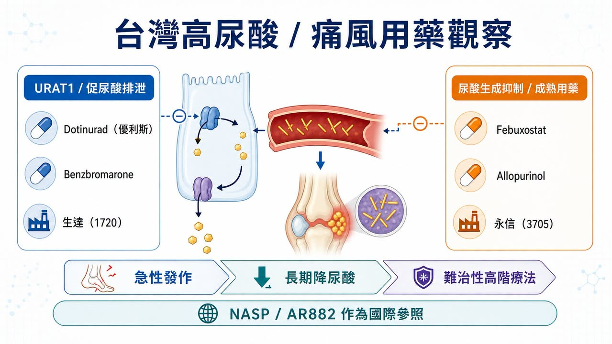

# 痛風新藥被 FDA 打回票：NASP 沒輸在療效，而是卡在製造可信度

有些新藥被 FDA 打回票，是因為療效不夠。

有些是安全性過不了。

但 Sobi 這次的 NASP，不太一樣。

這款針對成人難治性痛風的在研療法，收到 FDA 的 Complete Response Letter（CRL，完整回覆信）。表面上看，這就是「沒有在這一輪審查拿到核准」。可是細看 Sobi 公告，FDA 並沒有點出會影響核准可能性的臨床有效性或安全性疑慮；真正被要求補強的，是 NASP 生物製劑成分的製造控制策略，以及委託製造設施相關缺失。

這句話很關鍵。

它代表 NASP 不是在病人身上被否定，而是在上市前最後一哩路，被 CMC、製造與品質系統攔了下來。

對生技投資人來說，這比單純「痛風新藥遭拒」更值得看。因為它提醒市場：越是複雜的生物製劑，越不是只有臨床數據能決定命運。真正到 FDA 門口時，製程、品管、委外廠管理、法規文件完整性，都會變成藥品價值的一部分。

## 01｜NASP 是什麼？一款想解決尿酸酶免疫原性的痛風療法

痛風的核心問題，是血中尿酸過高，尿酸鹽結晶沉積在關節與組織裡，引發發炎、疼痛、痛風石，嚴重時會造成關節破壞。大多數病人可以靠口服降尿酸藥物控制，但有一小群患者即使用藥，血清尿酸仍降不下來，且反覆發作、痛風石明顯，這就是 NASP 想切入的族群。

NASP 的設計不是單一成分。

它是一種每 4 週一次的雙組分連續輸注療法，包含 nanoencapsulated sirolimus（奈米包封 sirolimus）與 pegadricase（聚乙二醇化尿酸酶）。

pegadricase 的角色，是把尿酸分解成更容易排除的產物，快速降低血清尿酸。

nanoencapsulated sirolimus 的角色，則是調節免疫反應，降低患者對尿酸酶產生抗藥抗體的機率。

這個組合的邏輯很直接：尿酸酶可以很有效地清除尿酸，但蛋白質藥物容易引發免疫反應；一旦抗藥抗體形成，療效可能下降，輸注反應風險也會變高。NASP 想處理的，不只是尿酸本身，而是「尿酸酶這類生物製劑如何在體內維持穩定效果」。

所以它真正的賣點，不只是降尿酸，而是用免疫調節去延長尿酸酶療法的可用性。

## 02｜為什麼這個市場還有空間？因為已上市療法仍有不便與免疫原性問題

難治性痛風不是最大眾的代謝市場，卻是一個醫療需求很尖銳的市場。

Sobi 在公告中提到，美國有超過 1,200 萬名痛風患者，其中約 20 萬人屬於 uncontrolled gout，也就是即使使用口服降尿酸藥物，血清尿酸仍高於 6 mg/dL，並伴隨反覆急性發作或痛風石沉積。

這群病人不是單純「尿酸高一點」。

長期控制不佳的痛風，可能造成不可逆的關節損傷，也會和腎臟、心血管代謝共病一起讓生活品質變差。對這類患者來說，能不能穩定、持續地把尿酸壓下來，本身就是臨床價值。

目前已上市的 pegloticase（KRYSTEXXA）是重要選項，但它需要每兩週靜脈輸注，也有免疫原性與輸注反應管理問題。因此，若 NASP 能用每 4 週一次的療程，在維持降尿酸效果的同時降低抗藥抗體形成，商業定位就會很清楚：不是取代所有痛風藥，而是改善難治性患者的高階治療體驗。

痛風常見，不代表難治性痛風容易做。

尿酸酶有效，不代表蛋白質藥物免疫原性好處理。

臨床數據通過，不代表製造與品質系統就會自動過關。

這也是 NASP 這次 CRL 最值得投資人拆開看的原因。

## 03｜FDA 這次打回票，重點不是療效，而是 CMC

CRL 很容易被市場粗暴解讀成「失敗」。

但同樣是 CRL，含義可以差很多。如果 FDA 認為療效不夠，可能代表產品定位要重做；如果安全性出現重大疑慮，甚至可能讓整個項目估值坍塌。可是 NASP 這次 Sobi 公告寫得很明確：FDA 並未提出會影響獲批可能性的臨床有效性或安全性顧慮。

真正的問題在 CMC。

CMC 指的是 Chemistry, Manufacturing and Controls，也就是藥品的化學 / 生物製程、製造、品質控制、批次一致性、分析方法、穩定性與法規文件。對傳統小分子藥來說，CMC 已經重要；對 NASP 這種複雜生物製劑與免疫調節組合來說，CMC 更是核心。

FDA 要看的不是「你在臨床試驗裡有用過」。

FDA 要看的是，上市後每一批產品能不能穩定做出來。

FDA 要看的不是「委託廠商說可以做」。

FDA 要看的是，委託製造設施、品質系統、偏差管理、製程控制與文件是否足以支撐商業化供應。

這是很多早中期生技公司最容易低估的地方。

臨床開發可以把故事講得很漂亮，投資人也常常盯著 P 值、終點、反應率。但真正進入 BLA / NDA 審查，藥品就不再只是科學故事，而是一套可被監管機構檢查、可被工廠重複、可被品質系統承擔的產品。

## 04｜NASP 走到這一步，反而說明痛風高階療法不是沒有價值

NASP 這次被打回，不應該被看成痛風領域沒有機會。

ClinicalTrials.gov 顯示，SEL-212，也就是 NASP 過去開發名稱之一，已完成多項臨床研究。DISSOLVE I 與 DISSOLVE II 都是針對 refractory / chronic gout 患者的第三期試驗，主要終點聚焦在第 6 個月血清尿酸能否維持低於 6 mg/dL。這些設計很清楚地指向一件事：難治性痛風的高階療法，核心不是短期止痛，而是長期把尿酸壓到目標以下。

Sobi 也不是只押 NASP 一張牌。

公司另外布局口服 URAT1 抑制劑 pozdeutinurad（AR882），ClinicalTrials.gov 上可以看到 AR882 已有第三期研究，用於評估痛風患者血清尿酸控制。這條線和 NASP 的定位不同：NASP 是高階生物製劑與免疫調節組合，AR882 則是口服降尿酸小分子。

這讓 Sobi 在痛風領域形成一種雙軌布局：

一邊是 NASP，切入難治性、痛風石與高階輸注治療。

另一邊是 AR882，瞄準更廣的口服降尿酸市場。

NASP 的 CRL 會延後上市節奏，也會增加補件與製造整改成本。但只要問題確實集中在 CMC，而不是臨床有效性或安全性本身，這個資產就不等於被判死刑。

比較合理的看法是：NASP 從「臨床開發風險」進入了「製造與法規執行風險」。

## 05｜這件事對生技股的提醒：不要只看臨床，還要看誰能把產品做出來

生技投資很容易迷戀科學。

新機制、新靶點、新平台、新終點，確實是早期故事的核心。但 NASP 這次提醒市場，越接近上市，價值判斷越會從「會不會有效」轉向「能不能穩定製造、能不能通過查廠、能不能支撐商業化」。

這也是為什麼全球藥廠越來越重視 CDMO、製造網路、品質系統與供應鏈韌性。尤其是生物製劑、抗體、酵素、長效製劑、奈米包封或複雜注射劑，臨床成功只是入場券，CMC 才是上市門票。

小分子可以靠配方與製程優化降低風險。

生物製劑需要批次一致性、分析方法與品質文化。

委託製造不是外包後就沒事， sponsor 仍然要對法規結果負責。

FDA 看的是整套系統，不是單一漂亮數據。

這種新聞，對台灣投資人其實很有參考價值。

## 06｜台灣可以看什麼？從 URAT1 到 Febuxostat，先看高尿酸用藥鏈

放回台股，這件事不能只看製造端。

如果把 NASP 和 Sobi 另一條口服 URAT1 抑制劑 pozdeutinurad（AR882）放在一起看，痛風與高尿酸治療其實是一張分層地圖：急性發作時要止痛，長期管理要把血清尿酸壓下來，部分患者需要抑制尿酸生成，部分患者需要促進尿酸排泄，真正難治、痛風石明顯的病人，才會走到尿酸酶與高階生物製劑這一層。

這也是為什麼台灣公司不能只從 CMC 角度看。

痛風本身雖然是成熟市場，但高尿酸治療仍然能分成不同用藥路線，讀法會比單純找「誰做製造」更貼近題目。

生達（1720）可以放在第一順位觀察。

根據 TFDA 藥品許可證資料，生達是 URECE（dotinurad，優利斯）0.5 mg、1 mg、2 mg 在台灣的申請商，適應症為高尿酸血症。Dotinurad 屬於選擇性尿酸再吸收抑制劑，核心邏輯是透過 URAT1 抑制，促進尿酸排泄。這條路線和 Sobi 口服小分子 AR882 的產業方向更接近，都是在高尿酸慢病治療裡，處理「如何更有效把尿酸降下來」這件事。

生達另外也可從既有高尿酸產品組合來看。TFDA 資料中可以看到生達的 Febuxostat 產品「達理痛」、Allopurinol 產品，以及 Benzbromarone 產品。這代表它不是只有單一品項，而是在高尿酸與痛風慢性管理裡，有比較完整的產品觸點。

永信（3705）則可以從成熟痛風用藥覆蓋來看。TFDA 資料中，永信有 Febuxostat 產品「痛悅定」40 mg、80 mg，也有 Allopurinol 與 Benzbromarone 相關產品。這種公司看的不是單一新藥爆發性，而是慢病用藥、醫院通路、產品組合與長期市場覆蓋能力。

這裡更好的讀法，是把痛風治療的產業地圖拆開：

NASP 代表難治性痛風的高階生物製劑路線。

臨床價值高，但也更容易被免疫原性、輸注管理、CMC 與查廠卡住。

AR882、Dotinurad 代表口服 URAT1 / 促尿酸排泄路線。

它們瞄準的是更長期、更廣泛的高尿酸控制市場。

Febuxostat、Allopurinol、Benzbromarone 代表成熟慢病治療底盤。

這一層未必有爆炸性的故事，但是真正貼近台灣藥廠的產品、通路與用藥結構。

所以，NASP 這封 CRL 對台灣投資人的提醒，不只是「製造很重要」，也不是把所有公司都套進同一個 CDMO 邏輯。更完整的看法是：一個治療領域從成熟用藥、口服新機制，到高階生物製劑，各自有不同風險，也對應到不同公司的能力圈。

## 結語｜FDA 這封 CRL，真正打醒的是製造端風險

NASP 這次被 FDA 打回，最表面的標題是「痛風新藥遭拒」。

但真正值得看的，不是痛風，也不是拒絕，而是拒絕的原因。

如果一款藥輸在療效，代表醫學假設可能要重想。

如果輸在安全性，代表風險收益比可能站不住。

但如果卡在 CMC 和委託製造，代表市場要問的是另一個問題：這家公司能不能把臨床裡做得出來的產品，變成商業化世界裡每一批都做得出來的產品？

這就是生技產業最現實的一面。

科學讓產品有故事。

臨床讓產品有證據。

製造與品質系統，才讓產品有機會上市。

NASP 還沒有結束。Sobi 後續會和 FDA 討論補件與製造缺失，這個資產仍有機會回到審查路徑。但這封 CRL 已經足夠提醒投資人：越是高階生物製劑，越不能只看臨床新聞稿。真正的壁壘，常常藏在工廠、文件、批次、查廠與品質文化裡。

參考資料：

1. Sobi｜[Sobi receives Complete Response Letter from FDA for NASP, nanoencapsulated sirolimus plus pegadricase](https://www.sobi.com/en/press-releases/sobi-receives-complete-response-letter-fda-nasp-nanoencapsulated-sirolimus-plus-pegadricase-2465072)
2. ClinicalTrials.gov｜[DISSOLVE I, NCT04513366](https://clinicaltrials.gov/study/NCT04513366)
3. ClinicalTrials.gov｜[DISSOLVE II, NCT04596540](https://clinicaltrials.gov/study/NCT04596540)
4. ClinicalTrials.gov｜[COMPARE, NCT03905512](https://clinicaltrials.gov/study/NCT03905512)
5. ClinicalTrials.gov｜[AR882-301, NCT06846515](https://clinicaltrials.gov/study/NCT06846515)
6. ClinicalTrials.gov｜[AR882-302, NCT06439602](https://clinicaltrials.gov/study/NCT06439602)
7. DailyMed｜[KRYSTEXXA（pegloticase）injection label](https://dailymed.nlm.nih.gov/dailymed/drugInfo.cfm?setid=6e566303-d93a-4130-b764-25749829aa95)
8. 衛生福利部食品藥物管理署｜[未註銷藥品許可證資料集](https://data.gov.tw/dataset/9123)
9. PubMed｜[Switching from febuxostat to dotinurad, a novel selective urate reabsorption inhibitor](https://pubmed.ncbi.nlm.nih.gov/41113711/)
10. PubMed｜[Molecular mechanisms of urate transport by the native human URAT1 and its inhibition by anti-gout drugs](https://pubmed.ncbi.nlm.nih.gov/40169562/)

---

免責聲明：本文僅供產業研究與知識分享，不構成投資、醫療、募資、買賣或個股建議。生技醫藥投資涉及臨床試驗、法規審查、製造查廠、商業化、匯率與資本市場波動等多重風險，投資人應自行判斷並自負盈虧。
