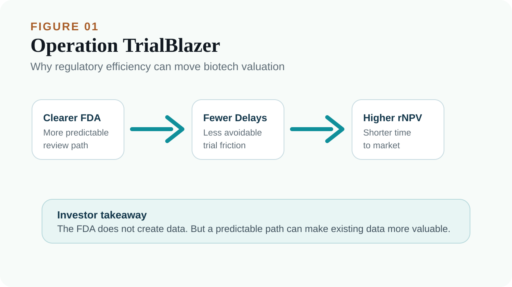
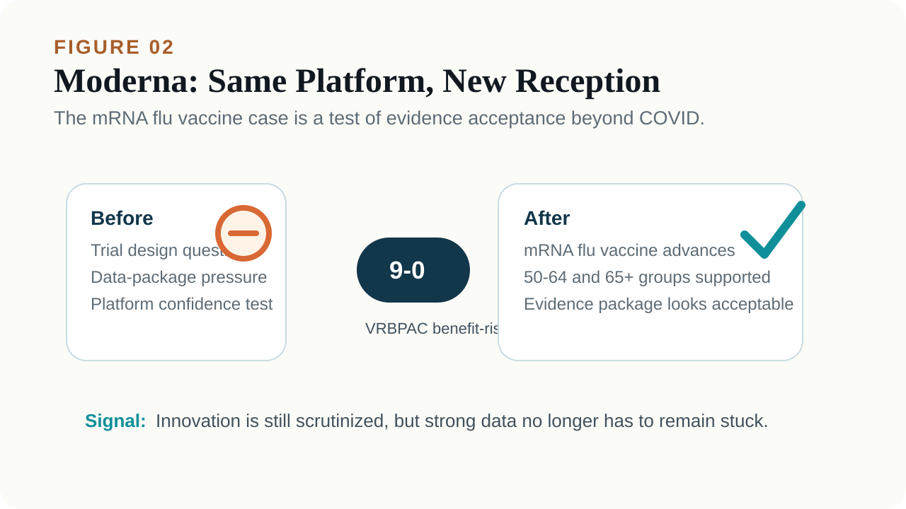
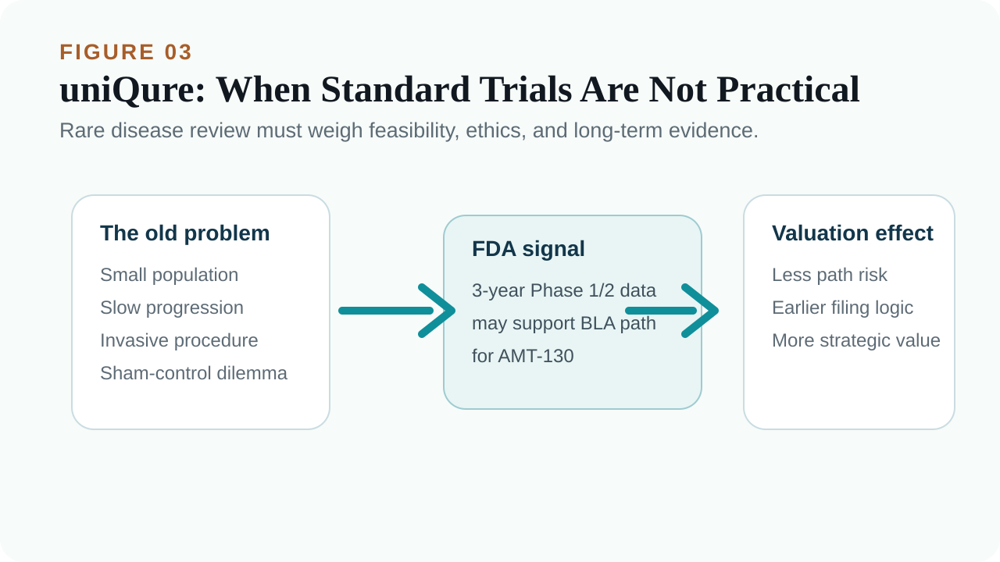
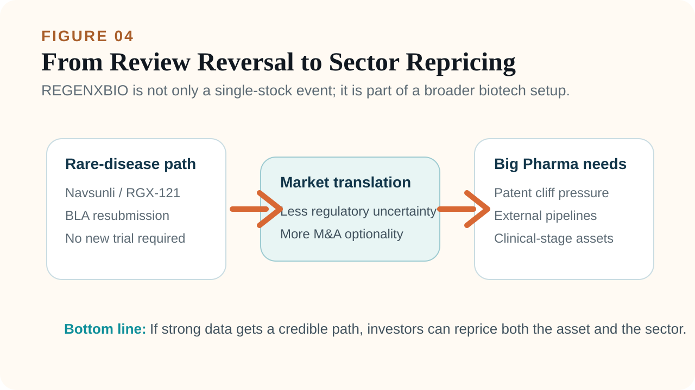

# The FDA Tone Has Shifted: Why Biotech’s Rebound Is Starting at the Regulatory Layer

The mood around US biotech has changed.

The XBI, the SPDR S&P Biotech ETF that represents many small and mid-cap biotech companies, has been moving strongly, and capital has started to flow back into the sector. In a world where interest rates have not fully relaxed and high-risk assets are still vulnerable to discount-rate pressure, biotech should not be an easy group to own. Yet the market has begun to buy the sector again.

This is not just a simple “oversold rebound.”

The more important change is that regulatory signals and pharma M&A activity are improving at the same time. Market reports have noted that XBI has risen sharply over the past 13 months, with additional gains in 2026, partly because investors are returning to the sector and because M&A activity has become more visible again.

The real pivot is the FDA.

Over the past period, the US FDA went through leadership volatility, and the market repeatedly questioned its standards for rare diseases, gene therapy, vaccines, and accelerated approval. But several recent cases suggest that the agency is moving away from a phase that many investors viewed as rigid, conservative, and sometimes inconsistent. The new tone looks more pragmatic and more willing to communicate.

For biotech companies, that matters.

A clinical-stage biotech is not only afraid of trial failure. It is also afraid of having meaningful data but no viable regulatory path. It is afraid of being asked to run a nearly impossible randomized trial in a tiny patient population. It is afraid of hearing one answer in one FDA meeting, and a different answer in the next.

When the FDA starts to send a more open and predictable signal, the valuation logic for many beaten-down biotech assets can change.

## 01 | Operation TrialBlazer: FDA Is Signaling That Review Efficiency Matters Again

On June 22, the FDA announced Operation TrialBlazer. The goal is to accelerate drug development, reduce unnecessary regulatory friction, and use more efficient trial design and data tools so innovative drugs can move more quickly from early research into later-stage clinical development.

Public FDA information describes the effort as including updated guidance, simplified development paths, more efficient clinical trial design, and greater use of digital tools.

That policy language may not sound exciting to general readers. But for biotech investors, it is important. A large part of biotech valuation comes from discounting future cash flows. The FDA’s attitude directly affects three questions:

First, does a company need to run another trial?

Second, can a filing move earlier?

Third, can existing evidence support accelerated or conditional approval?

If FDA requirements become more predictable, development timelines shorten, and complete-response risk falls, the risk-adjusted net present value of the same pipeline can rise. That is why regulatory tone can move the entire XBI. It is not because the slogan sounds nice. It is because the regulatory path may directly shorten the route to market.

## 02 | Moderna: The Same mRNA Flu Vaccine Suddenly Looks Different

Moderna is one of the clearest examples of this FDA tone shift.

After the COVID-19 vaccine windfall faded, Moderna needed to prove that it was not merely a pandemic-era company. Its next major step is the mRNA flu vaccine mRNA-1010, also called mFLUSIVA, along with combination flu and COVID vaccine programs.

But the path was not smooth at first.

Earlier, Moderna’s filing was slowed by questions around trial design, data package requirements, and review standards. For Moderna, this was not only a single-product issue. It was a confidence test for whether the mRNA platform could keep working outside COVID.

The turning point came on June 18, when the FDA’s Vaccines and Related Biological Products Advisory Committee discussed Moderna’s mRNA flu vaccine. The committee voted 9 to 0 that the benefits of mRNA-1010 outweighed the risks for adults aged 50 to 64 and for adults aged 65 and older.

That makes Moderna an important candidate for the first US-approved mRNA seasonal flu vaccine.

The interesting part is not that the data magically changed overnight. What changed was how the evidence package was received and how the advisory committee viewed benefit-risk balance.

For the market, the signal is clear: the FDA is not ignoring risk. But if the evidence is strong enough, an innovative platform does not have to remain stuck indefinitely.

## 03 | uniQure: Rare-Disease Gene Therapy Sees a Path Back to Accelerated Approval

The uniQure case is even more dramatic.

uniQure’s AMT-130 is a gene therapy for Huntington’s disease, a hereditary neurodegenerative disease caused by mutations in the HTT gene. Patients gradually lose motor, cognitive, and psychiatric function, and there is still no therapy that clearly changes the course of the disease.

AMT-130 is designed as a one-time gene therapy that lowers expression of the toxic mutant huntingtin protein.

The problem is that diseases like this are extremely difficult to study through traditional large randomized controlled trials. The patient population is small, progression is slow, the surgical procedure is invasive, and sham-surgery controls raise serious ethical and practical problems. The market’s biggest concern was whether the FDA would insist on a large controlled study before accepting a filing.

If the answer had been yes, AMT-130’s development time and cost would have expanded substantially.

Recent signals suggest a different path. The FDA has allowed uniQure to use three-year Phase 1/2 data to support a planned BLA, or biologics license application, under an accelerated approval pathway.

That matters for rare-disease gene therapy. It suggests the FDA is willing to consider long-term follow-up, natural-history controls, and clinical scale data even without a traditional large Phase 3 trial.

This is not regulatory “leniency.” It is a recognition that rare diseases and neurodegenerative disorders cannot all be forced into a conventional large-trial template.

## 04 | REGENXBIO: Navsunli Looks Like a Rare-Disease Review Barometer

REGENXBIO offers another important example.

Its gene therapy Navsunli, also known as RGX-121, is being developed for Hunter syndrome, or MPS II, a rare and severe inherited disorder. These patients are few in number, disease progression can be rapid, long-term controlled trials are difficult, and many families would struggle to accept placebo assignment for children.

Previously, the FDA asked REGENXBIO for more data, which led the market to view the asset as blocked. In June, the FDA shifted its position and supported REGENXBIO’s plan to resubmit the BLA, with accelerated review and no requirement for additional patients or another trial.

REGENXBIO said the FDA recognized that the company could resubmit the Navsunli BLA after meeting with the agency, and that the FDA supported the accelerated approval path for rare disease. Public reporting also described the FDA’s reversal as removing the need for additional patients or another placebo-controlled trial, which helped the stock rebound.

When cases like this accumulate, they are no longer just company-specific catalysts. They begin to reprice the broader rare-disease and gene-therapy universe.

## 05 | XBI’s Rebound Is Not Only About FDA. It Is Also About M&A Coming Back

Regulation is the first spark.

The second spark is M&A.

Pharma and biotech dealmaking has clearly warmed up in 2026. Market data suggest that the first six months of 2026 already saw roughly US$134 billion in pharmaceutical and biotech transactions, exceeding the full-year 2025 figure of about US$112 billion. There have also been dozens of biotech acquisitions above the US$1 billion level.

The logic is straightforward. Big Pharma faces the patent cliff. Over the next several years, many blockbuster drugs will lose exclusivity, and the revenue gap has to be filled by external pipelines. Compared with building everything from zero, buying assets that already have clinical data and a credible path toward late-stage development or commercialization remains the fastest route.

That is why deals such as GSK buying Nuvalent, AbbVie buying Apogee, and continued activity from Merck, Lilly, Pfizer, and others should not be surprising.

For an index like XBI, which has heavy exposure to small and mid-cap biotech, M&A is a direct valuation catalyst. As long as the market believes Big Pharma will keep buying, smaller biotech companies will not be valued only by how long their cash runway lasts. Investors will also start asking which companies could become the next acquisition targets.

## Conclusion | The FDA Is Not Opening the Gates. It Is Letting Strong Data Be Seen Faster.

This XBI rebound should not be simplified as sudden optimism.

The more accurate reading is that several conditions are improving at the same time:

The FDA is sending a more efficient and pragmatic review signal.

Rare-disease and gene-therapy programs are seeing a clearer accelerated approval path.

mRNA, gene therapy, and rare-disease companies are reacting positively to regulatory shifts.

Big Pharma M&A is accelerating.

Capital is again looking for high-upside small and mid-cap biotech opportunities.

When these factors stack together, biotech repricing is not surprising. Of course, a changed FDA tone does not mean every company will pass. Companies without data still do not have data. Products with safety problems will still be blocked. Pipelines with vague endpoints or unclear commercial value will not become good businesses simply because policy language has changed.

But for biotech companies with real evidence, real patient need, and a credible regulatory path, today’s environment is friendlier than it was for much of the recent past.

That is the first signal behind the biotech rebound. It is not necessarily the return of a bubble.

It is the market beginning to believe again that if the data are strong enough, the regulatory path does not always have to be so narrow.

References:

[1] Barron’s | [Biotech Shares Are Soaring](https://www.barrons.com/articles/biotech-shares-xbi-ff82f9cb)

[2] FDA | [Clinical Trials and Human Subject Protection](https://www.fda.gov/drugs/development-approval-process-drugs/clinical-trials-and-human-subject-protection)

[3] FDA | [Vaccines and Related Biological Products Advisory Committee](https://www.fda.gov/vaccines-blood-biologics/vaccines/vaccines-and-related-biological-products-advisory-committee)

[4] The Wall Street Journal | [FDA Gives Third Rare-Disease Drug Another Shot, Regenxbio Says](https://www.wsj.com/tech/biotech/fda-will-reverse-rejection-of-third-rare-disease-drug-regenxbio-says-d8fff1fc)

[5] REGENXBIO | [RGX-121 / Navsunli program information](https://www.regenxbio.com/pipeline/rgx-121/)

---

This article is intended for industry research and knowledge sharing only. It does not constitute investment, medical, fundraising, or individual stock advice.
