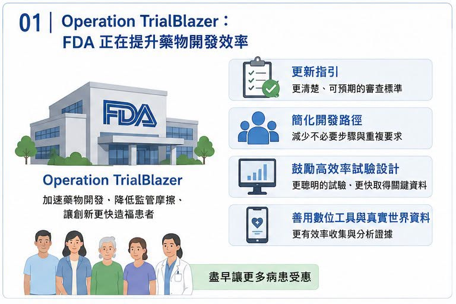
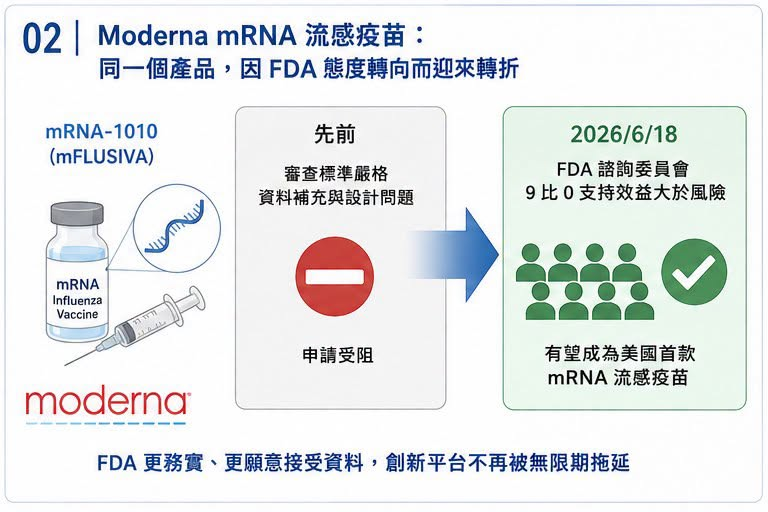
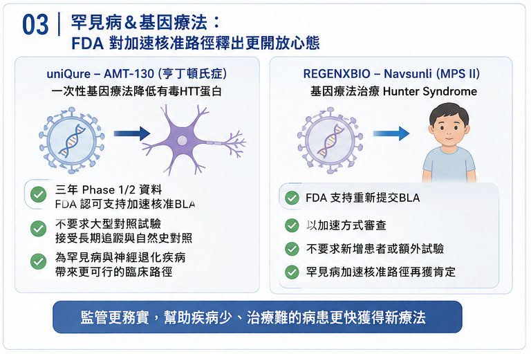
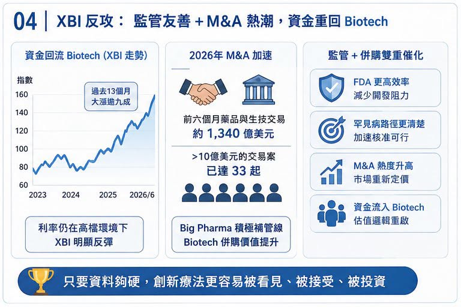

# FDA 風向變了：Biotech 反攻訊號，正在從監管端亮起

最近美國生技股的氣氛，明顯不一樣了。

代表中小型 Biotech 的 XBI（SPDR S&P Biotech ETF）近期走勢強勁，資金也重新流入。照理說，在利率仍未完全放鬆、風險資產仍會被折現率壓制的環境下，高波動的 Biotech 不應該是最輕鬆的族群。但市場卻開始重新買回這個板塊，背後不是單純「跌深反彈」，而是監管風向與併購節奏同時出現變化。市場資料顯示，XBI 在過去 13 個月大漲逾九成，2026 年以來也有明顯漲幅，部分原因來自資金回流與 M&A 熱度升高。

真正的關鍵，出在 FDA。

過去一段時間，美國 FDA 經歷高層人事震盪，罕見疾病、基因療法、疫苗與加速核准標準都被市場反覆檢視。但最近幾個案例顯示，FDA 正從此前偏嚴、偏保守、甚至被業界認為「標準忽左忽右」的狀態，逐步轉向更務實、更願意溝通的路線。

對 Biotech 來說，這不是小事。

因為一家臨床階段公司最怕的，從來不只是試驗失敗，而是明明有資料，卻被監管路徑卡住；

明明患者族群很小，卻被要求做幾乎不可能完成的大型隨機對照試驗；明明前一次會議溝通過可行，下一次又被推翻重來。當 FDA 開始釋放更開放的訊號，很多原本被壓在谷底的 Biotech，估值邏輯就會重新被市場計算。

## 01｜Operation TrialBlazer：FDA 正在告訴市場，審評效率會被重新重視

6 月 22 日，美國 FDA 宣布 Operation TrialBlazer，目標是加速藥物開發流程，降低不必要的監管摩擦，並透過更有效率的試驗設計與資料使用方式，讓創新藥能更快從早期研究走向後期臨床。

公開資訊指出，這項計畫包括更新指引、簡化開發路徑、鼓勵更高效率的臨床試驗設計與數位工具使用。

這種政策語言，對一般讀者可能不夠刺激，但對 Biotech 投資人來說，這是很重要的訊號。因為 Biotech 的估值，很大一部分來自未來現金流折現。而 FDA 的態度，會直接影響三件事：

第一，臨床試驗要不要多做一個。

第二，上市申請能不能提前。

第三，既有資料能不能被接受為加速核准或條件式核准基礎。

如果 FDA 要求變得比較可預期，開發時間縮短，補件風險下降，那同一條管線的 rNPV，也就是風險調整後淨現值，就會自然上升。這就是為什麼監管風向會影響整個 XBI。不是因為 FDA 口號好聽，而是因為它可能直接縮短 Biotech 的上市路徑。

## 02｜Moderna：同一個 mRNA 流感疫苗，命運突然轉向

Moderna 是這波 FDA 風向轉變裡最具代表性的案例之一。

COVID-19 疫苗紅利退潮後，Moderna 必須證明自己不是只靠疫情時代吃飯的公司。它的重要下一步，是 mRNA 流感疫苗 mRNA-1010（mFLUSIVA），以及流感與新冠組合疫苗。

但這條路一開始並不順。

先前 Moderna 的申請曾因臨床設計、資料補充與審查標準問題，被 FDA 卡住。對 Moderna 來說，這不只是單一產品問題，而是市場對「mRNA 平台能不能在 COVID 之外持續成功」的信心問題。

轉折出現在 6 月 18 日，FDA 疫苗與相關生物製品諮詢委員會針對 Moderna 的 mRNA 流感疫苗進行討論，並分別以 9 比 0 的結果，認為 mRNA-1010 對 50 至 64 歲、以及 65 歲以上成人族群的效益大於風險。這讓 Moderna 成為美國第一款 mRNA 季節性流感疫苗潛在核准案的重要候選者。這件事真正有意思的地方在於：資料本身沒有突然變魔法，變的是 FDA 對證據包的接受度，以及諮詢委員會對風險效益的看法。

對市場來說，這是一個訊號：

FDA 不是不看風險。

但如果資料足夠支持，創新平台不會被無限期拖住。

## 03｜uniQure：罕見病基因療法，重新看到加速核准路徑

比 Moderna 更戲劇化的，是 uniQure。

uniQure 的 AMT-130 是一款針對 Huntington’s disease（亨丁頓氏症）的基因療法。Huntington’s disease 是由 HTT 基因突變造成的遺傳性神經退化疾病，患者的運動、認知與精神功能會逐步惡化，目前仍缺乏真正能改變疾病進程的療法。

AMT-130 的策略，是透過一次性基因療法降低有毒突變 huntingtin 蛋白的表達。

問題在於，這類疾病很難做傳統大型隨機對照試驗。患者少、疾病進展慢、手術侵入性高，加上要設計假手術對照，倫理與執行上都極為困難。先前市場最擔心的是，FDA 是否堅持必須要大型對照試驗，才願意接受上市申請。若答案是肯定的，AMT-130 的開發時間與成本都會大幅增加。

但最新訊號顯示，FDA 已允許 uniQure 以三年 Phase 1/2 資料支持加速核准路徑的 BLA 申請，也就是生物製劑許可申請。

公開資料指出，FDA 表示 AMT-130 三年資料可支持其規劃中的 BLA 申請，這對罕見病基因療法很重要。因為它代表 FDA 願意在沒有傳統大型三期試驗的情況下，考慮以長期追蹤、自然史對照與臨床量表資料支持加速核准。

這不是放水，而是承認罕見病與神經退化疾病不能全部套用常規大規模試驗模板。

## 04｜REGENXBIO：Navsunli 的回轉，更像是罕見病審查風向球

REGENXBIO 的案例，同樣具代表性。

其基因療法 Navsunli（RGX-121）用於 Hunter syndrome，也就是 MPS II，第二型黏多醣症，一種罕見且嚴重的遺傳性疾病。這類疾病患者少，疾病進展快，長期對照試驗很難做，也很難讓家長接受孩子被分配到安慰劑組。先前 FDA 對 REGENXBIO 的申請要求更高資料，一度讓市場認為產品前景受阻。但 6 月，FDA 轉向支持 REGENXBIO 重新提交 BLA，並表示會以加速方式審查，且不要求新增患者或額外試驗。REGENXBIO 也公告，FDA 認可公司可在與 FDA 會議後重新提交 Navsunli 的 BLA，並強調 FDA 對罕見病加速核准路徑的支持。公開報導也指出，FDA 對 REGENXBIO 罕見病基因療法的態度反轉，消除了新增患者或額外安慰劑對照試驗的要求，並帶動股價反彈。

這一類案例累積起來，就不只是單一公司利多，它開始變成整個罕見病與基因療法板塊的估值重估。

## 05｜XBI 反攻，不只靠 FDA，也靠 M&A 重啟
監管只是第一根火柴。

第二根火柴，是 M&A，也就是併購，2026 年以來，全球製藥併購明顯回溫。市場資料顯示，2026 年前六個月已有約 1,340 億美元藥品與生技交易，超過 2025 年全年的 1,120 億美元；其中已有 33 起金額超過 10 億美元的 Biotech 收購案。

這背後邏輯很清楚，Big Pharma 正面臨專利懸崖。

未來數年，多款重磅藥將失去市場獨占，收入缺口必須靠外部管線補上。相比從零自己研發，直接買進已經有臨床資料、可望進入後期或上市的資產，仍是最快方式。所以今年看到 GSK 買 Nuvalent，AbbVie 買 Apogee，Merck、Lilly、Pfizer 等公司持續在不同治療領域加碼，並不意外。對 XBI 這類中小型 Biotech 權重較高的指數來說，M&A 是最直接的估值催化。只要市場相信 Big Pharma 會繼續出手，中小型 Biotech 就不會只用「現金還能燒多久」來估值，而會開始重新計算「誰可能成為下一個被買走的標的」。

## 結語｜FDA 變化不是全面放水，而是讓「好資料」更快被看見
這一波 XBI 反攻，不能簡化成市場突然樂觀。

更準確地說，是幾個條件同時改善：

FDA 釋放更高效率、更務實的審查訊號。

罕見病與基因療法重新看到加速核准路徑。

mRNA、基因療法、罕見病公司股價因監管轉向而反彈。

Big Pharma M&A 正在加速。

資金重新尋找中小型 Biotech 的高彈性機會。

當這些因素疊在一起，Biotech 重新被市場定價，就不奇怪了。當然，FDA 變化不代表所有公司都會過關。沒有資料的公司，還是沒有資料。安全性不過關的產品，還是會被擋下。臨床終點模糊、商業價值不清的管線，也不會因政策口號就突然變好。但對那些真正有資料、有病人需求、有合理法規路徑的 Biotech 來說，現在的環境確實比過去一段時間友善許多。

這就是醫藥板塊反攻的第一個訊號，不是泡沫回來了。

而是市場開始重新相信：只要資料夠硬，監管路徑不一定永遠那麼窄。

參考資料：

[0] 各公司官網與公開資料。

[1] Barron’s｜[Biotech Shares Are Soaring](https://www.barrons.com/articles/biotech-shares-xbi-ff82f9cb)

[2] FDA｜[Clinical Trials and Human Subject Protection](https://www.fda.gov/drugs/development-approval-process-drugs/clinical-trials-and-human-subject-protection)

[3] FDA｜[Vaccines and Related Biological Products Advisory Committee](https://www.fda.gov/vaccines-blood-biologics/vaccines/vaccines-and-related-biological-products-advisory-committee)

[4] The Wall Street Journal｜[FDA Gives Third Rare-Disease Drug Another Shot, Regenxbio Says](https://www.wsj.com/tech/biotech/fda-will-reverse-rejection-of-third-rare-disease-drug-regenxbio-says-d8fff1fc)

[5] REGENXBIO｜[RGX-121 / Navsunli program information](https://www.regenxbio.com/pipeline/rgx-121/)

---

本文僅供產業研究與知識分享，不構成投資、醫療、募資或個股建議。
