# 太陽製藥、梯瓦製藥 與 全球學名藥廠的轉型焦慮

全球學名藥廠面對價格壓力與成長瓶頸，轉型焦慮的核心，是如何從製造與成本優勢走向更高價值的產品組合。

## 學名藥不是沒有價值，而是舊模式變難了

學名藥產業長期靠規模、製造效率與通路能力創造價值，但當價格競爭加劇、監管要求提高、供應鏈成本上升，單純靠量和成本的模式就越來越辛苦。

太陽製藥、梯瓦製藥這類公司面對的，不是單一產品問題，而是整個商業模式必須往特殊學名藥、複雜製劑、品牌藥與生物相似藥移動。

- 傳統學名藥毛利承壓。
- 複雜製劑與特殊學名藥提高進入門檻。
- 轉型需要研發能力與資本配置，不只是成本控制。

## 轉型焦慮來自兩邊壓力

一邊是老產品持續被價格壓縮，另一邊是新產品需要更高研發投入、更長時間與更高失敗風險。這讓學名藥公司常常處在現金流與創新投資的拉扯中。

投資人要看的是，公司是否真的建立差異化產品組合，而不是只在簡報裡說要轉型。

- 現金流能否支撐轉型。
- 新產品組合是否有足夠進入門檻。
- 債務、訴訟與合規風險會影響估值。

## Drugnews 的判斷

全球學名藥廠的價值，不會再只看出貨量，而是看誰能把製造優勢升級成更高技術門檻的產品平台。轉型成功的公司會被重新評價，轉型失敗的公司則可能繼續被低本益比困住。

- 轉型不是口號，要看產品組合品質。
- 學名藥公司的估值差異，會越來越取決於技術門檻。

## 小結

這篇文章的重點不是把單一新聞看成短線題材，而是回到 Drugnews 一直強調的分析方法：從臨床證據、商業定位、競爭格局與監管風險四個面向，判斷一個生技醫藥事件是否真的會改變公司價值。

本文僅供產業研究與知識分享，不構成投資、醫療、募資或個股建議。
