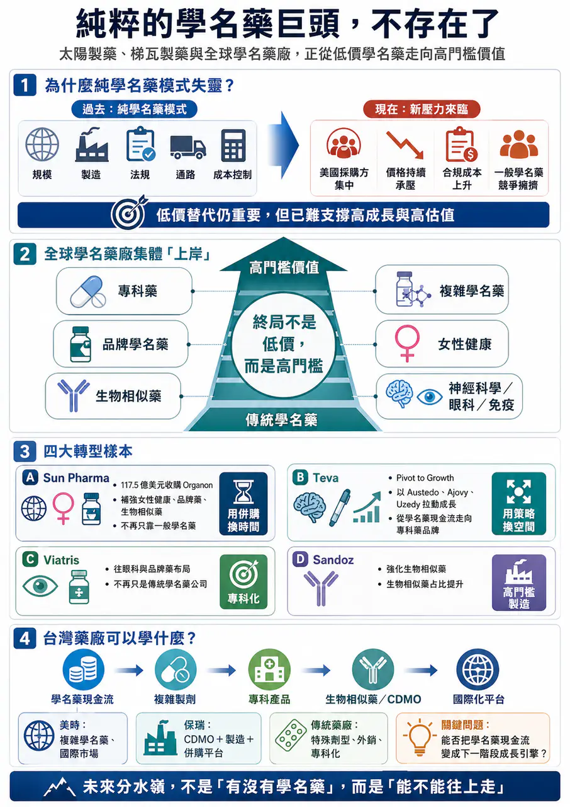
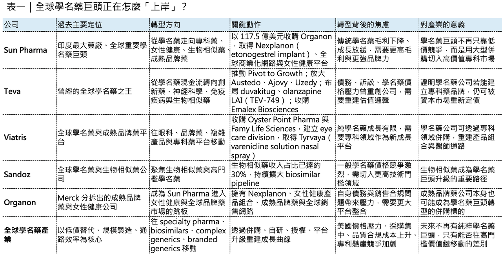
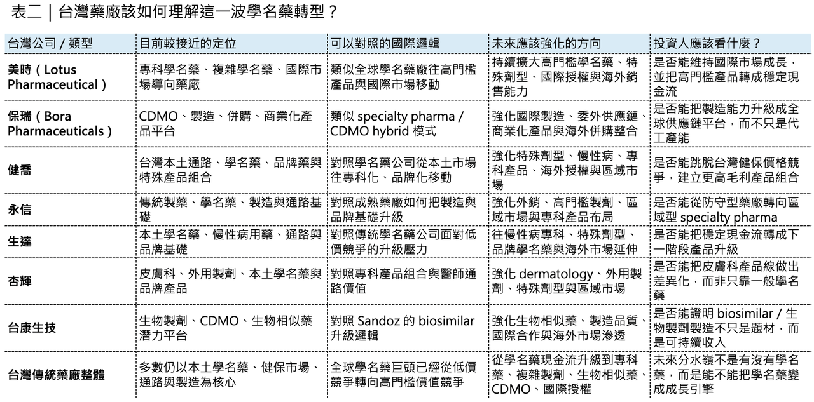

# 太陽製藥、梯瓦製藥 與 全球學名藥廠的轉型焦慮

## 💊 純粹的學名藥巨頭，不存在了

全球學名藥產業，正在進入一個新的階段。

過去，學名藥巨頭的優勢很清楚：規模、製造、法規、通路、成本控制。只要專利藥到期，學名藥公司就能用更低價格切入市場，用大量品項、大規模供應和全球銷售網路，換取穩定現金流。

這套模式曾經非常有效。

但現在，純粹靠傳統學名藥躺贏的時代，正在結束。

美國市場採購方集中化、價格持續承壓，學名藥競爭越來越激烈，品質與合規成本越來越高。即使是全球學名藥巨頭，也很難再只靠一般學名藥維持高成長與高估值。世界仍然需要廉價藥。但資本市場更青睞能定義自身價值的公司，所以我們看到一個很清楚的趨勢：學名藥巨頭正在集體「上岸」。

它們不想再困在低價競爭裡，而是往專科藥、品牌學名藥、生物相似藥、複雜學名藥、女性健康、神經科學、眼科、免疫疾病這些更有定價能力、更有品牌與臨床價值的位置移動。印度 太陽製藥 （Sun Pharma） 收購 Organon，是這個轉向最具代表性的事件。Teva 的反彈，則證明轉型不是口號，只要策略對，學名藥巨頭也能重新被市場定價。

## 01｜Sun Pharma 為什麼要花 117.5 億美元買 Organon？

Sun Pharma 是印度最大藥廠，也是全球重要學名藥巨頭。但它現在做了一件非常不「傳統學名藥」的事：用 117.5 億美元企業價值 收購美國藥廠 Organon。

這是印度藥廠史上最大型的海外併購之一。Organon 股東將取得每股 14 美元現金；交易完成後，合併公司年營收約 124 億美元，業務將涵蓋成熟品牌藥／品牌學名藥、女性健康、生物相似藥與創新藥。Organon 目前擁有超過 70 個產品，銷售遍及約 140 個國家；合併後，Sun Pharma 也將成為全球女性健康前三大公司之一，並躋身全球生物相似藥前十大玩家。這筆交易表面上是規模擴張，真正目的卻是結構升級。Sun Pharma 不是只想買營收。

它想買的是三樣東西：

🏥 第一，是女性健康平台。

Organon 最重要的產品之一，是長效避孕植入劑 Nexplanon（etonogestrel implant）。這類產品不是一般學名藥邏輯，而是具備品牌、醫師教育、通路與長期使用場景的專科藥品牌。

🏥 第二，是全球商業化網路。

Organon 不是新創 biotech，而是一家從 Merck 分拆出來、具備全球銷售與製造基礎的成熟藥廠。對 Sun Pharma 來說，這能快速補強美國以外市場，尤其是歐洲、加拿大、巴西、中國與其他新興市場。

🏥 第三，是生物相似藥與成熟品牌藥組合。

傳統學名藥競爭太擁擠，生物相似藥雖然也有競爭，但門檻更高、製造與法規能力更重，價格崩跌速度通常不像一般小分子學名藥那麼快。Sun Pharma 透過 Organon 直接把自己推進更高階的牌桌。

這就是這筆交易的真正邏輯。Sun Pharma 不是放棄學名藥，而是要讓學名藥不再是公司唯一語言。

## 02｜豪賭背後，是學名藥公司的成長焦慮

Sun Pharma 為什麼要冒這麼大的風險？答案很直接：傳統學名藥的利潤池變薄了。

美國市場過去是全球學名藥公司最重要的金礦，但現在這個市場越來越難賺。採購端高度集中，通路議價能力提高；同一品項常常很快擠進多家競品；價格壓力持續下來，傳統小分子學名藥很難再支撐過去那種成長曲線。

這也是為什麼 Sun Pharma 近年一直強調專科藥業務。它已經有 Ilumya（tildrakizumab）、Winlevi（clascoterone cream） 等專科藥產品，但整體創新藥／特藥占比仍然不夠高。Organon 的加入，可以讓 Sun Pharma 的創新藥收入占比提升至約 27%。這對一家學名藥巨頭來說很重要，因為市場不會只問你有多少品項。市場會問：

📉 你的產品有沒有品牌？

📉 有沒有專科醫師通路？

📉 有沒有更高毛利？

📉 有沒有生物相似藥？

📉 有沒有女性健康、皮膚、腫瘤、肥胖、神經等更高價值領域？

📉 能不能避開純價格戰？

Sun Pharma 這次收購 Organon，本質上就是在回答這些問題，但這筆交易也有風險。Organon 本身背負不少債務。Reuters 報導指出，截至 2025 年底，Organon 淨負債約 86 億美元；Sun Pharma 則計畫透過現金與已承諾銀行融資完成交易。此外，Organon 曾因 Nexplanon 美國批發商銷售實務問題引發內部調查。Organon 公告指出，調查發現 2022 至 2025 年部分季度中，某些美國批發商被要求購買超過實際需求的 Nexplanon；公司董事會認定相關批發商銷售實務不當，部分既有揭露也不完整或不準確。這也導致 CEO Kevin Ali 離任，所以 Sun Pharma 不是撿到便宜。它是在買一個有全球商業化能力、也帶著整合與治理風險的成熟平台，這就是大型轉型併購的本質：你不是只買成長，也買問題。

## 03｜梯瓦製藥 （Teva） 的重生：從學名藥之王，轉向創新與專科藥品牌

如果 Sun Pharma 是用併購換時間，Teva 則是用策略換空間。Teva 曾經是全球學名藥之王，但也曾陷入非常嚴重的困境。

債務高、成長停滯、訴訟壓力、學名藥價格下滑，都讓這家公司一度被市場視為舊時代巨頭。

真正改變 Teva 的，是 CEO Richard Francis 推出的 Pivot to Growth 策略。這個策略的核心不是放棄學名藥，而是讓學名藥成為穩定現金流，同時把公司重新推向創新藥、生物相似藥、複雜學名藥與神經科學品牌。

Teva 2025 年營收達 173 億美元，年增 4%；其中關鍵創新品牌 2025 年收入超過 30 億美元，以當地貨幣計算年增 35%。最重要的成長引擎包括 Austedo（deutetrabenazine）、Ajovy（fremanezumab）、Uzedy（risperidone extended-release injectable suspension）。Austedo 2025 年全球收入達 22.6 億美元，年增 34%；Ajovy 達 6.73 億美元，年增 30%；Uzedy 達 1.91 億美元，年增 63%。

它代表 Teva 不再只是用學名藥現金流撐住公司，而是開始用專科藥品牌拉動估值修復。Teva 自己也把 2030 年前建立超過 50 億美元創新藥品牌組合作為目標，核心資產包括 Austedo、Ajovy、Uzedy，以及後期管線裡的 olanzapine 長效針劑（TEV-749）、duvakitug（anti-TL1A antibody）、emrusolmin 等。其中 duvakitug 是與 Sanofi 合作開發的 TL1A 抗體，目標是發炎性腸道疾病。Teva 也已在 2025 年 12 月向 FDA 提交 olanzapine 長效注射懸浮劑（TEV-749）的新藥申請，用於成人思覺失調症。

2026 年 4 月，Teva 又宣布以 7 億美元現金收購 Emalex Biosciences，另有最高 2 億美元商業里程碑付款與銷售權利金。核心資產是 ecopipam，一款針對兒童妥瑞症的後期、已接近申請階段、first-in-class dopamine D1 receptor antagonist。這筆併購很有 Teva 的味道，它不是去買最熱門的 oncology 平台，也不是做超大規模豪賭，而是買一個和自己神經科學商業能力高度契合、接近申請階段、風險相對去化的專科藥資產。

這就是 Teva 的轉型方式：不是從學名藥公司突然變成創新藥夢想家，而是用既有商業化能力，去接住更高價值、更專科化、更能形成品牌溢價的產品。

## 04｜👁️ Viatris、Sandoz 也在做同一件事，只是路徑不同

Sun Pharma 和 Teva 不是孤例。

全球學名藥巨頭都在轉向。

暉致（Viatris） 也不再只是傳統學名藥公司。它透過收購 Oyster Point Pharma 和 Famy Life Sciences 建立眼科部門，取得 Tyrvaya（varenicline solution nasal spray） 以及多個後期眼科項目。這筆交易完成後，Viatris 明確把眼科視為未來專科藥成長平台之一。

山德士藥業（Sandoz） 則選擇更清楚的生物相似藥路線。Sandoz 2025 年淨銷售額達 111 億美元，生物相似藥已占總銷售約 30%；公司也表示其生物相似藥管線瞄準約 2,000 億美元原廠藥銷售市場，這些公司走的路不同，但方向一致。

🧠 Viatris 從學名藥往眼科、品牌藥、複雜產品移動。

🧠 Sandoz 從學名藥往生物相似藥和高門檻藥物移動。

🧠 Teva 從學名藥往神經科學、免疫疾病、生物相似藥移動。

🧠 Sun Pharma 則透過 Organon 快速切入女性健康、生物相似藥、全球品牌藥組合。

這就是新的產業秩序，未來不會再有「純粹學名藥巨頭」。只靠一般學名藥的公司，估值會被壓住，毛利會被壓住，成長會被壓住。真正能活得更好的，是那些能把學名藥現金流，升級成專科藥廠平台的公司。

## 05｜專利懸崖不是學名藥巨頭的保證，而是重新洗牌的開始

很多人直覺認為，專利懸崖來了，學名藥公司應該很爽。因為一堆重磅藥物專利到期，照理說學名藥和生物相似藥機會變多。但事情沒有那麼簡單。專利懸崖確實帶來供給機會，但也帶來更激烈競爭。

每一個大品種到期，都會吸引大量學名藥公司與生物相似藥公司進場。真正能賺錢的，不是所有人，而是少數有法規、製造、成本、通路、訴訟、商業化和供應能力的玩家。尤其生物相似藥更是如此。它不像小分子學名藥那樣簡單替代。生物相似藥需要更高開發成本、更複雜製造、更強法規能力，也需要醫師、支付方與患者轉換信任。所以專利懸崖不是保證學名藥公司躺著賺錢。

它更像是一次大考。

⏰ 低門檻玩家會被價格競爭淘汰。

⏰ 高門檻玩家會往生物相似藥、複雜學名藥、專科藥品牌、品牌學名藥和區域商業化平台集中。

這就是產業分層。

## 06｜這對台灣藥廠是警訊，也是機會

這個趨勢對台灣非常重要。

台灣本土藥廠長期有很強的學名藥、特殊製劑、通路與製造能力，但如果只停留在台灣本土市場、一般學名藥與健保價格競爭裡，長期估值天花板會非常明顯。台灣藥廠要思考的問題，和 Sun Pharma、Teva、Viatris、Sandoz 本質上是一樣的：如何從低毛利、低估值的學名藥邏輯，走向更高附加價值的專科藥廠？

這裡最值得連結的台灣公司，不是純新藥公司，而是有學名藥、特殊製劑、國際通路、CDMO、併購能力或生物相似藥想像的公司。

🇹🇼 美時（Lotus Pharmaceutical） 是最直接的案例。

美時本來就不是傳統本土學名藥公司，而是更接近專科學名藥／複雜學名藥／國際市場導向的公司。它的價值不只在台灣市場，而在歐洲、美國與亞洲多地產品布局，也在於能不能持續把高門檻學名藥、特殊劑型與國際授權推成穩定現金流。

🇹🇼 保瑞（Bora Pharmaceuticals） 則是另一條路。

保瑞不是單純學名藥公司，而是透過併購、CDMO、製造、商業化產品與國際供應鏈，往平台型專科藥廠／CDMO 混合模式走。全球藥廠越重視供應鏈韌性、委外製造、製程穩定與地緣風險分散，保瑞這類公司就更有機會被重新理解。

🇹🇼 健喬、永信、生達、杏輝 這類台灣傳統藥廠，則面臨更典型的轉型命題。

它們在台灣有通路、有製造、有品牌、有現金流，但如果只靠傳統學名藥與本土市場，長期成長會受限。未來真正重要的是，能不能走向特殊劑型、外銷市場、品牌藥、區域授權、皮膚科／眼科／呼吸／慢性病等專科產品組合，而不是只在台灣健保市場裡做價格競爭。

這些公司都不是 Sun Pharma 或 Teva 的複製版。但方向是類似的：學名藥現金流只是起點。

專科化、複雜化、國際化，才是下一階段估值語言。

## 07｜📌 台灣不能只把學名藥當防守型產業

台灣資本市場常常把學名藥公司看成防守型、低成長、低估值族群。這有一部分合理，因為本土學名藥受到健保價格、通路競爭、產品同質化與人口結構影響，確實很難像創新藥或 AI 半導體那樣給高成長想像。

但如果全球學名藥巨頭都在轉型，台灣也不應該只用「學名藥就是低估值」的舊框架看這些公司，真正值得看的，不是公司今天是不是做學名藥，而是它有沒有能力往上走。

- 能不能做複雜學名藥？
- 能不能做專科品牌藥？
- 能不能做生物相似藥？
- 能不能做 CDMO？
- 能不能收購海外產品？
- 能不能建立國際通路？
- 能不能把台灣製造能力變成全球供應鏈價值？
這才是評價邏輯的變化，未來台灣藥廠的分水嶺，不會是「有沒有學名藥」。而是：有沒有辦法把學名藥現金流變成下一階段成長引擎。

## 08｜學名藥的終局，不是低價，而是高門檻

純粹低價學名藥會越來越辛苦，但高門檻學名藥、特殊製劑、生物相似藥、難製劑型、專科品牌藥，仍然有價值。

不是學名藥沒有未來，是低門檻學名藥沒有好估值，未來真正有價值的公司，不一定全部是原創新藥公司。它也可能是：

🧱 能做複雜製劑的公司。

🧱 能做生物相似藥的公司。

🧱 能取得全球銷售權的公司。

🧱 能整合製造與商業化的公司。

🧱 能透過併購取得成熟品牌藥的公司。

🧱 能在專科疾病領域建立醫師通路的公司。

Sun Pharma 買 Organon，Teva 推 Pivot to Growth，Viatris 建眼科部門，Sandoz 強化生物相似藥，本質上都在回答同一個問題：如何從「低價替代」走向「高門檻價值」。

## 結語｜🌊 學名藥巨頭正在上岸，台灣藥廠也該重新定位自己

世界仍然需要學名藥。

學名藥降低醫療支出，提高藥物可近性，是全球醫療體系不可或缺的一部分。但對資本市場來說，純學名藥已經很難支撐高估值。因為低門檻學名藥的競爭太激烈，價格太透明，毛利太容易被壓縮。

純粹的學名藥巨頭，正在消失。

留下來的，會是那些能把低價競爭轉成高門檻價值，能把製造能力轉成全球平台，能把成熟產品轉成專科藥品牌的公司。這不是學名藥產業的終點，這是它重新分層的開始。

---

參考資料：

[0]: 各公司官網＆公開資料

[1]:

Sun Pharma signs Definitive Agreement to Acquire Organon | Organon

Organon stockholders to receive US$ 14.00 per share in cash The deal values Organon at EV of US$ 11.75 billion Combined Business leverages complementary portfolios and global scale for sustained long‑term value creation Sun Pharmaceutical Industries Limit

www.organon.com

"Sun Pharma signs Definitive Agreement to Acquire Organon | Organon"

[2]:

reuters.com

https://www.reuters.com/business/healthcare-pharmaceuticals/sun-pharma-acquire-organon-1175-bln-all-cash-deal-2026-04-27/

www.reuters.com

"Sun Pharma to buy US drugmaker Organon for $11.75 billion in India's largest pharma deal | Reuters"

[3]:

www.sec.gov

https://www.sec.gov/Archives/edgar/data/1821825/000110465925108740/tm2530588d2_10qa.htm

www.sec.gov

[4]:

Teva Pharmaceutical Industries Ltd. - Teva Innovative Portfolio and Consistent Execution of Pivot to Growth Strategy Deliver Third Consecutive Year of Growth; Pipeline Positioned to Unlock Significant Value Potential

Teva delivers 3 consecutive years of growth - 2025 revenues of $17.3 billion, an increase of 4% year-over-year (YoY) in U.S. dollars, or 3% in local currency (LC) terms, compared to 2024. Excluding Japan BV, revenues increased 5% YoY in LC. Key Innovative

ir.tevapharm.com

"

Teva Pharmaceutical Industries Ltd. - Teva Innovative Portfolio and Consistent Execution of Pivot to Growth Strategy Deliver Third Consecutive Year of Growth; Pipeline Positioned to Unlock Significant Value Potential"

[5]:

YouTube icon

https://www.tevausa.com/news-and-media/press-releases/teva-reaffirms-pivot-to-growth-strategy-progress-with-launch-of-acceleration-phase-at-2025-innovation-a/

www.tevausa.com

"Teva Reaffirms “Pivot to Growth” Strategy Progress with Launch of Acceleration Phase at 2025 Innovation a"

[6]:

Teva Pharmaceutical Industries Ltd. - Teva Pharmaceuticals Submits New Drug Application to FDA for Olanzapine Extended-Release Injectable Suspension (TEV-'749) for the Once-Monthly Treatment of Schizophrenia in Adults

Olanzapine long-acting injectable (LAI) has the potential to offer the efficacy of olanzapine in a once-monthly, subcutaneous formulation, for a broad patient population 1 Olanzapine LAI is designed to help support real-world adherence and improved stabil

ir.tevapharm.com

本文僅供產業研究與知識分享，不構成投資、醫療、募資或個股建議。
