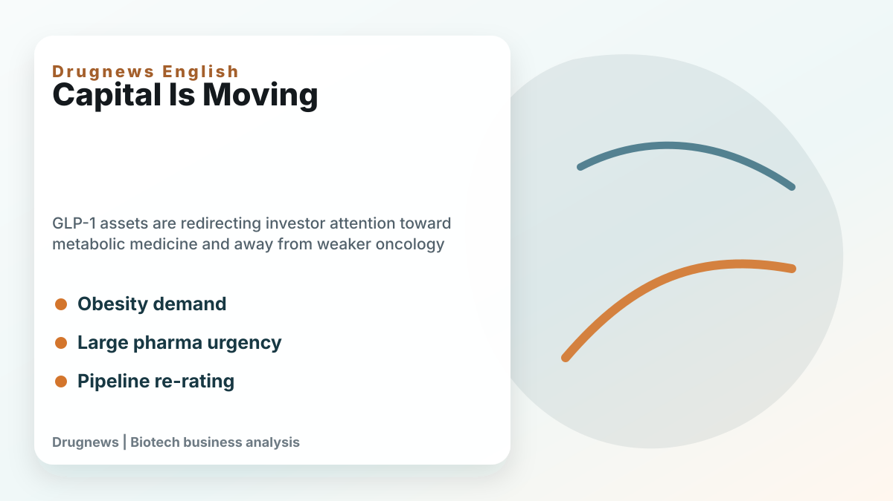
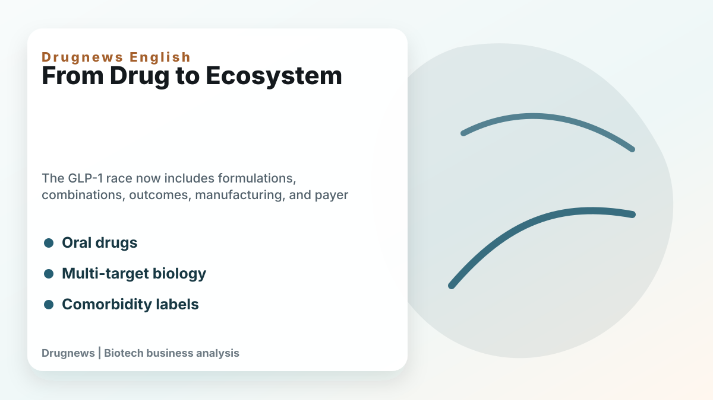
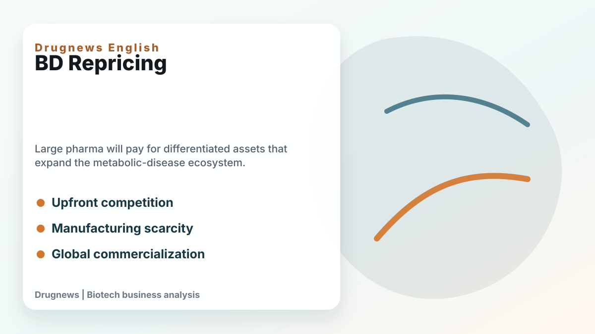
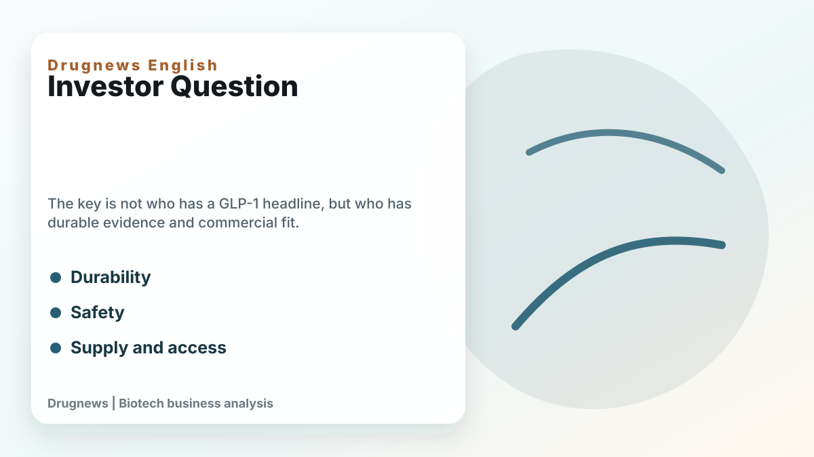

# Obesity Becomes King: How GLP-1 Is Reshuffling Global Biotech Capital

In the past few years, the most crowded field in the global biotech community has been tumors.

PD-1, dual antibodies, ADCs, small molecule targets, and cell therapy are all coming one after another. From large pharmaceutical companies to early stage startups, almost everyone is trying to find ways to squeeze cancer. Because the cancer market is large, the price is high, and the unmet needs are clear, as long as the clinical data is good enough, there is a chance that it will be favored by major international pharmaceutical companies.

But now, the market is undergoing a very cruel change, and the capital attractiveness of "ordinary tumor pipelines" is rapidly declining. What really sucked the money away was not another oncology drug, but GLP-1.

GLP-1 has been simplified by many people as a "weight-loss drug" or a "slimming injection" in the past, but this understanding is too shallow. Today's GLP-1 is becoming a core variable for global pharmaceutical companies to reconfigure their R&D budgets, production capacity investments, M&A strategies and licensing bargaining chips.

📌 GLP-1 is causing a "draining effect" in the biotech capital market.

[Drugnews and CMoney CMoney jointly create an investment course on weight-loss drugs]

The Drugnews team conducts an in-depth analysis of the current status of the global weight-loss drug market, drug development process, and clinical use. It also fully explains the investment logic of weight-loss drugs and the targets that the market is focusing on. The in-depth courses of the Drugnews team will enable you to become a professional expert and investor in biotechnology and weight-loss drugs: [Online Course - Financial Management | Provide a full range of investment online courses](https://www.cmoney.tw/course-media/17141/intro)

[01｜Deloitte’s beautiful figure of 7.0% is actually very uneven]

The latest version of Deloitte's "Measuring the return from pharmaceutical innovation" report shows that the estimated internal rate of return (IRR) of the late-stage R&D pipelines of the world's top 20 pharmaceutical companies will rebound to 7.0% in 2025, which has been improved for three consecutive years.

On the surface, it looks like the R&D efficiency of large pharmaceutical companies has finally rebounded from its trough, but when taken apart, this recovery is actually very concentrated.

Deloitte mentioned that obesity-related assets have surpassed oncology to become the largest contributor to late-stage pipeline value for the first time in its 16-year tracking. Obesity assets account for about a quarter of the late-stage pipeline's estimated sales value, while oncology drops to about a fifth. More importantly, GLP-1/GIP assets significantly boost overall returns. In other words, the R&D return rate of global pharmaceutical companies seems to be getting better, which does not mean that the entire industry has become healthier, but that a few super products are pulling the average upward.

The difference here is important.

📌 If the recovery of an industry relies on simultaneous improvements in many areas, it means that the underlying economy has really improved.

📌 But if the recovery is mainly supported by a small number of metabolic assets, it means that capital will be more concentrated, more picky, and less willing to spread money to pipelines that look similar.

This is the most embarrassing part of Oncology Biotech.

In the past, as long as you had a tumor target that looked good and had promising preclinical or early-stage data, there might be a large pharmaceutical company willing to buy a ticket to the future. But now, what the CFO of a pharmaceutical company looks at is not "whether this oncology drug has a story", but "whether the money is used to build GLP-1 production capacity, expand metabolic indications, or buy a larger platform, and the remuneration will be more certain."

[02｜Tumors are not abdicating, but mediocre tumor pipelines are being phased out first]

This wave of changes cannot simply be interpreted as "the tumor is over."

Cancer is still one of the most important battlefields in global medical care. Oncology drugs that are truly differentiated, have clear biomarkers, and have clear clinical positioning will still be valuable. The problem is that in the past few years, too many companies have been working on similar targets, similar mechanisms, and similar patient groups, and finally squeezed into a market that is difficult to calculate. It’s not that big pharmaceutical companies don’t want to buy oncology drugs, but they just don’t want to pay high prices for pipelines that are “only slightly better than existing therapies and require costly verification in the third phase.”

This is particularly evident in the licensing market.

The previous logic was that cancer was priced high, so as long as there was a chance to run out of data, it was worth taking a seat first. The current logic becomes that if an oncology asset does not have a very clear differentiation, does not have advantages that can persuade clinicians to change their treatment habits, and does not have patient stratification that can support commercialization, then it will be discounted in the large pharmaceutical company model.

📌 It’s okay to accept that the tumor is still high risk, but you can’t accept spending a lot of money on a high-risk one where you can’t see a real difference.

📌 You can accept that early-stage assets are not perfect yet, but you cannot accept that before entering the third phase, you can’t even explain “why you have to buy it.”

This is why many oncology companies feel that it is more difficult to raise funds, BD is slower, and valuations are tougher. It’s not that investors suddenly don’t understand science, but that the entire capital market is asking a more realistic question: Are you the next platform, or the next me-too to be eliminated?

【03｜Why can GLP-1 draw away so much capital? Because it’s not just an indication]

The scariest thing about GLP-1 is not its good weight loss effect.

The real power is that it is extending from diabetes and obesity to cardiovascular, sleep apnea, fatty liver, kidney disease, and even more chronic disease comorbidity management.

The U.S. FDA approved Wegovy (semaglutide) in March 2024 to reduce the risk of cardiovascular death, myocardial infarction, and stroke in overweight or obese adults with cardiovascular disease. This takes GLP-1 further from "weight control" to "cardiovascular risk management." In December of the same year, the FDA approved Zepbound (tirzepatide) for the treatment of obese adult patients with moderate to severe obstructive sleep apnea. This further proves that GLP-1/GIP drugs are no longer just a single weight loss market, but are cutting into the entire medical expenditure structure of obesity-related diseases.

To put it bluntly, this is a treatment platform that is rewriting the allocation of medical resources.

As long as GLP-1 can reduce body weight, improve metabolism, affect cardiovascular risk, and even change the treatment path for sleep apnea and fatty liver disease, other drugs related to cardiovascular, renal, liver disease, and metabolic comorbidities will be forced to answer a more difficult question: "Compared with GLP-1, what do you have more?"

In the past, many drugs were valuable for development as long as they proved to be better than placebos. But after GLP-1 becomes a platform for chronic diseases, drugs in many fields must not only prove to be effective, but also prove to be complementary and superimposed with GLP-1, or to solve problems that cannot be solved by GLP-1.

📌 This is the capital pumping effect.

The money is not disappearing, but flowing to platforms that are more certain, larger, and can extend the indications. If the remaining fields cannot prove that they are irreplaceable, they will be forced to use lower valuations, longer waits, and more rigorous data in exchange for the same amount of funds.

[04｜The money of large pharmaceutical companies is changing from "buying stories" to "buying production capacity, buying platforms, and buying certainty"]

Another change that GLP-1 has brought to large pharmaceutical companies is production capacity.

In the era of oncology drugs, many companies can advance in a relatively asset-light manner. R&D, clinical trials, manufacturing, and sales can be split up among different partners. As long as the pipeline is valuable, there will be opportunities to move forward through licensing and external cooperation.

But GLP-1 is different.

Such products involve peptide synthesis, APIs, sterile injections, filling, equipment, global supply chains and quality systems. Once demand explodes, not only clinical data must be obtained, but supply must also keep up. Novo Nordisk and Eli Lilly have spent a lot of capital expenditures to expand production in recent years because the competition for GLP-1 is not only in the laboratory, but also in factories, production lines, supply chains and global distribution capabilities.

This would make capital allocation more realistic.

If a large pharmaceutical company has money, they can choose to buy an early-stage oncology asset, or they can use it to expand GLP-1 production capacity, strengthen their metabolic product portfolio, or invest in next-generation oral or long-acting platforms. When the latter has greater market visibility, the former must come up with stronger reasons.

This is not a sentiment issue, it is a capital efficiency issue.

Especially in the context of major immuno-oncology drugs such as Keytruda and Opdivo facing patent cliff pressure, big pharmaceutical companies will not waste bullets on ordinary assets that "may not be able to fill the hole." What they want are assets that can fill revenue gaps, extend their platforms, and open up new therapeutic areas.

So oncology Biotech valuations will be reclassified.

✅ Oncology companies with clear differentiation, special patient groups, strong clinical endpoints, and platform scalability will still be taken seriously by the market.

⚠️ But if we just make another story with similar targets, similar combinations, and similar back-line patients, it will be increasingly difficult to get a good price in the future.

[05｜The real opportunity is not the “next GLP-1”, but the position next to GLP-1]

The real opportunity for Taiwanese companies to enter may not be to challenge the GLP-1 main drug market head-on, but to stand in the value chain surrounding GLP-1.

📌The first one is marketing and body posture management after weight loss.

The main focus of Caliway (6919)'s CBL-514 is local fat reduction, not a systemic weight-loss drug in the traditional sense. The company's public information mentioned that the clinical phase II data of CBL-514 for reducing abdominal subcutaneous fat has reached the standard, and the development direction has been extended to weight management. The goal is to complement GLP-1 weight-loss drugs and improve problems such as weight relapse after drug withdrawal.

The focus of this road is not "I am also a GLP-1", but "After GLP-1 brings a large number of people to lose weight, what are the unmet needs for appearance, local fat, weight gain management and long-term maintenance." If the global weight loss market really moves towards long-term medication and posture management, this complementary asset may have its own positioning.

📌The second one is manufacturing and supply chain.

Bora Pharmaceuticals (6472) is one of the representatives of Taiwan's pharmaceutical CDMO. Stock exchange information also mentioned that Bora Pharmaceuticals has the service capabilities of large and small molecule drugs from development, testing, certification to manufacturing, packaging and delivery. The more global pharmaceutical companies pay attention to supply chains, quality systems, multinational manufacturing and production capacity flexibility, the more Taiwanese companies with experience in international regulations and manufacturing capabilities will be worthy of being put on the watch list.

TTY Biopharm (4746) looks at it from the perspective of APIs and CDMOs. The GLP-1 craze has brought about not only the drugs themselves, but also APIs, peptides, peptide synthesis, scale-up processes, quality systems and outsourced manufacturing needs. TTY Biopharm may not be a pure concept equal to GLP-1, but its API and CDMO capabilities will be something that investors in Taiwanese stocks cannot ignore when understanding this trend.

📌The third type is differentiated tumors that should not be crowded out by GLP-1.

It’s not that there are no opportunities for tumors, but the valuation logic has become stricter. Companies like PharmaEssentia (6446) that already have commercialized products, revenue paths, and specific disease positioning will look at the market with different rulers than oncology Biotech, which is still telling stories in its early stages. If Taiwan's new oncology drugs want to receive higher evaluations in the future, they must not just say that they are cancer-themed, but must clearly explain the patient stratification, clinical endpoints, differences between competing products, and international licensing value.

[06｜This wave is not a rotation of themes, but a rewriting of valuation rules]

The most noteworthy thing about the GLP-1 pumping effect is that it is not a short-term hot topic. It’s changing three issues in global biotech capital.

📌First, pharmaceutical companies pay more attention to certainty. Assets that can be amplified across indications, bring a huge market, and be accepted by payers will receive more resources.

📌Second, the fault tolerance rate of ordinary pipelines decreases. Especially for early-stage tumors, homogeneous ADCs, and small molecule targets that lack clear patient stratification, valuations will become increasingly difficult to sustain without strong clinical justification.

📌Third, the supply chain has become important again. In the past, everyone loved to talk about targets and data, but now we also need to look at production capacity, raw materials, processes, quality, equipment and global delivery. GLP-1 brings manufacturing from the backstage to the frontstage.

This will make biotech investments more differentiated in the coming years.

Good companies will be more expensive, and ordinary companies will be cheaper; assets that can really enter the capital allocation of big pharmaceutical companies will be pursued, and pipelines with unclear positioning will be left out. Oncology drugs are not without a future, but the era of “as long as it’s cancer, someone will pay for it” is probably over.

[Conclusion｜Don’t just look at whether GLP-1 is hot or not, look at whose money it takes away]

📌 The impact of GLP-1 has exceeded that of weight-loss drugs themselves.

It is diverting the R&D resources, manufacturing capital, BD budgets and investor attention of large pharmaceutical companies from the most crowded oncology track in the past, and redirecting it to metabolism, chronic diseases, autoimmunity, supply chain and complementary platforms. Some companies will be re-visited because they stand next to new trends; some companies will be slowly downgraded by the market because their original stories are too mediocre.

What investors should really pay attention to is no longer whether the subject name has GLP-1, but what irreplaceable value the company will have left after GLP-1 draws away global biotech capital.
---
[Reference materials] Public information from Deloitte, Citeline, FDA, Caliway, Bora Pharmaceuticals, and TTY Biopharm.

[Disclaimer] This article is only for industrial research and does not constitute investment advice. Please make your own judgment and be responsible for your own profits and losses. This article is for industrial research and knowledge sharing only and does not constitute investment, medical, fund-raising or individual stock advice.
