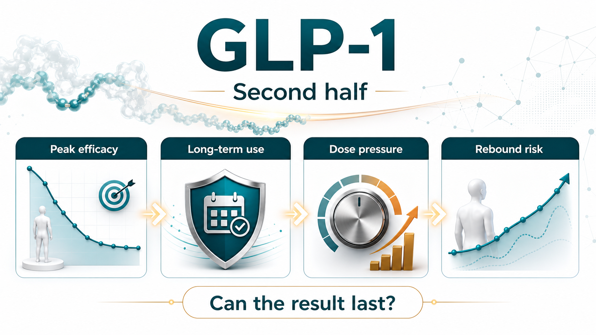
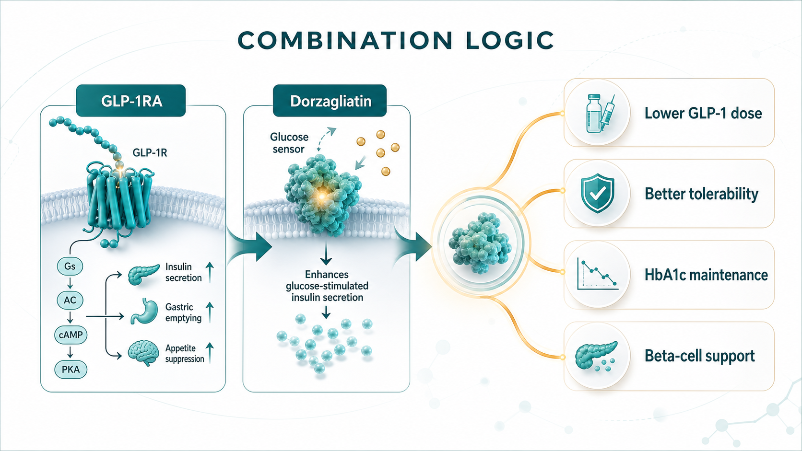
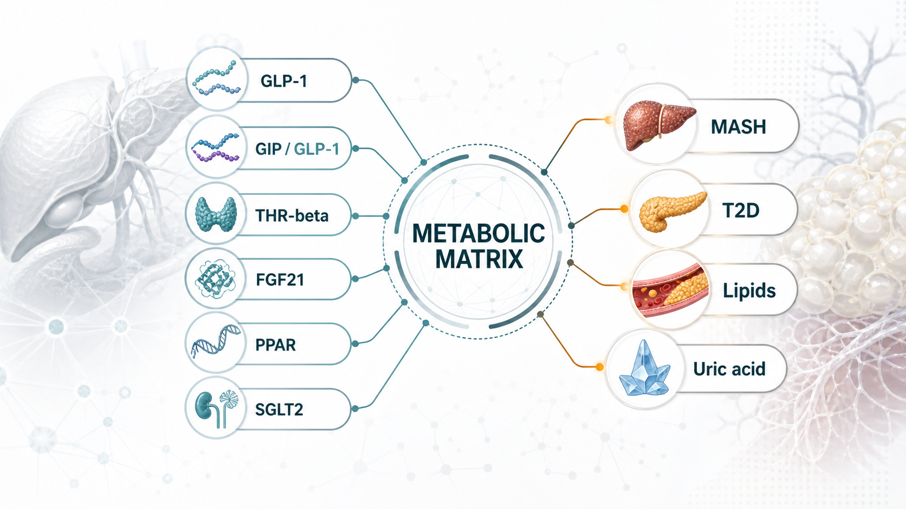

# GLP-1's Second Half: Why Dorzagliatin Is About Making Metabolic Therapy Last

The GLP-1 arms race has moved from one question to another.

The first question was whether these drugs work.

The next question is whether patients can stay on them, tolerate them, stop them without rapid rebound, and maintain benefit at a dose that is realistic for chronic metabolic disease.

Over the past two years, the market has mostly cared about weight-loss magnitude. Wegovy, based on semaglutide, and Zepbound, based on tirzepatide, pushed body-weight reduction into territory that used to look unrealistic for pharmacologic obesity treatment. Oral GLP-1 programs from Eli Lilly, Novo Nordisk, and other large drugmakers have also moved deeper into late-stage development and commercialization planning. From the outside, the competitive rule can look simple: whoever produces more weight loss wins.

But chronic metabolic disease is not that simple.

The real issue is not merely that another combination story has appeared around GLP-1. The more important point is that GLP-1 is moving from a star weight-loss drug category into a long-term metabolic treatment platform. Once that happens, the industry has to answer harder commercial and clinical questions: can patients continue treatment, do they want to continue treatment, what happens after discontinuation, and can lower-dose maintenance preserve enough of the effect?

That is why dorzagliatin, an oral glucokinase activator, has become worth watching again.

Dorzagliatin is not trying to replace GLP-1.

Its more interesting role may be to become a metabolic base underneath GLP-1 therapy.

## 01｜GLP-1 Has Proved Efficacy, but the Real-World Problem Is Long-Term Persistence

GLP-1 receptor agonists have expanded from type 2 diabetes into obesity, cardiovascular-risk reduction, and even MASH, or metabolic dysfunction-associated steatohepatitis. The clinical logic is no longer theoretical. GLP-1 biology has already become one of the central engines of metabolic drug development.

The problem is that chronic disease treatment is not a sprint.

Common gastrointestinal adverse events, including nausea, vomiting, diarrhea, and constipation, can directly affect dose escalation and long-term use. The more practical issue is what happens once treatment stops. Weight and metabolic markers can rebound. A 2026 BMJ systematic review of weight regain after stopping weight-management medications again reminded the market that anti-obesity drugs can open a treatment window, but maintaining the result after discontinuation will become the next competitive problem.

This does not invalidate GLP-1.

It means GLP-1 has matured into a more demanding problem set.

Efficacy can be discussed.

Long-term persistence is harder.

The weight-loss curve can keep improving.

But if patients discontinue because of adverse events, the clinical and commercial value will be discounted.

GLP-1 can become the core of metabolic therapy.

But the next phase will need combination strategies that reduce dose pressure, improve the metabolic base, and extend the useful treatment cycle.

That is why the market will no longer ask only which GLP-1 is strongest. It will also ask who can make GLP-1 therapy last longer.

## 02｜Dorzagliatin Is Not Just Another Glucose-Lowering Drug

Dorzagliatin was developed by Hua Medicine as an oral glucokinase activator. Its strategic point is not simply that it lowers glucose. The more important claim is that it works through glucokinase, one of the body's glucose-sensing systems, and may help recalibrate glucose-responsive signaling across the pancreas, liver, and gut.

In two 2022 Phase III studies published in Nature Medicine, dorzagliatin's clinical positioning became clearer.

The SEED trial studied drug-naive patients with type 2 diabetes. At week 24, dorzagliatin reduced HbA1c by 1.07% from baseline, versus 0.50% with placebo. The study also reported no severe hypoglycemia or drug-related serious adverse events in the dorzagliatin group.

The DAWN trial studied patients whose type 2 diabetes was inadequately controlled with metformin. Dorzagliatin plus metformin reduced HbA1c by 1.02% at week 24, compared with 0.36% for placebo plus metformin. The proportion of patients reaching HbA1c below 7% was 44.4% in the dorzagliatin group, versus 10.7% in the placebo group. Again, no severe hypoglycemia or drug-related serious adverse events were reported.

What makes the story more interesting is the direction of later real-world follow-up data. The BLOOM real-world dataset followed 2,024 patients for 52 weeks and reported an HbA1c below 7% achievement rate of about 44.5%, close to the 44.4% seen in DAWN. That kind of narrative, where the randomized-trial signal does not obviously collapse in real-world use, is exactly what chronic-disease drugs want.

Real life is not a clinical trial.

Patients forget doses, stop because of side effects, carry multiple comorbidities, and often take several glucose-lowering therapies at the same time. If a drug can maintain a relatively stable effect in that setting, the market is not only looking at one efficacy number. It is looking at safety, tolerability, and treatment persistence.

These data do not mean dorzagliatin can challenge GLP-1 on weight loss.

They point to something different.

Dorzagliatin looks more like a repair tool for metabolic sensing than a brute-force glucose-lowering drug.

Traditional diabetes drugs often push one pathway from the outside: increase insulin, reduce hepatic glucose output, or increase urinary glucose excretion. Dorzagliatin's commercial story is different. It aims to make the body respond to glucose changes in a more physiologic way: stronger response when glucose is high, less overstimulation when glucose is low. That is why it becomes relevant when the market starts discussing combination therapy with GLP-1.

## 03｜The Real Dorzagliatin Plus GLP-1 Imagination: Less Side-Effect Pressure, More Sustainability

If GLP-1 adverse events are dose related, the first commercial question for combination therapy is direct: can a lower GLP-1 dose plus dorzagliatin approach the effect of higher-dose GLP-1 monotherapy?

The research direction now attracting market discussion is the combination of dorzagliatin with oral small-molecule GLP-1 receptor agonists such as Eli Lilly's orforglipron. The logic is intuitive. A GLP-1 receptor agonist directly stimulates the receptor. Dorzagliatin may work further upstream by influencing intestinal L cells and glucokinase-related incretin responses. One pushes the receptor from the outside. The other may improve the metabolic sensing environment that sits upstream of incretin signaling.

This is not simply adding two glucose-lowering drugs together.

It is an attempt to form a more complementary treatment design.

First, there is dose saving.

If low-dose GLP-1RA plus dorzagliatin can approach high-dose GLP-1RA monotherapy, then gastrointestinal side-effect pressure could, in theory, be reduced.

Second, there is treatment-cycle improvement.

For patients who stop because of nausea, vomiting, excessive appetite suppression, or general tolerability problems, a combination that balances efficacy and tolerability could extend treatment duration.

Third, there is beta-cell-function support.

Dorzagliatin's Phase III studies and later follow-up narratives both place beta-cell function at the center of the story. If GLP-1 is responsible for appetite, weight, and glycemic improvement, dorzagliatin could act as a metabolic safety net when GLP-1 is reduced or stopped, potentially slowing the loss of glycemic control.

That said, this is exactly where discipline matters.

Much of the combination evidence remains early, animal-based, or based on small studies. It cannot be read as proof of large Phase III success. It also cannot be converted into a certainty that commercial adoption is already solved.

The real questions are whether larger, better-designed human trials will appear, whether the endpoints match real clinical needs, and whether the combination can show a difference in dose, tolerability, discontinuation, weight maintenance, and HbA1c maintenance against an already powerful GLP-1 background.

This is where Drugnews would stay conservative.

Early combination data can open the imagination. Valuation-changing evidence still has to come from human dose selection, tolerability, discontinuation rate, weight and HbA1c durability, and a clear reason for clinicians to add another drug to a GLP-1 regimen.

## 04｜Metabolic Drugs Are Moving From Single-Point Treatment to Combination Matrices

The most important extension is not dorzagliatin as a single product.

It is the change in metabolic drug development logic.

In the past, type 2 diabetes, obesity, fatty liver disease, hyperuricemia, and dyslipidemia were often treated as separate disease boxes. In reality, many patients are expressing one metabolic disorder through different organs. Insulin resistance, fat accumulation, liver inflammation, glucose fluctuation, and uric acid elevation are linked to one another.

That is why large drugmakers are no longer building only one drug.

They are building metabolic-disease combination systems.

MASH is a good example. In 2024, the FDA approved Madrigal's Rezdiffra, or resmetirom, making a THR-beta agonist the first treatment option for adults with noncirrhotic NASH with moderate to advanced liver fibrosis, under the terminology now moving toward MASH. But MASH is not merely a liver disease. It is a whole-body metabolic problem. That is why GLP-1, GIP/GLP-1, FGF21, THR-beta, PPAR, and SGLT2 mechanisms are all moving toward this market from different angles.

If dorzagliatin wants to move from type 2 diabetes into a larger metabolic map, it cannot rely only on the word glucose lowering.

It has to prove that it can serve as a combination base with GLP-1RA, THR-beta agonists, pan-PPAR agonists, and other metabolic mechanisms in a way that is explainable, testable, and commercially meaningful.

That is the real question.

Not whether one regional diabetes drug can sell well.

The question is whether a glucose-homeostasis platform can be re-understood by the international market.

## 05｜What Taiwan Investors Should Watch: Do Not Chase GLP-1 Blindly

For Taiwan investors, the point is not to force every company into a GLP-1 theme.

The better question is where each company sits in the next phase of metabolic therapy.

Standard Chem. & Pharm. (1720) and Yung Shin Pharmaceutical (3705) already have chronic-disease, diabetes, cardiovascular, and oral-formulation exposure. They may not be innovative GLP-1 developers, but if metabolic chronic disease moves toward long-term use, fixed-dose combinations, generics, and regional-market penetration, these companies represent the channel and chronic-care base.

Formosa Laboratories (4746) and ScinoPharm Taiwan (1789) should be watched from the manufacturing and supply-chain angle. GLP-1 and broader metabolic-drug competition will pull demand for peptides, specialized APIs, complex small molecules, and high-specification manufacturing. These companies should not be simplified into GLP-1 theme stocks. They are better understood as part of the global upgrade in metabolic-drug supply chains.

Foresee Pharmaceuticals (6576) is different. Its core logic is long-acting release and specialty formulation capability, not dorzagliatin or GLP-1 itself. But once metabolic chronic disease becomes a long-term-treatment market, lowering dosing burden and improving persistence become cross-industry problems. That is where long-acting formulation platforms may have spillover value beyond a single disease area.

Grape King Bio (1707) and TCI (8436) are not prescription-drug companies. But metabolic health, weight management, probiotics, and functional nutrition are consumer-health markets that may be repriced around the GLP-1 wave. The boundary must be clear: supplements cannot replace drugs and should not overclaim efficacy. Still, GLP-1 patients may have real needs around muscle mass, gastrointestinal tolerance, nutrition, and weight maintenance. Those needs can create discussion in the adjacent consumer-health market.

The common point is not who has GLP-1.

These companies occupy different positions: chronic-care channels, API and CDMO supply chains, long-acting formulation technology, and metabolic-health demand.

The question for Taiwan investors is this:

If the next stage of GLP-1 is long-term maintenance and combination therapy, which companies can participate in a longer treatment cycle and a more complex division of labor across metabolic medicine?

## 06｜Conclusion: The Next Weight-Loss Drug Question Is Whether the Effect Can Stay

The first half of GLP-1 proved how strong weight-loss and metabolic effects could become.

The second half will be more detailed.

Can patients tolerate treatment?

Can they remain on therapy?

What happens after discontinuation?

Can lower doses preserve enough efficacy?

Can GLP-1 become part of a combination matrix across MASH, diabetes, lipids, uric acid, and other metabolic risks?

Dorzagliatin plus GLP-1 sits directly inside that transition.

It does not mean dorzagliatin has become the next GLP-1. It also does not mean early combination data should be packaged as commercial certainty. The more accurate interpretation is that metabolic-drug competition is moving from single-drug peak efficacy toward the ability to design sustainable long-term treatment systems.

For large drugmakers, that means more companion drugs, maintenance drugs, fixed-dose combinations, and combination trials around GLP-1.

For Taiwan investors, it means the question should not be who is somehow connected to GLP-1. The better question is who has a real position in chronic treatment cycles, specialty formulations, API supply chains, and metabolic-health demand.

Weight-loss drugs are not valuable only because they are stronger.

The next source of differentiation will be whether the effect can be made to last.

References:

1. Nature Medicine, [Dorzagliatin in drug-naive patients with type 2 diabetes: a randomized, double-blind, placebo-controlled phase 3 trial](https://www.nature.com/articles/s41591-022-01802-6), 2022.
2. Nature Medicine, [Dorzagliatin add-on therapy to metformin in patients with type 2 diabetes: a randomized, double-blind, placebo-controlled phase 3 trial](https://www.nature.com/articles/s41591-022-01803-5), 2022.
3. BMJ, [Weight regain after cessation of medication for weight management: systematic review and meta-analysis](https://www.bmj.com/content/392/bmj-2025-085304), 2026.
4. FDA, [FDA Approves First Treatment for Patients with Liver Scarring Due to Fatty Liver Disease](https://www.fda.gov/news-events/press-announcements/fda-approves-first-treatment-patients-liver-scarring-due-fatty-liver-disease), March 14, 2024.
5. New England Journal of Medicine, [Tirzepatide for Metabolic Dysfunction-Associated Steatohepatitis with Liver Fibrosis](https://www.nejm.org/doi/10.1056/NEJMoa2401943), 2024.

Disclaimer: This article is for industry research and market observation only. It does not constitute investment advice, trading advice, medical advice, fundraising advice, or a recommendation on any individual security. Biotech and pharmaceutical investing involves clinical, regulatory, licensing, commercialization, currency, and capital-market risks. Readers should make independent judgments and bear their own risk.
