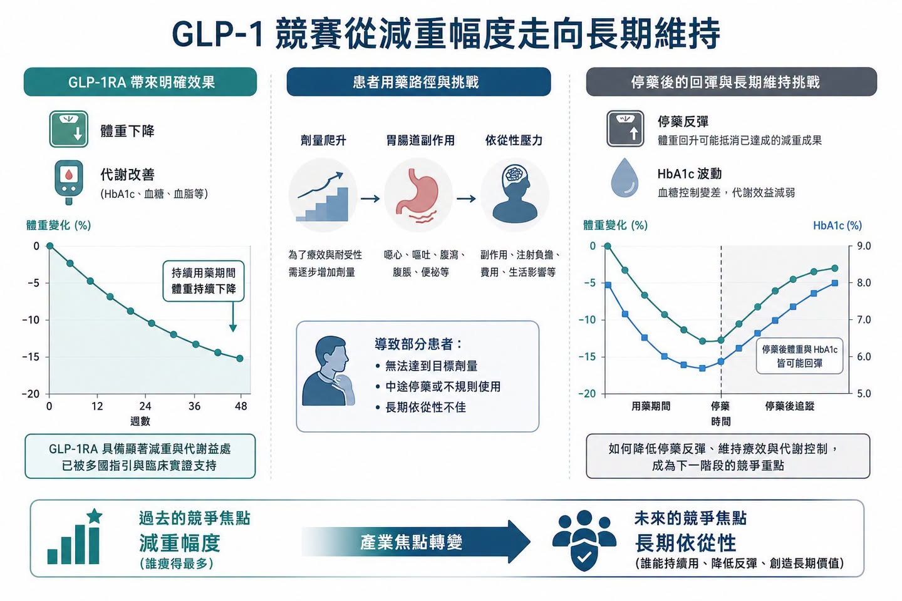
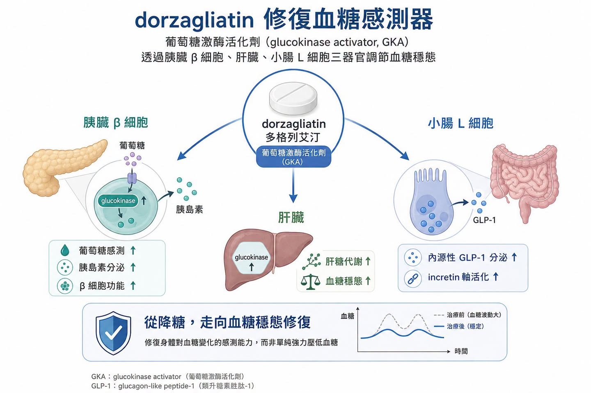
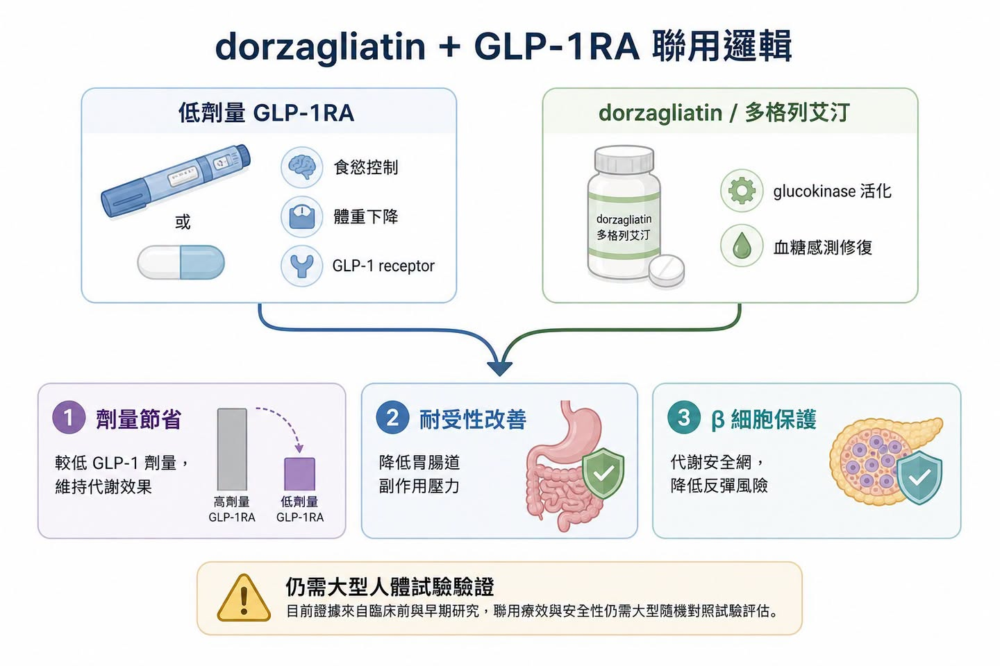
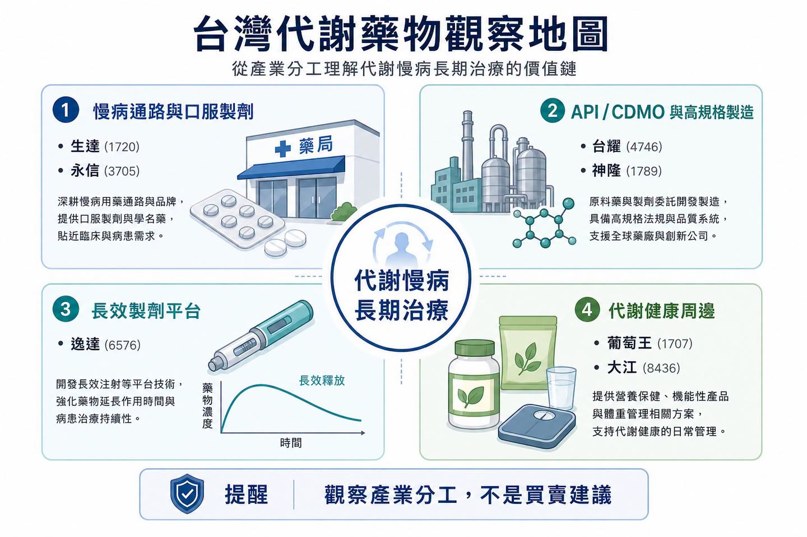

# GLP-1 下半場：dorzagliatin（多格列艾汀）想解決的，不是減重更猛，而是長期用得住

GLP-1 的軍備競賽，已經從「有沒有效」進入「能不能長期用」。

過去兩年，市場最愛看的題目是減重幅度。Wegovy（semaglutide，司美格魯肽）、Zepbound（tirzepatide，替爾泊肽）一路把體重下降推到兩位數，口服 GLP-1 也開始被 Eli Lilly、Novo Nordisk 等大藥廠推進後期開發與商業化。乍看之下，這條賽道的勝負好像很簡單：誰減得更多，誰就贏。

但慢性代謝疾病沒有那麼單純。

這篇真正要看的，不是 GLP-1 又多了一個聯用故事。

而是當 GLP-1 從明星減重藥走向慢病長期治療平台後，整個產業會被迫回答一個更現實的問題：患者能不能持續用、願不願意用、停藥後會不會反彈、能不能用較低劑量維持效果。

這也是多格列艾汀（dorzagliatin）這類葡萄糖激酶活化劑（glucokinase activator，GKA）重新變得值得觀察的原因。

它不是要取代 GLP-1，而是可能成為 GLP-1 的「代謝底座」。

## 01｜GLP-1 已經證明有效，但真實世界的問題是長期依從性

GLP-1 receptor agonist（GLP-1RA，GLP-1 受體促效劑）在糖尿病、肥胖、心血管風險，甚至 MASH（metabolic dysfunction-associated steatohepatitis，代謝功能障礙相關脂肪性肝炎）上的應用正在擴張。這條路線的成功，已經不是理論問題。

問題在於，慢性病治療不是短跑。

GLP-1 類藥物常見的胃腸道副作用，包括噁心、嘔吐、腹瀉、便秘，會直接影響劑量爬升與長期使用。更現實的是，一旦停藥，體重與代謝指標可能出現回彈。2026 年發表於 BMJ 的體重管理藥物停藥後復胖分析，也再次提醒市場：減重藥物可以打開治療窗口，但停藥後如何維持成果，會變成下一輪產業競爭。

這裡的重點不是否定 GLP-1，而是承認它已經走到更成熟的問題：

療效可以討論。

但長期依從性更難。

減重幅度可以創新高。

但如果患者因副作用停藥，臨床與商業價值都會被打折。

GLP-1 可以成為代謝治療核心。

但未來更需要能降低劑量壓力、改善代謝底盤、延長用藥週期的聯用方案。

所以，市場接下來不只會問「誰的 GLP-1 最強」，也會問「誰能讓 GLP-1 用得更久」。

## 02｜dorzagliatin 的定位，不是普通降糖藥，而是血糖感測器修復

多格列艾汀（dorzagliatin）是 Hua Medicine（華領醫藥）開發的口服葡萄糖激酶活化劑。它的機制重點，不只是把血糖壓低，而是透過 glucokinase（葡萄糖激酶）這個人體血糖感測器，重新調節胰臟、肝臟與腸道對葡萄糖變化的反應。

在 Nature Medicine 兩篇 2022 年三期研究中，dorzagliatin 的臨床定位已經很清楚。

SEED 試驗是藥物初治 2 型糖尿病患者的三期研究，dorzagliatin 在 24 週時使 HbA1c 較基線下降 1.07%，安慰劑組下降 0.50%，且 dorzagliatin 組沒有嚴重低血糖或藥物相關嚴重不良事件。

DAWN 試驗則是 metformin 控制不佳患者加用 dorzagliatin。結果顯示，dorzagliatin 加 metformin 在 24 週時 HbA1c 下降 1.02%，安慰劑加 metformin 下降 0.36%；HbA1c 小於 7% 的達標率為 44.4%，安慰劑組為 10.7%。同樣地，研究沒有觀察到嚴重低血糖或藥物相關嚴重不良事件。

更值得注意的是 dorzagliatin 後續真實世界資料的方向。BLOOM 研究追蹤 2,024 名患者、觀察 52 週，HbA1c 小於 7% 的達標率約 44.5%，和 DAWN 三期試驗中的 44.4% 相當接近。這種從 RCT 到真實世界沒有明顯打折的敘事，才是慢病藥物最想要的東西。

因為真實世界不是臨床試驗。

患者會忘記吃藥，會因副作用停藥，會合併其他疾病，也會同時使用多種降糖藥。若一款藥物能在這種環境中維持相對穩定的效果，背後真正被市場看的不是單一療效數字，而是安全性、耐受性與長期依從性。

這些資料不是要說 dorzagliatin 已經能挑戰 GLP-1 的減重效果，而是指出另一件事：

它比較像是「代謝感測系統」的修復器，而不是單純追求強力降糖。

傳統降糖藥常常是從外部強推某條路徑，例如增加胰島素、減少肝糖輸出、增加尿糖排出。dorzagliatin 的賣點則在於讓人體對血糖變化的感測更接近生理狀態：血糖高時促進反應，血糖低時避免過度刺激。這也是它被拿來討論聯用 GLP-1 的關鍵。

## 03｜dorzagliatin 加 GLP-1 的真正想像：少一點副作用，多一點可持續性

如果 GLP-1 的副作用和劑量高度相關，那聯用策略的第一個商業問題就是：能不能用較低 GLP-1 劑量，達到接近高劑量單藥的效果？

這次被市場拿來討論的研究方向，是 dorzagliatin 與口服小分子 GLP-1RA，例如 Eli Lilly 的 orforglipron，進行聯用探索。這裡的邏輯很直覺：GLP-1RA 從受體端直接刺激 GLP-1 receptor；dorzagliatin 則可能透過小腸 L 細胞與 glucokinase 路徑，改善內源性 incretin 反應。換句話說，一個從外部推受體，一個從上游修代謝感測。

這不是簡單把兩種降糖藥加在一起，而是希望形成互補。

第一，劑量節省。

如果低劑量 GLP-1RA 加 dorzagliatin 可以接近高劑量 GLP-1RA 單藥效果，理論上就可能降低胃腸道副作用壓力。

第二，改善用藥週期。

對於因噁心、嘔吐、食慾過度壓抑而停藥的患者，聯用方案若能讓療效與耐受性取得平衡，就可能延長用藥時間。

第三，β 細胞功能保護。

dorzagliatin 的三期研究與後續觀察資料都把 β 細胞功能改善放在核心敘事裡。如果 GLP-1 負責降低食慾、改善體重與血糖，dorzagliatin 則可能扮演「代謝安全網」，讓停藥或減量時不至於出現太快的血糖失控。

不過，這裡要小心。

目前許多聯用證據仍在早期、動物或小型研究階段，不能直接推論成大型三期成功，更不能把「有聯用潛力」解讀成「商業化已經確定」。

真正值得看的是：未來能否出現更大規模、設計更嚴謹、終點更接近真實臨床需求的人體試驗。

這裡也是藥時事會比較保守的地方。早期聯用資料可以打開想像，但真正能改變估值的，還是要看人體劑量、耐受性、停藥率、體重與 HbA1c 維持效果，以及是否能在 GLP-1 已經很強的背景下做出差異。

## 04｜代謝藥物正在從單點治療，走向聯用矩陣

最值得延伸的地方，不是 dorzagliatin 單一產品，而是代謝疾病研發邏輯正在改變。

過去糖尿病、肥胖、脂肪肝、高尿酸、血脂異常，常被拆成不同疾病看。但實際上，很多患者是同一組代謝異常在不同器官上的表現。胰島素阻抗、脂肪堆積、肝臟發炎、血糖波動、尿酸上升，彼此互相牽動。

所以現在的大藥廠不是只做一顆藥，而是在做代謝疾病的組合拳。

MASH 就是一個很好的例子。FDA 在 2024 年核准 Madrigal 的 Rezdiffra（resmetirom），讓 THR-β agonist 成為第一個針對 NASH / MASH 肝纖維化的藥物選項。但 MASH 本質上不是單純肝病，而是全身代謝問題。這也是為什麼 GLP-1、GIP/GLP-1、FGF21、THR-β、PPAR、SGLT2 等不同機制，都在往這個市場靠近。

dorzagliatin 如果要從 T2D 走到更大的代謝版圖，就不能只靠「降糖」。它必須證明自己可以作為聯用底座，與 GLP-1RA、THR-β agonist、pan-PPAR agonist 等不同代謝藥物形成可解釋、可驗證、可商業化的組合。

這才是它真正的題目：

不是一款區域型降糖藥能不能賣得好，而是一個血糖穩態平台能不能被國際市場重新理解。

## 05｜台灣投資人可以看什麼：不要硬追 GLP-1，先看代謝藥物分工

生達（1720）與永信（3705）

這類台灣老牌藥廠本身就有慢性病、糖尿病、心血管與口服製劑產品線。它們未必是創新 GLP-1 開發商，但代謝慢病若走向長期用藥、複方、學名藥與區域市場滲透，這類公司代表的是「通路與慢病用藥底盤」。

台耀（4746）與神隆（1789）

GLP-1 與代謝藥物競爭會拉動 peptide、特殊原料藥、複雜小分子與高規格製造需求。台耀、神隆不必被簡化成 GLP-1 題材，而是可以放在全球代謝藥物供應鏈升級的角度看。

逸達（6576）

逸達的核心更偏長效釋放與特殊製劑平台，不是 dorzagliatin 或 GLP-1 本身。但代謝慢病走向長期治療後，如何降低給藥頻率、改善依從性，會變成整個產業的共通問題。這個角度可以觀察長效製劑平台在不同疾病領域的外溢價值。

葡萄王（1707）與大江（8436）

這兩家公司不是處方新藥公司，但代謝健康、體重管理、益生菌與功能性營養，是 GLP-1 熱潮外圍會被重新定價的消費健康市場。要注意，保健食品不能替代藥物，也不能誇大療效；但 GLP-1 患者在肌肉量、腸胃耐受、營養補充與體重維持上的需求，確實會帶動周邊市場討論。

這些標的的共同點不是「誰有 GLP-1」，而是它們分別站在慢病通路、API / CDMO、長效製劑、代謝健康周邊的不同位置。

台灣投資人真正要問的是：

如果 GLP-1 的下一階段是長期維持與聯用治療，哪些公司能吃到「更久的治療週期」與「更複雜的藥物分工」？

## 06｜結語：減重藥戰爭的下一題，是讓療效留得住

GLP-1 的上半場，是證明減重與代謝療效可以做到多強。

但下半場，問題會變得更細：

患者能不能忍受？

能不能長期使用？

停藥後會不會反彈？

能不能降低劑量還保有效果？

能不能和 MASH、糖尿病、血脂、尿酸等代謝疾病形成聯用矩陣？

dorzagliatin 加 GLP-1 的討論，正好切中這個轉折。

它不是要說 dorzagliatin 已經成為下一個 GLP-1，也不是要把早期聯用資料包裝成確定成功。更準確的說法是：代謝藥物的競爭，正在從單一藥物的療效峰值，轉向長期可持續治療方案的設計能力。

對大藥廠來說，這代表 GLP-1 周邊會長出更多伴侶藥、維持藥、複方策略與聯用試驗。

對台灣投資人來說，這代表不能只看「誰沾 GLP-1」，而要看誰在慢病治療週期、特殊製劑、API 供應鏈、代謝健康需求裡真的有位置。

減重藥不是只有更猛才有價值。

能讓療效留得住，才會是下一階段的真正差異化。

參考資料：

1. Nature Medicine, [Dorzagliatin in drug-naive patients with type 2 diabetes: a randomized, double-blind, placebo-controlled phase 3 trial](https://www.nature.com/articles/s41591-022-01802-6), 2022.
2. Nature Medicine, [Dorzagliatin add-on therapy to metformin in patients with type 2 diabetes: a randomized, double-blind, placebo-controlled phase 3 trial](https://www.nature.com/articles/s41591-022-01803-5), 2022.
3. BMJ, [Weight regain after cessation of medication for weight management: systematic review and meta-analysis](https://www.bmj.com/content/392/bmj-2025-085304), 2026.
4. FDA, [FDA Approves First Treatment for Patients with Liver Scarring Due to Fatty Liver Disease](https://www.fda.gov/news-events/press-announcements/fda-approves-first-treatment-patients-liver-scarring-due-fatty-liver-disease), 2024.
5. New England Journal of Medicine, [Tirzepatide for Metabolic Dysfunction-Associated Steatohepatitis with Liver Fibrosis](https://www.nejm.org/doi/10.1056/NEJMoa2401943), 2024.

---

本文僅供產業研究與知識分享，不構成投資、醫療、募資或個股建議。
