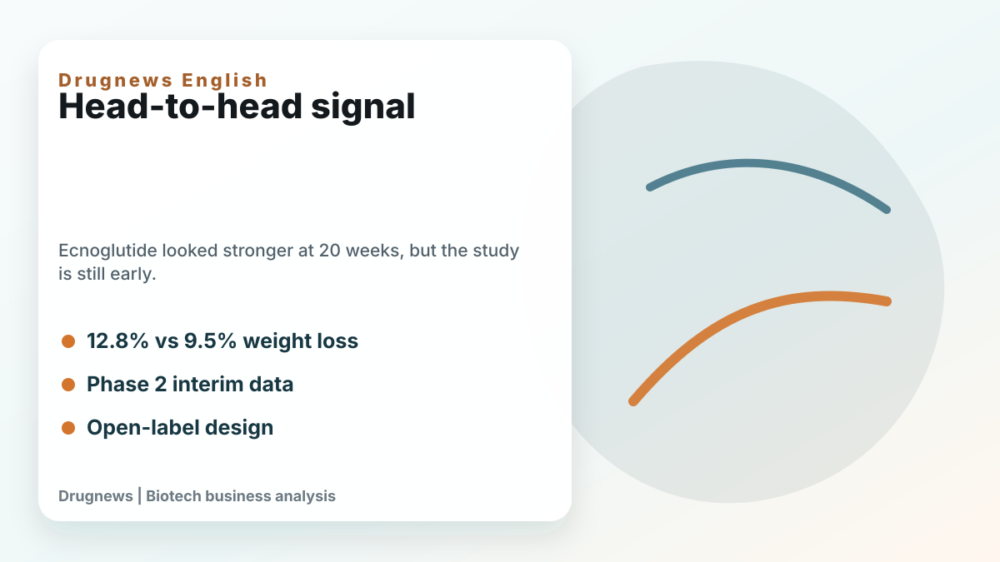
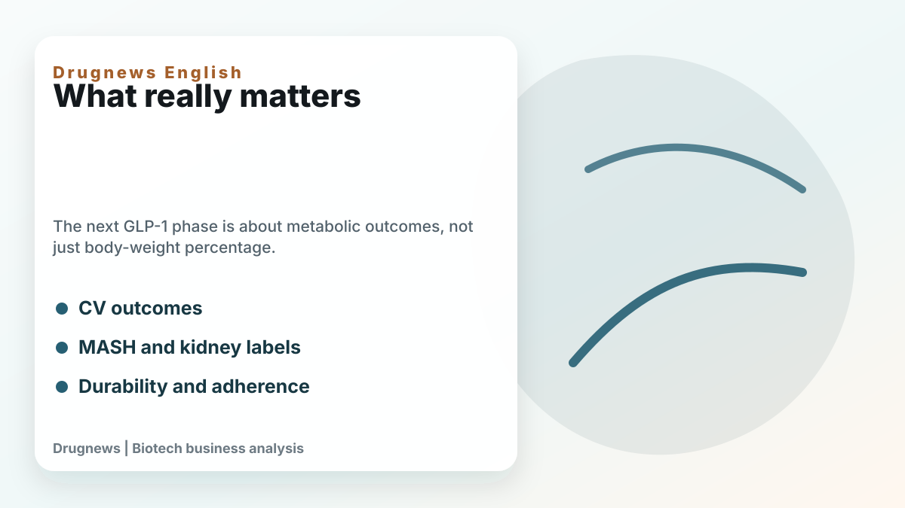
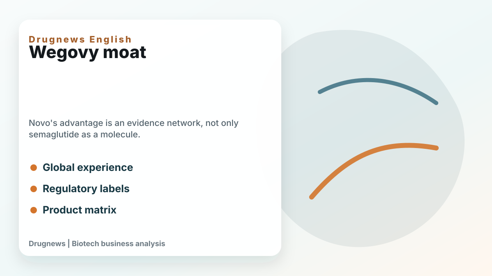

# Ecnoglutide Versus Wegovy: A 20-Week Head-to-Head Signal Is Not the Same as a New GLP-1 King

ADA 2026 gave the GLP-1 market another headline: ecnoglutide showed stronger 20-week weight loss than Wegovy in an interim Phase 2 head-to-head study.

That is a meaningful signal. In the SLIMMER-UP-SWITCH study, ecnoglutide produced average weight loss of 12.8% at 20 weeks versus 9.5% for semaglutide. Both were given weekly at a 2.4 mg maintenance dose. A higher share of ecnoglutide patients also reached at least 10% weight loss.

The data are interesting, but they are not enough to declare a new GLP-1 winner. This was a Phase 2, open-label, interim analysis with 163 participants. In obesity trials, open-label design can affect behavior, adherence, reporting, and expectations. The result should be taken seriously, but it should not be treated as a final commercial verdict.

The first stage of the obesity-drug market was dominated by a simple question: how much weight can the drug reduce? The next stage will ask harder questions. Can weight loss be maintained? What happens after discontinuation? How much lean mass is lost? Can the drug reduce cardiovascular events, liver disease, kidney deterioration, sleep apnea, inflammation, or long-term mortality risk?

This is where Wegovy's moat is often underestimated. Novo Nordisk's advantage is not only semaglutide. It is the evidence network around semaglutide: cardiovascular-risk reduction, global physician experience, regulatory labels, supply infrastructure, real-world use, and a broader product matrix.

Ecnoglutide's scientific story is still important. As a biased GLP-1 receptor agonist, it may eventually show a useful balance between efficacy, receptor activity, and tolerability. If larger and longer studies confirm better weight loss with acceptable gastrointestinal safety and persistence, Pfizer could have a serious asset, especially in China and potentially in broader markets.

But the market should not confuse a strong early signal with a changed throne. Novo is not standing still. Higher-dose semaglutide, oral formulations, MASH labels, cardiovascular data, and global commercial depth all make the semaglutide franchise more than one injectable product.

The real GLP-1 battle will be decided in 2027 and 2028, when larger Phase 3 trials, oral small molecules, dual and triple agonists, body-composition data, and long-term outcomes become clearer. Ecnoglutide has entered the conversation. It has not yet rewritten the ending.

This article is intended for industry research and knowledge sharing only. It does not constitute investment, medical, fundraising, or individual stock advice.
