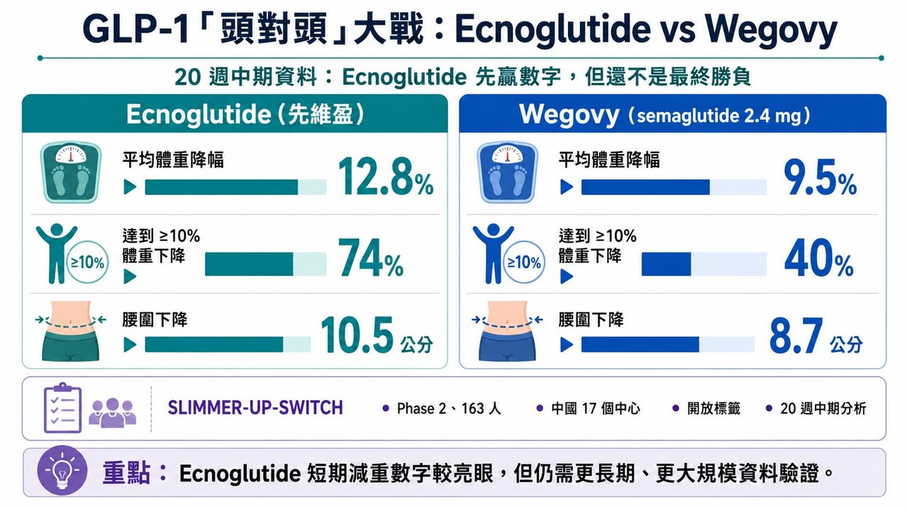
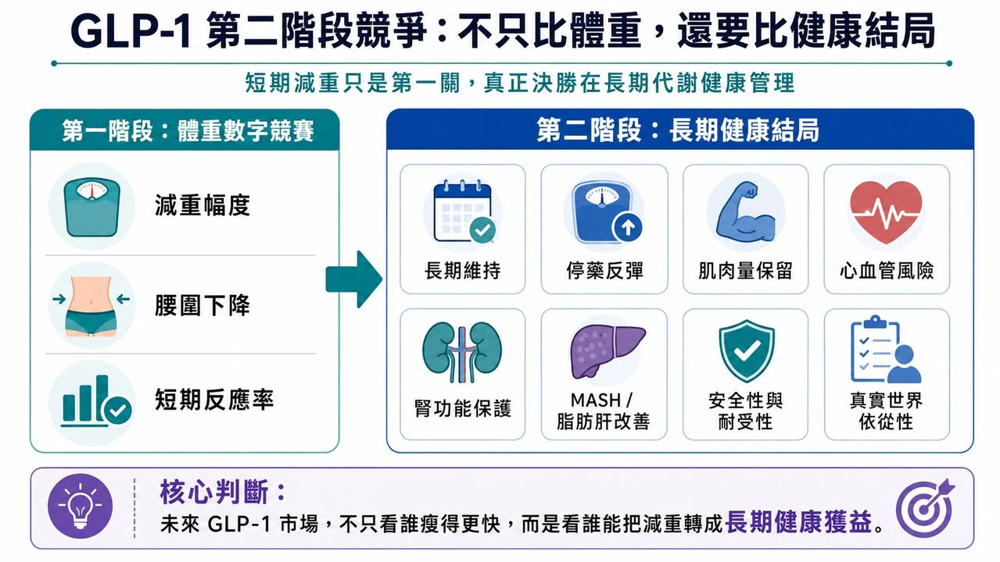
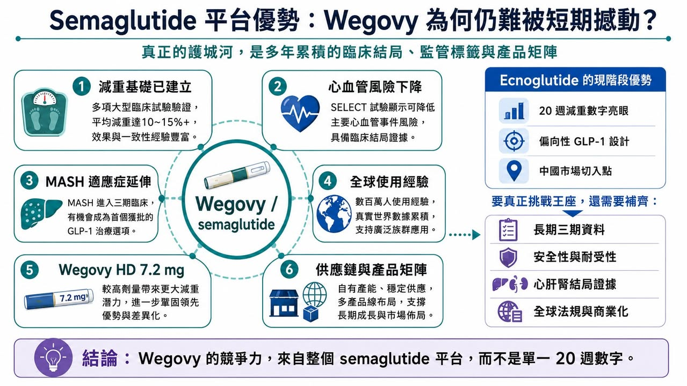
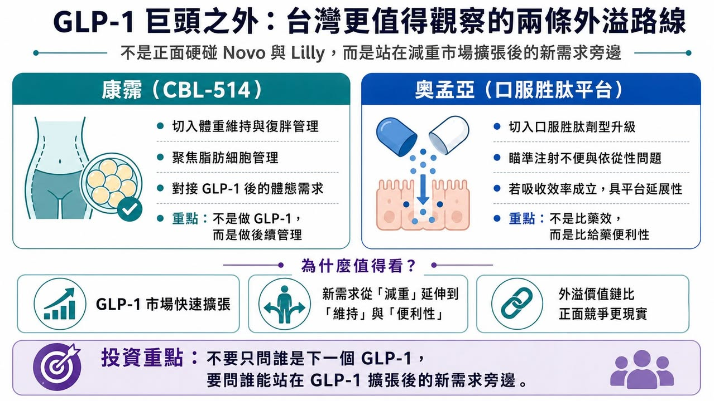

# GLP-1「頭對頭」大戰：輝瑞＆諾和諾德必有一戰？

【Ecnoglutide 贏了 20 週數字，但真能撼動 Wegovy 王座嗎？】

ADA 2026 剛落幕，GLP-1 賽道又被一組「頭對頭」資料點燃。

這次站上擂台的，是 ecnoglutide（先維盈） 與 Wegovy（semaglutide）。

Ecnoglutide 是一款偏向性 GLP-1 受體促效劑，已在獲准用於成人超重或肥胖患者的長期體重管理，用於配合飲食控制與增加身體活動，進行成人體重管理。

真正引發討論的，是一項名為 SLIMMER-UP-SWITCH 的二期頭對頭研究中期分析。

在 20 週時，ecnoglutide 的平均體重降幅為 12.8%，Wegovy（semaglutide）為 9.5%。兩者都是每週一次、2.4 mg 維持劑量。研究也顯示，ecnoglutide 組有 74% 受試者達到至少 10% 體重下降，而 Wegovy 組為 40%。

這樣的數字很容易讓市場興奮。

「挑戰者打贏藥王」、「Pfizer 撬動 Novo Nordisk 王座」、「新一代 GLP-1 正面擊敗 semaglutide」——這些標題都很吸睛。

但如果把這組資料放回臨床研究與產業競爭的框架裡，就會發現事情沒有那麼簡單。一項 163 人、開放標籤、20 週中期分析的二期研究，確實提供了一個值得重視的訊號。但它還遠遠不足以改寫整個 GLP-1 市場。

真正的勝負，不在 20 週體重多掉幾個百分點。

而在誰能用更完整、更長期、更有臨床意義的證據回答一個問題：減重藥的終極價值，到底只是體重數字，還是長期健康結局？

【藥時事 與 CMoney 全曜財經共同打造減肥藥賽道投資課程】

藥時事團隊深度分析全球 減肥藥市場現況、新藥開發進程、臨床使用情況，並且完整講解了減肥藥物的投資邏輯，以及市場正在著重關注的標的。藥時事團隊的深度課程將能夠讓您成為專業的生技減肥藥專業達人、投資人：https://www.cmoney.tw/course-media/17141/intro

## 01｜這場「頭對頭」有亮點，但也有邊界
先看研究設計。

SLIMMER-UP-SWITCH 是一項二期、多中心、隨機、開放標籤研究，共納入 163 名受試者，在中國 17 個研究中心進行。這項研究比較 ecnoglutide 與 semaglutide 在相同 2.4 mg 每週維持劑量下的減重效果，目前公布的是第 20 週中期資料。

從數字上看，ecnoglutide 確實漂亮。20 週平均減重 12.8%，對照 semaglutide 的 9.5%，差距不小。腰圍方面，ecnoglutide 組也有更大下降，第 20 週腰圍平均減少 10.5 公分，semaglutide 組為 8.7 公分。

但臨床研究不能只看數字。

這是一項二期研究，樣本量不大，療程只有 20 週，而且是開放標籤，也就是受試者與研究者都知道自己用的是哪一個藥。

在體重管理研究裡，開放標籤設計會帶來一些不可忽視的影響。受試者知道自己使用的是哪一組藥物後，飲食控制、運動配合、主觀回報、不良反應記錄，都可能受到心理預期影響。

這不代表資料沒價值，但它代表資料還不是最終答案。更精準地說，這份研究告訴我們：ecnoglutide 可能在短期減重上具備不錯競爭力。但它還不能證明：ecnoglutide 長期一定優於 semaglutide。更不能證明：ecnoglutide 已經能撬動 Novo Nordisk 在全球 GLP-1 市場建立的完整護城河。

## 02｜「減得更多」不等於「藥更好」

GLP-1 市場的第一階段競爭，很像體重數字競賽。

誰能讓患者瘦 10%。誰能瘦 15%。誰能瘦 20%。誰能接近減重手術。這些數字很直觀，也最容易被市場理解。但肥胖症不是單純外觀問題。它是一種慢性代謝疾病，背後牽涉第二型糖尿病、心血管疾病、慢性腎臟病、脂肪肝、睡眠呼吸中止症、骨關節炎、發炎狀態與長期死亡風險。所以，當 GLP-1 類藥物進入成熟競爭階段，評價標準一定會升級。

未來市場不會只問：「這個藥能減多少體重？」而會問：

體重能不能長期維持？

停藥後會不會快速反彈？

肌肉量保留得如何？

心血管事件能不能下降？

腎功能惡化能不能延緩？

脂肪肝能不能改善？

睡眠呼吸中止症能不能下降？

長期安全性是否足夠？

真實世界患者願不願意持續使用？

這就是「減重」走向「代謝健康管理」的本質。如果只看 20 週體重下降，ecnoglutide 的確很亮眼。但如果要說它能挑戰 Wegovy 的全球地位，還必須回答更多問題。

尤其是：這種短期差距能不能延續到 52 週、72 週、104 週？還有：更多減重是否能換來更多健康結局改善？這才是 GLP-1 第二階段競爭的核心。

## 03｜Wegovy 的護城河，不只是 semaglutide 這個分子

如果把 Wegovy 只理解為「一個減重藥」，就低估了 Novo Nordisk 的優勢。

Semaglutide 的真正護城河，不只是體重下降，而是長期、多適應症、多結局的證據網。

首先是心血管。Wegovy 已經在心血管風險降低上建立非常重要的臨床與監管基礎。Wegovy 已在美國獲准用於降低已知心血管疾病、且伴隨肥胖或超重成人患者的重大心血管事件風險，包括心血管死亡、心肌梗塞與中風。

其次是肝臟。

2025 年 8 月，FDA 加速核准 Wegovy 用於治療非肝硬化代謝功能障礙相關脂肪性肝炎，也就是 MASH，且伴隨中重度肝纖維化的成人患者。這讓 semaglutide 的臨床價值從減重進一步延伸到肝臟疾病。

再來是腎臟與整體心腎代謝風險。

GLP-1 類藥物已經逐漸被放進更大的心腎代謝疾病框架。WHO 在 2025 年更新基本藥物清單時，納入 semaglutide、dulaglutide、liraglutide 及 tirzepatide，用於成人第二型糖尿病合併心血管疾病、慢性腎臟病或肥胖等族群，這反映 GLP-1 類藥物已被視為全球公共衛生層級的重要治療工具。

這些證據不是短期可以複製的。

Novo Nordisk 的真正優勢，是 semaglutide 已經不只是一個減重藥。它是一個跨越糖尿病、肥胖、心血管、肝臟與其他代謝相關疾病的治療平台。所以，即便 ecnoglutide 在 20 週體重資料上勝出，仍然只是打進外圍。要真正挑戰 Wegovy，需要的是大型三期資料、長期安全性、真實世界經驗，以及最好能拿出心血管、肝臟、腎臟或其他臨床結局證據。這不是一兩年內可以靠一張中期成績單補齊的。

## 04｜Ecnoglutide 的破局點：偏向性 GLP-1 設計，能不能換來耐受性與療效平衡？
Ecnoglutide 最有意思的地方，不只是短期減重，而是它的分子設計。

它被定位為 cAMP 偏向型 GLP-1 receptor agonist。用白話講，就是它在活化 GLP-1 受體時，偏向啟動與代謝效應相關的 cAMP 訊號，同時降低 β-arrestin 路徑的募集。Pfizer 中國在公告中也提到，這種偏向性機制可能有助於降低受體脫敏與內化，進而維持更持久的受體活性，也可能帶來更好的胃腸道耐受性。

這是 ecnoglutide 的真正科學故事。傳統 GLP-1 藥物有效，但胃腸道副作用一直是限制，包括噁心、嘔吐、腹瀉、便秘、食慾過度下降等。如果偏向性 GLP-1 設計能在維持療效的同時，改善耐受性，這會是一個很有價值的差異化。但目前 SLIMMER-UP-SWITCH 的安全性資料還只是中期、樣本量也有限。研究資料指出，ecnoglutide 組噁心發生率較低，但便秘較高。這些差異是否具有穩定臨床意義，仍需要更大規模、更長期研究確認。所以 ecnoglutide 接下來真正要證明的，不只是「短期比 semaglutide 減更多」，而是：

能不能在更長時間維持療效？

胃腸道耐受性是否真的更好？

停藥率是否較低？

是否能形成更好的用藥依從性？

長期安全性是否足夠乾淨？

如果這些答案逐步成立，ecnoglutide 才會從中國市場的有力競爭者，升級為全球 GLP-1 版圖中真正值得重視的挑戰者。

## 05｜Novo Nordisk 也沒有坐著等：7.2 mg semaglutide 已經補上更高劑量
如果市場以為 Novo Nordisk 會守著 Wegovy 2.4 mg 不動，那就太小看這家公司了。

Novo Nordisk 已經推出更高劑量的 Wegovy HD，也就是 semaglutide 7.2 mg。根據 STEP UP 試驗資料，semaglutide 7.2 mg 每週一次在肥胖患者中帶來平均 20.7% 體重下降，約三分之一受試者體重下降達 25% 或以上。

這件事非常關鍵，因為 ecnoglutide 的 20 週資料主要是和 semaglutide 2.4 mg 比較。但 Novo Nordisk 已經把 semaglutide 推向更高劑量版本，目的就是補上更強減重需求的族群。也就是說，Novo 的防守不是靜態防守。它正在用更高劑量、口服版本、心血管與 MASH 標籤、全球供應鏈、醫師教育與真實世界經驗，把 Wegovy 變成一個產品矩陣。未來 GLP-1 市場的競爭，會越來越像代謝疾病平台之爭。不是單一藥物對單一藥物，而是產品組合對產品組合。Ecnoglutide 要面對的，不只是 semaglutide 2.4 mg，而是 Novo Nordisk 整個 semaglutide 特許經營。

## 06｜Pfizer 的機會與壓力：中國市場是入口，但全球競爭更難
Pfizer 在 GLP-1 賽道走得並不順。

早前公司押注口服小分子 GLP-1 藥物 danuglipron，但後續因安全性與耐受性問題放緩甚至調整策略。這讓 Pfizer 在全球肥胖藥物主戰場一度顯得失速。

Ecnoglutide 給了 Pfizer 一個重新切入代謝疾病市場的機會，尤其是在中國。

中國肥胖與超重人群龐大，GLP-1 藥物需求正在快速成長。Ecnoglutide 已在中國獲批，並由 Pfizer 商業化，這使 Pfizer 有機會在中國代謝健康市場重新建立存在感。

但全球化競爭仍然困難。

因為全球 GLP-1 市場已經不是空白市場。Novo Nordisk 有 semaglutide。Eli Lilly 有 tirzepatide、retatrutide、orforglipron 等龐大管線。Roche、Amgen、AstraZeneca、Boehringer Ingelheim、Zealand Pharma 等公司也都在從不同機制切入。

在這種局面下，ecnoglutide 若要走向全球，不能只靠「中國頭對頭中期資料略勝」。它需要更完整的三期臨床計畫，更強的全球法規策略，以及能說服支付方與醫師的差異化定位。

## 07｜GLP-1 的決勝時間，不在今天，而在 2027 到 2028 年
接下來兩年，才是 GLP-1 賽道真正進入洗牌的時間。

會有更多三期資料出來，會有更多口服小分子資料出來，會有更多雙重、三重受體藥物資料出來，也會有更多關於心血管、肝臟、腎臟、睡眠呼吸中止症、肌肉保留、停藥反彈與真實世界依從性的資料。到那時候，市場才會更清楚：

誰只是短期減重漂亮？

誰能長期維持？

誰能改善心腎代謝結局？

誰能口服化？

誰能解決供應與價格問題？

誰能成為一線治療？

誰只能成為區域市場競品？

所以現階段最不應該做的，是把一項 20 週二期中期資料，直接放大成「王座易主」。

它可以是警訊，可以是競爭升溫的證據，也可以是 Pfizer 在中國代謝疾病市場重返牌桌的開始。

但它還不是結局。

## 08｜台灣重點仍是康霈與奧孟亞這兩條外溢路線

第一個可觀察的是 康霈。

康霈不是做 GLP-1，也不是和 Novo Nordisk、Eli Lilly 或 Pfizer 正面競爭，而是切入 GLP-1 治療後的體重維持、脂肪細胞管理與局部體態改善。當減重藥物越來越強，下一個問題會變成：瘦下來後如何維持？停藥後如何降低復胖？局部脂肪與體態如何管理？這正是康霈 CBL-514 故事的切入點。

第二個是 奧孟亞。

奧孟亞看的是口服胜肽平台。GLP-1 類藥物雖然有效，但注射依從性、冷鏈、裝置、長期使用便利性都仍是問題。奧孟亞若能證明口服胜肽的吸收效率、穩定性與平台可複製性，就有機會成為台灣切入 GLP-1 劑型升級的一條路。

## 結語｜GLP-1 巨頭之戰，不是誰短期減更多，而是誰能回答「減重之後」的問題
Ecnoglutide 這次頭對頭資料很有意思。20 週減重 12.8%，高於 semaglutide 2.4 mg 的 9.5%，確實讓市場看到新一代偏向性 GLP-1 藥物的潛力。但它還不是顛覆 Wegovy 的證據，因為 GLP-1 賽道已經不只比體重下降。

Wegovy 的護城河，不是一個 20 週減重數字，而是多年累積的臨床結局、全球使用經驗、監管標籤與產品矩陣。Ecnoglutide 的機會，也不是只靠短期數字，而是要證明偏向性 GLP-1 機制能在療效、耐受性、依從性與長期健康獲益上建立真正差異化。

真正的答案，還在 2027 到 2028 年後面那些更大、更久、更接近真實世界的資料裡。

參考資料：

[1] Novo Nordisk｜Wegovy U.S. prescribing information: https://www.novo-pi.com/wegovy.pdf

[2] Pfizer｜Obesity and metabolic disease pipeline: https://www.pfizer.com/science/drug-product-pipeline

[3] Sciwind Biosciences｜Ecnoglutide / GLP-1 pipeline and company information: https://www.sciwind.com/

[4] U.S. FDA｜Drug approvals and databases: https://www.fda.gov/drugs

[5] World Health Organization｜Essential medicines and health-product updates: https://www.who.int/teams/health-product-policy-and-standards/essential-medicines

---

本文僅供產業研究與知識分享，不構成投資、醫療、募資或個股建議。
