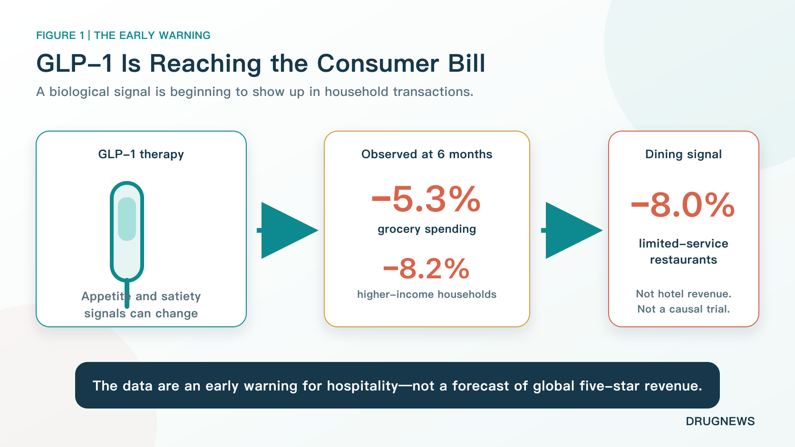
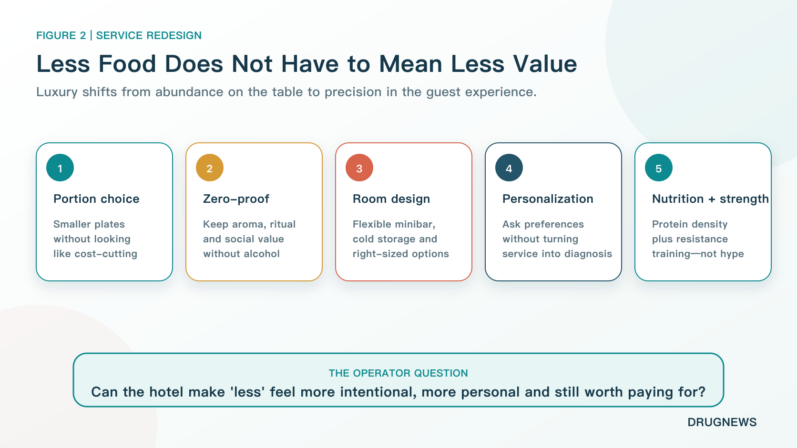
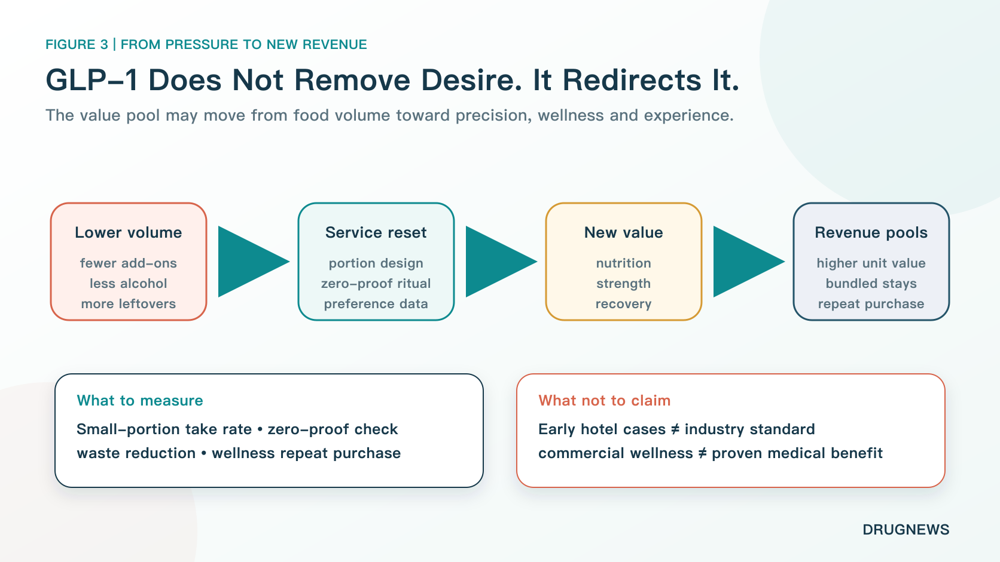
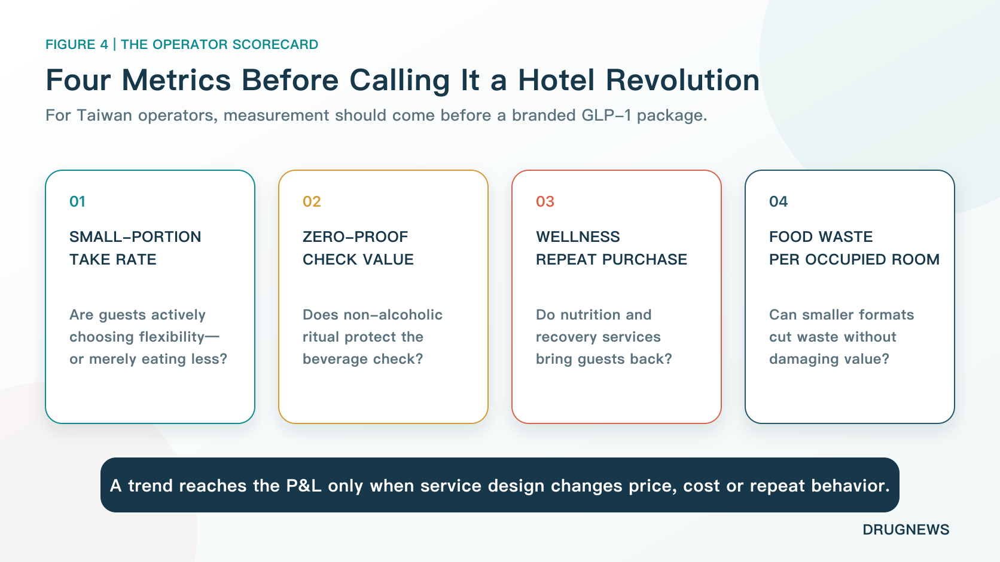

# GLP-1 Drugs Are Making Luxury Guests Eat Less. How Can Five-Star Hotels Protect Revenue?

The champagne is cold. The dessert tower is full. The guest paying several thousand dollars for a luxury stay takes one look and says, “I really cannot eat any more.”

That scene captures a new operating question for hospitality. GLP-1 medicines are best known for transforming obesity and diabetes treatment. Their commercial spillover, however, is reaching restaurants, grocery baskets, alcohol occasions, wellness services and the economics of a hotel stay.

A U.S. household transaction study found that grocery spending fell 5.3% on average six months after GLP-1 adoption. Among households earning more than $125,000 a year, the decline was 8.2%. Spending at fast-food outlets, coffee shops and other limited-service restaurants fell 8.0%.

Some luxury hotels are already testing smaller portions, protein-forward menus, flexible meal formats and more ambitious zero-proof programs. Those are meaningful early cases. They are not evidence that GLP-1 use has already reduced revenue across the global five-star hotel sector, and they do not prove that every change in guest behavior is caused by the drugs.

The strategic question is therefore more precise: **when appetite shrinks, can a hotel preserve value by selling better design, personalization and experience rather than more food?**

## 01 | Luxury Hospitality Was Built Around the Visible Language of “More”

Traditional luxury hotels know how to make value visible.

The breakfast buffet resembles a market. Afternoon tea arrives on three tiers. The minibar holds chocolate, nuts, spirits and several kinds of sparkling water. The room rate buys not only accommodation, but also the feeling that someone has anticipated every possible desire.

The underlying formula is abundance.

GLP-1 medicines can change how some guests experience that abundance. These drugs affect appetite and satiety signaling. The U.S. Food and Drug Administration prescribing information for Wegovy, the semaglutide product approved for chronic weight management, states that it delays gastric emptying. Common gastrointestinal adverse reactions in adult weight-management trials included nausea, vomiting, diarrhea, constipation and gastroesophageal reflux disease.

Not every user experiences the same effect. Not every guest taking a GLP-1 medicine suddenly rejects dessert or alcohol. Yet for some people, a large high-fat meal can stop looking generous and start feeling uncomfortable.

That distinction matters for service. A portion that once communicated hospitality may now communicate waste, pressure or lack of attention.

## 02 | The Spending Signal Has Moved Beyond Appetite Surveys

The most important evidence is not a social-media anecdote. It is the appearance of the signal in transaction data.

The 2026 *Journal of Marketing Research* study linked U.S. household medication surveys with observed purchases. It identified 2,602 households that adopted GLP-1 therapy and matched them with similar households that did not. Six months after adoption, grocery spending was 5.3% lower on average. The reduction reached 8.2% among households with annual income above $125,000. Spending at limited-service restaurants, including fast food and coffee shops, was 8.0% lower.

Higher-income households are important to luxury hospitality, which makes the result difficult to ignore. But the limits are equally important.

The study examines U.S. household consumption. It does not directly measure five-star hotel revenue. It is observational rather than randomized, even though the researchers used matching and a difference-in-differences design. Income may capture access to medicine, baseline consumption, lifestyle and other differences. The study also found that grocery spending moved back toward baseline for some households after treatment discontinuation.

The correct interpretation is therefore an early warning, not a financial forecast.

Luxury-hotel operators should pay attention to changing food demand among affluent consumers. They should not assume that every suite guest has “switched off” appetite, or that the spending effect will be identical across markets, hotels and treatment durations.

## 03 | If the Guest Eats Less, the Hotel Cannot Look as If It Gives Less

The hard part is not cutting a steak into a smaller portion.

The hard part is making the smaller portion feel worth the price.

Examples reported by *Forbes Travel Guide* show how that transition may work. Food options at St. Regis Washington, D.C. have moved toward lighter, smaller, protein-forward, plant-forward and nutrient-dense choices. Malibu Kitchen at The Ned Doha offers greater portion flexibility. The Broadmoor in Colorado allows guests to divide meals into smaller servings without abandoning presentation or visual impact.

This is not an attempt to turn five-star cuisine into boiled chicken and plain vegetables. It asks hotels to use ingredient quality, plate design, tableware and more attentive service to make “less” feel intentional.

Yesterday, value was communicated by how full the plate looked. Tomorrow, value may come from three bites that are exactly right.

That is also why removing dessert is too crude a response. The point raised by The Broadmoor's pastry team was not to eliminate pleasure, but to preserve it while changing sugar, fat or other ingredients without making the guest feel that the experience had been sacrificed.

Luxury service also needs to avoid public labeling. A large “weight-loss injection menu” could make guests feel classified by their medication status. A better design places smaller portions, protein-forward dishes, plant-led choices and zero-proof drinks on the regular menu. A guest using a GLP-1 medicine can choose them without disclosing a diagnosis, while every other guest retains the same option.

Luxury moves from “we filled the table for you” to “we calibrated the experience for you.”

The financial pressure can accumulate across a stay. A restaurant on the street may offset a lower check with faster table turnover. A luxury hotel carries banquet facilities, breakfast operations, room service, bars, pastry kitchens and labor-intensive service. One skipped drink or dessert looks small. Repeated across breakfast, tea, dinner and the minibar, the effect can reduce food-and-beverage revenue throughout the guest journey.

The hotel cannot simply halve the portion and preserve the old price without changing anything else. Luxury guests pay to feel understood, not manipulated. If a smaller plate looks like hidden cost-cutting, the damage to trust can exceed the ingredient savings.

GLP-1 therefore becomes a service-design test. Chefs need to improve nutrition and flavor per bite. Food-and-beverage managers need a portion and pricing architecture that feels flexible rather than cheap. Servers need to ask about preferences without asking for medical history. Bars need to keep non-drinkers inside the social center of the hotel.

The difficult task is not removing one piece of cake. It is redefining abundance when abundance no longer means food weight.

## 04 | The Bar Is Not Disappearing. It Is Learning to Sell Ritual Without Alcohol

Alcohol is one of the revenues luxury hotels are least willing to lose.

A cocktail does not sell ethanol alone. It sells an evening ritual, an entry point to social interaction and a photogenic object on the table. If a guest drinks less, replacing the whiskey with a glass of tap water destroys most of that value.

Miami Beach EDITION has expanded zero-proof options, while Four Seasons Fort Lauderdale and Omni La Costa are among the hotels offering more complete non-alcoholic drink experiences. These beverages retain aroma, glassware, color and bartending craft. Removing alcohol does not require removing price or ceremony.

But the claim “GLP-1 makes people stop drinking” goes beyond current evidence.

A small Phase 2 randomized trial published in *JAMA Psychiatry* in 2025 enrolled 48 adults with symptoms of alcohol use disorder. Low-dose semaglutide reduced alcohol craving, drinks per drinking day and some heavy-drinking outcomes. Not every alcohol endpoint was significant, and treatment lasted only nine weeks. Later reviews also described the signal as worthy of study while emphasizing the need for larger trials.

For hotels, a stronger zero-proof program is a demand test. It is not proof that semaglutide or the broader GLP-1 class has become an established treatment for alcohol use disorder.

The commercial lesson is narrower and more useful. A beverage occasion that might otherwise disappear can be redesigned as a premium non-alcoholic experience. The hotel is not surrendering to lower alcohol consumption. It is finding a way to charge for “not drinking, without leaving the occasion.”

## 05 | Smaller Meals Can Expand Into a GLP-1 Companion Economy

Once the guest's needs extend from dessert choice to nutrition, muscle maintenance, gastrointestinal comfort and medication routines during travel, a hotel sees a service chain rather than one menu item.

Four U.S. nutrition and obesity-medicine organizations issued joint guidance in 2025 that emphasized nutrient density, adequate protein and resistance training during GLP-1 treatment for obesity. The combination matters. A protein drink is not a substitute for resistance exercise, clinical assessment or an adequate overall diet.

This helps explain why resorts and wellness properties are linking kitchens, gyms, dietitians and recovery services. Hilton Head Health's GLP-1 Support Experience combines chef-prepared meals, protein guidance, strength and recovery classes, consultations with a dietitian and cooking workshops.

At the more expensive edge, hospitality begins to approach medical territory. The Four Seasons Hotel Los Angeles at Beverly Hills lists IV and “body maintenance” services provided by the third-party operator Immortelle Integrative Health. Its seasonal-treatment pages list a $750 body-maintenance IV and a $1,000 pre- and post-flight program that includes IV therapy.

Those pages establish that luxury hospitality is testing new paid services. They do not establish through high-quality clinical trials that these treatments preserve muscle or skin in GLP-1 users. Four Seasons also states that the provider is a third party and that the hotel does not guarantee the services.

The boundary is essential. Integrating qualified nutrition advice, reasonable exercise and thoughtful accommodation can be service innovation. Describing every IV bag as a medical breakthrough can turn luxury into expensive pseudoscience.

Privacy creates another operating risk.

A hotel may need to know that a guest wants refrigeration, a smaller meal or a different exercise schedule. That does not mean the guest wants to disclose a medical history. “I prefer a small portion” is not permission to ask which medicine the guest uses. Personalization that feels like interrogation can drive away the customer it is meant to retain.

A mature design therefore avoids forcing guests to identify themselves as GLP-1 users. Smaller portions, zero-proof cocktails, protein-forward dishes, in-room refrigeration and strength classes can be available to everyone. When a service becomes medical, responsibility should transfer clearly to a properly qualified professional.

Hotels can sell a wellness experience. They cannot blur medical accountability.

## 06 | GLP-1 Is Not Eliminating Desire. It Is Redirecting the Wallet

It is tempting to tell this story as the end of snacks, desserts and hotel bars.

Consumers may not stop spending. They may move the spending.

PwC surveyed more than 3,000 current, former and prospective GLP-1 users in 2026. Drawing on Numerator data, it estimated that about 21% of U.S. households included a current user as of May. Among current users, 61% said they bought fewer sweets and 56% bought fewer salty snacks. The survey also reported increases across fresh produce, protein foods, nutrition, clothing, fitness and self-care categories.

These are U.S. survey and consumer-association data, not a universal map for every person or country. Yet they indicate a practical direction: when companies can no longer sell “eat more” as easily, they begin selling “eat with more precision, look better and feel better cared for.”

The shift can be viewed in three circles.

1. **Food itself.** Large packages, calorie density and impulse add-ons face pressure, while smaller portions and protein- or fiber-forward products gain a new position. Nestlé launched Vital Pursuit in 2024 for GLP-1 users and weight-management consumers, emphasizing portion control, protein and nutrient density. The positioning does not guarantee success, but it shows that a large food company treats lower appetite as a product-design problem rather than a passing headline.
2. **Needs created by physical change.** Clothing size, muscle maintenance, exercise, sleep, skin and social habits can change. Some money previously spent on snacks or alcohol may move toward apparel, fitness, nutrition and self-care.
3. **Experience, where hotels have an advantage.** A food company can sell one small meal. A hotel can build that meal into a complete stay: a butler records preferences, the kitchen adjusts portions, the bar creates a zero-proof pairing, a trainer builds a strength session and the guest leaves with something that can continue at home.

In other words, a hotel may translate lower food volume into more service.

This is an advantage over packaged food. When a cookie package shrinks, consumers often see disguised inflation. When a dish becomes smaller but more personal, better sourced and more carefully served, a guest may accept a higher unit price.

That only works when the experience genuinely improves. Ordinary juice in a beautiful glass and plain chicken renamed as a “metabolic menu” are not innovation. They are old products using a popular medicine as decoration.

## 07 | Four Metrics Matter More Than a Branded “GLP-1 Hotel” Package

For Taiwan's hotel operators, the right first move is not to declare a GLP-1 hospitality revolution. It is to measure behavior.

Four metrics provide a useful starting point:

1. **Small-portion take rate.** Are guests actively choosing flexibility, or are they simply leaving more food uneaten?
2. **Zero-proof check value.** Do non-alcoholic drinks preserve beverage spending, replace alcohol spending or bring in a different occasion?
3. **Wellness repeat purchase.** Do nutrition, strength and recovery services bring guests back, or generate only one social-media visit?
4. **Food waste per occupied room.** Can smaller formats reduce waste while protecting price and satisfaction?

If guests already leave food on the plate, a large portion does not create value; it creates waste. A smaller format becomes good business when it lowers ingredient waste, protects the check and improves satisfaction. A smaller plate with an expensive “GLP-1 friendly” label is much easier to see through.

The economics will also differ by hotel type.

Business hotels often include breakfast in the room rate. Lower consumption may not reduce revenue immediately, although it may reduce preparation and waste. Resorts depend more heavily on restaurants, bars and paid activities, making demand changes more direct. Banquet-led hotels face another question: if guests eat less, do weddings and large gatherings still need a full table to communicate generosity?

The numbers are more valuable than the trend label. A trend reaches the income statement only when a company translates it into product design, price, cost or repeat behavior.

## Conclusion | The Next Version of Luxury May Be Knowing What Not to Put on the Table

The real challenge for a five-star hotel is not removing two cans of soda from the minibar.

It is making a small meal feel valuable, turning a non-alcoholic drink into a social ritual and building nutrition, strength and recovery services that guests choose again—without crossing the line between hospitality and unproven medical claims.

The previous version of luxury meant that everything was waiting when the guest opened the door.

The next version may mean that the hotel already knows what does not need to be there. What remains fits the guest better and feels more worth paying for.

GLP-1 medicines have not removed desire.

They may be changing “bring me another one” into “make this one exactly right.”

## Primary Sources

1. [Forbes Travel Guide | How GLP-1s Are Reshaping Luxury Hospitality](https://www.forbes.com/sites/forbestravelguide/2026/07/15/how-glp-1s-are-reshaping-luxury-hospitality/)
2. [Journal of Marketing Research | The No-Hunger Games](https://journals.sagepub.com/doi/10.1177/00222437251412834)
3. [U.S. FDA | Wegovy 2025 Prescribing Information](https://www.accessdata.fda.gov/drugsatfda_docs/label/2025/215256s023lbl.pdf)
4. [JAMA Psychiatry | Once-Weekly Semaglutide in Adults With Alcohol Use Disorder](https://jamanetwork.com/journals/jamapsychiatry/fullarticle/2829811)
5. [The Obesity Society and partner organizations | Nutritional Priorities to Support GLP-1 Therapy](https://www.obesity.org/wp-content/uploads/2025/06/Joint_Nutritional-Priorities-to-Support-GLP-1-Therapy-for-Obesity.pdf)
6. [PwC | 2026 GLP-1 Consumer Trends](https://www.pwc.com/us/en/industries/consumer-markets/library/glp-1-consumer-trends.html)
7. [Hilton Head Health | GLP-1 Support Experience](https://www.hhhealth.com/glp-1-support-experience/)
8. [Four Seasons Los Angeles | Immortelle](https://www.fourseasons.com/losangeles/landing-pages/property/immortelle/)
9. [Nestlé USA | Vital Pursuit](https://www.nestleusa.com/media/pressreleases/vital-pursuit-glp-1)

Fact-check cutoff: August 31, 2026.

> Disclaimer: This article is intended for industry analysis and general education. It does not constitute medical, treatment or investment advice. The indications, adverse effects and use of GLP-1 medicines should be assessed by a qualified healthcare professional for each individual.
