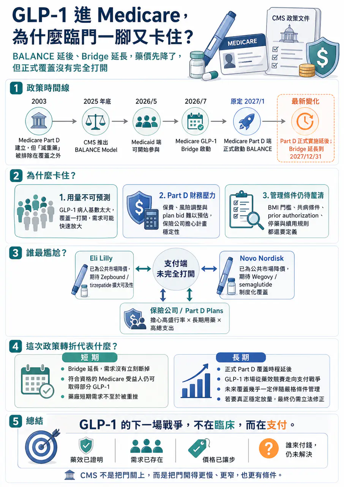
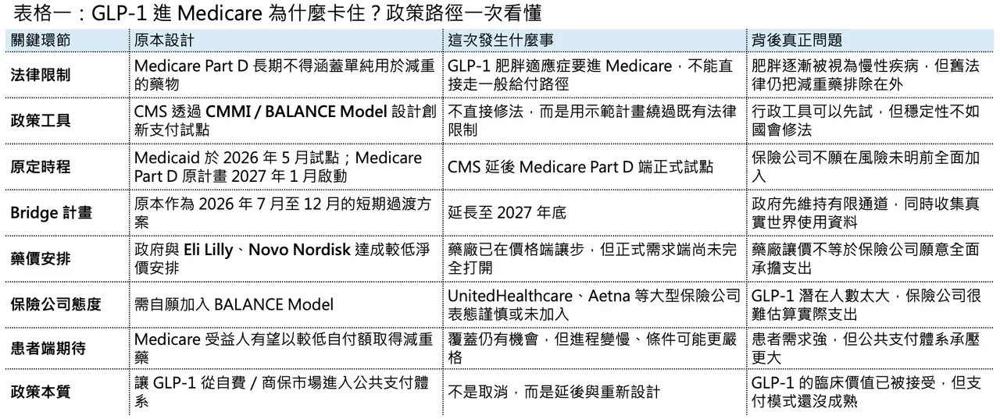
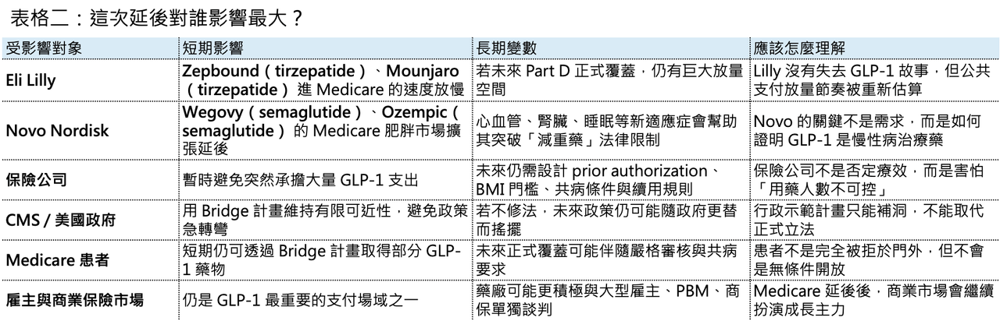

# 川普放政策鴿子，減肥藥價格白降了？

【川普政府放了 Eli Lilly（禮來）、Novo Nordisk （諾和諾德）的「鴿子」？GLP-1 進 Medicare，為什麼臨門一腳又卡住了】

📌 2026 年 4 月下旬，美國減重藥市場出現一個很微妙的政策轉折。

美國 Centers for Medicare & Medicaid Services（CMS）宣布，原本規劃在 2027 年導入 Medicare Part D 的 BALANCE Model，將延後啟動 Part D 端的正式實施。這個模型原本被視為美國 Medicare 正式覆蓋 GLP-1 肥胖治療的一次政策破冰，牽動的自然是兩大贏家：Eli Lilly 與 Novo Nordisk。但在正式上路前，保險公司先踩了煞車，CMS 也選擇把 Medicare Part D 端的全面試點往後延。CMS 同時宣布，短期過渡方案 Medicare GLP-1 Bridge 將延長到 2027 年底，讓符合資格的 Medicare Part D 受益人仍可透過橋接方案取得部分 GLP-1 藥物。

這不是單純行政延期，而是一場美國醫療支付體系對 GLP-1 財政壓力的真實壓力測試。

表面上看，是保險公司不願意進入一個結構還不夠清楚的自願模型。更深層看，這件事其實揭開了 GLP-1 商業化下一階段最關鍵的問題：藥效已經被證明，需求也已經存在；但誰來付錢，仍然沒有真正解決。

## 01｜政策破冰，但沒有真正解凍

要理解這次延後，必須先理解美國 Medicare 對減重藥的歷史限制。

2003 年通過的 Medicare Prescription Drug, Improvement, and Modernization Act（MMA）建立了 Medicare Part D，但同時也把用於 weight loss 的藥物排除在 Part D 覆蓋之外。這條規定多年來一直是 GLP-1 肥胖適應症進入 Medicare 的最大障礙。即使醫學界越來越傾向把 obesity 視為慢性疾病，而不是單純生活型態問題，法律上的排除條款仍然存在。

問題是，GLP-1 藥物已經不是傳統意義上的「減肥藥」。

Wegovy（semaglutide）、Zepbound（tirzepatide）、Mounjaro（tirzepatide）、Ozempic（semaglutide）這些產品，早已從體重控制延伸到心血管、阻塞性睡眠呼吸中止症、慢性腎臟病與代謝共病管理。尤其當 Wegovy 已取得心血管風險降低適應症、Zepbound 取得 obstructive sleep apnea 相關適應症後，GLP-1 的定位就不再只是「讓人變瘦」，而是變成一組能改變代謝疾病全程管理的藥物。Time 在 2025 年報導川普政府不延續拜登政府的 Medicare 覆蓋提案時，也指出這些藥物已經獲得降低心血管風險與阻塞性睡眠呼吸中止症等相關 FDA 適應症，並正在被研究於更多疾病領域。

這就是政策矛盾的根源。

🧭從醫學上看，obesity 越來越像慢性病。

🧭從法律上看，Medicare Part D 仍然不能直接把 weight loss drugs 當成一般處方藥覆蓋。

🧭從財政上看，一旦全面打開，數百萬甚至上千萬受益人可能湧入用藥，支出壓力非常大。

🧭從政治上看，讓老年人與低收入族群取得 GLP-1，又是一個很難反對的公共衛生命題。

於是，川普政府提出了一個折衷的政策設計：不是直接修改法律，而是透過 CMS Innovation Center / CMMI 的創新支付模型來試行。

2025 年底，CMS 公布 BALANCE（Better Approaches to Lifestyle and Nutrition for Comprehensive hEalth）Model。依照原規劃，Medicaid 可自 2026 年 5 月開始加入，Medicare Part D 則預計在 2027 年 1 月啟動。CMS 將代表州 Medicaid 機構與 Medicare Part D plan sponsors，直接與 GLP-1 製造商談判價格與覆蓋條件，並搭配生活型態介入。Reuters 當時報導，該模式建立在川普政府與 Eli Lilly、Novo Nordisk 的降價協議上，Medicare 受益人每月自付額可能被壓到 50 美元，現有注射型 GLP-1 對政府計畫的價格則可降至每月 245 美元附近。

這套設計很聰明。

但它有一個致命弱點：保險公司必須願意參與。

## 02｜保險公司為什麼猶豫？因為 GLP-1 是一個「用量不可預測」的財務黑洞

保險公司的猶豫，不是因為它們不相信 GLP-1 有效。

它們真正怕的是財務不可預測性。

GLP-1 和一般 specialty drug 很不一樣。許多高價藥雖然單價很高，但病人數相對有限，保險公司可以估算風險。GLP-1 則剛好相反：單價不低，潛在使用人數卻極其龐大，而且一旦開始覆蓋，用藥需求可能迅速放大。這就是 payer 最害怕的組合。

Reuters 報導指出，CMS 延後 BALANCE 的 Medicare Part D 端，是因為保險公司對是否參與仍有疑慮；CVS Health 已確認未在 4 月 20 日截止日前選擇加入 BALANCE，而 UnitedHealth 則指出目前計畫結構仍存在「notable challenges and outstanding questions」。

這些挑戰主要集中在三件事。

💰 第一，是 utilization risk。如果覆蓋條件太寬，符合資格的受益人數量可能遠超預期。肥胖不是罕見病，而是高盛行率慢性疾病。對保險公司來說，最可怕的不是某個藥貴，而是不知道最後會有多少人真的來領藥。

💰 第二，是 plan stability。Medicare Part D plans 的保費、風險調整、再保險與競標設計，都需要提前估算藥品成本。GLP-1 若在短時間內大量進入，可能造成 plan bid 不穩，進而影響下一年度保費與產品設計。Citi 與 Evercore 分析師也指出，保險公司的反彈重點並非完全反對 GLP-1 覆蓋，而是擔心 Part D plans 的穩定性與實際使用量不確定性。

💰 第三，是 clinical appropriateness。GLP-1 需求太強，保險公司一定會擔心濫用、非必要使用與長期續用管理。因此，即使未來真的覆蓋，嚴格的 prior authorization、BMI 門檻、共病條件、生活型態介入要求、停藥規則與續用標準，幾乎一定會存在。

說白了，保險公司不是說「這些藥沒用」。它們說的是：「這些藥太有用了，所以我們不知道要花多少錢。」

## 03｜CMS 沒有完全撤退，而是改用 Bridge 撐住過渡期

這次政策轉折不能簡單理解成「GLP-1 進 Medicare 失敗」。

更準確地說，正式的 Part D BALANCE Model 被延後，但 Medicare GLP-1 Bridge 被延長。

CMS 官網明確說明，Medicaid 端仍可自 2026 年 5 月開始參與 BALANCE；而符合資格的 Medicare Part D 受益人，預計可自 2026 年 7 月透過 Medicare GLP-1 Bridge 取得部分 GLP-1 藥物。Bridge 原本是 2026 年 7 月到 12 月的短期過渡方案，如今延長至 2027 年 12 月 31 日。CMS 也指出，延長 Bridge 是為了在 Part D 可能實施 BALANCE 前，收集更多 GLP-1 使用資料。

這其實是一個很務實的政策安排。

對患者來說，Bridge 的延長避免了完全斷崖。KFF 也指出，符合資格的 Medicare 受益人可在 Bridge program 下以每月 50 美元 copay 取得 GLP-1 肥胖藥物；這對患者是好消息，但聯邦支出會增加多少，目前 CMS 並未公開完整成本估算。

對保險公司來說，Bridge 等於讓政府先承擔一段時間的資料收集與價格風險。保險公司可以觀察真實世界使用量、停藥率、續用時間、患者選擇、合併症改善與成本抵銷效果，再決定未來是否接受更完整的 Part D 模型。

對藥廠來說，這不算最壞結果。因為需求沒有立刻被掐斷，短期覆蓋仍然存在；但它也不是最理想結果，因為真正穩定、長期、制度化的 Medicare Part D 覆蓋仍然懸而未決。所以這不是一場政策死亡，而是一場政策延後與再談判。

## 04｜Eli Lilly 與 Novo Nordisk 最尷尬：價格先讓了，需求端卻沒有完全打開

這次最尷尬的，當然是 Eli Lilly 與 Novo Nordisk。

兩家公司已經為公共支付市場做了大量準備。Reuters 報導，川普政府在 2025 年 11 月與 Eli Lilly、Novo Nordisk 達成降價協議，降低熱門 GLP-1 減重藥在政府 Medicare / Medicaid 計畫與現金支付市場的價格；CMS 後續推出 BALANCE，就是建立在這個協議之上。

問題在於，藥廠在供給端做了價格讓步，但需求端的正式制度化覆蓋沒有如期全面打開。這就像藥廠已經先把門票降價，期待政府把體育場大門打開；結果政府說，大門先不全開，我們先開一個臨時通道，看看有多少人進來。

短期來說，分析師普遍認為延後不會嚴重打擊 GLP-1 需求。Reuters 報導中，多位分析師認為 Bridge 延長會緩和短期需求衝擊，甚至提供一定覆蓋確定性；但長期可見度會因正式 Part D 模型延後而下降。這對 Lilly 和 Novo 的估值敘事很重要。

GLP-1 的市場需求早已不是問題。現在市場真正關心的是三件事：

💊 第一，產能能不能跟上。

💊 第二，價格會不會被政府和保險公司壓得更低。

💊 第三，公共支付市場到底能打開到什麼程度。

如果 Medicare 最終能制度化覆蓋肥胖適應症，Wegovy、Zepbound 這類產品的可及市場會大幅擴張。如果覆蓋長期卡在 Bridge 或高度限制的試點，藥廠仍能靠商保、雇主、自費與其他適應症成長，但 Medicare 肥胖市場的天花板就會比原本想像更慢釋放。這不是需求端的否定，而是支付端的節奏重估。

## 05｜這件事真正揭露的是：GLP-1 正在從「藥效故事」進入「支付戰爭」

過去幾年，GLP-1 的主線是藥效。

⚖️誰減重更多？

⚖️誰副作用更低？

⚖️誰能口服？

⚖️誰能保留肌肉？

⚖️誰能拓展心血管、腎臟、睡眠呼吸中止症、脂肪肝、阿茲海默症或成癮適應症？

但接下來的主線會變成支付。

因為當一個藥物從 specialty drug 變成 population-level drug，它就不再只是藥廠和醫師的問題，而是整個醫療支付體系的問題。

GLP-1 太強，也太貴，病人太多，使用時間又可能很長。

這使它成為美國醫療保險制度最難處理的一類產品。

⚖️不像腫瘤藥，患者數量相對有限。

⚖️不像罕病藥，雖然單價高，但總人數小。

⚖️不像傳統慢病藥，雖然病人多，但單價低。

GLP-1 是高價、長期、大人群三者疊在一起。

這也是為什麼保險公司會如此謹慎。它們不是看不懂醫學價值，而是要避免保費模型被打穿。所以未來即使 Medicare 最終覆蓋 GLP-1 肥胖適應症，也幾乎不可能是無門檻開放。更可能的路徑是：

⚖️先限定 BMI 與共病條件。

⚖️要求生活型態介入或體重管理計畫。

⚖️設定 prior authorization。

⚖️規定一定時間內必須達到減重反應才續用。

⚖️對不同藥物設 formulary tier。

⚖️引入 outcomes-based 或 utilization-based 的風險分攤合約。

⚖️甚至把口服 GLP-1、注射 GLP-1、GLP-1 / GIP 雙重促效劑放進不同支付層級。

⚖️未來 GLP-1 市場競爭，將不只是 Lilly vs Novo，也會是藥廠 vs payer、政府 vs 財政約束、患者可近性 vs 成本控制的長期拉扯。

## 06｜立法問題終究繞不過去

🏛️ BALANCE Model 的延後也提醒市場：行政創新可以繞路，但不能永遠取代立法。拜登政府在 2024 年曾嘗試透過重新解讀法律，讓 Medicare Part D 覆蓋 obesity drugs；但川普政府在 2025 年選擇不延續這個方向，維持原本對減重藥物的排除。這反映出，若沒有國會修改底層法律，每次行政更替都可能讓政策重新擺盪。TIME 在 2025 年報導中也提到，川普政府未推進拜登時期讓 Medicare 覆蓋 Wegovy、Zepbound 等肥胖藥物的方案，Lilly 與 Novo 均對此表達失望。

所以，真正穩定的解法，仍然是立法。

如果美國國會最終修改 Medicare 對 weight loss drugs 的排除條款，GLP-1 的公共支付市場就會迎來結構性放大。如果立法遲遲不動，行政部門只能繼續用 CMMI、bridge、demo、waiver 這類工具打補丁。而打補丁的政策，永遠比真正改法更脆弱。這也解釋了為什麼市場對這次延期反應微妙。它不是把 GLP-1 公共支付故事完全打掉，但也提醒所有人：這條路不會像藥廠想像得那麼順。

【結語｜GLP-1 的下一場戰爭，不在臨床，而在支付】

這次 CMS 延後 Medicare Part D 端 BALANCE Model，不是 GLP-1 故事的終結。

相反，它代表 GLP-1 進入下一個階段。

✨ 第一階段，藥廠證明了藥效。

✨ 第二階段，藥廠解決了產能。

✨ 第三階段，藥廠開始拓展心血管、睡眠、腎臟、肝臟等多適應症。

✨ 現在，第四階段來了：誰來付錢？

Eli Lilly 和 Novo Nordisk 仍然是這場革命的最大贏家。但就算是贏家，也必須面對政府、保險公司、雇主與患者共同構成的支付現實。CMS 這次不是把門關上，而是把門開得更慢、更窄，也更有條件。Bridge 延長讓短期需求不至於斷裂，但正式 Part D 覆蓋的延後，提醒市場不要把公共支付放量想得太線性。GLP-1 的醫學價值已經很難被否定。真正難的是，如何讓這個價值在不壓垮公共財政與保險體系的前提下，被長期支付。

這才是未來幾年 GLP-1 市場最大的戰爭。

---------

參考資料：

[0]: 各公司官網＆公開資料

[1]:

BALANCE (Better Approaches to Lifestyle and Nutrition for Comprehensive hEalth) Model | CMS

The BALANCE Model aims to increase access to select GLP-1 medications and healthy lifestyle interventions — to help people with Medicare and Medicaid improve their health.

www.cms.gov

"BALANCE (Better Approaches to Lifestyle and Nutrition for Comprehensive hEalth) Model | CMS"

[2]:

reuters.com

https://www.reuters.com/business/healthcare-pharmaceuticals/us-health-agency-expand-access-glp-1-weight-loss-drugs-2025-12-23/

www.reuters.com

"US health agency unveils weight-loss drug coverage model | Reuters"

[3]:

reuters.com

https://www.reuters.com/legal/litigation/delay-medicare-pilot-obesity-drugs-may-not-hurt-near-term-demand-analysts-say-2026-04-22/

www.reuters.com

"Delay in Medicare pilot for obesity drugs may not hurt near-term demand, analysts say | Reuters"

[4]:

CMS Extends Medicare’s Short-Term Bridge Program for GLP-1 Obesity Drug Coverage | KFF Quick Takes

Extending the short-term GLP-1 Bridge program is good news for eligible Medicare beneficiaries because it provides the certainty of obesity drug coverage at a $50 copay for a longer duration, but federal spending will also rise by some unknown amount sinc

www.kff.org

"CMS Extends Medicare’s Short-Term Bridge Program for GLP-1 Obesity Drug Coverage | KFF Quick Takes"

本文僅供產業研究與知識分享，不構成投資、醫療、募資或個股建議。
