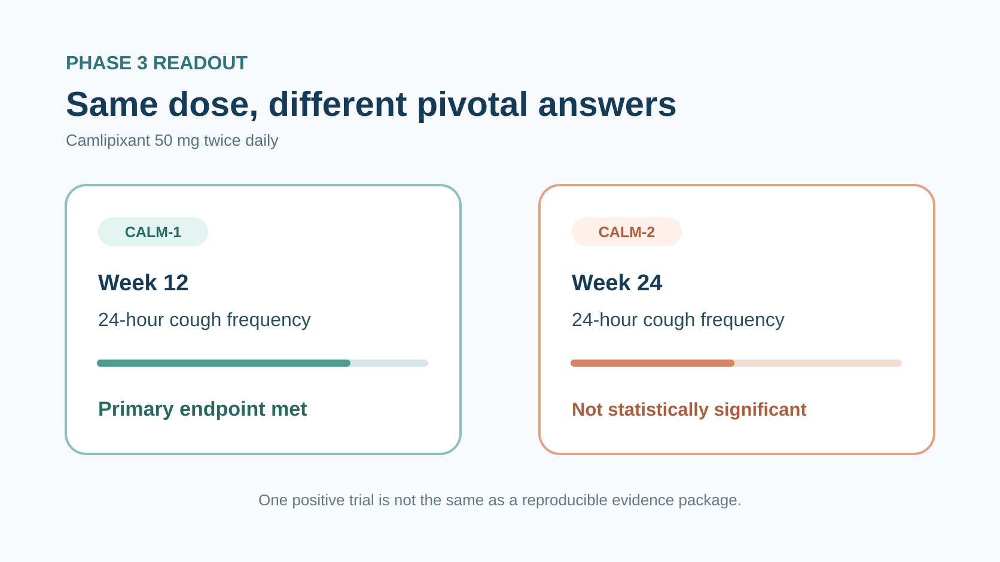
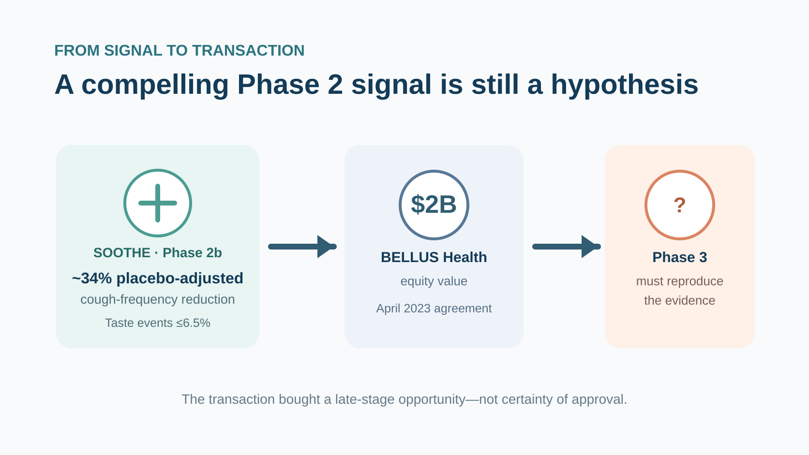
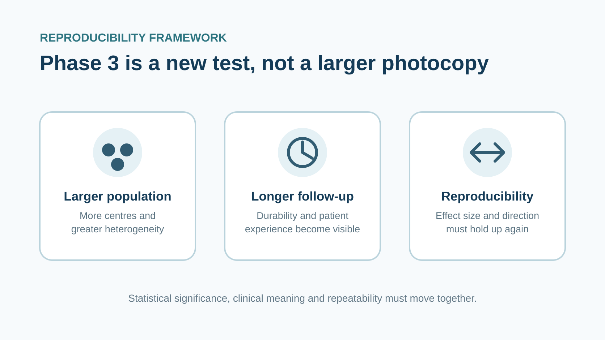
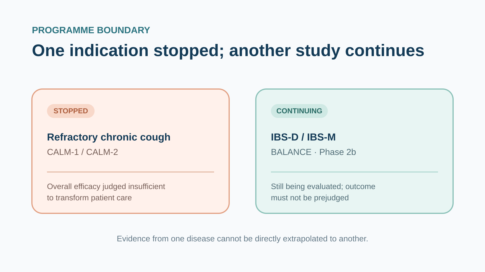

GSK paid roughly US$2 billion for a chronic-cough drug. Three years later, the programme stopped in Phase 3.

On 17 July 2026, GSK said it would discontinue development of camlipixant for refractory chronic cough (RCC). The uncomfortable part was not a clean sweep of negative trials. CALM-1 met its primary endpoint, while CALM-2 failed to reproduce the result.

When GSK acquired BELLUS Health in 2023, the investment case looked unusually coherent: a large patient population, no approved treatment in the United States or Europe, encouraging Phase 2 data, and a P2X3 inhibitor that might avoid the taste disturbance that had complicated the class.

In CALM-1, camlipixant 50 mg twice daily met the primary endpoint at Week 12. In CALM-2, the same dose did not achieve statistical significance at Week 24. The 25 mg twice-daily dose missed in both studies, and key secondary measures—including the Chronic Cough Diary (CCD)—also failed to reach their prespecified thresholds.

One positive pivotal trial and one negative one can sound better than an across-the-board failure. For a medicine expected to establish a new standard of care, however, it was not enough.

GSK's US$2 billion P2X3 bet ran into the most expensive problem in late-stage drug development: a signal that could not be reproduced consistently. That does not invalidate the entire cough target. It does force investors and developers to ask the question that Phase 3 exists to answer: can the early result happen again?

### 01 | Read CALM-1 and CALM-2 separately

GSK reported the combined headline results from CALM-1 and CALM-2 on 17 July 2026.

Both were Phase 3 trials in adults with refractory chronic cough. RCC refers to cough lasting more than eight weeks that persists despite appropriate treatment of possible underlying causes, or cannot be adequately explained by an identifiable cause. For patients, this is not an occasional need to clear the throat. It can mean hundreds of coughs a day, disrupted sleep, impaired work, social isolation and a sustained loss of quality of life.

CALM-1's primary efficacy time point was Week 12; CALM-2's was Week 24. Both studies measured 24-hour cough frequency and compared camlipixant with placebo.

The headline results were:

- **CALM-1:** camlipixant 50 mg twice daily significantly reduced 24-hour cough frequency versus placebo at Week 12 and met the primary endpoint.
- **CALM-2:** the same 50 mg twice-daily regimen did not achieve statistical significance at Week 24.
- **25 mg twice daily:** neither study reached statistical significance.
- **Key secondary endpoints:** both trials missed prespecified thresholds, including measures based on the Chronic Cough Diary.
- **Safety:** the overall incidence and severity of treatment-related adverse events were similar between camlipixant and placebo in both trials.

There was no obvious headline safety failure, and the pharmacology did not disappear completely. GSK stopped because the overall efficacy was limited and unlikely to transform patient care. The discontinuation applies to the RCC indication.

One boundary matters. The Phase 2b BALANCE study in diarrhoea-predominant and mixed irritable bowel syndrome is continuing. Camlipixant has not disappeared from every disease programme, and an RCC outcome cannot be mechanically extrapolated to IBS.

### 02 | Phase 2 gave GSK a credible reason to buy

In April 2023, GSK agreed to acquire BELLUS Health for US$14.75 per share in cash, representing an aggregate equity value of approximately US$2 billion. The transaction closed on 28 June. GSK bought the company, but camlipixant was clearly the central strategic asset.

The SOOTHE Phase 2b study provided the supporting signal. The 50 mg and 200 mg twice-daily regimens both met the primary endpoint, with placebo-adjusted reductions in 24-hour cough frequency of approximately 34.4% and 34.2%, respectively. Taste-related adverse events occurred in no more than 6.5% of participants across doses.

That tolerability profile mattered. P2X3 receptors participate in cough-reflex hypersensitivity, so inhibiting them may reduce cough. But interference with related receptors can also produce taste disturbance, making long-term treatment difficult. Camlipixant was designed as a selective P2X3 antagonist, and the Phase 2 data appeared to combine efficacy with comparatively manageable taste effects.

The commercial opportunity also looked compelling. GSK's acquisition announcement estimated that about 28 million people worldwide had chronic cough, roughly 10 million had RCC lasting longer than a year, and about six million lived in the United States and European Union. At the time, neither region had an approved RCC therapy.

Those figures were company estimates made in 2023. They should not be treated as a current, precise count of diagnosed or addressable patients. They do explain the acquisition logic: a large population, clear unmet need, a late-stage asset, encouraging Phase 2 efficacy, and a potential tolerability advantage within the class.

GSK then expected an approval and launch in 2026, with accretion to adjusted earnings per share from 2027. In a 2024 presentation, the company also assigned camlipixant peak-year sales potential of more than £2.5 billion.

The currency and status of that estimate matter. It was expressed in pounds sterling and represented a forward-looking, unrisked product potential—not realised revenue.

### 03 | Why one successful Phase 3 study could not rescue the programme

If CALM-1 was positive, why could GSK not simply file on the strength of the successful study?

A p-value below a statistical threshold is only the first requirement for a medicine expected to change practice. The magnitude and durability of benefit must be consistent; patients should feel a meaningful difference; and the overall benefit-risk profile must support chronic use.

CALM-1 showed a statistically significant difference at Week 12, whereas CALM-2 did not reproduce that finding at Week 24. Potential explanations include placebo response, patient heterogeneity, execution, timing, effect size or other study-specific factors. GSK has so far disclosed headline conclusions rather than the full data set, so it would be premature to assign a single cause.

The Week 12 and Week 24 results also came from two different trials with different participants. They do not prove that efficacy simply faded by Week 24. Assessing durability would require the full time-course data from both trials, baseline characteristics, estimated treatment differences and confidence intervals.

Nor does CALM-1's positive primary endpoint mean that every RCC patient benefited. Objective cough monitors count frequency. Patients also care about intensity, night-time disruption, urinary incontinence, fatigue and social limitation. The failure of CCD and other key secondary endpoints to provide support therefore weakens the total evidence: a measurable instrument signal that does not connect consistently with patient experience carries less regulatory and commercial value.

The development decision nevertheless had a clear direction. The lower dose missed in both studies, the higher dose succeeded on the primary endpoint in only one, and key secondary endpoints failed to support either study. A programme cannot readily claim to transform patient care when benefit appears at a single trial and time point but does not move several patient-relevant measures together.

This is also why a relatively clean safety headline could not save the asset. Similar treatment-related adverse-event rates versus placebo suggest that the topline data did not reveal an obvious tolerability price. In a chronic condition, however, safety must accompany reliable benefit; it cannot replace it.

### 04 | Phase 3 is a new test, not a larger photocopy

Drug development is often described as a straight line: Phase 1 checks safety, Phase 2 finds a signal, Phase 3 expands the sample, and approval follows.

Reality is closer to sitting the exam again.

Phase 2 trials are usually smaller. Patient and site selection can be more concentrated, while dose, endpoint and statistical assumptions are still being refined. Phase 3 moves the proposed effect into a larger and more heterogeneous population, more centres, longer follow-up and a stricter execution environment. A larger sample can improve statistical power, but it also exposes disease heterogeneity, measurement noise and real-world operational difficulty.

CALM's central problem is that a promising Phase 2 signal did not translate into consistent Phase 3 evidence.

SOOTHE reported placebo-adjusted reductions of roughly 34% with both 50 mg and 200 mg twice daily, alongside a low incidence of taste-related events. In Phase 3, GSK evaluated 25 mg and 50 mg. The higher dose met the primary endpoint in one study and missed in the other; the lower dose missed in both. The results are not a simple biological zero, but they do not support a stable benefit-risk conclusion.

The public evidence available at the time supported moving into Phase 3. CALM-1 and CALM-2 were the new information that changed the decision.

The more useful diligence questions are therefore not whether GSK should have predicted the future perfectly. They are how the company modelled variability in cough-frequency measurement, placebo response, dose selection and joint Phase 3 success—and whether management reallocated resources promptly once the evidence changed.

### 05 | What the market now has to reprice

It is tempting to say that US$2 billion simply disappeared. The accounting conclusion requires more discipline.

GSK paid approximately US$2 billion for all of BELLUS Health's equity. Any impairment charge must be read from the company's financial reporting rather than inferred from the clinical decision. What investors can already reprice are the lost peak-sales scenario, the resulting gap in GSK's 2031 product portfolio, and management's record of converting external business development into durable products.

The failure of one asset has not, by itself, rewritten GSK's 2026 full-year guidance or its 2031 ambitions. The 17 July programme update did not present a withdrawal or restatement of group guidance as its central message.

### 06 | Does P2X3 still have a path forward?

After camlipixant's discontinuation in RCC, it is easy to declare P2X3 another false target. That conclusion moves too quickly.

The high-dose CALM-1 result shows measurable activity in at least one study at a defined time point. The broader development and regulatory history of P2X3 inhibitors also indicates that the mechanism has human evidence. The unresolved challenge is how inhibition, selectivity, patient segmentation, endpoints and follow-up duration must be combined to produce a benefit that is both meaningful and reproducible.

A target can be biologically valid while a particular molecule, dose, population or study design is insufficient. Conversely, one positive trial cannot validate an entire class.

Investors should therefore watch the full subgroup analyses, baseline cough frequency, placebo response, time-course curves, patient-reported outcomes and whether the taste profile still resembles the advantage suggested in Phase 2.

### 07 | Three things Taiwan-based readers should track

There is not enough primary evidence to identify a Taiwan-listed company as a co-developer, manufacturer, clinical partner or commercial beneficiary of camlipixant. Forcing a local stock connection would create a claim that the evidence does not support.

Three industry questions are more useful:

1. **The complete CALM data.** The topline release does not yet show whether the discrepancy was driven mainly by effect size, patient mix, placebo response, timing or another factor.
2. **Whether BALANCE continues and when it reads out.** IBS has different biology and endpoints. RCC failure cannot prove that the IBS study will fail, just as an ongoing trial cannot be treated as evidence of a second life for the molecule.
3. **How GSK accounts for the BELLUS transaction and reallocates R&D resources.** This is where the clinical stop will eventually become visible on the financial statements and in the portfolio.

### Conclusion | Phase 3 makes a compelling story prove itself again

Camlipixant's path is severe but familiar.

Phase 2 offered efficacy, a potentially favourable taste profile and substantial unmet need. A global pharmaceutical company paid US$2 billion, planned for a 2026 launch and assigned more than £2.5 billion in peak-year sales potential. Then one pivotal trial met its primary endpoint, another did not, and key secondary endpoints failed to support either study. GSK stopped development in RCC.

The Phase 2 evidence was once sufficient to justify Phase 3. It was not sufficient to reproduce the result across two pivotal studies. The US$2 billion transaction bought the right to test a late-stage hypothesis—not certainty of approval. When the evidence no longer supported the programme, stopping became the final development decision.

### References

1. [GSK, CALM-1 and CALM-2 Phase 3 update, 17 July 2026](https://www.gsk.com/en-gb/media/press-releases/gsk-provides-an-update-on-calm-1-and-calm-2-phase-iii-trials/)
2. [GSK, agreement to acquire BELLUS Health, 18 April 2023](https://www.gsk.com/en-gb/media/press-releases/gsk-reaches-agreement-to-acquire-late-stage-biopharmaceutical-company-bellus-health/)
3. [GSK, completion of the BELLUS Health acquisition, 28 June 2023](https://www.gsk.com/en-gb/media/press-releases/gsk-completes-acquisition-of-bellus-health/)
4. [SOOTHE original peer-reviewed Phase 2b paper, NCT04678206](https://academic.oup.com/ajrccm/article/211/6/1038/8513749)
5. [ClinicalTrials.gov: SOOTHE, NCT04678206](https://clinicaltrials.gov/study/NCT04678206)
6. [GSK, J.P. Morgan Healthcare Conference transcript](https://www.gsk.com/media/tsvlrat3/jp-morgan-healthcare-conference-transcript.pdf)
7. [ClinicalTrials.gov: CALM-1, NCT05599191](https://clinicaltrials.gov/study/NCT05599191)
8. [ClinicalTrials.gov: CALM-2, NCT05600777](https://clinicaltrials.gov/study/NCT05600777)
9. [ClinicalTrials.gov: BALANCE, NCT07519395](https://clinicaltrials.gov/study/NCT07519395)

### Disclaimer

This article is an analysis of biopharma and industry trends. It does not constitute medical diagnosis, treatment advice or investment advice. Trial results and subsequent development status should be verified against company disclosures, trial registries and regulatory materials.
