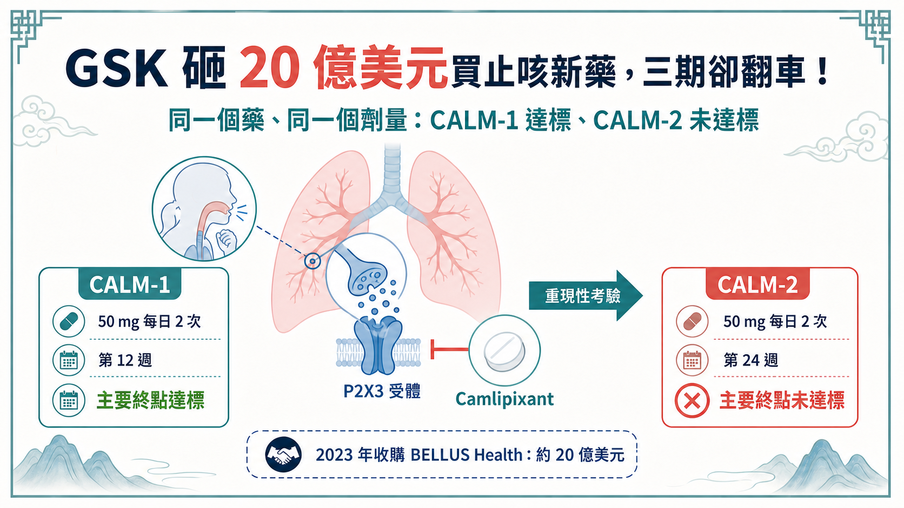
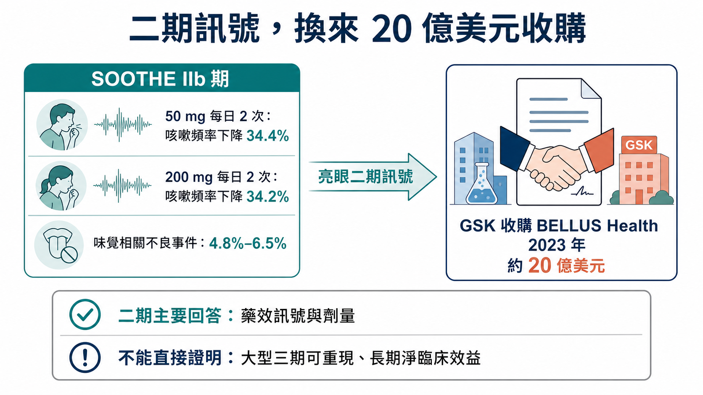
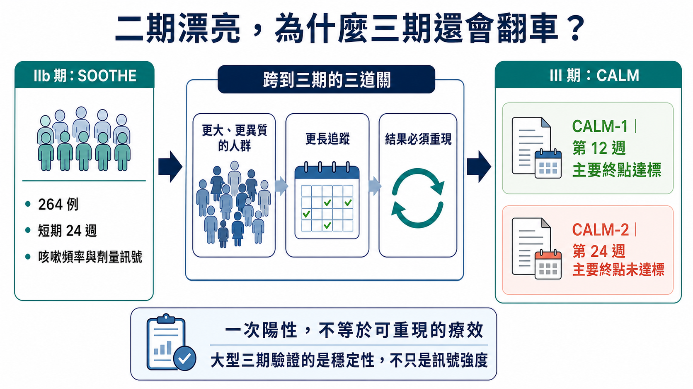
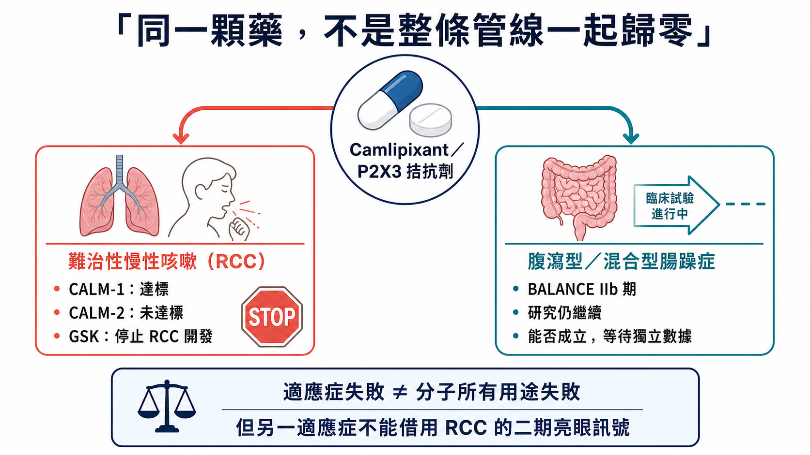

GSK 砸 20 億美元買止咳新藥，三期卻翻車！
──────────

GSK 曾花約 20 億美元買下一款慢性咳嗽新藥。三年後，它停在第三期。

2026 年 7 月 17 日，GSK 宣布停止 camlipixant 在難治性慢性咳嗽的開發。更棘手的是：CALM-1 過關，CALM-2 卻無法複製。

2023 年收購 BELLUS Health 時，市場看到的是一個很完整的故事：患者多、歐美缺乏核准治療、二期訊號漂亮，camlipixant 還可能避開同類藥最麻煩的味覺副作用。

CALM-1 的 50 mg 每日兩次，在第 12 週達到主要終點；問題是 CALM-2 的同一劑量，在第 24 週沒有達到統計顯著。25 mg 每日兩次則在兩項研究都沒過，慢性咳嗽日記等關鍵次要終點也沒有達到預設門檻。

一個試驗過、一個試驗沒過，聽起來比「全面失敗」好一點；對一個想成為新標準的藥，卻仍然不夠。

GSK 花 20 億美元押下的 P2X3 資產，在三期撞上了「無法重現」。這沒有替整個止咳靶點判死刑，卻把 CALM 最昂貴的教訓攤在桌上：早期訊號，能不能再做一次？

──────────
📌 01｜先把 CALM-1 與 CALM-2 分開看

GSK 在 2026 年 7 月 17 日公布 CALM-1 與 CALM-2 綜合結果。

兩項都是針對成人難治性慢性咳嗽（refractory chronic cough, RCC）的第三期試驗。RCC 指咳嗽持續超過八週，已針對可能的原因接受適當治療後仍持續，或找不到能充分解釋的原因。對患者來說，這不是偶爾清喉嚨，而可能是一天反覆數百次、影響睡眠、工作、社交與生活品質的長期疾病。

CALM-1 的主要療效時間點是第 12 週；CALM-2 則是第 24 週。兩個研究都測量 24 小時咳嗽頻率，並比較 camlipixant 與安慰劑。

正式結果如下：

- CALM-1：50 mg 每日兩次，在第 12 週相較安慰劑顯著降低 24 小時咳嗽頻率，主要終點達標；
- CALM-2：相同 50 mg 每日兩次，在第 24 週沒有達到統計顯著；
- 25 mg 每日兩次：兩項試驗都沒有達到統計顯著；
- 關鍵次要終點：包括慢性咳嗽日記（CCD）在內，兩項試驗都沒有達到目標門檻；
- 安全性：兩項試驗中，camlipixant 與安慰劑的治療相關不良事件整體發生率與嚴重度相近。

安全性沒有爆雷，藥理活性也未完全消失；讓 GSK 停手的是整體療效有限，難以改變患者照護。公司停止的是 RCC 適應症後續開發。

另一個邊界也要講清楚：評估腹瀉型與混合型腸躁症的 IIb 期 BALANCE 試驗仍會繼續，camlipixant 尚未從所有疾病開發中消失。

──────────
🧪 02｜二期看起來，真的很有理由買

回到 2023 年 4 月，GSK 宣布以每股 14.75 美元現金收購 BELLUS Health，總股權價值約 20 億美元；6 月 28 日，公司另行公告交易完成。GSK 買的是整家公司，但 camlipixant 顯然是核心理由。

支持收購的是 SOOTHE IIb 期研究。50 mg 與 200 mg 每日兩次都達到主要終點，經安慰劑校正的 24 小時咳嗽頻率降幅分別約 34.4% 與 34.2%。味覺相關不良事件在不同劑量的發生率不高於 6.5%。

這個安全性輪廓很重要。P2X3 受體參與咳嗽反射過度敏感，抑制它有機會降低咳嗽；但如果藥物同時明顯干擾相關受體，可能帶來味覺異常，讓患者難以長期服用。camlipixant 被設計成具選擇性的 P2X3 拮抗劑，二期資料看起來同時保留療效與味覺耐受性。

市場空間也很誘人。GSK 收購公告引用的估計是，全球約 2,800 萬人有慢性咳嗽，其中約 1,000 萬人的 RCC 超過一年，美國與歐盟約 600 萬人。當時美國與歐盟沒有核准的 RCC 藥物。

這些數字都是 2023 年收購時的公司估計，不能當成今天精準的診斷人數或可治療市場。不過它們解釋了 GSK 為何願意出手：大患者池、明確未滿足需求、後期資產、二期訊號，以及可能優於同類的味覺安全性。

GSK 當時預期 2026 年核准與上市，並希望從 2027 年起增厚調整後每股盈餘。2024 年的公司簡報更曾給出「峰值年銷售潛力超過 25 億英鎊」的估計。

這個口徑是英鎊，而且屬於公司前瞻、未經風險調整的產品潛力，尚未形成收入。

──────────
⚖️ 03｜一個三期過關，為何仍救不了專案？

讀到 CALM-1 過關，直覺會問：為什麼 GSK 不拿成功的那一個繼續申請？

一個 p 值小於門檻，只是新藥改變臨床的第一關。效果是否穩定、病人是否真的感受到、風險效益能否支持長期使用，缺一不可。

CALM-1 在第 12 週看到顯著差異，CALM-2 在更長的第 24 週沒有複製。這可能涉及安慰劑反應、患者異質性、試驗執行、時間點、效果大小或其他因素；GSK 目前只公布頂線結論，完整數據尚待會議或論文，因此不能替公司指定單一失敗原因。

第 12 週與第 24 週來自兩項不同試驗、不同受試者，無法直接推論「藥效到第 24 週就消失」。若要判斷療效是否隨時間衰退，至少要看到兩項試驗各時間點的完整曲線、基線特徵、估計差異與信賴區間。

同理，CALM-1 的陽性也不表示所有 RCC 患者都受益。客觀咳嗽監測器算到的是頻率，患者在意的還有咳嗽強度、夜間干擾、尿失禁、疲勞與社交限制。這正是 CCD 等關鍵次要終點沒有支持，會讓整體證據變得更弱的原因：儀器上的變化若沒有穩定連到患者感受，商業與監管價值都會打折。

但開發決策已經有足夠方向：低劑量兩個研究都沒過，高劑量只過一個主要終點，兩個研究的關鍵次要終點也沒有支持。若藥物只在某個試驗、某個時間點顯示統計優勢，卻無法讓多項患者相關指標一起移動，要宣稱它能「transform patient care」就很困難。

這也是為什麼安全性沒有救回專案。camlipixant 的治療相關不良事件與安慰劑相近，表示它至少沒有在頂線資料出現明顯的安全性代價；慢性病上市還需要穩定療效，再乾淨的耐受性也補不上這一格。

──────────
🔁 04｜三期是一場重新驗證

新藥故事常被寫成一條直線：一期看安全、二期看訊號、三期放大樣本，最後核准。

現實比較像重新考一次。

二期研究通常規模較小，受試者與試驗中心選擇也可能較集中；劑量、終點與統計假設仍在摸索。看到正面訊號後，三期必須把那個效果放進更大的患者群、更多中心、更長追蹤與更嚴格執行環境。樣本變大可以提高統計能力，也會把疾病異質性、量測雜訊與真實執行難度一起放大。

CALM 最刺眼之處，是二期訊號沒有穩定轉成三期的一致性。

SOOTHE 的 50 mg 與 200 mg 都看到約 34% 的安慰劑校正降幅，味覺事件又少，這讓資產看起來相當可推進。到了三期，GSK 改以 25 mg 與 50 mg 評估；高劑量在一項試驗達標，另一項沒過，低劑量則兩項都沒過。結果無法化成零與一；這組數據很難支撐穩定的風險效益結論。

當時能看到的公開證據支持進三期；CALM-1 與 CALM-2 的結果，才是後來新增的關鍵資訊。

更合理的問題是：GSK 在盡職調查中如何評估咳嗽頻率的量測變異、安慰劑反應、劑量選擇與兩個三期的成功機率？以及資料延後後，管理層是否及時重新分配資源？這些才是收購品質的核心。

──────────
💰 05｜20 億美元，市場重砍四筆帳

標題很容易寫成「20 億美元打水漂」，但財務上要保守。

GSK 以約 20 億美元買下 BELLUS Health 全部股權，實際減損仍要等財報。市場現在同時重估消失的峰值銷售想像、2031 年產品組合缺口，以及 GSK 外部併購的命中率。

單一資產失敗尚未改寫 GSK 的 2026 全年財測或 2031 年目標。公司沒有正式更新指引，7 月 17 日的專案公告也沒有把全年指引寫成撤回或重申的核心事項。

──────────
🧭 06｜P2X3 還有沒有下一條路？

camlipixant 停止後，很容易把 P2X3 寫成「又一個偽靶點」。這個結論走太快。

CALM-1 的高劑量主要終點達標，本身就顯示藥物在至少一個研究、特定時間點有可測量的作用；其他 P2X3 路線的開發與監管歷史，也說明這個生物機制已有人體證據。尚待解決的是抑制程度、選擇性、患者分層、終點與追蹤時間，怎麼組合才能得到足夠且可重現的效益。

靶點可以是對的，分子、劑量、族群或試驗設計仍可能不夠好；反過來，一個試驗陽性也不能替整個靶點背書。

這個區分很重要。投資人接下來應追完整亞組、基線咳嗽頻率、安慰劑反應、不同時間點曲線、患者報告結果，以及味覺相關事件是否仍維持二期優勢。

──────────
🇹🇼 07｜台灣讀者應該追的三件事

目前沒有足夠一級證據，能把台灣上市櫃公司列為 camlipixant 的共同開發、製造、臨床或商業化受益者，因此不硬湊台股。

產業上更值得追的是：

第一，GSK 後續發表的 CALM 完整數據。現在只有頂線結果，尚不能判斷失敗主要來自效果大小、患者差異或時間點。

第二，BALANCE IIb 期是否繼續、何時讀出。腸躁症的疾病機制與終點不同，RCC 失敗不能直接推導 IBS 一定失敗；同樣也不能因為專案還在，就先說分子有第二次生命。

第三，GSK 財報如何處理 BELLUS 交易相關資產與研發優先順序。這才會告訴投資人，臨床止損最後如何落到帳上。

──────────
🎯 結語｜三期的價值，是讓漂亮故事接受複製

camlipixant 的歷程很殘酷，也很典型。

二期看見療效、味覺安全性與巨大未滿足需求；大藥廠用 20 億美元買進，設定 2026 年上市與超過 25 億英鎊峰值銷售潛力；最後，一個三期過、一個三期沒過，兩個研究的關鍵次要終點又都沒有支持，GSK 選擇停止 RCC。

二期資料曾經足以支持進三期，卻沒能在兩個關鍵試驗中重現。20 億美元買到的是驗證假設的機會；當證據不夠，及時停手就是最後一項開發決策。

參考資料（查證截止：2026-07-19）：

1. GSK, CALM-1／CALM-2 phase III update, 2026-07-17

https://www.gsk.com/en-gb/media/press-releases/gsk-provides-an-update-on-calm-1-and-calm-2-phase-iii-trials/
2. GSK, agreement to acquire BELLUS Health, 2023-04-18

https://www.gsk.com/en-gb/media/press-releases/gsk-reaches-agreement-to-acquire-late-stage-biopharmaceutical-company-bellus-health/
3. GSK, completion of BELLUS Health acquisition, 2023-06-28

https://www.gsk.com/en-gb/media/press-releases/gsk-completes-acquisition-of-bellus-health/
4. SOOTHE original peer-reviewed paper, phase 2b, NCT04678206

https://academic.oup.com/ajrccm/article/211/6/1038/8513749
5. ClinicalTrials.gov, SOOTHE, NCT04678206

https://clinicaltrials.gov/study/NCT04678206
6. GSK, J.P. Morgan Healthcare Conference transcript（峰值年銷售潛力）

https://www.gsk.com/media/tsvlrat3/jp-morgan-healthcare-conference-transcript.pdf
7. ClinicalTrials.gov, CALM-1, NCT05599191

https://clinicaltrials.gov/study/NCT05599191
8. ClinicalTrials.gov, CALM-2, NCT05600777

https://clinicaltrials.gov/study/NCT05600777
9. ClinicalTrials.gov, BALANCE, NCT07519395

https://clinicaltrials.gov/study/NCT07519395

#GSK #Camlipixant #P2X3 #慢性咳嗽 #臨床三期 #新藥研發 #Biotech #藥時事

免責聲明：本文為生技醫藥與產業趨勢整理，不構成醫療診斷、治療建議或投資建議。試驗結果與後續開發狀態應以公司公告、試驗登錄與監管資料為準。
