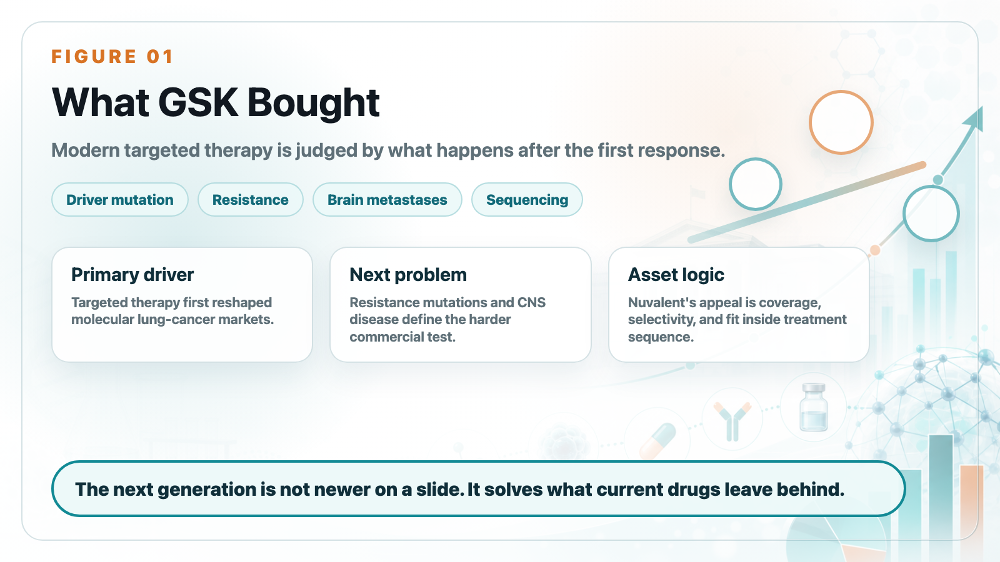
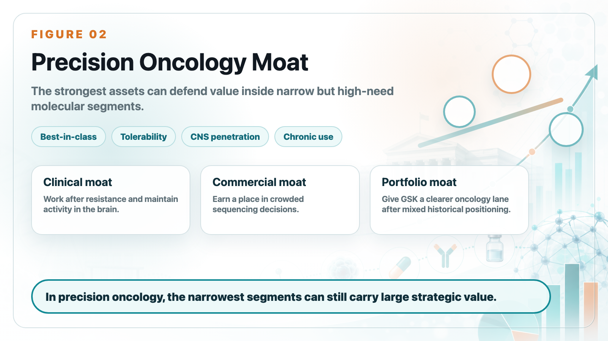
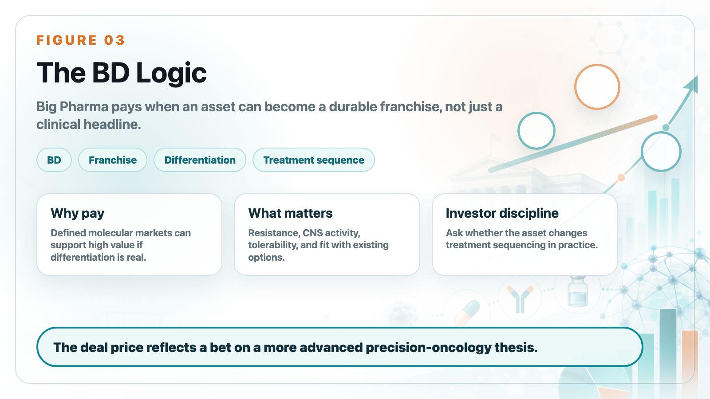

# GSK's US$10.6 Billion Nuvalent Deal Is Really a Bet on Resistance and Brain Metastases

GSK's agreement to acquire Nuvalent for roughly US$10.6 billion should not be read as simply buying three lung-cancer pipelines. The deeper logic is more specific: GSK is buying a position in the next phase of precision oncology.

Lung cancer has already been transformed by targeted therapies. EGFR, ALK, ROS1, MET, RET, NTRK, and other drivers have turned subsets of non-small cell lung cancer into molecularly defined markets. But targeted therapy creates its own next problem. Patients respond, then resistance emerges. Many also develop or already have brain metastases, which require drugs that can work in the central nervous system.

That is why Nuvalent is strategically attractive. The company's programs are designed around cleaner kinase inhibition, resistance coverage, and CNS activity. In modern lung cancer, a drug is not judged only by whether it hits the primary driver. It is judged by whether it can cover resistance mutations, reduce off-target toxicity, maintain activity in the brain, and fit into a treatment sequence that is already crowded.

This is the business meaning of "next generation." It does not mean a newer molecule on a slide. It means a molecule that solves problems left by existing products.

For GSK, the deal also reflects a broader portfolio strategy. The company has been trying to strengthen oncology after years of mixed positioning. Nuvalent gives GSK a clearer way to participate in precision lung cancer, an area where commercial value can be high if the asset becomes best-in-class or meaningfully differentiated.

The price is large, but the logic is understandable. Big Pharma is willing to pay for assets that can become durable franchises in well-defined molecular segments. The most valuable assets are not always the broadest. Sometimes they are the ones that answer the hardest treatment-sequencing questions.

For biotech investors, the Nuvalent deal is a reminder that BD value is often created by solving the second problem, not the first. The first problem was making targeted therapy work. The second is making it work after resistance, in the brain, and with tolerability good enough for chronic use.

That is what GSK is paying for. Not just pipelines, but a more advanced precision-oncology thesis.

This article is intended for industry research and knowledge sharing only. It does not constitute investment, medical, fundraising, or individual stock advice.
