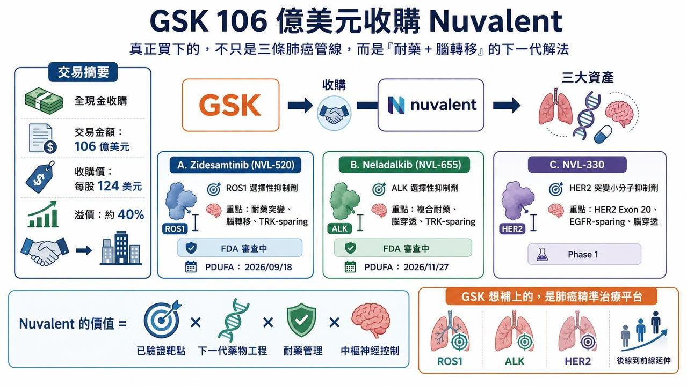
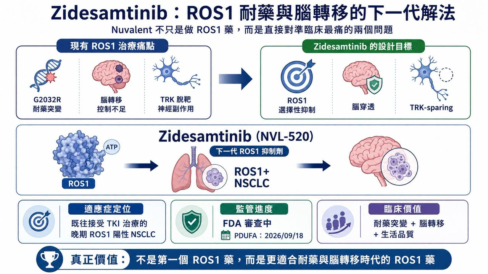
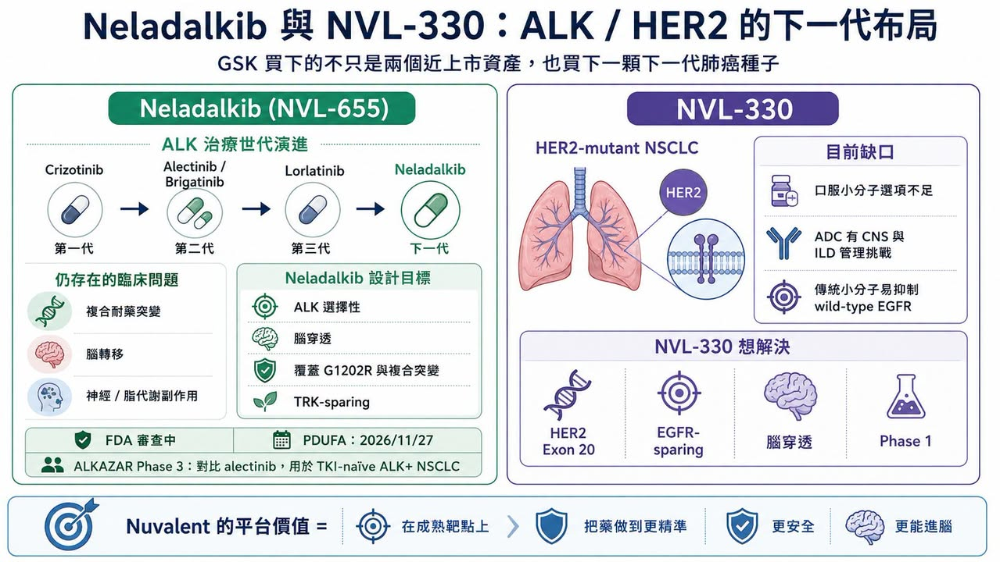
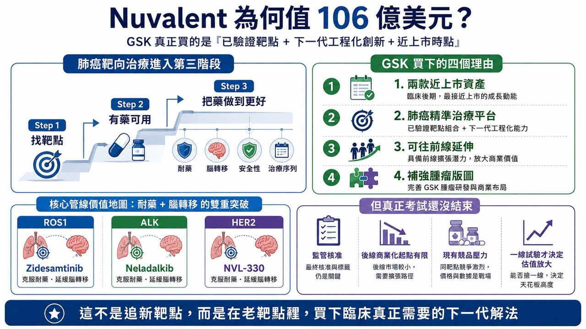

# GSK 用 106 億美元買下 Nuvalent：真正買的不是三條肺癌管線，而是「耐藥與腦轉移」的下一代解法

GSK 這次出手很重。

2026 年 6 月 9 日，GSK 宣布以 106 億美元全現金收購 Nuvalent，收購價格為每股 124 美元，較 Nuvalent 前一交易日收盤價溢價約 40%。這是 GSK 近年最大型的腫瘤併購之一，也讓它瞬間補上肺癌精準治療版圖中最缺的一塊。

這筆交易的核心，是三款非小細胞肺癌標靶藥物：Zidesamtinib（NVL-520），新一代 ROS1 抑制劑；Neladalkib（NVL-655），新一代 ALK 抑制劑；以及 NVL-330，針對 HER2 突變的早期小分子抑制劑。

其中 Zidesamtinib 與 Neladalkib 都已經進入美國 FDA 上市審查階段。Zidesamtinib 的審查目標日是 2026 年 9 月 18 日，Neladalkib 則是 2026 年 11 月 27 日。換句話說，GSK 買的不是一個還停在概念階段的早期平台，而是兩款距離商業化僅一步之遙的後期肺癌資產。

這也是這筆交易最有意思的地方。

GSK 不是為了追逐全新靶點，而是回到已經被充分驗證的肺癌驅動基因：ROS1、ALK、HER2。但它買的不是「老靶點的普通跟隨者」，而是在老靶點裡，專門解決兩個仍然困住臨床的難題：

耐藥突變。

腦轉移。

這才是 Nuvalent 值 106 億美元的真正理由。

## 01｜Nuvalent 的選擇：不搶新靶點，而是把老靶點做到更深

Nuvalent 成立於 2019 年，是一家專注腫瘤激酶標靶治療的臨床階段公司。和很多 Biotech 不一樣，Nuvalent 並沒有把主要精力放在尋找全新靶點。它選擇的是已經被臨床驗證過、醫師知道怎麼用、患者分型也相對明確的靶點。

ROS1 融合、ALK 重排、HER2 突變，都是非小細胞肺癌裡非常清楚的致癌驅動因素。但問題在於，這些靶點雖然已經有藥，卻遠遠沒有被解決。

患者一開始可能對標靶藥有很好反應，但隨著治療時間拉長，癌細胞會慢慢長出耐藥突變。另一方面，肺癌患者特別容易發生腦轉移，而早期標靶藥對中樞神經系統的控制能力不夠，常常讓腦部成為疾病進展的破口。

所以，Nuvalent 的思路很清楚：不是重新發明靶點，而是重新設計藥物。它要做的，是更選擇性、更能打耐藥突變、更能穿透血腦屏障、同時又盡量降低脫靶毒性的下一代肺癌標靶藥。這種創新不一定像全新靶點那樣吸睛，但非常實用。因為它直接對準臨床最痛的地方。

## 02｜Zidesamtinib：ROS1 治療裡，真正難的是 G2032R 與腦轉移

第一個核心產品，是 Zidesamtinib（NVL-520）。

它是一款 ROS1 選擇性抑制劑。ROS1 融合約占非小細胞肺癌患者的 1% 到 2%。比例不高，但放在全球肺癌患者基數裡，仍然是一個有明確治療價值的族群。ROS1 靶向治療並不是新事物。早期有 Crizotinib，後來有 Entrectinib，再到 Repotrectinib（Augtyro） 等新一代藥物。這些藥物一路把 ROS1 陽性肺癌患者的預後往前推。

但它們仍然留下兩個問題。

第一，是耐藥突變。ROS1 裡最難處理的突變之一，是 G2032R。這是一種所謂 solvent-front mutation，也就是出現在藥物結合口袋附近、會阻礙藥物進入或穩定結合的突變。很多早期 ROS1 抑制劑碰到 G2032R，療效就會大幅下降。

第二，是神經系統副作用。部分 ROS1 抑制劑也會抑制 TRK 家族蛋白。TRK 和神經系統功能有關，若被不必要地抑制，患者可能出現頭暈、感覺異常、平衡感變差等神經副作用。這對需要長期用藥的肺癌患者，是很實際的生活品質問題。

Zidesamtinib 的設計，就是想同時處理這兩件事。它要保持對 ROS1 及耐藥突變的強抑制，同時盡量避開 TRK，降低神經毒性風險。Nuvalent 也把它設計成具備腦穿透能力，希望對腦轉移患者有更好控制。Nuvalent 過往公開資料將 zidesamtinib 定位為 brain-penetrant、TRK-sparing 的 ROS1 抑制劑，也就是「能進腦、避開 TRK 脫靶」的設計，這就是 GSK 願意買單的原因。

Zidesamtinib 不是第一個 ROS1 藥物。但它有機會成為更適合耐藥與腦轉移時代的新一代 ROS1 藥物。

## 03｜Neladalkib：ALK 藥物已經很多，但複合耐藥仍然是下一道牆

第二個核心產品，是 Neladalkib（NVL-655）。

它是一款 ALK 選擇性抑制劑。ALK 陽性非小細胞肺癌約占患者的 3% 到 5%。這是一個相對小眾、但非常成熟的精準治療市場。

這個領域的競爭非常激烈。從第一代 Crizotinib，到第二代 Alectinib、Ceritinib、Brigatinib，再到第三代 Lorlatinib，ALK 抑制劑已經一代一代把療效天花板往上推。尤其 Lorlatinib，具有強大的中樞神經系統活性，也能覆蓋多種 ALK 耐藥突變，在臨床上占有重要地位。但 Lorlatinib 仍然不是完美答案。它的問題包括脂代謝異常，例如膽固醇升高，也包括神經認知與情緒相關不良反應。對部分患者來說，這些副作用會影響長期用藥體驗。

更重要的是，隨著 Lorlatinib 使用增加，臨床上開始看到更複雜的 ALK 複合耐藥突變。這些突變不是單一位點變化，而是多個突變同時出現，使後續治療更加困難。Neladalkib 的設計，就是要往這裡打。它被設計為腦穿透、高選擇性的 ALK 抑制劑，目標是覆蓋第一代、第二代、第三代 ALK 抑制劑治療後出現的耐藥突變，包括 G1202R 及相關複合突變。Nuvalent 在官方資料中也明確指出，neladalkib 旨在處理現有 ALK 抑制劑的限制，並保留對中樞神經系統病灶的活性。它的上市申請已經被 FDA 接受，並獲得優先審查，審查目標日為 2026 年 11 月 27 日。

這說明 GSK 買下 Nuvalent，不只是買 ROS1，也是在 ALK 這個成熟但仍持續演進的市場裡，買下一個可能挑戰現有後線治療格局的產品。

## 04｜NVL-330：HER2 肺癌仍缺口服小分子解法

第三個資產，是 NVL-330。

它目前還在 Phase 1 臨床，進度較早，但戰略價值不低。HER2 突變在非小細胞肺癌中約占 2% 到 4%，其中外顯子 20 插入突變是重要類型。這類患者過去治療選擇有限。

目前 HER2 突變肺癌中最重要的藥物之一，是抗體藥物複合體 Enhertu（trastuzumab deruxtecan）。Enhertu 的出現，確實讓 HER2 突變肺癌治療前進一大步。但 ADC 也有自身限制。它是大分子藥物，進入中樞神經系統的能力仍然存在挑戰；同時，Enhertu 這類 ADC 的間質性肺病風險也需要嚴格管理。

另一方面，傳統 HER2 小分子抑制劑常常也會抑制野生型 EGFR，導致腹瀉、皮疹等毒性，限制劑量與臨床使用。NVL-330 的定位，就是嘗試解決這個缺口。它是一款針對 HER2 突變優化設計的小分子抑制劑，重點覆蓋 HER2 外顯子 20 插入突變，同時盡量避免抑制野生型 EGFR，以降低皮疹與腹瀉等副作用。和 Nuvalent 其他產品一樣，NVL-330 也被設計成具備腦穿透能力。

這條管線還早，風險比 Zidesamtinib、Neladalkib 更高。但如果前兩款藥物順利上市，NVL-330 就會成為 GSK 肺癌靶向平台的下一顆種子。

## 05｜GSK 為什麼願意花 106 億美元？
GSK 這筆交易，看似昂貴，其實很符合近年 Big Pharma 併購邏輯。

大型藥廠現在最缺的，不是科學概念，而是風險已經部分去化、距離上市不遠、又能快速補進產品組合的後期資產。

這幾年類似交易並不少。Bristol Myers Squibb 收購 Mirati Therapeutics，是為了取得 KRAS G12C 抑制劑 Krazati（adagrasib）；AbbVie 收購 ImmunoGen，是為了取得 FRα ADC Elahere（mirvetuximab soravtansine）；Pfizer 收購 Seagen，是為了補強 ADC 平台。GSK 收購 Nuvalent，則是為了快速補上肺癌精準治療平台。

這筆交易對 GSK 特別重要。

GSK 過去曾經在 2014 年把部分腫瘤業務賣給 Novartis，之後又透過收購 Tesaro 重新回到腫瘤領域，取得 PARP 抑制劑 Zejula（niraparib）。但和 AstraZeneca、Merck、Roche、BMS、Pfizer 這些腫瘤大廠相比，GSK 在實體瘤，尤其是肺癌領域，仍然缺乏足夠強的核心產品。

肺癌是全球最大實體瘤市場之一，也是精準治療最成熟的癌種之一。如果 GSK 想在腫瘤領域重新取得話語權，它不能只靠單一產品。它需要平台。

Nuvalent 給它的，正是一個肺癌小分子靶向平台。

更現實的是，GSK 也面對 HIV 產品未來專利週期與成長接續壓力。更多報導指出，這筆交易也是 GSK 擴大腫瘤布局、對沖未來 HIV 產品專利到期壓力的一部分。從 GSK 的角度看，它買的不是三條管線。它買的是 2026 年可能上市的兩個收入起點，以及一個可延展的肺癌平台。

## 06｜這筆交易的本質：肺癌靶向治療從「有藥可用」走向「把藥做到更好」
這次 Nuvalent 被高價收購，背後其實反映出肺癌靶向治療的新階段。

早期精準治療的問題，是找靶點。EGFR、ALK、ROS1、BRAF、MET、RET、NTRK、HER2，一個個驅動基因被找到，藥物陸續上市。現在很多靶點已經不是「有沒有藥」的問題，而是：

藥物能不能打耐藥？

能不能進腦？

能不能避開脫靶毒性？

能不能延長序貫治療時間？

能不能讓患者活得更久，也活得更好？

這就是 Nuvalent 的價值。它沒有發現全新肺癌靶點，卻在已驗證靶點上繼續做工程化創新。

這種創新看起來不像 first-in-class 那麼浪漫，但很可能更容易被醫師和市場接受。因為它直接解決現有治療的痛點。

ROS1 的 G2032R、ALK 的複合耐藥突變、HER2 小分子對野生型 EGFR 的毒性、腦轉移控制不足、TRK 脫靶造成的神經副作用，這些都是臨床每天會遇到的問題。

Nuvalent 把這些問題變成藥物設計目標，這就是它能賣出 106 億美元的原因。

## 07｜風險在哪裡？上市不是終點，真正考試在一線
Nuvalent 的兩個核心產品雖然已進入上市審查，但這筆交易仍有風險。

第一，是監管風險。

Zidesamtinib 與 Neladalkib 目前都還沒有正式獲批。雖然都已進入 FDA 審查，但審查結果、標籤範圍、適應症限制、上市後要求，都會影響商業化速度。

第二，是商業起點風險。

這兩款藥物初期大概率會先用於既往治療失敗或後線患者。這類患者需求明確，但人群相對有限。若要真正支撐百億美元收購價格，未來必須往更前線治療推進。

第三，是競爭風險。

ROS1 有 Repotrectinib，ALK 有 Lorlatinib。這些藥物已經建立臨床位置。Zidesamtinib 與 Neladalkib 必須證明自己不只是「又一個後線選擇」，而是在耐藥、腦轉移、安全性或生活品質上有明確優勢。

第四，是一線挑戰。

真正的大市場，不在後線，而在一線。如果 Zidesamtinib 未來能在 ROS1 初治患者中證明比既有標準療法更好，Neladalkib 也能在 ALK 初治或更早線別中挑戰 Alectinib、Lorlatinib 等現有藥物，那這筆交易的價值才會真正放大。

所以 GSK 買的是確定性，也買了下一階段的臨床風險。這正是大型併購的本質：不是把風險消滅，而是把風險買到自己手上，靠全球開發與商業化能力把它放大成收益。

## 08｜台灣可以看「工程化創新」能力
台灣目前沒有直接對標 ROS1、ALK、HER2 腦穿透小分子肺癌平台的上市櫃公司。真正該看的，是這筆交易背後代表的產業邏輯：已驗證靶點不等於沒有機會，重點是能不能針對耐藥、安全性、腦轉移、劑型或製造問題做出真正差異化。

從這個角度看，浩鼎 的 OBI-992 可以放在 ADC 工程化創新的脈絡中觀察。OBI-992 是以 TROP2 為靶點的抗體藥物複合體，目前處於臨床 Phase 1，適應症涵蓋晚期實體瘤。浩鼎公開資料指出，OBI-992 採用高親水性連接子與拓撲異構酶 I 抑制劑 payload，目標是在血液中維持穩定，並在進入腫瘤細胞後釋放細胞毒藥物。

這和 Nuvalent 的路徑不同，但底層問題相似：在一個已經非常擁擠的靶點賽道裡，產品要如何用工程細節證明自己更好？

對浩鼎來說，真正要回答的是 TROP2 ADC 能否在療效、安全性、連接子穩定性、旁觀者效應與適應症選擇上做出差異化。

## 結語｜GSK 106 億美元買下的，是肺癌靶向治療下一階段的入場券
GSK 收購 Nuvalent，看起來是一筆大手筆併購。但本質上，它反映的是肺癌精準治療進入新週期。

第一階段，是找出驅動基因。第二階段，是讓患者有第一款標靶藥可用。第三階段，則是處理耐藥、腦轉移、安全性與治療序列。

Nuvalent 站在第三階段。

Zidesamtinib 要解決 ROS1 耐藥與腦轉移。Neladalkib 要解決 ALK 複合耐藥與神經毒性。NVL-330 則嘗試補上 HER2 突變肺癌小分子口服治療缺口。

這三條管線共同指向一件事：肺癌靶向治療的下一輪競爭，不是誰先找到靶點，而是誰能把已知靶點做到更精準、更安全、更耐用。對 GSK 來說，這筆交易補上了它在肺癌精準治療領域的空白，也讓它重新拿到腫瘤戰場的入場券。對整個產業來說，Nuvalent 的高價出售則證明：即使是成熟靶點，只要能真正解決耐藥與中樞轉移，仍然可以賣出頂級估值。

創新不一定永遠來自全新靶點，有時候，它來自把一個老靶點做到臨床真正需要的樣子。

參考資料：

[1] GSK｜Investor relations and company announcements: https://www.gsk.com/en-gb/investors/

[2] Nuvalent｜Investor relations and company news: https://investors.nuvalent.com/

[3] Nuvalent｜Pipeline overview: https://www.nuvalent.com/pipeline/

[4] Reuters｜Health and pharmaceutical M&A coverage: https://www.reuters.com/business/healthcare-pharmaceuticals/

---

本文僅供產業研究與知識分享，不構成投資、醫療、募資或個股建議。
