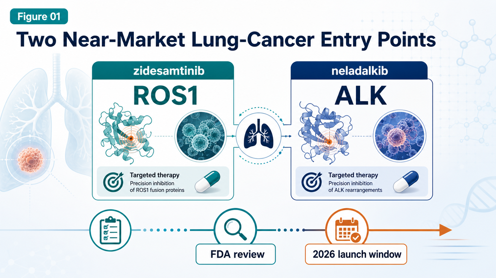
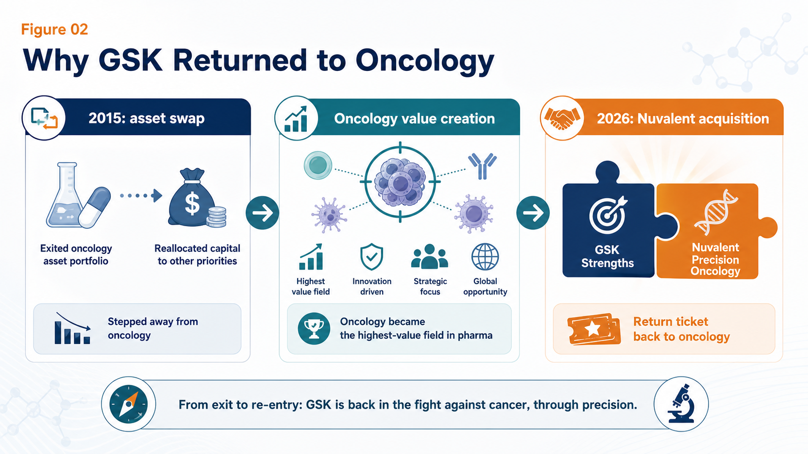
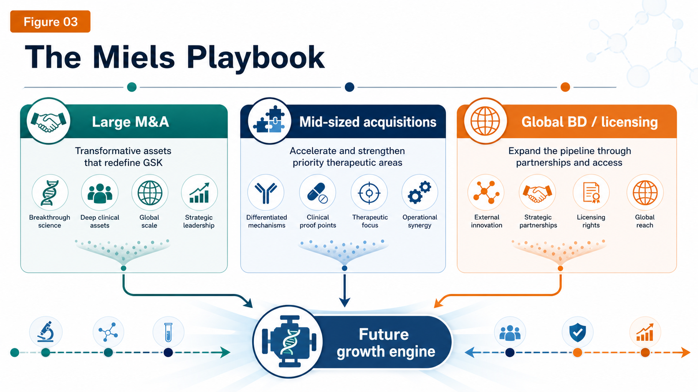
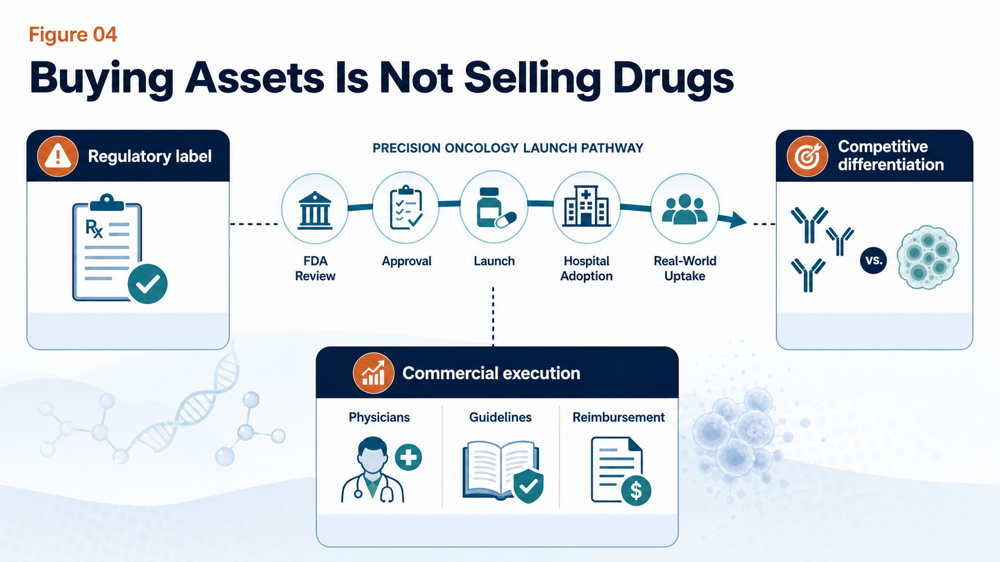

# GSK Goes Big: The $10.6B Nuvalent Deal Is Not Just a Lung-Cancer Pipeline Buy

GSK has clearly raised the intensity.

In June 2026, GSK announced a $10.6 billion all-cash acquisition of Nuvalent, offering $124 per share. This is not a small bolt-on transaction. It is one of the clearest moves yet by new CEO Luke Miels to put GSK back into the oncology conversation with assets that are close enough to launch to matter commercially.

According to GSK, the deal brings in two late-stage non-small cell lung cancer drugs already under FDA review, zidesamtinib and neladalkib, plus an earlier HER2 inhibitor, NVL-330. After adjusting for Nuvalent's cash on hand, GSK's effective investment is roughly $9.4 billion.

This is not the kind of transaction investors normally associate with GSK's recent comfort zone. Earlier this year, the market had been reading GSK as a company more likely to favor $2-4 billion bolt-on acquisitions. Then, in June, GSK went straight to a $10 billion-plus oncology deal.

The initial market reaction was mixed: Nuvalent's share price jumped, while GSK's share price fell.

That reaction does not necessarily mean the deal lacks logic. It means investors now have to reassess a bigger question: is GSK shifting from a relatively cautious R&D and M&A rhythm into a more aggressive oncology rebuilding mode?

The answer increasingly looks like yes.

## 01 | GSK is buying two near-market lung-cancer entry points

Nuvalent's most valuable assets are two next-generation targeted therapies for non-small cell lung cancer.

The first is zidesamtinib, a next-generation ROS1 inhibitor.

ROS1-positive non-small cell lung cancer is not a large patient population, but it is a genetically defined market. These patients usually have a clear oncogenic driver, depend heavily on targeted therapy, and may stay on treatment for a long time. The value proposition of zidesamtinib is not that it is the first ROS1 drug. The question is whether it can address resistance mutations and brain metastases that remain difficult for existing therapies.

Zidesamtinib has received FDA priority review, with a PDUFA target date of September 18, 2026.

The second asset is neladalkib, a next-generation ALK inhibitor.

ALK-positive lung cancer is already a mature market. The field has moved from crizotinib to alectinib, brigatinib, and Pfizer's Lorbrena, with each generation trying to improve potency, durability, CNS activity, and tolerability.

But the market still has unresolved pain points:

- brain metastases
- compound resistance mutations
- neurocognitive adverse effects
- long-term tolerability during chronic use

Neladalkib is also under FDA review, with a PDUFA target date of November 27, 2026.

This is the core reason GSK is willing to pay a large price. It is not buying a five-year wait. It is buying two precision lung-cancer assets that are already near the commercial starting line. If both drugs are approved this year, GSK can immediately begin commercial preparation, and 2027 could become the first year in which the deal starts contributing to revenue.

That timing matters. External reports have also pointed out that this transaction could help GSK support revenue from 2027 onward and offset pressure from dolutegravir patent expiry in the HIV franchise.

## 02 | GSK sold oncology once. Now it is paying a higher price to return.

The Nuvalent deal has strategic drama because GSK has already stepped away from the oncology table once.

In 2015, GSK and Novartis completed a major asset swap. GSK sold its oncology business to Novartis and shifted more weight toward vaccines and consumer health. At the time, the decision had its logic. Oncology R&D was expensive, failure rates were high, and GSK's oncology franchise was not yet large enough to command the future shape of the market.

The problem is what happened over the next decade.

The richest land in global pharma turned out to be oncology.

Merck built an immuno-oncology empire around Keytruda.

AstraZeneca raised its strategic value through Tagrisso, Imfinzi, and later a broader oncology platform.

BMS, Roche, Pfizer, and other large pharma companies continued to invest heavily in cancer.

GSK had to rebuild from a weaker position. It was not inactive. In 2018, GSK acquired Tesaro for $5.1 billion and gained the PARP inhibitor Zejula. It also advanced Jemperli and Blenrep, among other oncology assets. But the path has not been smooth. Blenrep was withdrawn from the US market after a confirmatory trial failed to meet its endpoint, before GSK began working on a potential return.

That is the reality of GSK's oncology rebuild:

It needs time.

It also needs stronger assets that are closer to commercialization.

Nuvalent fills that gap better than a purely early-stage platform story.

## 03 | The Miels playbook: large M&A, mid-sized acquisitions, and global BD

Since Luke Miels took over, GSK's external-innovation rhythm has clearly accelerated.

In January 2026, GSK announced a $2.2 billion acquisition of RAPT Therapeutics, adding ozureprubart, an anti-IgE antibody aimed at food-allergy prevention. In February, GSK acquired 35Pharma and added HS235, a candidate linked to activin signaling, with positioning in pulmonary arterial hypertension and cardiopulmonary disease.

Then came Nuvalent in June.

The total M&A volume in the first half of 2026 is already substantial.

At the same time, GSK has been using BD, meaning business development and licensing, to reinforce the pipeline. In 2025, GSK reached a collaboration with Hengrui that gave it access to multiple innovative drug assets, including HRS-9821, with total potential deal value reportedly reaching roughly $12 billion.

In oncology, GSK has also been building value through the B7-H4 ADC Mo-Rez, licensed from Hansoh. Reports have noted encouraging response signals in early gynecologic tumor studies, and GSK has indicated plans to push the asset into more advanced clinical development.

Nuvalent is therefore not an isolated event. It is one brick in a broader strategy. GSK is trying to fill the next few years of revenue pressure and pipeline depth through three routes at once:

- large acquisitions
- mid-sized pipeline reinforcement
- global licensing

For investors, the central question is not whether GSK can buy assets. Large pharma companies can always write checks. The harder question is whether the company can convert those purchased assets into durable commercial franchises.

Pipeline ownership is not the same thing as market ownership.

## 04 | The biggest risk: buying assets is not the same as selling drugs

Nuvalent's drugs have real potential, but $10.6 billion is not a small check. The risk comes in three layers.

The first is regulatory risk.

Zidesamtinib and neladalkib are both under FDA review, but neither has been formally approved yet. Label scope, treatment line, post-marketing commitments, and any safety or CMC issues can all affect final commercial value.

The second is competitive risk.

ROS1 and ALK are not empty markets. BMS has Augtyro, Pfizer has Lorbrena, and Roche has Alecensa. Nuvalent's products need to show sufficiently clear differentiation in resistance coverage, brain-metastasis activity, and tolerability to take share from established therapies.

The third is commercialization risk.

GSK has been returning to oncology, but lung-cancer sales and medical-affairs infrastructure cannot match AstraZeneca, Roche, or Pfizer overnight. Buying the asset is only the first step. The harder work is earning physician confidence, entering treatment guidelines, securing reimbursement, and scaling use in the real world.

Miels has described GSK's strategy as building "brick by brick." That phrase is useful because it keeps expectations grounded.

Whether the bricks are solid depends on two follow-up questions:

- How will the FDA label zidesamtinib and neladalkib this year?
- Can GSK preserve Nuvalent's biotech agility while adding Big Pharma global launch scale?

## 05 | How Taiwan should read this deal: do not only look for the usual names

Taiwan does not need to force a direct "Taiwanese Nuvalent" comparison. That would be too simple. A better reading is to look at lung cancer, targeted small molecules, and oncology commercialization through several closer observation points.

The first is Genovate Biotechnology, stock code 7427.

Genovate has been advancing multi-kinase and tumor-immunology-related drug development. Its GNTbm-TKI data have referred to inhibitory activity against multiple targets, including TYRO3, AXL, c-MER, BTK, ROS1, NTRK2, MET, and VEGFR2. This is not the same route as Nuvalent's highly selective ROS1 and ALK strategy. But it reflects the same broader direction: small-molecule oncology drugs increasingly need clearer target positioning, combination logic, and international clinical validation.

The second is Gongwin Biopharm, stock code 6617.

Gongwin's PTS-302 is not a targeted TKI. It is a minimally invasive targeted tumor-ablation drug aimed at severe central airway obstruction in lung cancer. The product has already obtained a Class 1 new-drug approval in China, and the company has planned regulatory submissions in Malaysia and the Philippines. This is a case where a Taiwanese company has taken a lung-cancer-related product from R&D toward regional commercialization.

The third is AnHorn Medicines, stock code 7784.

AnHorn's ABT-101 is a HER2 tyrosine kinase inhibitor designed for HER2 exon 20 mutation non-small cell lung cancer. That is directionally close to Nuvalent's NVL-330 logic: finding oral small-molecule solutions in HER2-mutant lung cancer. AnHorn has disclosed that its ABT101-102 clinical trial received TFDA clearance in Taiwan, and the company later obtained MFDS approval in Korea to conduct a Phase I/II human clinical trial.

The practical lesson for Taiwan is not "find the next Nuvalent." The better lesson is this:

In precision oncology, investors are not only paying for mechanisms. They are paying for assets where the target, patient segment, resistance logic, regulatory path, and commercialization route can be understood as one coherent story.

## Conclusion | GSK has pushed real chips back onto the oncology table

GSK's $10.6 billion acquisition of Nuvalent looks on the surface like the purchase of three lung-cancer programs. At a deeper level, it is buying three things.

First, it is buying time. Two core products could potentially be approved in 2026, much faster than waiting for early discovery programs to mature.

Second, it is buying oncology relevance. GSK needs to rebuild its presence in lung cancer and precision oncology.

Third, it is buying future growth. With dolutegravir patent pressure ahead, GSK needs to identify the next set of assets that can support revenue.

This deal is large, and it carries real risk. But from GSK's position, it is also a rational move that was becoming difficult to avoid.

Ten years ago, GSK handed away much of its oncology business.

Ten years later, it is paying a higher price to sit back at the oncology table.

The FDA decisions for zidesamtinib and neladalkib will be the first exam. The real exam will come after 2027: can GSK turn purchased pipelines into a durable new oncology engine?

The cards are now on the table.

The question is whether GSK can play this hand into a genuine turnaround.

References:

1. [The Guardian: GSK to buy US cancer treatment firm Nuvalent in $10bn deal](https://www.theguardian.com/business/2026/jun/09/gsk-buy-us-cancer-treatment-firm-nuvalent-luke-miels)
2. [Investor's Business Daily: Nuvalent stock surges on GSK acquisition](https://www.investors.com/news/technology/nuvalent-stock-gsk-acquisition/)
3. [MarketWatch: GSK announces its biggest purchase in eight years](https://www.marketwatch.com/story/gsk-just-announced-its-biggest-purchase-in-eight-years-to-rev-up-cancer-portfolio-it-had-previously-wound-down-a95e6065)
4. [Barron's: Nuvalent stock jumps on GSK cancer deal](https://www.barrons.com/articles/nuvalent-stock-gsk-cancer-deal-89443e68)
5. Company websites and public disclosures

---

This article is for industry research and knowledge sharing only. It does not constitute investment, medical, fundraising, or individual stock advice.
