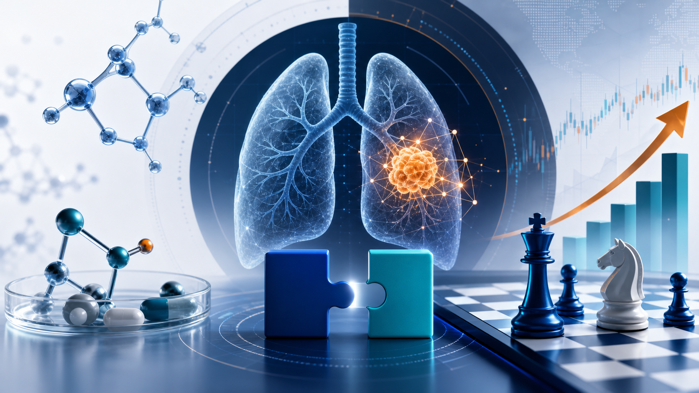

# GSK Goes Big: The $10.6B Nuvalent Deal Is Not Just a Lung-Cancer Pipeline Buy

GSK has clearly changed its tempo.

In June 2026, GSK announced a $10.6 billion all-cash acquisition of Nuvalent, offering $124 per share. This was not a small bolt-on deal. It was one of the clearest signals yet that new CEO Luke Miels wants to rebuild GSK's oncology position with assets that are close enough to the market to matter.

Nuvalent brings two late-stage non-small cell lung cancer assets already under FDA review: zidesamtinib and neladalkib. It also brings an earlier HER2 inhibitor, NVL-330. After adjusting for Nuvalent's cash, GSK's effective investment is roughly $9.4 billion.

That is not the type of transaction the market had been expecting from GSK. Earlier in the year, investors were still thinking about smaller $2-4 billion bolt-on acquisitions. Instead, GSK went straight into a large oncology transaction.

The initial market reaction was mixed: Nuvalent surged, while GSK traded lower.

That does not mean the deal lacks logic. It means investors now need to answer a larger question: is GSK moving from a relatively cautious R&D and M&A posture into a more aggressive oncology rebuilding mode?

The answer increasingly looks like yes.

## 01 | GSK is buying two near-market lung-cancer entry points

Nuvalent's core value is not simply that it has oncology assets. It has two next-generation targeted therapies in non-small cell lung cancer, both close to potential approval.

The first is zidesamtinib, a next-generation ROS1 inhibitor.

ROS1-positive non-small cell lung cancer is not a large patient population, but it is a genetically defined market. These patients often depend heavily on targeted therapy, and treatment duration can be long. The point of zidesamtinib is not that it is the first ROS1 drug. The point is whether it can address resistance mutations and brain metastases that remain hard for existing therapies.

The second is neladalkib, a next-generation ALK inhibitor.

ALK-positive lung cancer is already a mature market. The category has moved from crizotinib to alectinib, brigatinib, and Pfizer's Lorbrena. Each generation has tried to improve potency, durability, CNS activity, and tolerability.

But the market still has real pain points:

- brain metastases
- compound resistance mutations
- neurocognitive adverse effects
- long-term tolerability during chronic use

This is the core reason GSK is willing to pay a large price. It is not buying a five-year wait. It is buying two precision-lung-cancer assets that are near the commercial starting line. If approvals arrive as expected, GSK can begin commercialization quickly and potentially see revenue contribution from 2027 onward.

That timing matters. GSK also needs to prepare for pressure from dolutegravir patent expiry in its HIV franchise. Nuvalent gives the company a credible oncology growth bridge.

## 02 | GSK sold oncology once. Now it is paying a higher price to return.

The Nuvalent deal has strategic drama because GSK has already left this table once.

In the 2014-2015 Novartis asset swap, GSK sold much of its oncology business to Novartis and strengthened its position in vaccines and consumer health. At the time, the logic was understandable. Oncology R&D was expensive, failure rates were high, and GSK did not yet have the scale of the future oncology leaders.

The problem is what happened next.

Over the following decade, oncology became one of the richest areas in global pharma.

Merck built a dominant immuno-oncology franchise around Keytruda. AstraZeneca used Tagrisso, Imfinzi, and later oncology-platform expansion to strengthen its valuation. BMS, Roche, Pfizer, and others continued to invest heavily.

GSK did try to return. It bought Tesaro in 2018 for Zejula, advanced Jemperli, and continued working on Blenrep. But the rebuild has been uneven. Blenrep's U.S. withdrawal after a failed confirmatory study was a reminder that oncology scale cannot be rebuilt through narrative alone.

This is why Nuvalent matters.

GSK needs assets with stronger clinical differentiation, clearer commercial entry points, and shorter time to market. Nuvalent fits that need better than a purely early-stage platform story.

## 03 | The Miels playbook: large M&A, mid-sized acquisitions, and global BD

Luke Miels has already accelerated GSK's external-innovation rhythm.

In January 2026, GSK agreed to acquire RAPT Therapeutics for $2.2 billion, adding ozureprubart, an anti-IgE antibody aimed at food-allergy prevention. In February, GSK acquired 35Pharma, adding HS235, a candidate linked to activin signaling and cardiopulmonary disease.

Then came Nuvalent.

At the same time, GSK has been using business development and licensing to broaden its pipeline. Its Hengrui collaboration gave GSK access to multiple innovative assets with a potential deal value of around $12 billion. In oncology, GSK has also been building value through assets such as the B7-H4 ADC Mo-Rez, licensed from Hansoh.

Nuvalent is therefore not an isolated transaction. It is one piece in a broader capital-allocation shift.

GSK is trying to rebuild future growth through three parallel routes:

- large acquisitions
- mid-sized pipeline reinforcement
- global licensing and BD

For investors, the key is that this strategy only works if the acquired assets can be turned into actual commercial franchises. Pipeline ownership is not the same thing as market ownership.

## 04 | The biggest risk: buying the asset is not the same as selling the drug

Nuvalent's assets have clear strategic value, but $10.6 billion is not a small check. The risk comes in three layers.

The first is regulatory risk.

Zidesamtinib and neladalkib are under FDA review, but they are not yet approved. Label scope, treatment line, post-marketing obligations, and any safety or CMC issues can all affect the final commercial value.

The second is competitive risk.

ROS1 and ALK are not empty markets. BMS has Augtyro, Pfizer has Lorbrena, and Roche has Alecensa. Nuvalent's products need to show sufficiently clear differentiation in resistance coverage, brain-metastasis activity, and tolerability to take share from established drugs.

The third is commercialization risk.

GSK has been rebuilding oncology, but lung-cancer commercial infrastructure cannot match AstraZeneca, Roche, or Pfizer overnight. Buying Nuvalent is step one. The harder work is earning physician confidence, getting into guidelines, securing reimbursement, and scaling use in the real world.

Miels has described GSK's approach as building "brick by brick." That phrase is useful because it keeps expectations grounded. The next bricks are straightforward:

- How will the FDA label these assets?
- Can GSK preserve Nuvalent's biotech agility while adding Big Pharma launch scale?

## 05 | What Taiwan should watch

Taiwan does not need to force a "Taiwanese Nuvalent" comparison. A better reading is to look for companies connected to lung cancer, targeted small molecules, and oncology commercialization.

One example is OBI Pharma / OBI's local peers and small-molecule oncology developers that are trying to move from broad platform claims into clearer target positioning and international validation. The lesson from Nuvalent is not simply "targeted therapy is valuable." It is that investors reward clinical assets when the target, patient segment, resistance logic, and commercial path are all understandable.

Another angle is companies working on lung-cancer commercialization or regional oncology products. For Taiwan, the question is not whether a company has a fashionable mechanism. The question is whether it can move from data to label, from label to reimbursement, and from reimbursement to actual physician adoption.

AnHorn Medicines is also worth watching from the HER2 small-molecule angle. ABT-101 is a HER2 tyrosine kinase inhibitor designed for HER2 exon 20 mutation non-small cell lung cancer. That is directionally close to the broader logic of next-generation targeted lung-cancer drugs: smaller molecularly defined markets, clearer patient selection, and a need for differentiation against global standards.

## Conclusion | GSK has pushed real chips back onto the oncology table

GSK's acquisition of Nuvalent is nominally about three lung-cancer programs. Strategically, it is about three deeper things.

First, GSK is buying time. Two core assets could potentially reach the market soon, which is much faster than rebuilding from early discovery.

Second, GSK is buying oncology relevance. It needs to re-establish a credible position in precision cancer therapy.

Third, GSK is buying future growth. With HIV patent pressure ahead, the company needs another set of assets that can support revenue beyond the current base.

This is a big deal with real risk. But from GSK's position, it is also a rational move.

Ten years ago, GSK stepped away from oncology.

Now it is paying a higher price to sit back at the table.

The first test will be the FDA decisions for zidesamtinib and neladalkib. The real test will come later: can GSK turn acquired pipelines into a durable oncology growth engine?

References:

- [The Guardian, "GSK makes biggest ever acquisition with $10.6bn for US cancer drug firm", June 9, 2026](https://www.theguardian.com/business/2026/jun/09/gsk-buy-us-cancer-treatment-firm-nuvalent-luke-miels)
- [Investors Business Daily, "Nuvalent Catapults To Record High On GSK's $10.6 Billion All-Cash Bid", June 9, 2026](https://www.investors.com/news/technology/nuvalent-stock-gsk-acquisition/)
- [MarketWatch, "Why a U.K. pharma giant is paying a 40% premium to pivot back to oncology", June 9, 2026](https://www.marketwatch.com/story/gsk-just-announced-its-biggest-purchase-in-eight-years-to-rev-up-cancer-portfolio-it-had-previously-wound-down-a95e6065)
- [Barron's, "Nuvalent Stock Jumps 39% on Surprise GSK Cancer-Drug Deal", June 9, 2026](https://www.barrons.com/articles/nuvalent-stock-gsk-cancer-deal-89443e68)

This article is intended for industry research and knowledge sharing only. It does not constitute investment, medical, fundraising, or individual stock advice.
