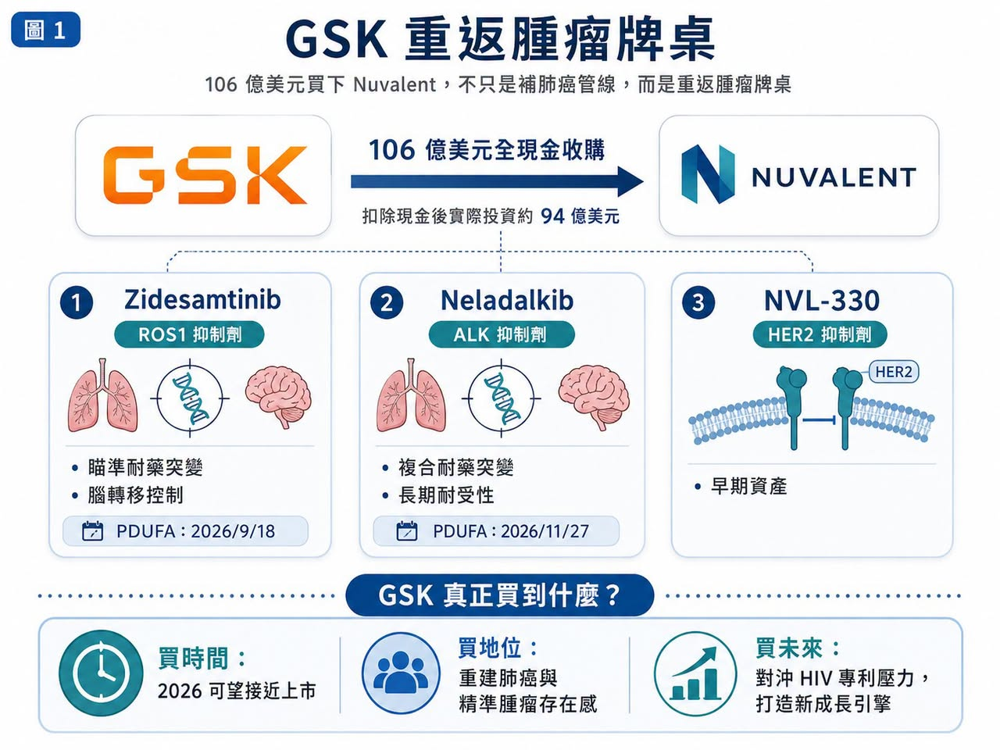
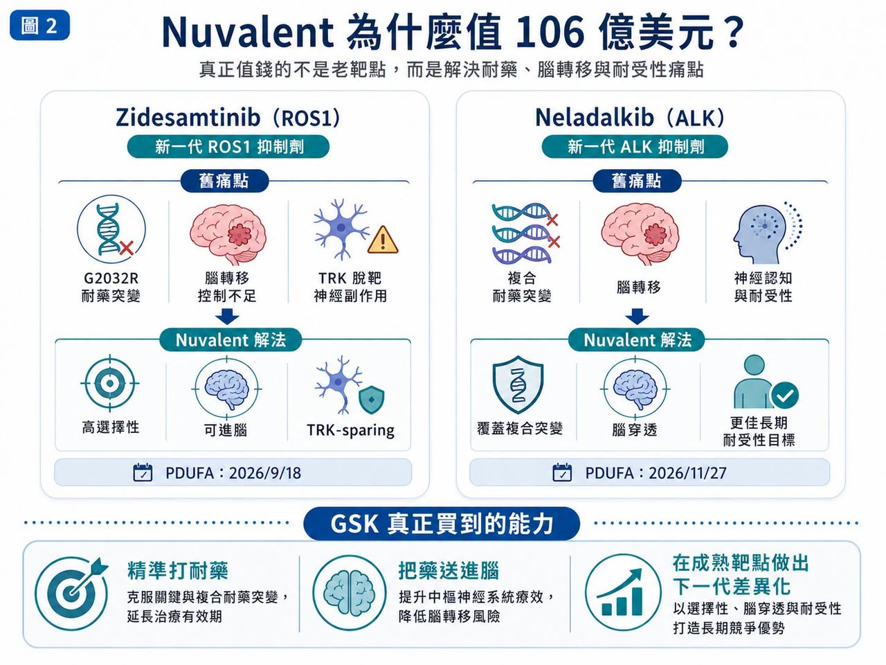
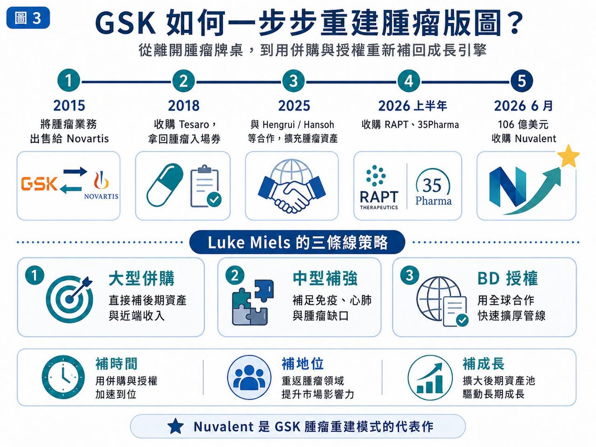
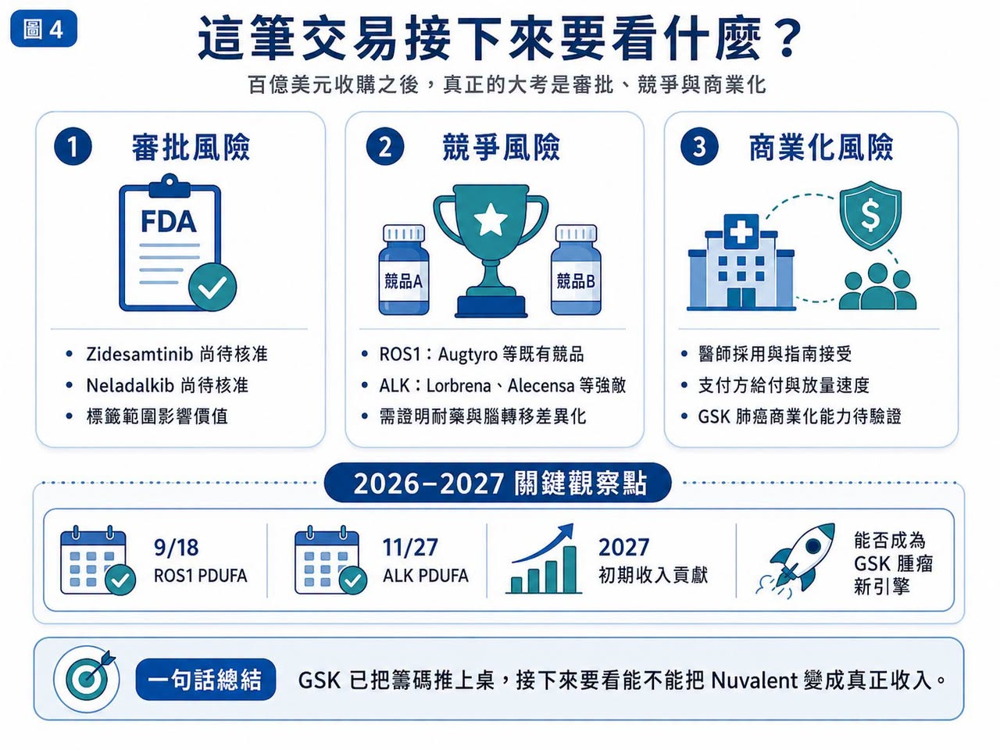

# GSK 上強度：106 億美元買下 Nuvalent，不只是補肺癌管線，而是重返腫瘤牌桌

GSK 這次真的上強度了。

2026 年 6 月，GSK 宣布以 106 億美元全現金收購 Nuvalent，收購價格為每股 124 美元。這筆交易不是小修小補，而是新任 CEO Luke Miels 上任後，替 GSK 腫瘤版圖打下的一記重拳。GSK 官方表示，這筆交易包含兩款已進入 FDA 審查的後期非小細胞肺癌藥物 zidesamtinib 與 neladalkib，以及早期 HER2 抑制劑 NVL-330。扣除 Nuvalent 帳上現金後，GSK 的實際投資約 94 億美元。

這不是 GSK 平常「舒適區」裡的交易。年初 GSK 還被市場解讀為偏好 20 億到 40 億美元規模的補強型收購，結果 6 月直接端出百億美元級別併購。

市場一開始有些消化不良：Nuvalent 股價大漲，GSK 股價下跌。

這反映的不是交易沒有邏輯，而是投資人要重新評估一件事：GSK 是否準備從過去相對保守的研發與併購節奏，轉向更積極的「腫瘤重建模式」？

答案看起來是肯定的。

## 01｜GSK 買的不是一家公司，而是兩個即將上市的肺癌入口

Nuvalent 最值錢的資產，是兩款下一代非小細胞肺癌標靶藥。

第一款是 zidesamtinib，一款新一代 ROS1 抑制劑。

ROS1 陽性非小細胞肺癌患者比例不高，但這類患者通常有明確驅動基因，對標靶治療依賴度高，用藥週期也可能很長。Zidesamtinib 的重點不是「第一個 ROS1 藥」，而是瞄準現有療法仍難處理的耐藥突變與腦轉移問題。它已獲 FDA 優先審查，PDUFA 目標日期為 2026 年 9 月 18 日。

第二款是 neladalkib，一款新一代 ALK 抑制劑。ALK 陽性肺癌已經是成熟市場，從 crizotinib（克唑替尼）到 alectinib（阿來替尼）、brigatinib（布加替尼），再到 Pfizer 的 Lorbrena（lorlatinib，洛拉替尼），一代比一代更強。

但這個市場仍有痛點：

腦轉移。

複合耐藥突變。

神經認知副作用。

長期用藥耐受性。

Neladalkib 目前同樣處在 FDA 審查階段，PDUFA 目標日期為 2026 年 11 月 27 日。這就是 GSK 願意付大錢的核心。它不是買一個還要等 5 年才知道成敗的早期故事，而是買兩個距離上市只差臨門一腳的精準肺癌資產。若今年順利獲批，GSK 可以立刻開始布局商業化，2027 年就有機會看到收入貢獻。相關報導也指出，這筆交易可望幫助 GSK 在 2027 年起提升營收，並對沖 dolutegravir（多替拉韋）專利到期後可能帶來的 HIV 業務壓力。

## 02｜十年前賣掉腫瘤，十年後用更高代價買回入場券

GSK 這次交易之所以有戲劇張力，是因為它曾經離開過腫瘤牌桌。

2015 年，GSK 與 Novartis 完成大型資產互換，GSK 將腫瘤業務賣給 Novartis，轉而強化疫苗與消費保健品。當時這個決策有其時代背景：腫瘤研發昂貴、失敗率高，GSK 的腫瘤業務規模也還不大。

問題是，接下來十年，整個製藥業最肥沃的土地正是腫瘤。

Merck 靠 Keytruda（pembrolizumab，帕博利珠單抗）成為腫瘤免疫王者。

AstraZeneca 靠 Tagrisso（osimertinib，奧希替尼）、Imfinzi（durvalumab，度伐利尤單抗）與 ADC 布局拉高估值。

BMS、Roche、Pfizer 也都在腫瘤裡持續下注。

GSK 則必須重新追趕，它不是沒有努力。2018 年 GSK 以 51 億美元收購 Tesaro，取得 PARP 抑制劑 Zejula（niraparib，尼拉帕利）。之後又推進 Jemperli（dostarlimab，多塔利單抗）、Blenrep（belantamab mafodotin，抗 BCMA ADC）等資產，但過程並不順利。Blenrep 曾因確證性研究未達標而退出美國市場，後來才重新尋找回歸機會。

這就是 GSK 腫瘤重建的現實：

它需要時間。

也需要更強、更接近商業化的資產。

Nuvalent 正好補上這一塊。

## 03｜Miels 的打法：大併購、中型補強、BD 授權一起來

Luke Miels 上任後，GSK 的節奏明顯加快。

2026 年 1 月，GSK 宣布以 22 億美元收購 RAPT Therapeutics，取得抗 IgE 抗體 ozureprubart，瞄準食物過敏預防市場。2 月，GSK 又收購 35Pharma，取得 HS235，一款針對 activin 訊號的候選藥物，布局肺動脈高壓與心肺疾病。再加上 6 月 Nuvalent，GSK 2026 年上半年併購總額已經相當驚人。同時，GSK 也大量透過 BD，也就是商務開發與授權合作，補強管線。2025 年，GSK 與 Hengrui 達成合作，取得 HRS-9821 等多個創新藥資產權益，總交易潛在金額可達約 120 億美元。在腫瘤領域，GSK 從 Hansoh 取得的 B7-H4 ADC Mo-Rez（mocertatug rezetecan）也已開始顯示價值。相關報導指出，Mo-Rez 在早期婦科腫瘤研究中展現出令人鼓舞的反應率，GSK 也計畫推進更多後期臨床。

所以，Nuvalent 不是孤立事件，它是 GSK 新策略的一塊磚，GSK 正試圖用三條線，同時補上未來幾年的收入缺口與管線厚度：

大型併購。

中型補強。

全球授權。

## 04｜這筆交易最大風險：買得到資產，不等於賣得好藥

Nuvalent 的藥很有潛力，但 106 億美元不是小錢，風險有三層。

第一，是審批風險。

Zidesamtinib 和 neladalkib 都尚未正式獲批。雖然已在 FDA 審查中，但標籤範圍、適應症線別、上市後承諾都會影響商業價值。

第二，是競爭風險。

ROS1 和 ALK 不是空白市場。BMS 有 Augtyro（repotrectinib，瑞波替尼），Pfizer 有 Lorbrena，Roche 有 Alecensa（alectinib，阿來替尼）。Nuvalent 的產品必須在耐藥、腦轉移與耐受性上做出足夠清楚的差異化，才有機會從既有藥物手上搶下份額。

第三，是商業化風險。

GSK 這幾年雖然重新投入腫瘤，但肺癌銷售與醫學事務網絡不可能一夜之間追上 AstraZeneca、Roche、Pfizer 這些老玩家。買下資產只是第一步，真正難的是讓醫師相信、讓指南接受、讓支付方給付、讓產品在真實世界放量。

Miels 把這套打法稱作「一塊磚一塊磚」建起來，這個說法很實在，但磚砌得穩不穩，要看後面兩件事：

FDA 今年怎麼批。

GSK 能不能把 Nuvalent 的 Biotech 靈活性，轉化成大藥廠的全球放量能力。

## 05｜台灣可以怎麼看？這篇別再只看老面孔
這次 GSK 收購 Nuvalent，台灣不需要硬找「台灣版 Nuvalent」。但可以從肺癌、標靶小分子、腫瘤藥物商業化三個角度，找幾個更貼近的新觀察點。

第一個是華上生醫（7427）。

華上生醫正在推進多重激酶與腫瘤免疫相關新藥布局，其 GNTbm-TKI 研究資料曾提到對 TYRO3、AXL、c-MER、BTK、ROS1、NTRK2、MET、VEGFR2 等多個靶點具有抑制活性。這和 Nuvalent 的高選擇性 ROS1／ALK 路線不一樣，但同樣反映小分子腫瘤藥未來要走向更清楚的靶點定位、聯合療法與國際臨床驗證。

第二個是共信-KY（6617）。

共信-KY 的 PTS-302 不是標靶 TKI，而是微創標靶腫瘤消融藥物，鎖定肺癌中央型嚴重氣道阻塞。該產品已在中國取得一類新藥藥證，且公司規劃向馬來西亞、菲律賓提交上市申請，代表台灣公司也有肺癌產品從研發走向區域商業化的案例。

第三個是安邦生技（7784）。

安邦的 ABT-101 是 HER2 tyrosine kinase inhibitor，也就是 HER2 酪胺酸激酶抑制劑，臨床設計針對 HER2 Exon 20 突變非小細胞肺癌。這和 Nuvalent 的 NVL-330 方向相近，都是在 HER2 突變肺癌裡尋找口服小分子解法。安邦生技公告顯示，ABT101-102 臨床試驗已取得台灣 TFDA 許可，後續也曾取得韓國 MFDS 核准進行 Phase I/II 人體臨床試驗。

## 結語｜GSK 已經把籌碼推上桌，接下來要看能不能換成真正收入
GSK 用 106 億美元買 Nuvalent，表面上是收購三款肺癌管線，但更深層看，它是在買三件事。

第一，買時間。兩款核心產品 2026 年就可能獲批，能比早期研發更快接上收入。

第二，買腫瘤地位。GSK 需要重新建立肺癌與精準腫瘤的存在感。

第三，買未來成長。面對 dolutegravir 專利到期壓力，GSK 必須提前找到下一批能支撐營收的資產。

這筆交易很大，也有風險，但從 GSK 的位置看，它幾乎是不得不下的一步棋。

十年前，GSK 把腫瘤業務交出去。

十年後，它用更高代價重新坐上腫瘤牌桌。

Zidesamtinib 和 neladalkib 的 FDA 決定日期，會是這筆交易的第一場考試，真正的大考，則在 2027 年之後：GSK 能不能把買來的管線，變成自己的腫瘤新引擎。

牌已經上桌，接下來，就看 GSK 能不能把這把牌打成一場翻身戰。

參考資料：

1. [The Guardian: GSK to buy US cancer treatment firm Nuvalent in $10bn deal](https://www.theguardian.com/business/2026/jun/09/gsk-buy-us-cancer-treatment-firm-nuvalent-luke-miels)
2. [Investor's Business Daily: Nuvalent stock surges on GSK acquisition](https://www.investors.com/news/technology/nuvalent-stock-gsk-acquisition/)
3. [MarketWatch: GSK announces its biggest purchase in eight years](https://www.marketwatch.com/story/gsk-just-announced-its-biggest-purchase-in-eight-years-to-rev-up-cancer-portfolio-it-had-previously-wound-down-a95e6065)
4. [Barron's: Nuvalent stock jumps on GSK cancer deal](https://www.barrons.com/articles/nuvalent-stock-gsk-cancer-deal-89443e68)
5. 各公司官網與公開資料

---

本文僅供產業研究與知識分享，不構成投資、醫療、募資或個股建議。
