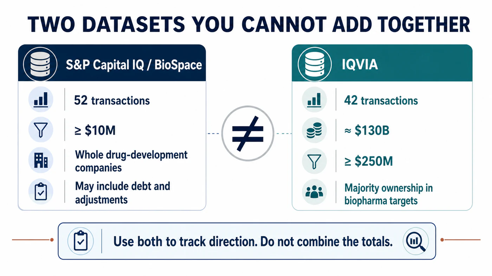
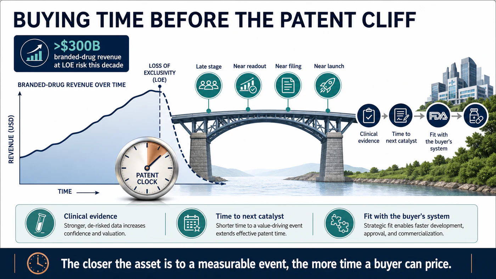
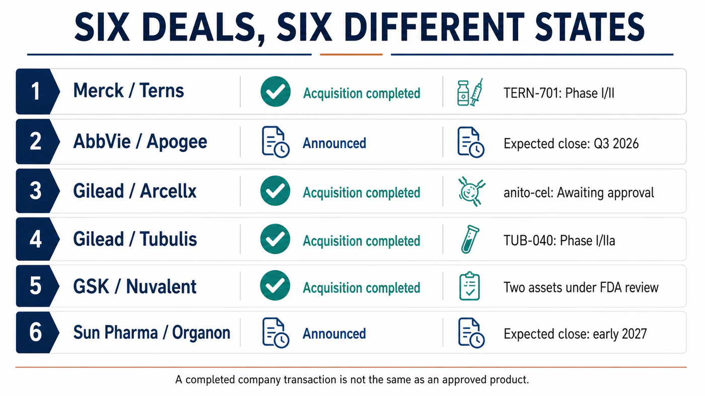
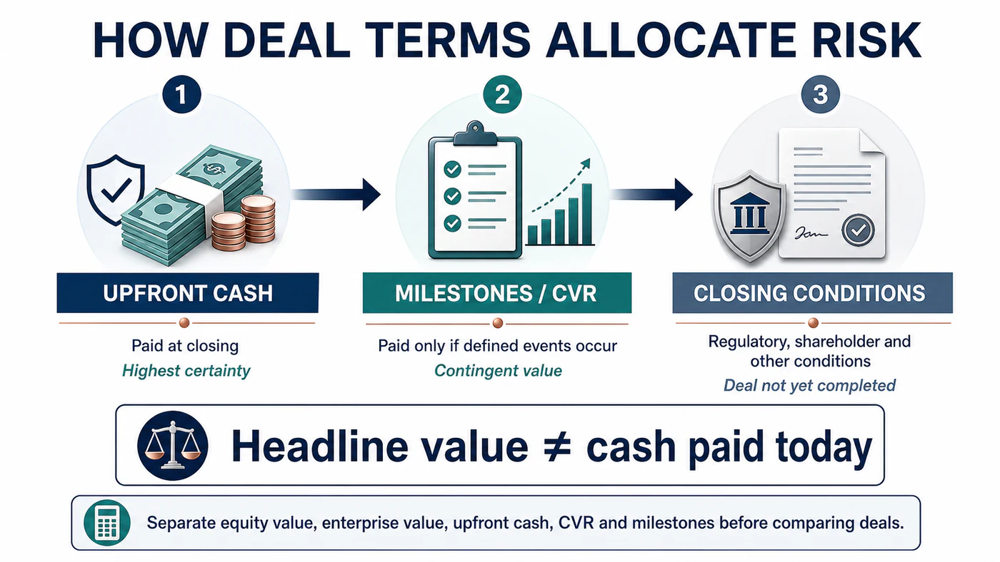

# $130 Billion in Six Months: Big Pharma Is Buying Time

Biopharma M&A is back.

But before placing “more than 50 deals” and “nearly $130 billion” in the same sentence and presenting them as one neat market statistic, there is an important methodological problem: those figures come from different databases with different inclusion rules.

BioSpace, using S&P Capital IQ, counted 52 transactions. Its screen includes acquisitions of whole drug-development companies valued at no less than $10 million, and reported deal value can include debt and other adjustments. IQVIA applied a different threshold: a buyer had to obtain majority ownership of a biopharma target, and the transaction had to be worth at least $250 million. That screen produced 42 transactions with an aggregate value of approximately $130 billion.

Both figures are useful. They are not one dataset, and they cannot be added together.

IQVIA's original wording also matters. The approximately $130 billion announced in the first half of 2026 nearly matched the $133 billion recorded for all of 2025. It did not already exceed the previous full year.

That small methodological distinction points to the larger issue. The M&A market has clearly accelerated, but the most important question is not how large a headline number can become. It is what pharmaceutical companies are buying.

Drugnews' central judgment is this:

Biopharma M&A in 2026 is not simply moving from cold to hot. The patent cliff has changed the set of choices facing large drugmakers. Buyers are no longer prioritizing size for its own sake. They are paying more for late-stage, near-readout, near-filing and near-launch assets because those assets provide something that can be valued with greater confidence: time.

## The Difference Between 52 and 42 Is Not Merely Ten Deals

BioSpace's 52-transaction count is a list of whole-company acquisitions. It shows that activity increased sharply from approximately 30 transactions in the comparable 2025 period. Eli Lilly led the group with nine acquisitions and more than $25 billion in committed value. An earlier circulating account listed 11, but that does not match this dataset.

IQVIA's 42-transaction count applies the higher $250 million threshold. The average deal size in this group was approximately $3.1 billion, up from $2.7 billion in 2025. Nine transactions reached at least $5 billion, yet not one target was valued above $30 billion.

In other words, the market was not carried by one Celgene-scale megamerger. It was built from a cluster of transactions broadly worth $5 billion to $11 billion, involving assets whose science and development timelines were relatively concrete.

PwC reached a similar conclusion from another angle. Biopharma deal value exceeded $65 billion in the first quarter of 2026, with 16 announced transactions worth at least $1 billion. Its midyear outlook described the market as being driven less by scale and more by precision science. Buyers have favored midsize acquisitions that can be integrated into existing franchises, while using contingent value rights, milestones and other conditional payments more frequently.

So the better question is not merely whether the M&A market has returned. It is why large pharmaceutical companies are suddenly prepared to pay premiums for these particular assets.

## Drugmakers Are Buying a Patent Clock, Not a Story

The answer begins with one number. PwC estimates that more than $300 billion in branded-drug revenue is exposed to loss-of-exclusivity risk during this decade.

That does not mean $300 billion disappears on one date, nor does it mean every dollar will be lost. It means large pharmaceutical companies must establish sufficiently large new revenue curves before older products decelerate.

Early platforms can be valuable, but the path from animal studies through Phase I, Phase II and a pivotal trial is difficult to price. Time, failure probability and additional capital requirements remain highly uncertain. When a major patent has only a few years left, buyers care intensely about three things: how far the clinical evidence has advanced, how long it will take to reach the next readout, and whether the asset can immediately connect to the buyer's development and commercial system.

That is what “buying time” means.

Merck announced in March that it would acquire Terns Pharmaceuticals for approximately $6.7 billion in equity value and completed the transaction on May 5. The lead asset, TERN-701, is an oral allosteric BCR::ABL1 inhibitor for chronic myeloid leukemia. It remains in the Phase I/II CARDINAL trial and is not an approved medicine. The company acquisition is complete, but Merck has not purchased guaranteed revenue.

AbbVie announced in June that it would acquire Apogee Therapeutics for approximately $10.9 billion in equity value, gaining an immunology pipeline led by atopic dermatitis and asthma programs. The lead asset, zumilokibart (APG777), is a half-life-extended IL-13 monoclonal antibody. The transaction is expected to close in the third quarter, subject to shareholder and regulatory conditions. An announced acquisition is not a completed acquisition.

The common logic is clear. These transactions are not designed to combine the back offices of two giant pharmaceutical companies. They are designed to place clinically legible assets inside established therapeutic-area and commercial engines.

## Lilly Went Shopping, but the Count Is Nine, Not Eleven

Eli Lilly was the most active buyer in the first half of 2026.

Using the whole-company acquisition definition applied by IQVIA and BioSpace, the count is nine, not 11. IQVIA estimated that Lilly invested approximately $26 billion, while BioSpace described more than $25 billion in committed value. The two figures are close, but invested capital, committed value and eventual cash paid are not identical concepts.

Lilly's defining feature is that it is not simply defending obesity and diabetes. It is using the cash-generating power of GLP-1 products to expand into immunology, neuroscience, in vivo cell therapy, vaccines and other areas. IQVIA highlighted Lilly's acquisition of three vaccine companies in May as one representative move; the three transactions totaled $3.8 billion.

That does not mean Lilly has already turned every new field into a second growth pillar. Frequent acquisition is an allocation decision. The real test comes afterward: trial design, program priority, integration speed and the discipline to terminate weak programs. A company can afford to buy ten assets without having a scientific or commercial reason to move all ten into Phase III.

Earlier accounts also included several companies and transaction values that could not be reconciled with Lilly's primary announcements. Those names are not repeated here. M&A reviews become misleading when acquisitions, licenses, investments and collaborations are presented as one trophy list. The count becomes more impressive while the analysis becomes less reliable.

## Gilead and GSK Are Betting on Oncology Assets Near Commercialization

Gilead's acquisition of Arcellx shows the value of time especially clearly.

Gilead completed the acquisition on April 28, 2026. The combination of cash and a contingent value right worth $5 per share implied an equity value of approximately $7.8 billion at closing. The target asset was anito-cel, a BCMA-directed CAR-T therapy still under development. Completing the transaction gave Gilead full control and eliminated profit-sharing, milestone and royalty obligations that had existed under the prior partnership.

It is accurate to say the acquisition was completed because the company announcement explicitly reported successful completion. Anito-cel, however, still awaits regulatory approval. Completing the purchase of a company and proving the success of its product are different events.

Gilead also completed its acquisition of Tubulis on May 21. The terms included $3.15 billion in upfront cash and as much as $1.85 billion in milestones. Describing the transaction only as a “$5 billion acquisition” combines guaranteed payment with amounts that will be paid only if future conditions are met. The company transaction is complete, but lead asset TUB-040 remains in a Phase I/IIa trial. Product risk and milestone risk did not disappear at closing.

GSK announced in June that it would acquire Nuvalent for total equity value of $10.6 billion and completed the transaction on July 15. It gained two late-stage targeted lung cancer agents, zidesamtinib and neladalkib, as well as the Phase I HER2 inhibitor NVL-330. The first two assets remain under FDA review, with target action dates of September 18 and November 27, 2026.

Nuvalent can therefore be described as a completed company acquisition involving assets close to market. It cannot be described as a portfolio of launched products that will certainly contribute profit in 2027. GSK's own expectations for product launch remain conditional on FDA approval.

Together, the three transactions form a useful risk spectrum:

- Arcellx: the company acquisition is complete, but the product still awaits regulatory approval.
- Tubulis: the company acquisition is complete, but TUB-040 remains in early clinical development and part of the consideration is milestone-based.
- Nuvalent: the company acquisition is complete, but two late-stage products still await FDA decisions.

Translating “the company was acquired” into “the product is about to generate revenue” removes the most important investment risk from the story.

## Even the Largest Deal Cannot Be Read from the Headline Alone

One of the largest transactions of the first half involved India's Sun Pharma and Organon.

The companies announced an enterprise value of $11.75 billion and cash consideration of $14 per share. The transaction is expected to close around early 2027 after regulatory and shareholder conditions are satisfied. BioSpace, using S&P Capital IQ and a methodology that incorporates debt and other factors, listed the value as $12.6 billion. The difference comes from methodology. The $12.6 billion figure should not be presented as the cash purchase price announced by the companies.

This transaction also differs from the pipeline-centered deals above. Organon brings existing women's-health, established-medicine and biosimilar products, together with a global commercial network. Sun Pharma is acquiring a portfolio, geographic reach and a cash-flow platform rather than placing a single bet on one clinical event.

That distinction matters. Precision and late-stage assets may dominate the 2026 narrative, but there is no single acquisition template. A mature portfolio can still be strategically rational when the buyer can clearly identify the gap it will fill.

## Why a Hot M&A Market Does Not End the Biotech Winter

For sellers, more acquisitions are clearly constructive. M&A provides an exit path outside the IPO market and gives data-rich, cash-constrained companies another strategic option.

But large pharmaceutical companies shopping more aggressively does not return the cost of capital for every biotech to its previous low. It also does not mean a platform story alone will attract a buyer.

PwC is seeing more surgical transactions. An asset must fill a patent gap, open a high-growth market or provide a near-term clinical or commercial event. Buyers are also using CVRs and milestones to move part of the failure risk back to sellers. That market is more selective than a broad bull cycle, not less.

The forces that could cool activity are equally specific. US drug-pricing policy, most-favored-nation proposals, expansion of Inflation Reduction Act negotiations, tariffs, cross-border review and US-China policy uncertainty can all alter valuation and payment structure. If a small group of large pharmaceutical companies drives prices too high, boards may also prefer to wait for additional data rather than chase assets at the top of the market.

That is why the first-half total cannot simply be extrapolated into the second half. A more reliable monitoring framework asks:

1. Does the number of transactions worth at least $1 billion remain elevated, rather than being carried by one exceptionally large deal?
2. Is upfront cash becoming a smaller share of total potential value as more consideration moves into milestones?
3. Do buyers continue to prefer Phase III, pre-filing or FDA-review assets?
4. Do announced transactions close on schedule, rather than remaining press-release events?
5. One year after acquisition, are the assets accelerated, delayed or terminated?

## What Should Readers in Taiwan Watch?

There is not enough primary-source evidence to identify a Taiwan-listed company as a direct product, manufacturing, testing or commercialization beneficiary of the transactions reviewed here. This article will not manufacture a list of “M&A concept stocks.”

The more relevant lesson for Taiwan biotech companies is that buyer preference has become more concrete. Clinical data must establish differentiation. The pivotal-trial pathway must be legible. Global rights must be organized cleanly. CMC and supply must be capable of connecting to a large pharmaceutical system. A platform can support imagination, but the transaction file must survive due diligence line by line.

Investors should perform two simple checks. When a release cites “maximum transaction value,” separate cash, equity value, enterprise value, contingent value rights and milestones. When a release says a deal is “complete,” return to the company announcement and verify whether the transaction was announced, signed or actually closed. Those two steps eliminate many apparently spectacular but analytically weak numbers.

## Conclusion: $130 Billion Is Really a Purchase of Time

There is no question that biopharma M&A recovered in the first half of 2026. BioSpace's 52 transactions and IQVIA's 42 transactions both point to materially higher activity. PwC's more than $65 billion in first-quarter deal value and 16 billion-dollar transactions provide additional support.

The problem begins when different methodologies are assembled into one perfect headline and the aggregate value is used to declare that the capital winter is over.

What buyers are competing for is clinical time that can arrive before the patent cliff. The closer an asset is to readout, filing or launch, the more likely its price is to rise. Risk has not disappeared. It has been redistributed among upfront cash, CVRs, milestones and closing conditions.

Big Pharma has not suddenly become romantic. It is looking at a patent clock and using cash to buy time.

## References

Verification cutoff: July 19, 2026.

1. [BioSpace | H1 2026 M&A count and methodology](https://www.biospace.com/business/biopharma-strikes-50-m-as-deals-in-h1-led-by-lillys-25b-spend)
2. [IQVIA | Biopharma M&A: Mid-year 2026 update](https://www.iqvia.com/locations/emea/blogs/2026/07/biopharma-ma-mid-year-2026-update)
3. [PwC | US Deals 2026 midyear outlook](https://www.pwc.com/us/en/industries/health-industries/library/pharma-life-sciences-deals-outlook.html)
4. [Merck and Terns | Transaction agreement](https://www.merck.com/news/merck-to-acquire-terns-pharmaceuticals-inc-expanding-its-hematology-pipeline-with-tern-701-a-novel-candidate-for-chronic-myeloid-leukemia-cml/)
5. [Merck | Completion of Terns acquisition](https://www.merck.com/news/merck-completes-acquisition-of-terns-pharmaceuticals-inc/)
6. [AbbVie and Apogee | Transaction announcement](https://investors.abbvie.com/news-releases/news-release-details/abbvie-acquire-apogee-therapeutics-deepening-immunology)
7. [Gilead | Completion of Arcellx acquisition](https://www.gilead.com/news/news-details/2026/gilead-sciences-completes-acquisition-of-arcellx-ahead-of-potential-commercial-launch-of-anito-cel)
8. [Gilead | Completion of Tubulis acquisition](https://investors.gilead.com/news/news-details/2026/Gilead-Sciences-Completes-Acquisition-of-Tubulis-Further-Strengthening-Oncology-Portfolio/default.aspx)
9. [GSK and Nuvalent | Transaction agreement](https://www.gsk.com/en-gb/media/press-releases/gsk-enters-agreement-to-acquire-nuvalent-inc/)
10. [GSK | Completion of Nuvalent acquisition](https://www.gsk.com/en-gb/media/press-releases/gsk-completes-acquisition-of-nuvalent-inc/)
11. [Organon and Sun Pharma | Definitive agreement](https://www.organon.com/news/sun-pharma-signs-definitive-agreement-to-acquire-organon/)

## Disclaimer

This article provides biotechnology, pharmaceutical and industry-trend analysis. It does not constitute medical diagnosis, treatment advice or investment advice. Transaction values can differ depending on whether a source reports equity value, enterprise value, debt, cash, contingent value rights or milestones. Investment decisions should be based on company announcements and regulatory documents.
