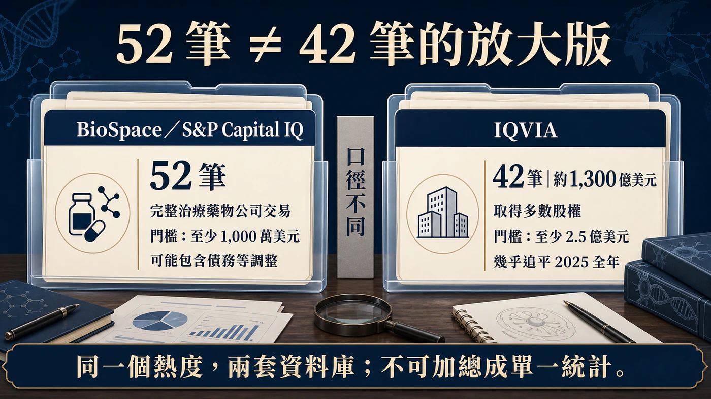
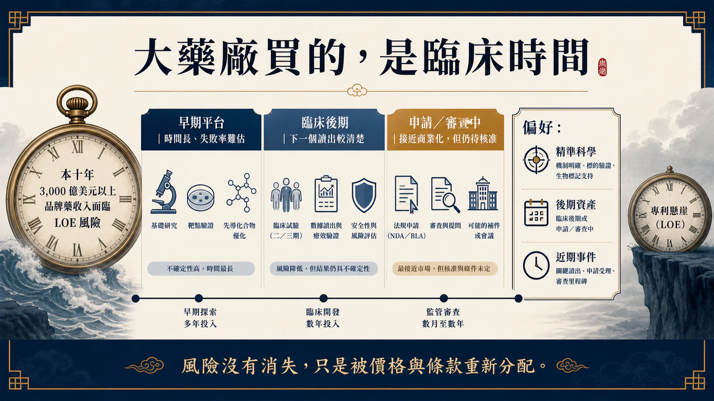
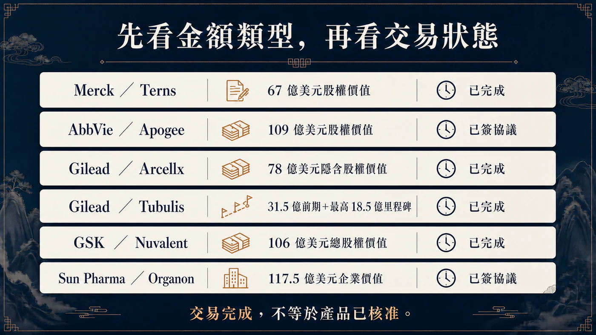
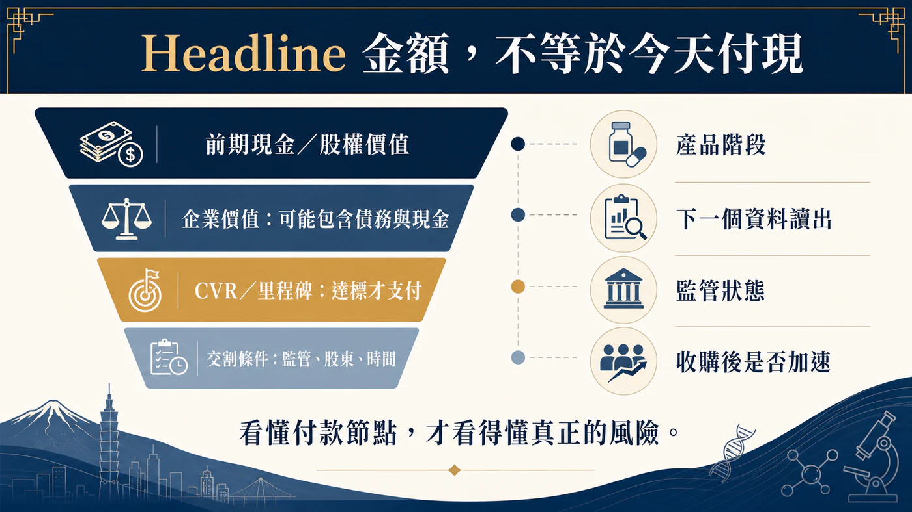

# 半年千億，買的是時間

2026 年上半年，生技併購真的回來了。

但先別急著把「超過 50 筆、接近 1,300 億美元」排在同一句，做成一個看起來很完整的大數字。這兩個數字來自不同資料庫，篩選門檻也不同。

BioSpace 依 S&P Capital IQ 統計到 52 筆交易，納入的是至少 1,000 萬美元、收購完整治療藥物公司的交易，交易價值還可能包含債務與其他調整；IQVIA 的口徑則是取得生技製藥標的多數股權、交易值至少 2.5 億美元，因此得到 42 筆、合計約 1,300 億美元。

兩個數字都可以用，不能把它們拼成同一份統計。

而且 IQVIA 的原文是：2026 上半年約 1,300 億美元，幾乎追平 2025 全年的 1,330 億美元，不是「已經超過去年全年」。

這個小小的口徑差，正好提醒我們：併購熱度固然回來了，真正值得追的卻不是一個越喊越大的總額，而是藥廠正在買什麼。

藥時事的主判斷是：

2026 年的生醫併購不是單純從冷轉熱，而是專利懸崖把大藥廠的選擇題改了。買家不再優先追求「公司越大越好」，而是用更高價格搶臨床後期、接近讀出或接近上市的資產，買下一段可以被計算的時間。

## 52 筆和 42 筆，差的不是 10 筆而已

BioSpace 的 52 筆，是一張「完整公司收購」清單。它告訴我們，2025 年同期約 30 筆，2026 年確實明顯變多；其中禮來以 9 筆居首，承諾金額超過 250 億美元。原始文章寫成 11 筆，並不符合這份統計。

IQVIA 的 42 筆則設了更高的 2.5 億美元門檻。這 42 筆平均交易規模約 31 億美元，高於 2025 年的 27 億美元；上半年共有 9 筆交易達 50 億美元以上，卻沒有一筆標的價值高於 300 億美元的「超大型合併」。

換句話說，市場不是靠一樁 Celgene 等級的巨獸交易撐起來，而是出現一群 50 億到 110 億美元左右、科學與時程都相對具體的標的。

PwC 從另一個角度看到同一件事。2026 年第一季生技製藥交易額已超過 650 億美元，宣布的 10 億美元級交易有 16 筆；其年中報告直接把這一波描述為「更少由規模、更多由精準科學驅動」。買家偏好中型、可嵌入現有產品線的收購，也更常把 CVR、里程碑或其他條件式付款塞進交易結構。

所以別只問「併購潮回來了嗎？」更精準的問題是：為什麼大藥廠突然願意為這些資產加價？

## 藥廠買的不是故事，是專利時鐘

答案先從一個數字開始：PwC 估計，本十年有超過 3,000 億美元的品牌藥收入暴露在市場獨占權到期風險之下。

這不是 3,000 億美元會在某一天同時消失，也不是每一塊錢都一定流失；它代表的是，大型藥廠必須在舊產品失速前，找到足夠大的新曲線補上。

早期平台當然可能很值錢，可是從動物實驗、一期、二期一路走到關鍵試驗，時間、失敗率與追加資本都很難算。當專利倒數只剩幾年，買家會更在意三件事：臨床證據走到哪裡、下一個讀出還要多久、拿進來之後能否立刻接上自己的開發與商業系統。

這就是「買時間」的意思。

默沙東 3 月宣布以約 67 億美元股權價值收購 Terns Pharmaceuticals，並在 5 月 5 日完成交易。核心資產 TERN-701 是治療慢性骨髓性白血病的口服變構 BCR::ABL1 抑制劑；它仍在一期／二期 CARDINAL 試驗，不是上市藥。因此，公司收購雖已完成，卻不能寫成已經買到一段確定收入。

艾伯維 6 月宣布以約 109 億美元股權價值收購 Apogee Therapeutics，取得以異位性皮膚炎與氣喘為主的多項免疫管線。帶頭的 zumilokibart（APG777）是一款延長半衰期的 IL-13 單株抗體。這筆交易預計第三季才完成，仍要經股東與監管條件；「宣布收購」不是「已完成收購」。

兩筆交易的共同點很清楚：不是為了合併兩間巨型藥廠的後台，而是為了把一個有臨床輪廓的資產，塞進既有治療領域與商業機器。

## 禮來掃貨，但不是原文寫的 11 筆

2026 上半年最積極的買家仍是禮來。

依 IQVIA 與 BioSpace 的完整公司收購口徑，禮來是 9 筆，不是 11 筆；IQVIA 計算投入約 260 億美元，BioSpace 的表述則是承諾超過 250 億美元。兩者接近，但「投入」「承諾」與最終實付仍不是完全相同的概念。

禮來的特色不是只守著肥胖與糖尿病，而是用 GLP-1 帶來的現金能力向外擴張：免疫、神經、體內細胞治療、疫苗等不同領域都出手。IQVIA 也把 5 月一次收購三家疫苗公司視為代表性案例，三筆合計 38 億美元。

這不代表禮來已經把每一個新領域都做成第二支柱。頻繁買進只是資產配置，真正的驗收要看收購後的試驗設計、優先順序、整合速度與淘汰紀律。藥廠有錢買十個項目，不等於十個都應該進三期。

原始文章還列入幾筆無法由禮來一級公告直接核對的公司與金額；這些名稱本文不保留。併購盤點最怕把收購、授權、投資與合作混在同一張「戰利品清單」，數量會很好看，判斷卻會失真。

## 吉利德與 GSK，押的是接近商業化的腫瘤資產

吉利德的 Arcellx 交易最能看出時間的價值。

吉利德在 2026 年 4 月 28 日完成收購 Arcellx，現金加一項每股 5 美元的或有價值權，完成時隱含股權價值約 78 億美元。標的是仍在開發中的 BCMA CAR-T anito-cel；交易完成讓吉利德取得完整控制權，也消除原合作中的分潤、里程碑與權利金義務。

注意這裡可以用「已完成」，因為公司公告明確寫了 successful completion；但 anito-cel 仍待監管核准。完成公司交易和產品成功，不是同一件事。

吉利德也在 5 月 21 日完成 Tubulis 收購。條件是 31.5 億美元前期現金，加上最高 18.5 億美元里程碑；新聞只寫「50 億美元收購」會把確定支付與未來達標才支付的金額混在一起。交易已完成，主力資產 TUB-040 卻仍在 I／IIa 期試驗，產品與里程碑風險都沒有消失。

GSK 6 月宣布以 106 億美元總股權價值收購 Nuvalent，並在 7 月 15 日完成交易，取得兩項後期肺癌標靶藥 zidesamtinib 與 neladalkib，以及一期的 HER2 抑制劑 NVL-330。前兩項資產仍在 FDA 審查，目標決定日分別是 2026 年 9 月 18 日與 11 月 27 日。

因此，Nuvalent 能寫成「公司收購已完成、買進接近上市的資產」，不能寫成「產品已上市、2027 年一定貢獻獲利」。GSK 自己也把未來推出產品綁在 FDA 核准前提上。

這三個案例剛好排出一條風險光譜：

- Arcellx：公司收購已完成，但產品仍待監管核准；
- Tubulis：公司收購已完成，但 TUB-040 仍在早期臨床，部分價金也綁里程碑；
- Nuvalent：公司收購已完成，但兩項後期產品仍待 FDA 決定。

把「公司已收購」直接翻成「產品即將貢獻收入」，會把真正的投資風險擦掉。

## 最大一筆，也不能只看 headline 數字

2026 上半年最大型交易之一，是印度 Sun Pharma 與 Organon。

公司正式公告的交易企業價值是 117.5 億美元，每股現金 14 美元，並預計在監管與股東條件完成後，於 2027 年初左右交割。BioSpace 依 S&P Capital IQ、包含債務與其他因素的口徑記為 126 億美元；兩個數字差異來自統計方法，不應把 126 億美元說成公司公告的現金收購價。

這筆交易也和前面的管線型交易不同。Organon 有女性健康、成熟藥與生物相似藥的現成產品與全球商業網路；Sun Pharma 買的比較像是產品組合、地理通路與現金流平台，而不是單押一個臨床事件。

這提醒我們，2026 的主流雖然偏向精準、後期資產，市場仍不是只有一種模板。只要能回答「買進之後補哪個缺口」，成熟產品組合也可能是合理標的。

## 併購熱，為什麼不等於 Biotech 寒冬結束？

對賣方而言，併購變多當然是好消息。它提供 IPO 以外的退出路徑，也讓有資料、有現金壓力的公司多一個選項。

但大藥廠開始掃貨，不代表每一家 Biotech 的資金成本都回到低點，更不代表只要有平台故事就會被買。

PwC 觀察到的是更「外科手術式」的交易：資產要能填專利缺口、切進高成長領域，最好有近期臨床或商業事件；買家也會用 CVR、里程碑把部分失敗風險推回賣方。這其實比全面牛市更挑剔。

接下來可能讓熱度降溫的因素也很具體：美國藥價政策、最惠國藥價構想、IRA 議價擴張、關稅、跨境審查與美中政策不確定性，都可能改變估值與付款條件。另一方面，如果熱門資產價格被少數大藥廠搶高，董事會也可能選擇等待資料，而不是在高點追價。

所以「下半年會不會繼續熱」不能只看上半年總額外推。更可靠的追蹤方式是：

1. 十億美元級交易的數量是否延續，而非只看一筆巨額交易；
2. 前期現金占總交易價值的比例，有沒有被里程碑愈拉愈低；
3. 買家是否持續偏好三期、申請前或 FDA 審查中的資產；
4. 已宣布交易能否如期完成，而不是停在簽約新聞；
5. 收購後一年內，資產究竟被加速、延後，還是直接砍掉。

## 台灣讀者該看什麼？

這一波沒有足夠一級證據，能把某一家台灣上市櫃公司直接標成上述交易的產品、製造、檢測或商業化受益者，因此本文不硬湊「併購概念股」。

真正值得台灣 Biotech 留意的，是買方偏好已變得更具體：臨床資料要能回答差異化、關鍵試驗路徑要清楚、全球權利要整理乾淨、CMC 與供應要能接上大型藥廠。平台可以有想像力，交易文件卻必須能被盡職調查拆開。

對投資人而言，看到「最高交易價值」時，先拆成現金、股權價值、企業價值、CVR 與里程碑；看到「完成交易」時，再回公司公告確認究竟是 announced、signed 還是 completed。這兩個動作，會過濾掉不少看似驚人的數字。

## 結語：半年千億，買的是時間

2026 上半年生醫併購回暖，這件事沒有問題。BioSpace 的 52 筆與 IQVIA 的 42 筆，都指向交易明顯轉熱；PwC 的第一季 650 億美元與 16 筆十億美元級交易，也提供另一個旁證。

有問題的是，把不同口徑拼成一個完美的大標題，再用總額直接宣告資本寒冬結束。

這一輪買家真正搶的，是能在專利懸崖前趕上的臨床時間。越接近讀出、申請或上市，價格越容易被抬高；風險還沒消失，只是被重新分配到前期現金、CVR、里程碑與交割條件裡。

大藥廠不是突然變得浪漫。它們只是看著專利時鐘，開始用現金買時間。

## 參考資料

查證截止：2026-07-19。

1. [BioSpace｜H1 2026 M&A count and methodology](https://www.biospace.com/business/biopharma-strikes-50-m-as-deals-in-h1-led-by-lillys-25b-spend)
2. [IQVIA｜Biopharma M&A: Mid-year 2026 update](https://www.iqvia.com/locations/emea/blogs/2026/07/biopharma-ma-mid-year-2026-update)
3. [PwC｜US Deals 2026 midyear outlook](https://www.pwc.com/us/en/industries/health-industries/library/pharma-life-sciences-deals-outlook.html)
4. [Merck／Terns｜Transaction agreement](https://www.merck.com/news/merck-to-acquire-terns-pharmaceuticals-inc-expanding-its-hematology-pipeline-with-tern-701-a-novel-candidate-for-chronic-myeloid-leukemia-cml/)
5. [Merck｜Completion of Terns acquisition](https://www.merck.com/news/merck-completes-acquisition-of-terns-pharmaceuticals-inc/)
6. [AbbVie／Apogee｜Transaction announcement](https://investors.abbvie.com/news-releases/news-release-details/abbvie-acquire-apogee-therapeutics-deepening-immunology)
7. [Gilead｜Completion of Arcellx acquisition](https://www.gilead.com/news/news-details/2026/gilead-sciences-completes-acquisition-of-arcellx-ahead-of-potential-commercial-launch-of-anito-cel)
8. [Gilead｜Completion of Tubulis acquisition](https://investors.gilead.com/news/news-details/2026/Gilead-Sciences-Completes-Acquisition-of-Tubulis-Further-Strengthening-Oncology-Portfolio/default.aspx)
9. [GSK／Nuvalent｜Transaction agreement](https://www.gsk.com/en-gb/media/press-releases/gsk-enters-agreement-to-acquire-nuvalent-inc/)
10. [GSK｜Completion of Nuvalent acquisition](https://www.gsk.com/en-gb/media/press-releases/gsk-completes-acquisition-of-nuvalent-inc/)
11. [Sun Pharma／Organon｜Definitive agreement](https://www.organon.com/news/sun-pharma-signs-definitive-agreement-to-acquire-organon/)

## 免責聲明

本文為生技醫藥與產業趨勢整理，不構成醫療診斷、治療建議或投資建議。交易金額可能因股權價值、企業價值、債務、現金、CVR 與里程碑口徑而不同，投資判斷應回到公司公告與監管文件。
