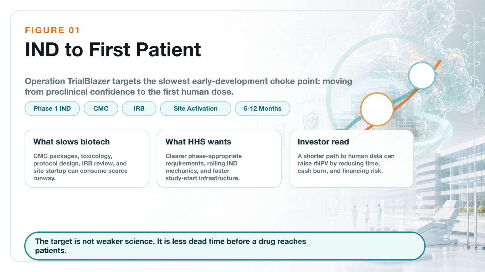
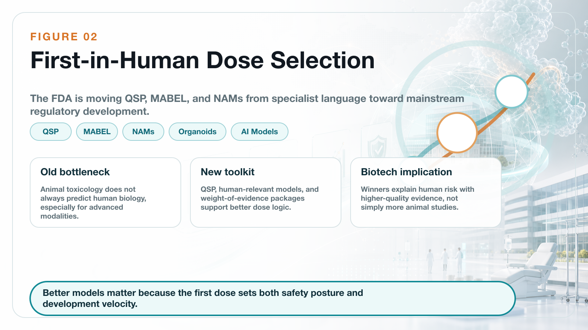
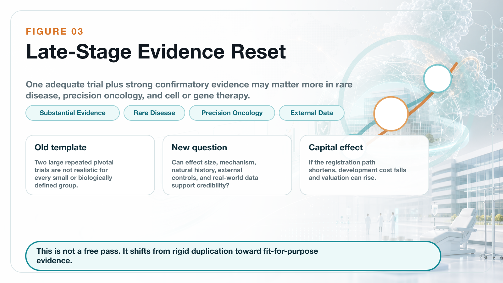
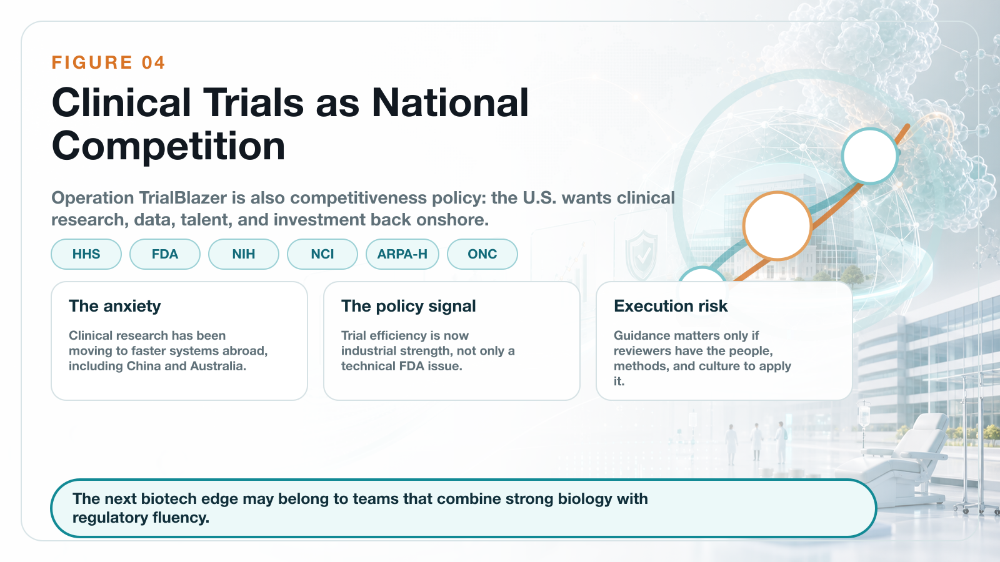

# Operation TrialBlazer: Why HHS Is Rewriting Clinical-Trial Rules and Biotech Competition

On June 22, 2026, the U.S. Department of Health and Human Services, or HHS, launched a department-wide clinical-trial reform program called Operation TrialBlazer.

This is not a small technical adjustment inside the FDA. The initiative pulls together several core agencies and offices across HHS, including the FDA, NIH, NCI, ARPA-H, and ONC, and tries to reset the U.S. clinical-trial system from the earliest stages of development to pivotal evidence generation.

The scope is broad: IND submission, first-in-human readiness, dose selection, pivotal trial design, electronic health record-enabled recruitment, rare-disease development, participant compensation, and the basic operating speed of clinical research.

The official policy language is direct. HHS wants to restore American leadership in clinical research, accelerate the development of life-saving therapies, and help patients reach innovative medicines faster.

HHS Secretary Robert F. Kennedy Jr. framed the same idea in even simpler terms: America once led global medical innovation, and it needs to lead again.

The message behind that line is not hard to read.

The United States believes it has become too slow.

That matters because global clinical-trial competition is no longer a background issue. China has become much faster at clinical development. Trial infrastructure has become a national industrial asset. Biotech capital is again looking for high-upside assets that can reach human proof of concept quickly. In that environment, the FDA and HHS cannot use the old development rhythm and expect the U.S. to remain the default center of gravity for global drug development.

The most important part of Operation TrialBlazer is not any single technical guidance. It is the strategic signal.

The United States is moving clinical-trial efficiency into the category of national competitiveness.

## 01 | Early Clinical Development: The Target Is the Time from IND to First Patient

For a biotech company, the most expensive and fragile period is often not after Phase 3 has started. It is the transition from preclinical work to the first human trial.

The sponsor must prepare the IND package. It must handle CMC, toxicology, the clinical protocol, IRB review, trial-site activation, and FDA communication. Each step can add delay. Each delay consumes cash.

For a large pharmaceutical company, an additional six months may be a line item in a financial model. For a small or mid-sized biotech company, six months can determine whether the next financing round is possible.

This is exactly where Operation TrialBlazer is aimed.

The FDA-related reform agenda includes faster early IND pathways, rolling IND-style mechanics, more efficient study-start infrastructure with leading medical centers and compliant CROs, and potential streamlining of IRB processes. The HHS roadmap also points to a more phase-appropriate view of what data are truly needed before a first-in-human trial begins.

The practical ambition is to remove unnecessary delay between IND preparation and the enrollment of the first patient. HHS materials suggest that clearer Phase 1 expectations could save sponsors roughly six to twelve months compared with current IND development timelines.

For biotech companies, that is not a cosmetic change.

Six to twelve months can mean lower cash burn, less financing pressure, earlier human data, and a better chance to negotiate licensing, partnership, or IPO timing from a position of strength.

For investors, the effect is also direct. A biotech asset's value is usually modeled through rNPV, or risk-adjusted net present value. If the development timeline shortens and the regulatory path becomes more predictable, the same pipeline can be worth more today.

In other words, Operation TrialBlazer is not only a regulatory story. It is also a valuation story.

## 02 | First-in-Human Trials: QSP, MABEL, and NAMs Are Entering the Mainstream Language

Another key part of the reform is first-in-human dose selection.

Traditionally, the first human dose has relied heavily on animal toxicology and animal-to-human extrapolation. That framework will not disappear. But animal data do not always predict human biology well, especially for cell and gene therapies, immune therapies, novel small molecules, and new biologic modalities.

The consequence can be a conservative starting dose, slower escalation, and lower development efficiency. In some cases, the animal package may be large without being especially informative for the specific human risk.

The FDA has now put more emphasis on QSP-based dose selection. QSP means quantitative systems pharmacology. The idea is to use mechanistic and quantitative models to understand how a therapy may behave in humans. This can support estimation of MABEL, the minimum anticipated biological effect level, for first-in-human Phase 1 trials.

That shift matters because it moves modeling, systems pharmacology, cellular models, and human-relevant prediction methods closer to the center of the regulatory toolbox.

At the same time, the FDA is continuing to advance NAMs, or new approach methodologies. These include organoids, organ-on-chip systems, cell models, real-world data, and AI-enabled models that can supplement, reduce, or in certain settings partially replace animal testing.

The point is not to eliminate safety evaluation. The point is to make early evidence more human-relevant, more efficient, and more ethically aligned.

For advanced-therapy companies, this is a meaningful transition.

The future standard may not be "more animal studies are always better." The more important question will be whether a company can use high-quality evidence to explain human risk and justify a faster, more rational path into the clinic.

That favors companies with strong translational science, good modeling discipline, and high-quality regulatory communication. It does not favor companies that simply collect more studies without making the human-risk story clearer.

## 03 | Late-Stage Development: One Pivotal Trial Plus Strong Confirmatory Evidence Could Become More Important

The late-stage clinical change may have even larger industry consequences.

The FDA's updated thinking around substantial evidence makes clear that, in certain circumstances, one adequate and well-controlled clinical trial plus strong confirmatory evidence may support a finding of effectiveness.

This does not mean that one trial can casually support approval. It does not mean the scientific bar has disappeared.

The real meaning is more subtle: the FDA is less willing to apply a rigid "two large repeated pivotal trials" template to every product, every disease, and every biological context.

Instead, the agency is looking at the disease setting, the magnitude of treatment effect, mechanism-of-action evidence, external data, real-world data, natural-history data, unmet medical need, and whether repeating a large trial is scientifically or ethically sensible.

This is especially important for three types of companies.

First, rare-disease companies.

When patient populations are very small, two large conventional trials may be unrealistic. A rigid template can make development practically impossible, even when the biology and early data are persuasive.

Second, precision-oncology companies.

Some molecularly defined patient groups are extremely small. If the response is strong and the mechanism is clear, repeatedly running large trials may not be efficient, ethical, or even feasible.

Third, cell and gene therapy companies.

These therapies often involve one-time treatment, small populations, difficult manufacturing, and long-term follow-up. The development model cannot always be copied from traditional chronic-disease drugs.

For biotech companies, the impact could be significant. If a single pivotal study can be supported by mechanism, natural-history controls, external cohorts, real-world evidence, and other confirmatory data, then development cost and time may fall.

That is one reason regulatory reform can affect biotech indices such as XBI. The market is not only buying sentiment. It is also trying to price the possibility that some pipelines could reach registration faster than investors previously assumed.

## 04 | CNPV: Extreme Review Speed Is Attractive, but Transparency Remains the Key Risk

Operation TrialBlazer also arrives shortly after another important FDA policy signal: the Commissioner's National Priority Voucher, or CNPV.

The CNPV pilot is designed for drugs and biologics aligned with U.S. national health priorities. The stated ambition is striking: compress review time from the traditional ten to twelve months to roughly one to two months for selected products.

That kind of speed is extraordinary.

If the program works well, it can become a major valuation catalyst for qualifying innovative drugs. A product that can move through review in one to two months has a very different capital-market profile from a product facing a standard review clock.

But CNPV also raises serious questions.

Which products qualify?

How transparent will the selection criteria be?

Will review teams face political or administrative pressure?

Can scientific review independence be protected while the timeline is compressed?

These questions matter because speed alone is not enough. The value of the FDA system comes from both scientific rigor and predictability. If a fast-review pathway is viewed as opaque or politically influenced, it could reduce confidence instead of increasing it.

That is why CNPV should not be evaluated only through the lens of speed. The real issue is whether the program can build a transparent, fair, predictable, science-based process that industry and investors can trust.

For biotech investors, the right question is not simply "who gets the voucher?" It is whether the review model becomes durable enough to change how risk is priced.

## 05 | The Deeper Background Is U.S. Anxiety About Clinical-Trial Offshoring

The most sensitive part of Operation TrialBlazer is the competitive anxiety behind it.

HHS is explicit that the United States has historically led medical innovation but now faces stronger competition for early clinical research, investment, and talent. The roadmap points to clinical research moving outside the United States and warns that this weakens the domestic clinical-research economy.

This should not be read only as political language.

Clinical-trial efficiency has become a core metric of global biomedical competition.

The country or system that can start sites faster, recruit patients faster, generate data faster, and communicate with regulators more efficiently will also move faster toward approval, licensing, and commercialization.

Over the past decade, China has become significantly faster in clinical-trial execution, patient recruitment, hospital-system mobilization, and oncology and autoimmune trial delivery. In some areas, its speed has become a competitive threat to the United States.

That is why Operation TrialBlazer should be understood as more than a patient-access initiative.

It is also about investment, jobs, supply chains, national security, and control over the future language of drug development.

The United States wants clinical-trial speed, early human data, and biomedical capital formation to move back toward the domestic ecosystem.

## 06 | Reform Will Not Succeed Automatically: FDA Culture and Capacity Are the Last Mile

Still, reform does not become real simply because it appears in a roadmap.

The real test is execution.

Does the FDA have enough reviewers?

Do review teams have the methodological training to evaluate QSP, NAMs, external controls, platform trials, basket trials, and real-world evidence?

Can FDA centers apply the new logic consistently across actual cases?

Can the agency maintain scientific rigor while also moving faster?

These questions decide whether Operation TrialBlazer becomes a true operating system or just another policy document.

If frontline reviewers are not comfortable with the new methods, sponsors may still face conservative interpretation in practice. If senior FDA leadership changes frequently, companies may fear that development rules will shift midstream. If standards are inconsistent across divisions, biotech companies will still treat the pathway as risky.

So the largest challenge is not announcing reform. It is turning the reform into everyday review language.

For the industry, the practical question is not only what HHS announced on June 22. It is how the FDA behaves in specific cases over the next several years.

## Conclusion | This Is Not Regulatory Laxity. It Is a Rebalancing of Speed and Evidence

Operation TrialBlazer should not be simplified as the FDA lowering its standards.

A better reading is that the United States is trying to rebalance speed and evidence.

For decades, regulatory rigor protected patients and helped build the FDA's global credibility. That credibility remains valuable. But as trials become more expensive, patient recruitment becomes harder, and innovative therapies become more personalized, the old development template creates friction.

For global biotech companies, this creates both opportunity and higher demands.

Not every company will benefit.

The real beneficiaries will be companies with clear mechanisms, solid data, mature clinical design, strong translational science, and the ability to communicate with the FDA at a high level.

The rules of the clinical-trial battlefield are changing.

The companies that adapt fastest will get the next ticket into the innovation-drug competition.

## References

[1] HHS, *Operation TrialBlazer: HHS Roadmap to Maintaining U.S. Leadership in Early Clinical Research and Development*: https://www.hhs.gov/sites/default/files/operation-trialblazer.pdf

[2] FDA, *FDA Actions to Accelerate and Modernize Early and Late-Stage Clinical Development*: https://www.fda.gov/drugs/development-resources/fda-actions-accelerate-and-modernize-early-and-late-stage-clinical-development

[3] Source post on Dcard by Drugnews: https://www.dcard.tw/@drugnews/post/261770223

---

This article is for industry research and educational purposes only. It does not constitute investment, medical, fundraising, or stock-specific advice.
