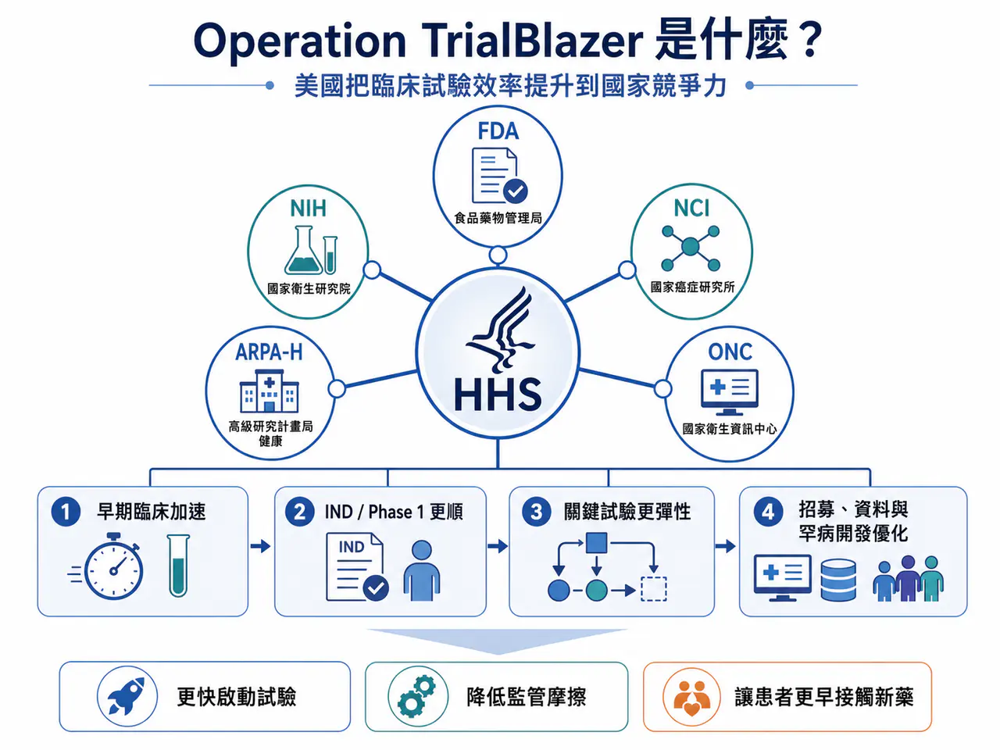
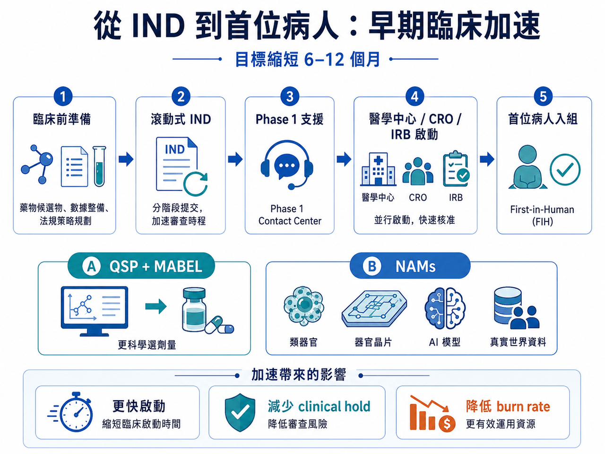
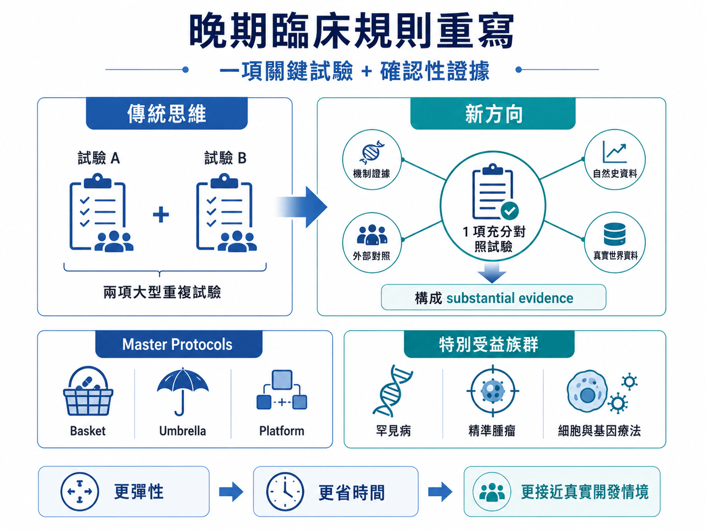
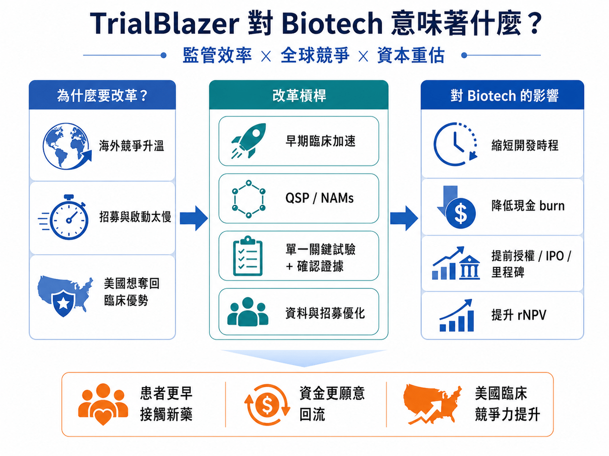

# 美國 HHS 啟動 Operation TrialBlazer：臨床試驗規則要變了，新藥競爭也要變了

2026 年 6 月 22 日，美國衛生與公共服務部，也就是 HHS，啟動了一項名為 Operation TrialBlazer 的部門級臨床試驗改革計畫。

這不是 FDA 單一部門的小修小補，而是把 FDA、NIH、NCI、ARPA-H、ONC 等核心機構一起拉進來，試圖從早期臨床、IND 申報、劑量選擇、關鍵性試驗設計、電子病歷招募、罕見病開發，到受試者報酬合規，重新調整美國臨床試驗體系。

HHS 官方聲明把目標講得很直白：恢復美國在臨床研究的領先地位，加快救命療法開發，讓患者更快接觸創新藥。

HHS 部長 Robert F. Kennedy Jr. 也在聲明中表示，美國曾經領跑全球醫療創新，現在要重新做到這一點。

📌 這句話背後的意思其實很清楚：美國覺得自己慢了。

尤其是在全球臨床試驗競爭愈來愈激烈、中國臨床開發效率快速提升、Biotech 資本又重新尋找高彈性資產的背景下，FDA 和 HHS 不能再用舊節奏面對新產業。

這次改革真正重要的，不只是幾條技術性指引，而是它釋放出一個訊號：

📌 美國正在把臨床試驗效率，提升到國家競爭力層級。
## 01｜早期臨床：最想縮短的，是 IND 到第一位病人入組的時間

對 Biotech 來說，最燒錢、也最容易卡死的階段，往往不是已經進入 Phase 3 之後，而是從臨床前走向首次人體試驗的這段路。

IND 資料準備、CMC、毒理、臨床方案、IRB、中心啟動、FDA 溝通，每一步都可能拖時間。

對大型藥廠來說，多等半年只是財務模型裡的一個變數。對中小 Biotech 來說，多等半年可能就是下一輪融資能不能接上的生死線。

📌 Operation TrialBlazer 的早期臨床改革，就是針對這個痛點。

FDA 公布的改革內容包括加速 IND 試點、滾動式 IND 申報、與頂尖醫學中心和合規 CRO 建立更高效率的早期試驗啟動機制，並探索如何簡化 IRB 審查流程。相關報導指出，這些措施目標是把早期 IND 到首次人體試驗啟動時間縮短約 6 到 12 個月。這對 Biotech 很實際。因為縮短 6 到 12 個月，不只是省時間，而是省現金 burn、降低融資壓力、提前拿到人體資料，甚至讓下一輪授權或 IPO 時點提前。

對投資人來說，這會直接影響 rNPV，也就是風險調整後淨現值。臨床開發時間越短、監管路徑越清楚，同一條管線今天的估值就越高。
## 02｜首次人體試驗：FDA 開始讓 QSP、MABEL、NAMs 進入主流語言

這次改革另一個關鍵，是首次人體試驗劑量選擇。

傳統上，第一個人體劑量常依賴動物毒理資料推估。但動物資料並不總是能準確預測人體反應，尤其是細胞與基因療法、免疫療法、創新小分子與新型生物製劑。

這不只會造成保守起始劑量，也可能導致開發效率偏低。FDA 這次發布了 QSP-based dose selection 指引草案，鼓勵使用 quantitative systems pharmacology，也就是定量系統藥理學，協助推估 MABEL，也就是最低預期生物效應劑量，用於首次人體 Phase 1 試驗。FDA 指引明確說明，這套方法可用於評估首次人體試驗起始劑量。這代表 FDA 正式把模型化、系統藥理、細胞模型與更接近人體生物學的預測方式，往主流監管工具箱裡放。

同時，FDA 也持續推進 NAMs，也就是新型替代方法，包括類器官、器官晶片、細胞模型、真實世界資料與 AI 模型，用來補充甚至部分替代動物試驗。這個方向不是要取消安全性評估，而是要讓早期資料更接近人體，更有效率，也更符合倫理。對新型療法公司來說，這會是一個重要轉折。未來不一定是「動物做得越多越好」，而是能否用更高品質、更能解釋人體風險的資料，支撐更快進入臨床。
## 03｜晚期臨床：一項關鍵試驗加強確認性證據，可能成為新常態

晚期註冊臨床的變化，更可能改變整個產業。

FDA 在 2026 年更新 substantial evidence，也就是療效充分證據相關指引，明確提出，在某些情境下，一項充分且良好對照的臨床試驗，加上強有力的確認性證據，可以支持藥物有效性的認定。FDA 指引草案文字明確提到，在某些情況下，單一充分對照試驗結合強確認性證據，可構成 substantial evidence。這不是完全推翻科學標準。也不是「一個試驗就能隨便上市」。真正的意思是：FDA 不再僵硬要求每個產品都必須做兩項重複的大型註冊試驗，而是看疾病情境、療效大小、機制證據、外部資料、真實世界資料、自然史資料與未滿足需求。

這對三類公司特別重要。

📌 第一，罕見病公司。患者少，兩項大型試驗往往不現實。

📌 第二，腫瘤精準治療公司。某些分子分型族群非常小，如果療效足夠強，重複做大型試驗可能既不倫理，也不有效率。

📌 第三，細胞與基因療法公司。這些療法常常一次性給藥，患者稀少，開發模式不能完全套用傳統慢性病藥物。

對 Biotech 來說，若單一關鍵性研究可以搭配機制資料、自然史對照、外部隊列或真實世界資料支持上市，產品開發成本和時間都會顯著下降。這也是最近 XBI 這類 Biotech 指數反彈的底層原因之一：資金看到的不只是情緒，而是部分管線的上市路徑可能真的提前。
## 04｜CNPV：極速審查很誘人，但透明度仍是爭議核心

這次改革也接在另一項重要政策之後：Commissioner’s National Priority Voucher，簡稱 CNPV。

FDA 官方說明指出，CNPV 是一項試點計畫，針對符合美國國家健康優先事項的藥品與生物製劑，目標是把審查時間從傳統 10 到 12 個月，大幅壓縮到 1 到 2 個月。

這種速度非常誇張。如果能運作順利，對符合資格的創新藥來說，就是巨大的估值催化。FDA 也已經有基因療法在 CNPV 下 61 天完成 BLA 核准，成為外界關注案例。但 CNPV 也不是沒有爭議。業界和政策觀察者擔心：

⚠️ 哪些產品可以拿到 voucher？

⚠️ 評選標準是否透明？

⚠️ 審評團隊是否會承受行政壓力？

⚠️ 科學審查獨立性是否足夠？

這些都還需要更多制度化說明。FDA 也在 2026 年 6 月舉行公開會議，徵求各界對 CNPV 資格條件、選案流程、審查程序與執行方式的意見。所以，CNPV 的意義很大，但不能只看速度。真正要看的，是速度能不能建立在透明、公平、可預期的科學審查之上。
## 05｜這場改革背後，是美國對臨床試驗外流的焦慮
Operation TrialBlazer 的背景裡，最敏感的一點，是美國對全球臨床研究競爭的焦慮。

HHS 官方文件明確提到，美國過去是醫療創新領導者，但如今太多臨床研究被推向海外，這削弱了美國本土臨床研究與投資吸引力。HHS 也將此計畫定位為恢復美國臨床研究領先地位的部門級行動。這裡不能只理解成政治口號。

📌 臨床試驗效率，已經成為全球生醫競爭的核心指標。

誰能更快啟動中心、招募患者、完成資料讀出、和監管機構溝通，誰就能更快取得藥證、授權與市場。過去十年，中國在臨床試驗效率、受試者招募、醫院體系動員、腫瘤與自免試驗執行上快速追趕，甚至在部分領域展現超高速度。這確實讓美國產業界感到壓力。Operation TrialBlazer 的本質，就是美國要把臨床試驗速度重新拉回國內。這不只關乎病人，也關乎投資、就業、供應鏈、國家安全與新藥話語權。
## 06｜改革不會自動成功：FDA 文化與人力才是最後一哩路
不過，任何改革都不是寫在文件裡就會發生。真正決定成敗的，是 FDA 審評團隊是否有足夠人力、方法學訓練、跨部門協作能力，以及一致的執行文化。如果前線審評員仍然不熟悉 QSP、NAMs、外部對照、平台試驗、籃子試驗、真實世界資料，再好的指引也可能卡在實務層面。如果 FDA 高層頻繁更換、中心主任不穩、審查標準不一致，企業仍然會害怕在開發中途遇到規則改變。

所以，Operation TrialBlazer 最大的挑戰不是提出改革，而是讓改革變成日常審評語言。

🔍 不是 HHS 宣布了什麼，而是接下來 FDA 在具體案子上怎麼做。
## 結語｜這不是監管放水，而是創新藥開發規則的再平衡
Operation TrialBlazer 不該被簡化成 FDA 放寬標準，更準確地說，它是美國在重新平衡速度與證據。

過去，監管嚴謹保護了患者，也建立了 FDA 的全球公信力。但當臨床試驗變得昂貴、患者招募變慢、創新療法越來越個人化，舊模式也會產生摩擦。

對全球 Biotech 來說，這意味著新的機會，也意味著新的要求，未來真正受惠的，不會是所有公司。而是那些有清楚機制、紮實資料、成熟臨床設計、能和 FDA 高品質溝通的公司。臨床試驗的戰場，正在換規則。

⚠️而誰能最快適應新規則，誰就會先拿到下一輪創新藥競爭的門票。
--------------
參考資料：

0. 各公司官網＆公開資料

1.

HHS Launches Unprecedented Department-Wide Effort to Restore American Leadership in Clinical Trials

HHS announced a coordinated department-wide effort to strengthen America’s leadership in clinical research.

www.hhs.gov

2.

www.hhs.gov

https://www.hhs.gov/sites/default/files/operation-trialblazer.pdf

www.hhs.gov

3.

FDA Actions to Accelerate and Modernize Early and Late-Stage Clinical Development | FDA

Learn more about actions to accelerate and modernize clinical research across the full continuum of drug development —from the Investigational New Drug (IND) phase to late-stage pivotal trials.

www.fda.gov

---

本文僅供產業研究與知識分享，不構成投資、醫療、募資或個股建議。
