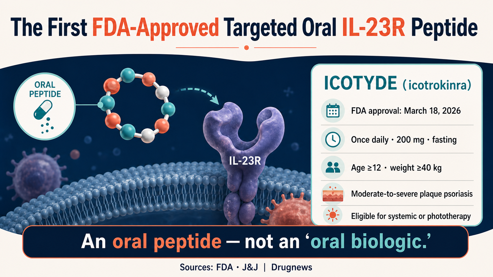
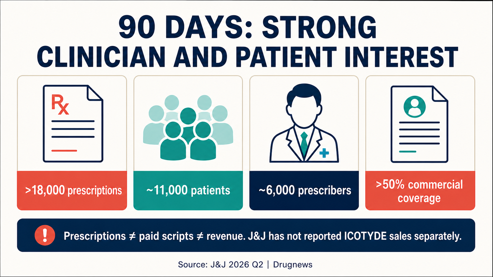

# J&J's Oral Psoriasis Drug Logged 18,000 Prescriptions in Its First Full Quarter. Is It Coming for Injectables?

One of the hardest rules to break in psoriasis may be starting to loosen: patients who want biologic-like efficacy have generally had to accept an injection.

In the first full quarter after launch, Johnson & Johnson's ICOTYDE (icotrokinra) accumulated more than 18,000 prescriptions, reached roughly 11,000 patients, and was prescribed by about 6,000 healthcare professionals. A once-daily oral medicine is beginning to enter a high-efficacy market that injectables have long dominated.

The U.S. Food and Drug Administration approved ICOTYDE on March 18, 2026. It is the first and currently the only FDA-approved targeted oral peptide that directly blocks the interleukin-23 receptor, an important inflammatory signaling switch in psoriasis. It is indicated for patients aged 12 years and older, weighing at least 40 kilograms, with moderate-to-severe plaque psoriasis who are candidates for systemic therapy or phototherapy.

What patients want is not complicated: skin that clears sufficiently, an effect that lasts, and preferably no repeated injections. Historically, oral convenience came with an efficacy gap versus IL-23 and IL-17 biologics. Injectable biologics can deliver high levels of skin clearance, but patients must manage needles, clinic logistics, storage requirements, and the burden of long-term treatment.

ICOTYDE gives an oral therapy a credible place in the high-efficacy conversation for the first time. Eighteen thousand prescriptions demonstrate willingness to try it. Commercial success will depend on refill behavior, actual reimbursement, and long-term persistence.

It has reached for the injectables' lunch. For now, it has only earned a seat at the table.

## 01 | One Pill a Day: How Did J&J Get a Peptide into the Body?

ICOTYDE's generic name is icotrokinra. It is taken as a 200 mg tablet once daily on an empty stomach. The drug blocks the IL-23 receptor and suppresses downstream signaling associated with psoriatic inflammation.

J&J and the FDA describe it as a targeted oral peptide. That term matters.

From a regulatory perspective, ICOTYDE is an oral peptide new drug reviewed through the conventional new drug application pathway. It is not a monoclonal antibody placed inside a capsule.

Oral peptides face degradation and absorption barriers in the gastrointestinal tract. ICOTYDE's ability to directly engage IL-23R demonstrates that at least one molecular design can overcome those barriers. It validates this molecule, not every oral macromolecule platform, and it should not be explained with unsupported stories about disulfide bonds, permeation enhancers, or membrane penetration that do not appear in formal documents.

Patients ultimately care about one question: can one pill a day maintain clear skin for one year, two years, or longer, with an acceptable safety profile?

## 02 | Eighteen Thousand Prescriptions Ignited the Launch, but Payment Quality Still Needs Testing

On J&J's second-quarter 2026 earnings call, management disclosed that ICOTYDE had accumulated more than 18,000 prescriptions, approximately 11,000 patients, and about 6,000 prescribers. More than half of the prescribers were advanced practice providers, and roughly 40% were dermatologists. Within 90 days of launch, U.S. commercial insurance coverage exceeded 50%.

Those figures tell us at least three things.

First, clinicians are willing to try it. Six thousand prescribers extend beyond a small number of major academic centers, indicating that product education is spreading into a broader range of care settings.

Second, patients have a real appetite for a high-efficacy oral option. Eleven thousand patients and 18,000 prescriptions suggest that some refills have begun, but dividing the two numbers to produce 1.6 prescriptions per patient does not prove adherence. The count may include initial prescriptions, refills, unfilled prescriptions, free trials, or patient-assistance supply. Public data do not separate those categories.

Third, payer access did not start slowly. More than 50% commercial coverage within 90 days can help move a prescription toward an actual fill. But coverage does not mean unconditional reimbursement. It does not disclose prior authorization, step-therapy restrictions, patient out-of-pocket costs, rebates, or the share of prescriptions that were actually paid.

That is why 18,000 prescriptions cannot be translated directly into sales success. J&J's second-quarter financial report did not disclose ICOTYDE sales separately, and the earnings call did not provide a full split among free samples, support programs, and commercially paid prescriptions.

A new medicine can rapidly build prescription volume through trials and market education. The harder commercial questions arrive three to six months later: how many patients continue filling it, how far reimbursement expands, and whether net pricing holds under competition.

The start is strong. The scorecard is not complete.

## 03 | An Oral Drug Finally Has an Efficacy Case

Oral psoriasis medicines have never lacked the convenience argument. What they lacked was evidence strong enough to place them inside a high-efficacy treatment sequence.

ICOTYDE was compared directly with deucravacitinib in the ICONIC-ADVANCE head-to-head program. According to J&J's approval announcement, approximately 70% of patients achieved an Investigator's Global Assessment score of 0 or 1 at Week 16, indicating clear or almost-clear skin, and approximately 55% achieved PASI 90. Both outcomes favored ICOTYDE. A randomized comparison within the same study is more persuasive than placing slides from unrelated trials next to each other.

One-year data addressed a second question: does the effect last?

J&J reported in 2025 that adult patients who had already achieved PASI 90 at Week 24 were re-randomized. Among these responders, 84% of those who continued icotrokinra maintained PASI 90 through Week 52, compared with 21% of those switched to placebo.

The 84% figure is easy to misuse.

It applies only to adult responders who had achieved PASI 90 by Week 24 and then continued treatment. It is not a one-year response rate for the entire enrolled population. The 21% result after treatment withdrawal also underscores the importance of continuous treatment in maintaining efficacy.

Some comparisons place the 84% maintenance rate next to an 82% result for Skyrizi and conclude that an oral medicine has matched a leading monoclonal antibody. That conclusion is not valid. The 84% denominator consists of Week 24 responders, while the other percentage comes from a different trial and analysis population. Numbers that differ by only two percentage points may still answer entirely different questions.

A more defensible conclusion is that ICOTYDE has materially raised the efficacy credibility of oral treatment. It outperformed deucravacitinib head to head and has supportive one-year maintenance data. Whether it can displace established IL-23 biologics at scale in routine care still requires longer-term safety, persistence, reimbursement, and direct comparative evidence.

## 04 | Once Daily Still Has to Survive the Real World

There is still a gap between being oral and being taken reliably for years.

The disadvantages of injectable biologics are obvious: needle aversion, training or clinic visits, and storage requirements for some products. Their dosing intervals, however, may be several weeks or longer, so patients do not have to remember treatment every day.

ICOTYDE is taken once daily and its label requires administration on an empty stomach. For some patients this will be easier than an injection. For others with irregular schedules, multiple medicines, or busy routines, daily fasting administration may create a different kind of friction.

Adherence therefore has to be assessed through real persistence: refill rates, discontinuation reasons, missed doses, treatment satisfaction, maintained skin clearance, and interruptions in insurance coverage.

Safety should not be summarized simply as better than traditional small molecules. ICOTYDE does not carry the same boxed warning used for JAK inhibitors, but its FDA label still contains precautions involving infection, tuberculosis assessment, and immunization.

## 05 | A $5 Billion Ambition Requires Multiple Indications

J&J has listed ICOTYDE as an asset with more than $5 billion in potential sales. That is a forward-looking expectation for a multi-indication asset. Peak sales in psoriasis alone and second-quarter revenue have not been disclosed.

As of July 15, 2026, J&J's development pipeline showed icotrokinra in Phase 3 for psoriatic arthritis and ulcerative colitis and in Phase 2 for Crohn's disease. If those indications succeed, the commercial opportunity for oral IL-23R inhibition could expand from dermatology into rheumatology and gastroenterology.

Psoriasis efficacy cannot simply be copied into other indications. Disease biology, endpoints, background therapies, competitors, and reimbursement differ. Each program has to answer its own clinical question.

ICOTYDE will also grow in a crowded market. Established injectable IL-23 and IL-17 biologics have accumulated long-term data, physician familiarity, and payer contracts. Other oral small molecules and peptides are advancing. ICOTYDE must demonstrate efficacy, convenience, safety, and access simultaneously; weakness in any one dimension could cause early launch momentum to fade.

## 06 | One Successful Product Does Not Yet Validate an Entire Platform

ICOTYDE's success will encourage investment in oral peptides. That industry inference is reasonable. One approval, however, does not validate every platform for oral macromolecules.

Each peptide has different requirements for stability, absorption, exposure, target affinity, therapeutic window, and manufacturing. Cardiovascular, metabolic, and autoimmune diseases involve different biology and dosing demands. Oral semaglutide showed that certain peptides can be commercialized, and ICOTYDE adds another successful design. Those examples prove that paths exist; they do not prove that every path is equivalent.

Calling this the eve of an oral-biologics boom by piling together different mechanisms, dosage forms, and secondary-market transaction values obscures the four measures that matter most for ICOTYDE: paid prescriptions, refill persistence, quality of insurance coverage, and efficacy and safety beyond one year. Only when those four hold up does platform spillover become a serious claim.

## 07 | What Should Taiwan-Based Readers Watch Next?

First, separate prescription quantity from prescription quality. If J&J begins disclosing net sales, paid prescriptions, refills, and payer detail, readers can estimate how much of the 18,000-prescription start converts into durable revenue.

Second, watch persistence beyond Week 52. Whether daily fasting administration holds up in routine care cannot be answered by launch enthusiasm.

Third, follow psoriatic arthritis, ulcerative colitis, and Crohn's disease. The more-than-$5-billion narrative requires success across indications.

Fourth, track Taiwan regulatory status and patient access. U.S. FDA approval does not mean that a medicine is approved, launched, or reimbursed in Taiwan. Patients should not change or stop treatment based on overseas news.

The public-market company most directly connected to this analysis is Johnson & Johnson (NYSE: JNJ). At the evidence cut-off, Drugnews did not identify a Taiwan-listed company with a verifiable direct role in ICOTYDE product rights, core manufacturing, pivotal clinical development, or commercialization. We therefore do not force an unrelated Taiwan concept-stock angle.

## The Bottom Line

ICOTYDE has brought an oral therapy into the high-efficacy competitive set. It has head-to-head evidence and supportive one-year maintenance data.

One pill has reached for the injectables' lunch. Whether it actually takes the meal will depend on refills, reimbursement, long-term outcomes, and new indications.

## Primary Sources

1. [FDA ICOTYDE label](https://www.accessdata.fda.gov/drugsatfda_docs/label/2026/220149Orig1s000lbl.pdf)
2. [FDA multidisciplinary review](https://www.fda.gov/media/192646/download)
3. [J&J FDA approval release](https://www.jnj.com/media-center/press-releases/fda-approval-of-icotyde-icotrokinra-ushers-in-new-era-for-first-line-systemic-treatment-of-plaque-psoriasis-with-a-targeted-oral-peptide)
4. [J&J 2025 PASI 90 maintenance results](https://www.investor.jnj.com/investor-news/news-details/2025/Icotrokinra-shows-superiority-to-deucravacitinib-in-first-reported-head-to-head-trials-reinforcing-promise-of-novel-targeted-oral-peptide-for-treatment-of-plaque-psoriasis/default.aspx)
5. [J&J one-year results](https://www.investor.jnj.com/investor-news/news-details/2026/ICOTYDE-icotrokinra-one-year-results-confirm-lasting-skin-clearance-and-favorable-safety-profile-in-oncedaily-pill-for-plaque-psoriasis/default.aspx)
6. [J&J second-quarter 2026 results](https://www.investor.jnj.com/investor-news/news-details/2026/Johnson--Johnson-reports-Q2-2026-results-raises-2026-outlook/default.aspx)
7. [J&J second-quarter 2026 earnings call transcript](https://s203.q4cdn.com/636242992/files/doc_financials/2026/q2/JNJ-USQ_Transcript_2026-07-15.pdf)
8. [J&J development pipeline](https://www.investor.jnj.com/pipeline/development-pipeline/default.aspx)

## Disclaimer

This article summarizes public medical and industry information. It does not constitute medical advice, a diagnosis or treatment recommendation, or investment advice. U.S. approval does not imply approval or reimbursement in Taiwan. Treatment decisions should be made with a qualified healthcare team based on the individual patient's condition.
