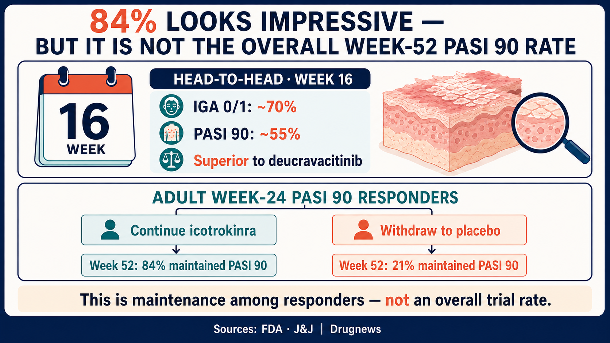
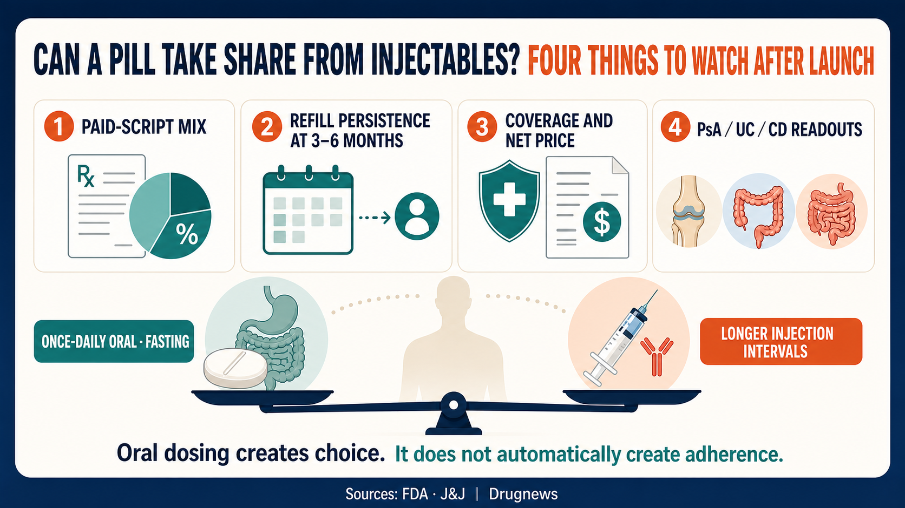

# Can a Pill Take Share from Injectables? The ICOTYDE Commercial Test

Oral psoriasis drugs have never lacked convenience. What they have lacked is efficacy.

On March 18, 2026, the FDA approved Johnson & Johnson's ICOTYDE (icotrokinra). It is the first and currently only FDA-approved targeted oral peptide that directly blocks the interleukin-23 receptor. The label covers patients aged 12 years or older who weigh at least 40 kilograms and have moderate-to-severe plaque psoriasis suitable for systemic or phototherapy.

In its first full quarter on the market, J&J reported more than 18,000 prescriptions, approximately 11,000 patients, and roughly 6,000 prescribers. US commercial coverage exceeded 50% within 90 days of launch.

That is a strong demand signal. It is not yet proof of commercial success.

Our central judgment is that ICOTYDE has moved oral therapy into the high-efficacy competitive tier. The next valuation question is no longer prescription volume alone, but how much of that demand becomes paid prescriptions, repeat use, and successful expansion into additional indications.

## Do Not Call It an “Oral Biologic”

The FDA and J&J formally describe ICOTYDE as a targeted oral peptide. It is not an injectable monoclonal antibody placed inside a capsule, and it was not approved as a biologic under a biologics license application.

Its technical significance is that an oral peptide can directly block IL-23R despite the gastrointestinal stability and absorption barriers that historically constrained peptides. That does not validate every oral macromolecule platform. Exposure, dose, target biology, and therapeutic window remain molecule-specific.

## The Threshold It Actually Crossed Was Efficacy

In the head-to-head ICONIC-ADVANCE program, approximately 70% of patients receiving ICOTYDE achieved an Investigator's Global Assessment score of 0 or 1 at week 16, and about 55% achieved PASI 90. Both endpoints were superior to deucravacitinib. A direct comparison within the same trial is more informative than placing percentages from unrelated presentations side by side.

The one-year data were also encouraging. Among adult patients who had already achieved PASI 90 at week 24 and were then rerandomized, 84% of those who continued icotrokinra maintained PASI 90 at week 52, compared with 21% of those switched to placebo. In two other studies, the proportions reaching PASI 100 at week 52 were approximately 49% and 48%.

But the denominator behind “84%” matters. This was not the week-52 PASI 90 rate for every patient who started treatment. It was the maintenance rate among week-24 responders who were rerandomized and continued therapy. Comparing that figure directly with a separate Skyrizi trial and declaring oral therapy equivalent to a monoclonal antibody would be methodologically unsound.

A more defensible investment conclusion is that ICOTYDE has beaten an oral TYK2 inhibitor head to head and has shown durable efficacy over one year. A claim that it can broadly displace established injectable IL-23 therapies would still require real-world persistence, longer-term safety, reimbursement quality, and direct comparative evidence.

## 18,000 Prescriptions Do Not Mean 18,000 Paid Prescriptions

More than 18,000 prescriptions across approximately 11,000 patients suggests that some patients had already begun refilling. It does not justify dividing the two figures and declaring adherence proven.

Prescription counts can include initiation, refills, unfilled prescriptions, free trials, or patient-assistance supply. J&J has not reported ICOTYDE sales separately, nor has it disclosed the mix of paid prescriptions, net price, and assistance programs.

Commercial coverage above 50% is positive, but coverage does not mean unconditional payment. The metrics that matter include prior authorization, step edits, patient out-of-pocket costs, gross-to-net deductions, and refill rates three to six months after initiation.

Oral dosing also does not automatically guarantee adherence. ICOTYDE is taken once daily on an empty stomach. That can be attractive for patients who want to avoid injections, but it can become a daily burden for people with irregular schedules or substantial polypharmacy. Established biologics require injections, yet the interval between doses can be several weeks.

## The $5 Billion Depends on More Than Psoriasis

J&J identifies ICOTYDE as an asset with more than $5 billion in potential. That figure is a forward-looking, multi-indication expectation. It is not current sales and it is not a psoriasis-only peak-sales estimate that has already been validated.

As of July 15, 2026, J&J's pipeline listed icotrokinra in phase 3 development for psoriatic arthritis and ulcerative colitis, and in phase 2 for Crohn's disease. If those programs succeed, oral IL-23R inhibition could expand from dermatology into rheumatology and gastroenterology. A shared target, however, does not guarantee success across different diseases.

We would separate the valuation into three layers:

1. **Psoriasis persistence:** How many prescriptions become paid scripts, and how many patients remain on treatment after six months?
2. **Payer quality:** Does broader coverage require excessive rebates, or can net price remain durable?
3. **Indication-specific probability:** Psoriatic arthritis, ulcerative colitis, and Crohn's disease should each receive their own probability of clinical success. The entire $5 billion should not enter the model at once.

Prescriber composition is another easily overlooked signal over the next two quarters. Of the roughly 6,000 prescribers reported so far, more than half were advanced practice providers and approximately 40% were dermatologists. If growth spreads into broader primary-care and non-specialist settings, the oral formulation may be expanding the addressable patient pool. If scripts remain concentrated around launch promotion while new prescribers and refills slow together, the market should reduce aggressive penetration assumptions. Prescription, patient, and prescriber counts need to be read together; any one of them can mistake initial trial interest for durable demand.

Safety should not be reduced to the slogan “safer than JAK inhibitors.” ICOTYDE does not carry the same boxed warnings used for JAK inhibitors, but its FDA label still includes precautions related to infections, tuberculosis evaluation, and immunization. Differentiation is not the same as zero risk.

JNJ is the most direct public-market exposure discussed in this article. In Taiwan, Formosa Laboratories (4746) is better treated as a capability reference point. The company's website lists solid-phase peptide synthesis, automated microwave synthesis, purification, and peptide sequence analysis. Those capabilities make it relevant when tracking Taiwan's peptide manufacturing and analytical infrastructure. They do not establish that Formosa Laboratories supplies ICOTYDE, owns icotrokinra's oral-absorption platform, or holds commercial rights. Stock code 4746 is therefore a capability coordinate, not a direct ICOTYDE beneficiary.

## Conclusion

The final takeaway is simple: more than 18,000 prescriptions show that patients and clinicians are willing to try ICOTYDE. Whether it can take meaningful share from injectables depends on whether patients stay, payers pay, and the next indication succeeds.

## Primary Sources

1. [FDA prescribing information](https://www.accessdata.fda.gov/drugsatfda_docs/label/2026/220149Orig1s000lbl.pdf)
2. [FDA multidisciplinary review](https://www.fda.gov/media/192646/download)
3. [J&J approval announcement](https://www.jnj.com/media-center/press-releases/fda-approval-of-icotyde-icotrokinra-ushers-in-new-era-for-first-line-systemic-treatment-of-plaque-psoriasis-with-a-targeted-oral-peptide)
4. [J&J 2025 PASI 90 maintenance and head-to-head results](https://www.investor.jnj.com/investor-news/news-details/2025/Icotrokinra-shows-superiority-to-deucravacitinib-in-first-reported-head-to-head-trials-reinforcing-promise-of-novel-targeted-oral-peptide-for-treatment-of-plaque-psoriasis/default.aspx)
5. [J&J one-year results](https://www.investor.jnj.com/investor-news/news-details/2026/ICOTYDE-icotrokinra-one-year-results-confirm-lasting-skin-clearance-and-favorable-safety-profile-in-oncedaily-pill-for-plaque-psoriasis/default.aspx)
6. [J&J development pipeline](https://www.investor.jnj.com/pipeline/development-pipeline/default.aspx)
7. [Formosa Laboratories peptide synthesis and analytical capabilities](https://www.formosalab.com/tw/peptide-synthesis)

#JNJ #ICOTYDE #icotrokinra #psoriasis #IL23 #oralpeptide #TaiwanBiotech

## Disclaimer

This article summarizes public information and industry trends. It is not medical or investment advice. US approval does not imply approval or reimbursement in Taiwan, and investors should independently assess clinical and commercial risks.
