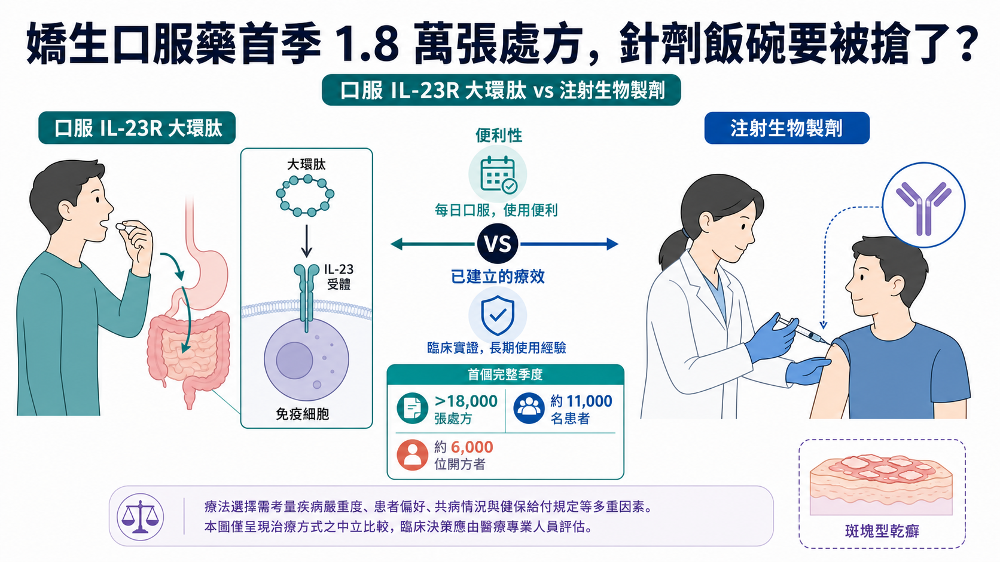
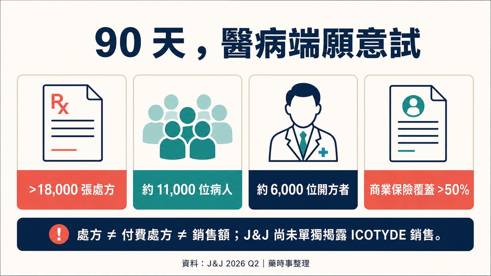
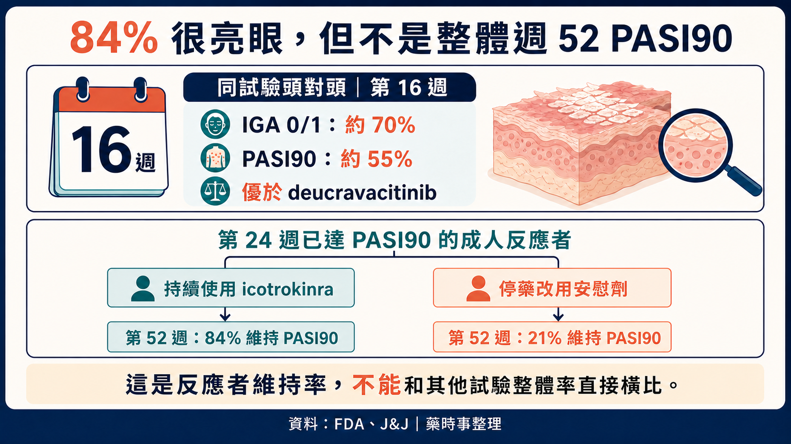
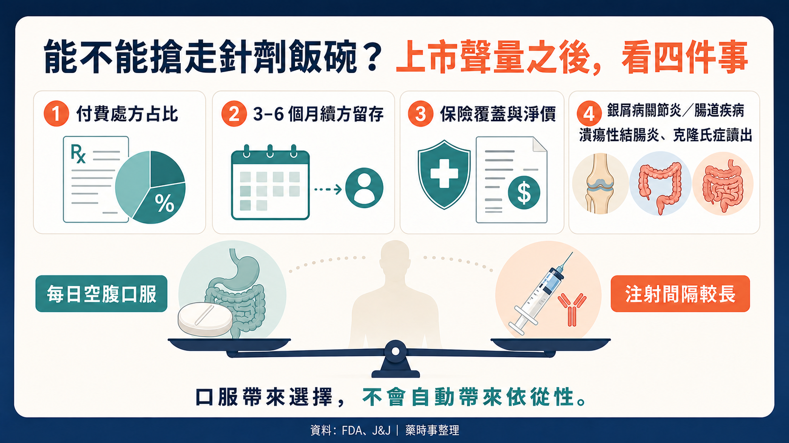

# 嬌生口服藥首季 1.8 萬張處方，針劑飯碗要被搶了？

乾癬市場最難撼動的一條規則，可能開始鬆了：想追上生物製劑的療效，通常就得接受注射。

嬌生（J&J）的 ICOTYDE（icotrokinra）上市後第一個完整季度，就累積超過 18,000 張處方、約 11,000 位病人與 6,000 位開方者。一顆每天服用的口服藥，開始把手伸進原本由針劑主導的高療效市場。

ICOTYDE 於 2026 年 3 月 18 日獲美國食品藥物管理局（FDA）核准。它是第一款、也是目前唯一獲 FDA 核准、直接阻斷 IL-23 受體（乾癬發炎的重要訊號開關）的標靶口服胜肽，適用於 12 歲以上、體重至少 40 公斤，且適合全身性治療或光照治療的中重度斑塊型乾癬患者。

乾癬病人想要的其實不複雜：皮膚清得夠乾淨、效果維持得夠久，而且最好不要一直打針。過去的問題是，口服藥方便，療效常和 IL-23、IL-17 生物製劑有一段差距；注射型生物製劑能把皮膚廓清率拉得很高，卻要面對針劑、回診、保存與長期治療負擔。

ICOTYDE 讓口服藥第一次有資格進入高療效的對話。18,000 張處方證明市場願意試；商業成績要等續方、實際支付與長期留存接棒。

它正在搶針劑的飯碗，現在只是拿到入場券。

## 01｜每天一顆，嬌生怎麼把胜肽送進體內？

ICOTYDE 的學名是 icotrokinra，每日一次、空腹口服 200 mg。它會阻斷 IL-23 receptor，抑制與乾癬發炎相關的下游訊號。

J&J 與 FDA 使用的定位是 targeted oral peptide，也就是標靶口服胜肽。這個名詞很重要。

監管上，ICOTYDE 屬於口服胜肽新藥，走的是一般新藥申請途徑；它並非膠囊版單株抗體。

胜肽口服會遇到胃腸分解與吸收難題；ICOTYDE 能直接作用 IL-23R，證明至少有一條設計路徑能跨過障礙。但這只驗證了這個分子，不代表所有大分子都能口服化，也不該靠未經正式文件支持的二硫鍵、促滲透或穿膜故事解釋成功。

病人只在乎一件事：每日一顆，能不能在安全性可接受下，把皮膚清除維持一年、兩年，甚至更久？
## 02｜18,000 張處方點火，付費品質還要驗收

J&J 2026 年第二季電話會議披露：ICOTYDE 上市後已累積超過 18,000 張處方、約 11,000 位病人與約 6,000 位開方者。開方者中，超過一半是進階執業醫療人員，約 40% 是皮膚科醫師；上市 90 天內，美國商業保險覆蓋率超過 50%。

這些數字至少說明三件事。

第一，醫療端願意試。6,000 位開方者已跨出少數大型醫學中心，產品教育正擴散到更廣的診療場域。

第二，病人對口服高療效選項有真實需求。11,000 位病人對 18,000 張處方，顯示已有部分續方，但不能僅用 1.6 張處方／人的簡單除法就宣布依從性成功。處方可能包含起始、續方、未實際取藥、免費試用或患者援助，公開資料沒有拆開。

第三，保險准入起步不慢。90 天內商業保險覆蓋超過 50%，有助於從開方走到取藥；但覆蓋不代表無條件支付，也沒有告訴我們事前授權、先試用其他藥物的限制、病人自付、折讓與實際付費處方的比例。

這也是為什麼 18,000 張處方不能直接翻譯成銷售成功。J&J 第二季財報沒有單獨揭露 ICOTYDE 銷售額，電話會議也沒有完整說明免費樣品、援助方案與商業付費處方的組成。

一款新藥上市初期，可以靠試用與市場教育快速拉高處方數。三到六個月後還有多少病人持續取藥、保險支付能否擴大、淨價扛不扛得住競爭，才是商業價值的硬考題。

開局很強，成績單還沒寫完。

## 03｜口服藥，終於拿出療效說服力

乾癬口服藥從來不缺「不用打針」這個賣點。缺的是讓醫師願意把它放到高療效治療序列裡的數據。

ICOTYDE 在 ICONIC-ADVANCE 頭對頭研究中，和 deucravacitinib 比較。依 J&J 核准公告，第 16 週約 70% 病人達到 IGA 0/1，也就是皮膚清除或幾乎清除；約 55% 達到 PASI 90，兩個結果都優於對照。兩組患者在同一研究中直接比較，說服力比拿兩張不同試驗的簡報拼在一起更高。

一年資料也回答了另一個問題：效果能不能維持。

J&J 2025 年公告顯示，第 24 週已達 PASI 90 的成人反應者重新隨機分組後，持續使用 icotrokinra 的一組有 84% 到第 52 週仍維持 PASI 90；停藥改用安慰劑的一組則為 21%。

這個 84% 很容易被寫錯。

84% 只適用於第 24 週已達 PASI 90、之後持續用藥的成人反應者。這個分母不能當成全體患者的一年反應率；停藥組僅 21%，也凸顯持續治療對維持效果的重要性。

有人把 ICOTYDE 持續使用組第 52 週「84% 維持 PASI 90」直接和 Skyrizi 的 82% 放在一起，得出「口服已和一線單抗持平」。這個比較不成立：84% 的分母是第 24 週反應者，另一個數字來自不同試驗、不同分析族群。跨試驗百分比看起來只差兩個點，實際回答的是兩個問題。

比較合理的說法是：ICOTYDE 已經把口服療法的療效可信度往上推，頭對頭優於 deucravacitinib，且一年維持資料有支持；它是否能在真實世界中大規模取代成熟 IL-23 生物製劑，仍需要更長安全性、留存、支付與直接比較資料。

## 04｜每日一顆，真實世界留存才是答案

「口服」和「長期按時用藥」，中間仍隔著真實生活。

注射型生物製劑的缺點很直觀：怕針、需要訓練或就醫、部分產品有保存要求。但它們的給藥間隔可能是數週或更久，病人不需要每天記得服藥。

ICOTYDE 是每日一次，而且標示要求空腹服用。對某些病人，這比注射容易；對另一些忙碌、服藥多或生活作息不規律的病人，每天固定空腹反而會形成新的摩擦。

所以依從性要回到實際留存。處方續領率、停藥原因、漏服、治療滿意度、皮膚清除維持與保險中斷，才是上市後需要回答的指標。

安全性也不能只用「優於傳統小分子」一筆帶過。ICOTYDE 沒有 JAK 抑制劑同一套黑框警告，FDA 標示仍列出感染、結核評估與免疫接種等注意事項。

## 05｜50 億美元，要靠多適應症兌現

J&J 把 ICOTYDE 列為具有 50 億美元以上銷售潛力的資產。這是公司對多適應症資產的前瞻期待；乾癬單一適應症的峰值與第二季銷售仍未揭曉。

截至 2026 年 7 月 15 日，J&J 開發管線顯示，icotrokinra 在乾癬性關節炎與潰瘍性結腸炎進入第三期，克隆氏症則在第二期。若後續適應症成功，口服 IL-23R 的商業場景才可能從皮膚科擴到風濕與腸胃領域。

乾癬療效無法直接複製到其他適應症。疾病位置、終點、背景治療、競品與支付邏輯都不同，每項試驗仍要各自作答。

它也不會在沒有競爭的真空裡成長。成熟的注射型 IL-23、IL-17 生物製劑已累積長期資料、醫師習慣與保險合約；其他口服小分子與口服胜肽正在推進。ICOTYDE 必須同時證明療效、便利、安全與支付，少一塊都可能讓開局熱度掉下來。

## 06｜先跑出一個產品，平台價值還要慢慢累積

ICOTYDE 的成功會鼓勵更多公司投入口服胜肽，這個產業推論合理；但不能把一個產品的核准，直接寫成所有口服大分子平台都已被驗證。

每個胜肽的穩定性、吸收、暴露、標靶親和力、治療窗與製造條件都不同。心血管、代謝、自體免疫的疾病與劑量需求也完全不同。口服 semaglutide 已經證明某些多肽可以商業化，ICOTYDE 又替另一種設計增加一個成功案例；這些案例說明路可以走，不代表每一條路都一樣。

把不同機制、不同劑型與二手交易金額堆成「口服生物藥爆發前夜」，反而容易看不見 ICOTYDE 最重要的四個指標：付費處方、續方留存、保險覆蓋品質，以及一年以上的療效與安全性。這四項能站穩，才有資格談平台外溢。

## 07｜台灣讀者接下來看什麼？

第一，拆解處方的「質」。未來若 J&J 開始揭露淨銷售、實際付費處方、續方與保險細節，才能判斷 18,000 張處方有多少轉成可持續收入。

第二，看第 52 週以後的留存。每日空腹服用能否在真實世界維持，不能只靠上市初期熱情回答。

第三，看乾癬性關節炎、潰瘍性結腸炎與克隆氏症。50 億美元以上的敘事，需要多適應症成功才能兌現。

第四，看台灣監管與可近性。美國 FDA 核准不等於台灣已核准、已上市或已給付；個別病人也不能因為看到國外新聞就自行停換藥。

股票方面，本文最直接的公開市場公司是 Johnson & Johnson（NYSE：JNJ）。截至查證截止日，沒有找到台灣上市櫃公司在 ICOTYDE 的產品權利、核心製造、關鍵臨床或商業化上具可驗證的直接角色，因此不硬列台股概念股。

## 最後一句

ICOTYDE 已把口服療法帶進高療效競爭區：有頭對頭數據，也有一年維持資料。

一顆藥已經把手伸向針劑的飯碗。它能否真的端走那碗飯，接下來就看續方、支付、長期結果與新適應症。
## 參考資料

1. [FDA ICOTYDE label](https://www.accessdata.fda.gov/drugsatfda_docs/label/2026/220149Orig1s000lbl.pdf)
2. [FDA multidisciplinary review](https://www.fda.gov/media/192646/download)
3. [J&J FDA approval release](https://www.jnj.com/media-center/press-releases/fda-approval-of-icotyde-icotrokinra-ushers-in-new-era-for-first-line-systemic-treatment-of-plaque-psoriasis-with-a-targeted-oral-peptide)
4. [J&J 2025 PASI 90 維持資料](https://www.investor.jnj.com/investor-news/news-details/2025/Icotrokinra-shows-superiority-to-deucravacitinib-in-first-reported-head-to-head-trials-reinforcing-promise-of-novel-targeted-oral-peptide-for-treatment-of-plaque-psoriasis/default.aspx)
5. [J&J one-year results](https://www.investor.jnj.com/investor-news/news-details/2026/ICOTYDE-icotrokinra-one-year-results-confirm-lasting-skin-clearance-and-favorable-safety-profile-in-oncedaily-pill-for-plaque-psoriasis/default.aspx)
6. [J&J 2026 Q2 results](https://www.investor.jnj.com/investor-news/news-details/2026/Johnson--Johnson-reports-Q2-2026-results-raises-2026-outlook/default.aspx)
7. [J&J 2026 Q2 earnings call transcript](https://s203.q4cdn.com/636242992/files/doc_financials/2026/q2/JNJ-USQ_Transcript_2026-07-15.pdf)
8. [J&J development pipeline](https://www.investor.jnj.com/pipeline/development-pipeline/default.aspx)

## 免責聲明

本文為公開醫藥與產業資料整理，不構成醫療診斷、治療建議或投資建議。美國核准不等於台灣核准或給付；用藥選擇應由專業醫療團隊依個人病況判斷。
