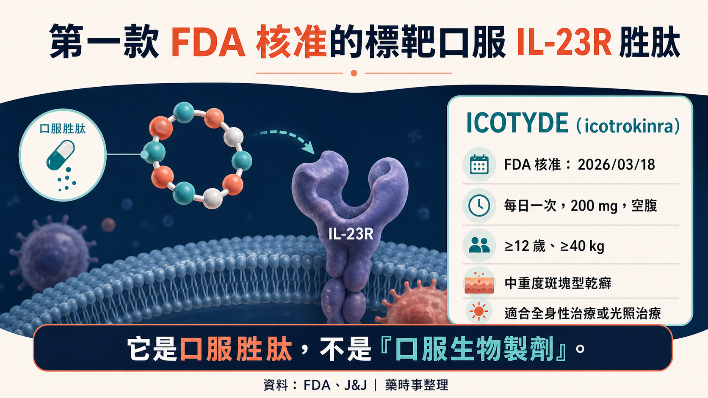
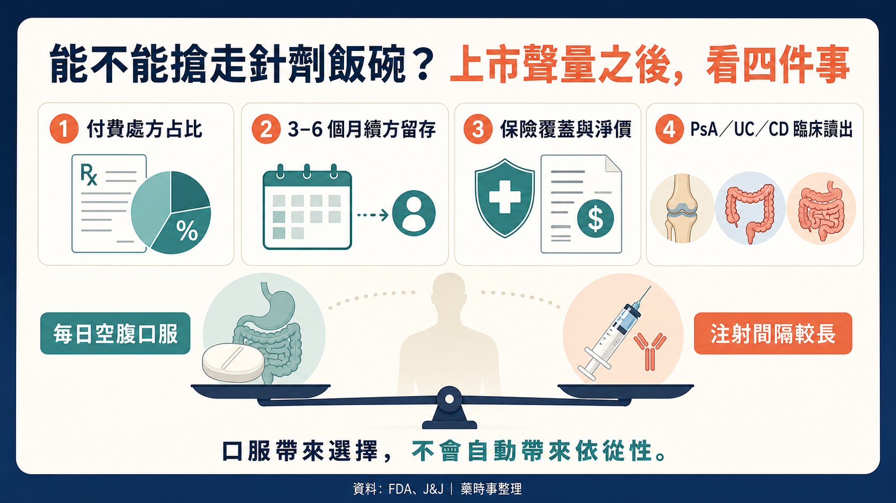

# 一顆藥，搶針劑的飯碗

乾癬口服藥不缺「方便」，缺的是療效。

2026 年 3 月 18 日，FDA 核准 Johnson & Johnson（NYSE：JNJ）的 ICOTYDE（icotrokinra）。它是第一款、也是目前唯一獲 FDA 核准、直接阻斷 IL-23 受體的標靶口服胜肽，用於 12 歲以上、體重至少 40 公斤，且適合全身性或光照治療的中重度斑塊型乾癬患者。

上市後第一個完整季度，J&J 披露超過 18,000 張處方、約 11,000 位病人、約 6,000 位開方者；上市 90 天內，美國商業保險覆蓋超過 50%。

這是很強的需求訊號，但還不能直接叫商業成功。

我的主判斷是：ICOTYDE 已經讓口服藥進入高療效的競爭區，估值下一步卻不看處方聲量，而看付費處方、續方與多適應症兌現。

## 先別叫它「口服生物製劑」

FDA 與 J&J 的正式定位是 targeted oral peptide，也就是標靶口服胜肽。它不是把注射單抗裝進膠囊，也不是以 biologic license application 核准的生物製劑。

這個產品的技術意義，在於口服胜肽能直接阻斷 IL-23R，跨過過去胜肽在胃腸穩定與吸收上的難題；但不能因此把所有口服大分子平台一起宣布驗證。每個分子的暴露、劑量、標靶與治療窗都不同。

## 它真正跨過的是療效門檻

在 ICONIC-ADVANCE 頭對頭研究中，ICOTYDE 第 16 週約 70% 病人達到 IGA 0/1，約 55% 達到 PASI 90，兩項都優於 deucravacitinib。這是在同一試驗直接比較，比拿不同藥的簡報百分比拼在一起更有說服力。

一年資料也不差：第 24 週已達 PASI 90 的成人反應者重新隨機分組後，持續使用 icotrokinra 的一組有 84% 到第 52 週仍維持 PASI 90，停藥改用安慰劑的一組為 21%；另兩項研究第 52 週 PASI 100 比例約 49% 與 48%。

但「84%」的分母一定要看清楚。它不是所有治療病人的第 52 週 PASI 90，而是第 24 週已反應者重新分組後，持續用藥組的維持率。把它直接和 Skyrizi 的另一項試驗數字相比、說口服已和單抗持平，口徑不成立。

比較穩健的投資結論是：ICOTYDE 已頭對頭贏過一款口服 TYK2，且一年療效有延續；要說大規模取代成熟 IL-23 針劑，仍缺真實世界留存、長期安全性、支付與直接比較。

## 1.8 萬張處方，不等於 1.8 萬張付費處方

18,000 張處方對約 11,000 位病人，顯示有人開始續方；但不能用 1.6 張／人就宣布依從性成功。

處方可能包含起始、續方、未取藥、免費試用或患者援助。J&J 尚未單獨披露 ICOTYDE 銷售，也沒有拆出 paid prescription、淨價與援助方案組成。

保險 coverage 超過 50% 是好消息，卻不等於無條件支付。真正要看的，是事前授權、step edit、病人自付、折讓與三到六個月後的續方率。

而且口服也不自動等於依從性。ICOTYDE 是每日一次、空腹服用；對怕針病人很方便，對作息不規律或同時吃很多藥的人，可能換成每日負擔。成熟生物製劑雖然要注射，給藥間隔卻可能是數週。

## 50 億美元，靠的不是乾癬一項

J&J 把 ICOTYDE 列為 50 億美元以上潛力資產，這是多適應症的前瞻期待，不是現在的銷售，也不是乾癬單一適應症已經驗證的峰值。

截至 2026 年 7 月 15 日，公司管線顯示 icotrokinra 的乾癬性關節炎與潰瘍性結腸炎在第三期，克隆氏症在第二期。若這些適應症成功，口服 IL-23R 才可能從皮膚科擴到風濕與腸胃科；但相同靶點不能保證不同疾病都成功。

估值上我會做三層拆解：

1. 乾癬留存：處方能否轉成 paid scripts，半年後有多少人續用。
2. 支付品質：coverage 擴張是否伴隨過高折讓，淨價能否守住。
3. 多適應症機率：PsA、UC、CD 分別用自己的臨床成功率估，不把 50 億美元一次全灌進模型。

接下來兩季還有一個容易被忽略的訊號：開方者結構。現在約 6,000 位開方者中，超過一半是進階執業醫療人員，約 40% 是皮膚科醫師。如果成長主要來自更廣的基層與非專科場域，代表口服劑型正在擴大可觸及病人；如果處方集中在上市初期推廣、後續開方者與續方同步放慢，就要下修爆發式滲透假設。處方數、病人數與開方者必須一起看，單一數字最容易把試用熱度誤當長期需求。

安全性也不能只寫「比 JAK 安全」。ICOTYDE 沒有 JAK 抑制劑同一套黑框警告，但 FDA 標示仍有感染、結核評估與免疫接種等注意事項。差異化存在，不等於零風險。

本文最直接的美股標的是 JNJ；台灣的技術座標是台耀（4746）。台耀公司頁面列出固相胜肽合成、自動化微波合成、純化，以及胜肽序列分析等能力，適合用來追蹤台灣胜肽製造與分析平台。這不代表台耀供應 ICOTYDE，也沒有證據顯示它擁有 icotrokinra 的口服吸收平台或商業權利，因此 4746 是能力座標，不是 ICOTYDE 直接受惠股。

## 結語

最後一句：1.8 萬張處方證明大家願意試；能不能搶走針劑的飯碗，要看病人會不會留下、保險願不願意付，以及下一個適應症能不能再成功一次。

## 主要來源

1. [FDA label](https://www.accessdata.fda.gov/drugsatfda_docs/label/2026/220149Orig1s000lbl.pdf)
2. [FDA review](https://www.fda.gov/media/192646/download)
3. [J&J approval](https://www.jnj.com/media-center/press-releases/fda-approval-of-icotyde-icotrokinra-ushers-in-new-era-for-first-line-systemic-treatment-of-plaque-psoriasis-with-a-targeted-oral-peptide)
4. [J&J 2025 PASI90 維持資料](https://www.investor.jnj.com/investor-news/news-details/2025/Icotrokinra-shows-superiority-to-deucravacitinib-in-first-reported-head-to-head-trials-reinforcing-promise-of-novel-targeted-oral-peptide-for-treatment-of-plaque-psoriasis/default.aspx)
5. [J&J one-year results](https://www.investor.jnj.com/investor-news/news-details/2026/ICOTYDE-icotrokinra-one-year-results-confirm-lasting-skin-clearance-and-favorable-safety-profile-in-oncedaily-pill-for-plaque-psoriasis/default.aspx)
6. [J&J pipeline](https://www.investor.jnj.com/pipeline/development-pipeline/default.aspx)
7. [台耀胜肽合成與分析能力](https://www.formosalab.com/tw/peptide-synthesis)

#JNJ #4746 #ICOTYDE #icotrokinra #乾癬 #IL23 #口服胜肽

## 免責聲明

本文為公開資料與產業趨勢整理，不構成醫療或投資建議。美國核准不等於台灣核准或給付，投資人應自行評估臨床與商業風險。
