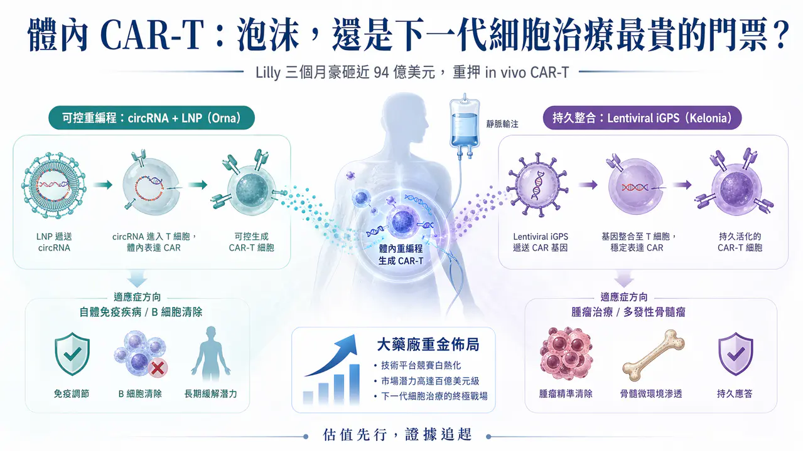
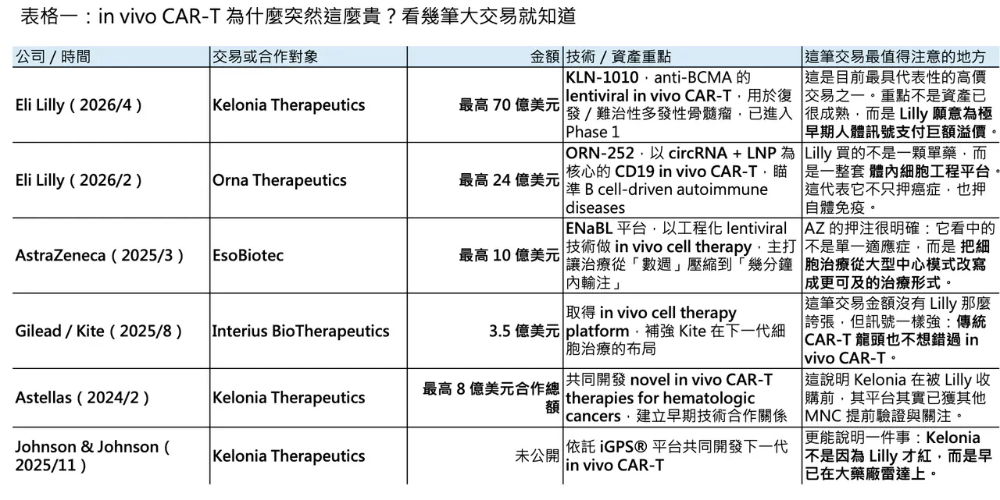
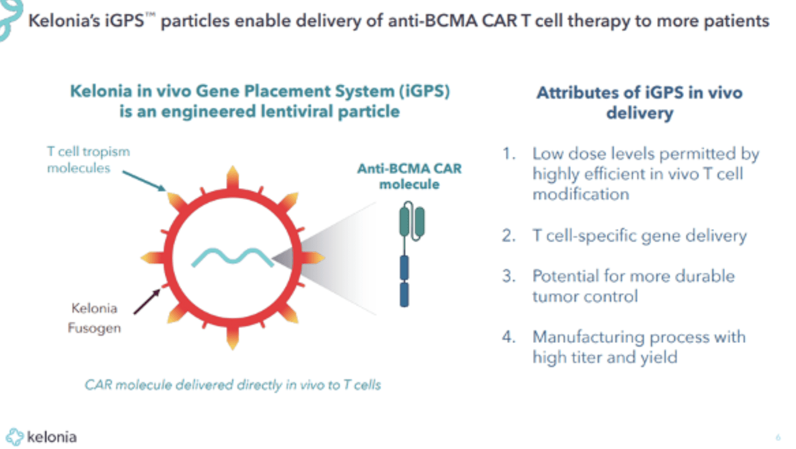
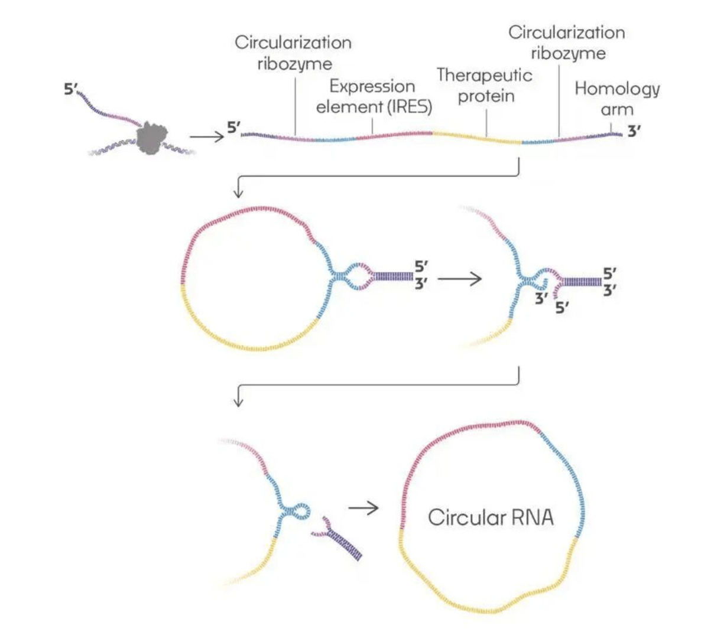
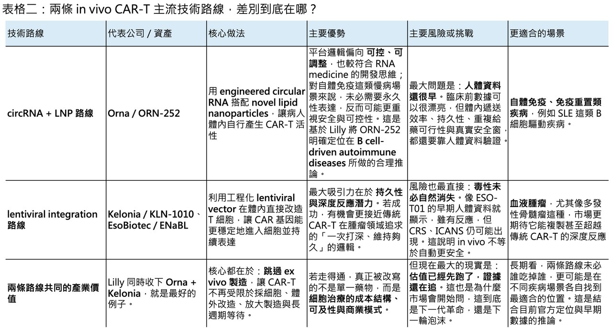

# 體內 CAR-T 的泡沫，還是下一代細胞治療最貴的門票？

📌 4 月 20 日，Eli Lilly 宣布將以最高 70 億美元收購臨床階段生技公司 Kelonia Therapeutics，其中包含 32.5 億美元現金預付款，其餘則取決於後續臨床、監管與商業里程碑；交易預計在 2026 年下半年完成。若再加上 Lilly 在 2 月以最高 24 億美元收購 Orna Therapeutics，Lilly 在不到三個月內，已對體內 CAR-T 相關平台砸下接近 94 億美元。這不是零星補管線，而是明確把 in vivo CAR-T 拉到公司未來十年技術佈局的核心位置。

真正值得注意的，不是金額本身，而是 Lilly 買進來的都不是成熟資產。KLN-1010 雖已進入 Phase 1，但截至 2025 年 ASH 公布的首批人體資料，也只治療了 4 位復發／難治性多發性骨髓瘤患者；ORN-252 則甚至還只是 clinical trial-ready 的臨床前／送件前項目。換句話說，Lilly 這次押的不是某一個已經去風險化的分子，而是兩條不同的體內 CAR-T 技術路徑，以及它們未來可能重寫細胞治療經濟學的機會。

## 01｜為什麼估值愈來愈貴？

💡 先看 Kelonia。Lilly 願意把這筆交易做到 70 億美元，不是沒有依據。根據 Kelonia 在 2025 年 ASH 年會公布的首個人體資料，KLN-1010 以一次性靜脈輸注的方式，在不做 lymphodepletion、不經 leukapheresis，也不需 ex vivo 製造的前提下，讓 4 位復發／難治性多發性骨髓瘤患者在 1 個月時全部達到 MRD-negative response，且在最長 5 個月追蹤期內仍維持反應；同時，循環 T 細胞中 CAR-T 的比例最高可達 85%。安全性上，前 4 位患者沒有出現 grade 3 以上 CRS，也沒有 ICANS。對一個體內 CAR-T 平台來說，這組數據雖然樣本非常小，但已足以讓大藥廠相信：這不只是概念，而是有可能真的碰到臨床可行性的門檻。

這也是 in vivo CAR-T 最近會被重新定價的根本原因。傳統自體 CAR-T 的瓶頸，很多時候不是單點工程問題，而是整個模式本身太重：要先採細胞、體外改造、放大製造，再回輸病人，中間還常需要 lymphodepletion，整體時程往往是以「週」為單位。AstraZeneca 在收購 EsoBiotec 時就直接把這件事講得很白：其 ENaBL 平台的價值，在於有機會把原本需要數週的流程，縮短成以分鐘計的簡化輸注模式。Lilly 的 Jacob Van Naarden 也在 Kelonia 交易中強調，今天真正限制 CAR-T 普及的，是製造、安全性與可及性障礙，而不是臨床概念本身。市場願意給高估值，本質上是在為「若能繞開 ex vivo 製造，整個細胞治療市場天花板可能被打開」這件事付權利金。

但這裡也正是「泡沫感」出現的地方。因為目前這些估值，大多不是建立在已經成熟的 registrational data 上，而是建立在極早期人體訊號 + 巨大的產業想像力之上。Kelonia 的臨床資料只有 4 位患者、最長追蹤 5 個月；Orna 的 ORN-252 甚至還沒有人體療效資料。這類資產現在被大藥廠用十億、甚至數十億美元的價格掃貨，某種程度上確實已經不像傳統意義上的「買資產」，更像是在買未來平台壟斷權的選擇權。

## 02｜Lilly 其實不是在買兩家公司，而是在買兩種完全不同的細胞治療哲學

🧬 Orna 和 Kelonia 看似都屬於 in vivo CAR-T，但底層邏輯其實不一樣。

Orna 的核心，是 engineered circular RNA（circRNA）+ novel lipid nanoparticles（LNP）。Lilly 在官方公告裡把話講得很清楚：Orna 的 lead program ORN-252 是一個 CD19-targeting、clinical trial-ready 的 in vivo CAR-T，設計目標是治療 B cell-driven autoimmune diseases。Orna 在 2025 年 ASH 公布的資料顯示，ORN-252 在 humanized mouse lupus model 中可在低至 0.03 mg/kg 的劑量下造成強勁的 B cell depletion，並伴隨 dsDNA titers 下降；在非人靈長類中，低至 0.1 mg/kg 即可達到周邊血與脾臟的 B 細胞清除。這些數據還停留在臨床前，但已足以說明為什麼 Lilly 會把它放在自體免疫方向：它不是想用一個永久、強整合的模式去「打掉」免疫系統，而是希望透過較可控的體內重編程，去碰免疫重置這件事。

從技術哲學上看，circRNA + LNP 路線最大的吸引力，在於它比較接近「可控、可反覆優化」的 RNA medicine 思維。Lilly 官方雖沒有直接說 ORN-252 一定更適合長期重複給藥，但它把 ORN-252 明確放在 B-cell-driven autoimmune diseases，本身就反映出一種判斷：對自體免疫病來說，過度持久的 CAR 表現未必永遠是優點，可控的表達時長與較彈性的劑量設計，反而可能更重要。這一點，至少在平台方向上，是合理的。

Kelonia 則走了另一條完全不同的路。它的 iGPS®（in vivo Gene Placement System）建立在經過工程化的 lentiviral vector 上，核心不是短暫表達，而是希望在體內直接把 CAR 基因穩定送進 T 細胞，做出更接近傳統 CAR-T 的持久性與深度反應。Kelonia 官方把 iGPS 描述為一個 built on lentiviral vector 的系統，透過 targeting molecule 與 optimized fusogen 來提高對目標細胞的特異性與遞送效率。學術綜述也指出，Kelonia 的平台是利用 CD3-targeting molecules 與去天然嗜性的 fusogen 來把 T 細胞變成體內基因遞送的主要受體。這條路線的邏輯很清楚：如果腫瘤治療要追求一次性深度緩解，甚至功能性治癒，持久性很可能仍是關鍵，而 lentiviral integration 正好對應這種需求。

也因為這樣，Lilly 這兩筆收購其實不是重複下注，而是兩頭下注。Orna 對應的是 autoimmune／immune reset 的可能性；Kelonia 對應的是 oncology／durable response 的可能性。前者偏向「可控、可調整、適合慢病場景」；後者偏向「高強度、追求深度與持久反應」。Lilly 現在同時把這兩張牌都抓在手上，說明它對 in vivo CAR-T 的判斷不是「某一種載體一定會贏」，而是這個賽道現在還早到不能只押單一路線。

## 03｜這不是 Lilly 一家的熱情，而是大藥廠集體提前卡位

🌍 若把 Lilly 拉回整個產業地圖來看，會發現這波熱潮根本不是個案。AstraZeneca 在 2025 年以最高 10 億美元收購 EsoBiotec，其中包含 4.25 億美元 upfront 與最多 5.75 億美元里程碑付款；AstraZeneca 對外的說法也非常直接：這類平台有機會把 cell therapy delivery 從以週計縮短到以分鐘計，讓更多患者真正用得到。

Gilead/Kite 也在 2025 年 8 月以 3.5 億美元現金收購 Interius BioTherapeutics，把 integrating in vivo platform 直接收進自家體系；兩個月後，Kite 又與 Pregene 簽下最高 16.4 億美元的 in vivo CAR-T 合作。根據 Reuters 引述的 Novotech 報告，到 2025 年底，進入臨床的 in vivo CAR-T 計畫已超過 5 項，公開資產數量預期將超過 100 項。這不是單一公司在炒作一個新名詞，而是整個大藥廠體系都已經把它視為下一代細胞治療的可能主戰場。

其他跨國藥廠也都在場上。AbbVie 與 Umoja Biopharma 在 2024 年簽下兩項 in-situ CAR-T 協議，總對價最高達 14.4 億美元；Astellas 早在 2024 年就與 Kelonia 針對 in vivo CAR-T 建立研究與授權合作，潛在總額達 8 億美元；而 Johnson & Johnson 也在 2025 年和 Kelonia 建立戰略合作，想用其 iGPS 平台開發下一代 in vivo CAR-T。這些交易一筆一筆看，也許都像局部佈局；但合起來看，訊號非常清楚：大藥廠不是在等待 in vivo CAR-T 完全成熟後再進場，而是在它還很早的時候，就先卡位。

## 04｜但樂觀之外，風險也正在被快速放大

⚠️ 最典型的提醒，來自 EsoBiotec 的 ESO-T01。這款 anti-BCMA in vivo CAR-T 是目前少數已經把早期人體概念做出來的代表性項目之一。根據 2026 年公開的 Phase 1 資料，5 位復發／難治性多發性骨髓瘤患者中，有 4 位達到 objective response，其中 3 位是 stringent complete remission，而 4 位可評估反應者都在 day 60 達到 MRD negativity。如果只看療效 headline，這組數字其實非常漂亮。

但同一份資料也清楚提醒市場：in vivo CAR-T 的問題，不只是做不做得出反應，而是能不能把風險控制在可接受範圍內。ESO-T01 的 5 位患者中，4 位發生 CRS，其中 3 位為 grade 3；另有 1 位出現 grade 1 ICANS，且最終因與髓外病灶相關的脊髓壓迫死亡。這不代表 ESO-T01 沒價值，相反地，它證明了 in vivo CAR-T 的確可能做出非常深的反應；但它同時也說明，體內直接生成 CAR-T，並不會自動把傳統 CAR-T 的毒性問題一筆勾銷。療效可以很驚艷，安全邊界卻未必同步成熟。

另一種風險，則是持久性與可控性之間的兩難。例如深圳 MagicRNA 的 HN2301，這是一個以 mRNA-LNP 為基礎的 in vivo CD19 CAR-T，已在難治性 systemic lupus erythematosus（SLE）患者中做出首個人體 proof-of-concept。根據公司發布並同步對外說明的資料，5 位患者在 3 個月內都出現明顯的 SLEDAI-2000 分數下降，且沒有 grade 3 以上 CRS 或神經毒性；但同時，給藥後形成的 B cell depletion 在較高劑量組大約維持 7–10 天。這正好點出另一條 LNP / RNA 路線的核心問題：它或許更安全、也更靈活，但若要追求像腫瘤治療那樣的長期持久控制，持續性是否夠用，仍然是必須正面回答的問題。

## 05｜所以，這是泡沫嗎？

🤔 如果從財務定價角度看，答案很難說完全不是。因為今天支撐 in vivo CAR-T 高估值的，確實更多是機制吸引力、早期人體訊號與平台想像力，而不是大樣本、長追蹤、已被監管驗證的成熟臨床價值。Kelonia 只有 4 位患者、Orna 還在人體前、EsoBiotec 雖然做出了很深的反應，但安全性並不乾淨。把這些資產定到十億、數十億美元，本身就帶有很強的「未來貼現」色彩。

但如果從大藥廠的戰略角度看，這又不只是泡沫。因為它們想買的從來不是短期營收，而是誰有機會把 CAR-T 從高端、低滲透、超高成本的極少數治療，變成真正可普及的主流療法。只要這件事有一條路能走通，不管是 lentiviral 的穩定整合，還是 circRNA / LNP 的可控重編程，它都可能重寫整個細胞治療市場的成本結構、適應症邊界與商業模式。用這個角度看，今天的大額交易更像是在買一張昂貴、但可能改變遊戲規則的門票。

✨ 所以，體內 CAR-T 現在最貼切的狀態，不是「已經成熟」，也不是「純粹炒作」，而是進入了估值先行、證據追趕的階段。Lilly 這一輪連續重押，並不代表勝負已分；它只代表一件事：在大藥廠眼裡，in vivo CAR-T 已經不是可有可無的邊緣技術，而是值得用幾十億美元提早卡位的下一代主戰場。至於這場熱潮最後會被證明是泡沫，還是被證明是下一輪細胞治療革命的起點，答案恐怕不在交易公告裡，而在未來兩到三年的臨床數據裡。

---------

參考資料：

[0]:各公司官網＆公開資料

[1]:

[2]:

Kelonia Therapeutics Presents First-in-Human Data from Phase 1 inMMyCAR Study of KLN-1010 in vivo BCMA CAR-T Therapy at the American Society of Hematology (ASH) 2025 Annual Meeting   - Kelonia

100% MRD-negative response rate in four patients; all remain in response through the longest follow up of 5 months  Favorable toxicity profile with no CRS grade 3 or above and no ICANS  Potent CAR-T expansion from a single, an off-the-shelf infusion witho

keloniatx.com

[3]:

www.astrazeneca.com

https://www.astrazeneca.com/media-centre/press-releases/2025/astrazeneca-to-acquire-esobiotec.html

www.astrazeneca.com

[4]:

[5]:

Science | kelonia | Delivering on the Promise of Genetic Medicine

Unlocking the full promise of genetic medicine while expanding the benefits & reach of these genetic therapies to help all patients.

keloniatx.com

[6]:

reuters.com

https://www.reuters.com/legal/litigation/gilead-unit-acquire-cell-therapy-developer-interius-350-million-2025-08-21/

www.reuters.com

[7]:

AbbVie and Umoja Biopharma Announce Strategic Collaboration to Develop Novel In-Situ CAR-T Cell Therapies - Jan 4, 2024

Collaboration to leverage Umoja's VivoVecTM gene delivery platform and AbbVie's expertise in oncology to develop in-situ generated chimeric antigen receptor (CAR)-T cell therapy candidates NORTH...

news.abbvie.com

[8]:

In vivo generation of anti-BCMA CAR-T cells in relapsed or refractory multiple myeloma: a phase 1 study

In vivo chimeric antigen receptor (CAR)-T cell generation can bypass ex vivo manufacturing and lymphodepletion, potentially simplifying and accelerating access to cellular therapy; preliminary clinical experience supports feasibility and suggests prelimin

pubmed.ncbi.nlm.nih.gov

[9]:

www.biospace.com

https://www.biospace.com/press-releases/magicrnas-first-in-human-clinical-data-demonstrating-feasibility-of-in-vivo-car-t-therapy-in-systemic-lupus-erythematosus-published-in-the-new-england-journal-of-medicine

www.biospace.com

本文僅供產業研究與知識分享，不構成投資、醫療、募資或個股建議。
