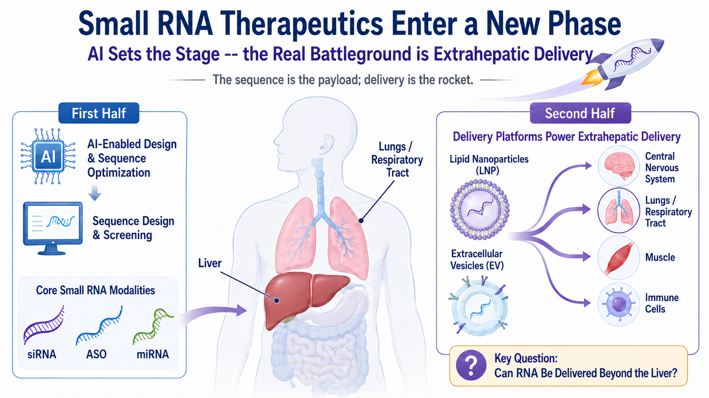
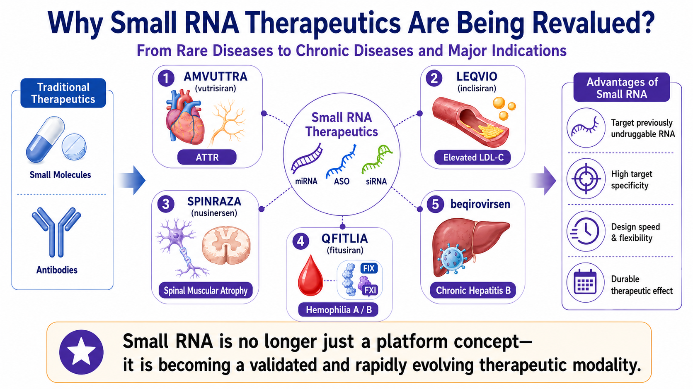
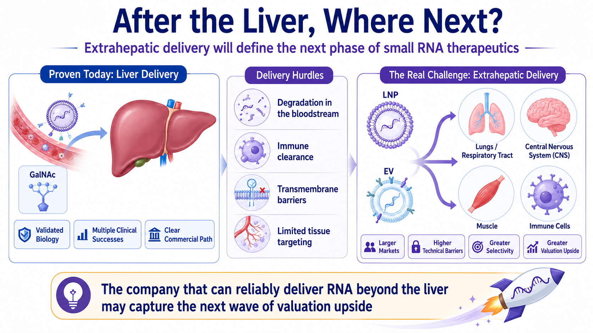
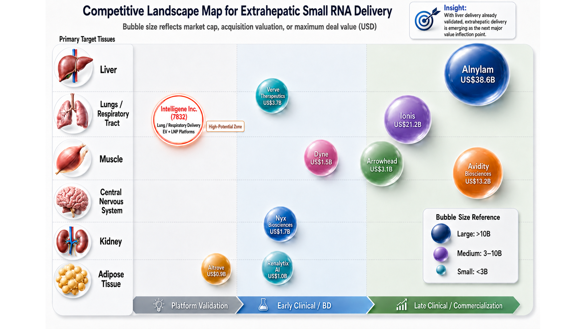
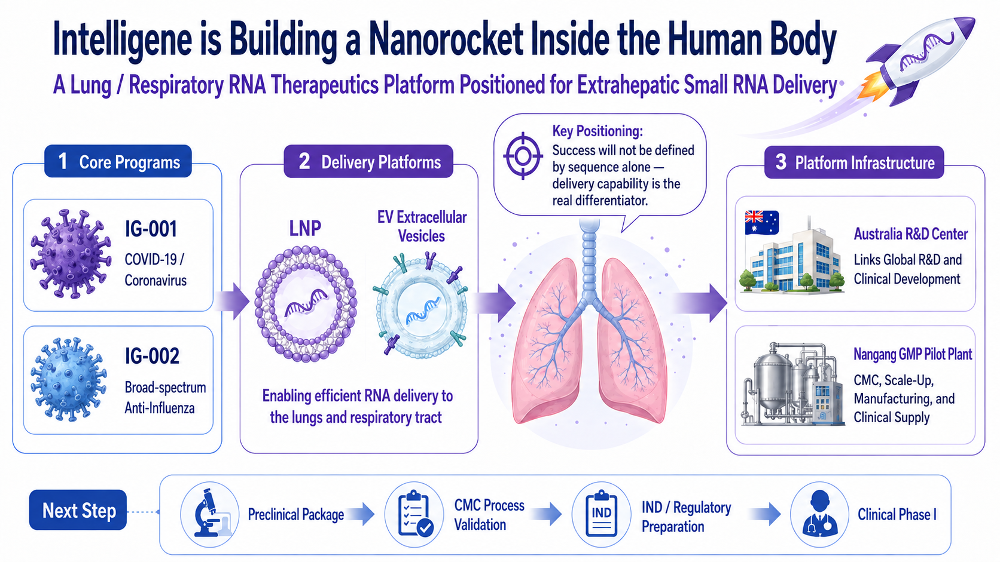

# This Taiwanese Biotech Is Building a Nanorocket Inside the Human Body

The sequence is the payload. Delivery is the rocket. The company that can move RNA beyond the liver may hold the key to the next valuation cycle in oligonucleotide therapeutics.

Source date: August 3, 2026

Some technologies begin as scientific experiments. Only after major pharmaceutical companies commit meaningful capital does the market recognize that they have become durable industry themes.

Oligonucleotide (Small RNA) therapeutics are approaching that inflection point.

In 2026, Alnylam Pharmaceuticals entered into a collaboration with AI biotech company Inceptive Nucleics valued at up to $2 billion. At first glance, the agreement looks like an RNAi leader placing a strategic bet on artificial intelligence. The deeper message is more consequential: competition in RNA medicines is no longer limited to who can design the most elegant sequence. It is increasingly about who can move a candidate into the clinic faster, more reproducibly, and with a higher probability of success. The agreement includes a $30 million upfront payment, an equity investment, and potential preclinical, regulatory, and commercial milestones, with AI being used to accelerate RNA candidate design and selection.

The fit between AI and oligonucleotide drug discovery is straightforward. Traditional small-molecule programs search for binding pockets on proteins, while antibodies generally target extracellular or cell-surface proteins. Oligonucleotides intervene further upstream in the flow of biological information: siRNA can trigger the degradation of a target mRNA, antisense oligonucleotides can alter mRNA degradation or splicing, and miRNA-based approaches may regulate broader gene networks.

In other words, oligonucleotide therapeutics shift drug discovery from finding a structure to engineering a sequence.

Once drug development begins to resemble sequence engineering, AI becomes a natural accelerator. It can support sequence design, off-target prediction, and chemical-modification optimization while reducing the volume of wet-lab trial and error. But that is only the first half of the value chain.

Even the best-designed RNA sequence cannot reach a disease site on its own.

The harder challenge comes next. An RNA medicine must survive the body’s defensive barriers, avoid rapid degradation and excessive immune interception, reach the correct organ and cell type, and generate sufficient pharmacologic activity at a tolerable dose.

That is the most unforgiving—and potentially the most valuable—problem in the second half of oligonucleotide therapeutics: delivery.

*Figure 1 | The first half of oligonucleotide therapeutics is sequence design; the second half is delivery beyond the liver.*

> Core Investment Thesis • AI is accelerating the design and selection of RNA sequences. • The next major value inflection will come from reproducible delivery beyond the liver. • A validated extrahepatic delivery route can reframe a company from a single-asset story into a platform asset.

## 01 | Oligonucleotide Therapeutics Have Moved from Scientific Promise to Commercial Reality

To distinguish a durable technology platform from a market bubble, three questions matter: Are there products? Are patients using them? Is the category generating revenue?

Oligonucleotide therapeutics have begun to produce a credible commercial scorecard.

Alnylam is the clearest example. Its RNAi portfolio has crossed the threshold from “can this modality become a drug?” into commercial scale-up. AMVUTTRA (vutrisiran) has become a flagship product for the category, while ONPATTRO (patisiran) remains a landmark in the commercialization of RNAi therapeutics. Alnylam has built its identity around RNA interference as a way to silence disease-causing genes and reduce the production of harmful proteins at the source.

Other global pharmaceutical companies have pushed oligonucleotide drugs into increasingly large disease markets.

Novartis brought siRNA into hypercholesterolemia with LEQVIO (inclisiran). Biogen’s SPINRAZA (nusinersen) became a defining antisense therapy for spinal muscular atrophy. QFITLIA (fitusiran), developed through the Sanofi–Alnylam partnership, entered prophylactic treatment for hemophilia A and B. Together, these products show that oligonucleotide therapeutics are no longer confined to technically elegant rare-disease programs; they can address chronic disease, inherited disorders, hematology, and infectious disease.

An even more consequential signal has emerged in chronic hepatitis B.

Bepirovirsen, developed by GSK and Ionis, achieved a 19% functional cure rate in the overall population and 26% in the low-viral-activity subgroup in the Phase 3 B-Well program, compared with 0% in the control arm. GSK has also noted that more than 240 million people worldwide are living with chronic hepatitis B, while current standards of care generally require long-term treatment and deliver low rates of functional cure.

Those numbers matter.

For decades, the treatment objective in chronic hepatitis B has largely been long-term viral suppression rather than functional cure after a finite course of therapy. If bepirovirsen ultimately reaches the market, it would show that oligonucleotide drugs can do more than prove themselves in rare diseases; they may reshape the treatment logic of major global indications.

That is why the category is being re-rated.

Oligonucleotide therapeutics are not simply a way to treat one disease. They represent a new, programmable language for intervening in disease biology.

*Figure 2 | Commercial RNA medicines, hepatitis B functional-cure data, and extrahepatic delivery are reshaping the small-RNA opportunity.*

## 02 | The Liver Was the First Orbit, Not the Final Destination

The liver was the dominant proving ground for the first commercial wave of oligonucleotide therapeutics.

The reason is practical. The liver naturally takes up nucleic-acid medicines from the circulation, and mature hepatocyte-targeting technologies such as GalNAc have enabled many siRNA programs to generate clinical and commercial results more efficiently.

But maturity also creates crowding.

Once the liver route was validated, the market moved to the next question:

- Can RNA be delivered beyond the liver?

The lung and airways, central nervous system, muscle, adipose tissue, and immune cells are the new territories that next-generation oligonucleotide platform companies are trying to open. These tissues are linked to large markets across chronic disease, infectious disease, neurology, autoimmunity, and oncology.

The path will not be easy.

RNA is not a conventional small molecule. It is fragile, charged, vulnerable to nuclease degradation, and generally unable to cross cell membranes on its own. Designing the molecule is not enough. It must be protected, transported, released, and activated inside the relevant disease cell.

That is why the second half of oligonucleotide therapeutics cannot be reduced to a claim that a company “has a sequence.”

*Figure 3 | Organ-level delivery difficulty is beginning to reprice RNA platform companies.*

> Payload vs. Rocket • The sequence is the payload. • Delivery is the rocket. • Without a reliable launch system, even the best payload never reaches its destination.

## 03 | Markets Are Repricing RNA Platforms by Organ-Level Difficulty and Degree of Validation

The next phase of the market is beginning to value RNA platforms along two dimensions: the difficulty of the target organ and the degree to which the delivery approach has been validated.

If a company is making incremental advances within the established liver route, investors will focus primarily on indication size, clinical stage, and commercial execution. If a company can open a new extrahepatic organ, however, the market is no longer evaluating only a single product. It is evaluating whether the company has created a new delivery gateway.

That is why muscle, the central nervous system, kidney, adipose tissue, and lung are becoming the new coordinates of the oligonucleotide industry.

Several major transactions over the past year illustrate the shift.

Novartis acquired Avidity for approximately $12 billion, not simply for exposure to one muscle disease, but for an AOC platform capable of delivering oligonucleotides into muscle tissue. Arrowhead and Novartis entered into a collaboration worth up to $2 billion around ARO-SNCA, pointing toward the more difficult central nervous system. Lilly’s agreement with Ascidian, worth up to $1.9 billion, extended RNA medicines into kidney disease and RNA exon editing. GSK’s collaboration with SiranBio showed that adipocyte-targeted siRNA is also attracting early strategic interest from large pharmaceutical companies.

Together, these transactions make one point clear:

The competitive question in the second half of oligonucleotide therapeutics is no longer simply whose RNA sequence is better. It is who can be first to open a new organ frontier.

Muscle delivery has already reached high-value acquisition territory. The central nervous system remains exceptionally difficult, but the potential market in neurodegenerative disease is enormous. Kidney and adipose tissue are being reopened through RNA editing, siRNA, and new targeting technologies. Lung and airway delivery remain less fully priced by the market, but a clinically validated platform in this area would be highly differentiated.

The competitive landscape can be read in three ways.

First, by organ. Each organ represents a different technical barrier and a different market opportunity. The liver is established; muscle is receiving high-value validation; and the central nervous system, kidney, adipose tissue, and lung are emerging as the next platform battlegrounds.

Second, by position. A company or transaction further to the right on the development spectrum has more clinical or business-development validation. A company further to the left remains at the platform-concept or early-validation stage. This distinction helps investors separate platforms supported by data from platforms still waiting for a decisive milestone.

Third, by transaction or valuation scale. A larger value reflects a higher market capitalization, acquisition value, or deal ceiling. The point is not merely to compare who is larger today. It is to use capital-market pricing as a proxy for the value that a validated delivery platform may unlock.

*Figure 4 | Intelligene is using lung and airway programs to build an EV and LNP RNA delivery platform.*

Table 1. Competitive Landscape for Extrahepatic RNA Delivery

| Company / Transaction | Primary Delivery Target | Stage / Validation | Market Cap / Acquisition Value / Deal Ceiling | Technology / Platform | Key Investment Read-Through |
| --- | --- | --- | --- | --- | --- |
| Alnylam | Primarily liver, expanding toward multiple organs | Late-stage clinical / commercial | Approx. US$38.6B market cap | RNAi / siRNA | Commercial RNAi leader; demonstrates that oligonucleotide drugs can scale into meaningful sales. |
| Ionis | Liver, CNS, rare and chronic diseases | Late-stage clinical / commercial | Approx. US$12.2B market cap | ASO / LICA | Bepirovirsen extends the ASO opportunity from rare disease into a major chronic hepatitis B market. |
| Avidity | Muscle | Late-stage clinical / near-commercial | Approx. US$12.0B acquisition value | AOC (antibody–oligonucleotide conjugate) | Novartis’s high-value acquisition strategically validated muscle delivery as a platform asset. |
| Arrowhead | CNS, lung, cardiometabolic tissues and other targets | Early clinical / BD | Approx. US$10.3B market cap | TRiM RNAi | The ARO-SNCA collaboration with Novartis supports the licensing value of an extrahepatic RNAi platform. |
| Dyne | Muscle | Early- to mid-stage clinical | Approx. US$3.1B market cap | FORCE platform | Commonly viewed as an important benchmark for Avidity and the muscle-delivery field. |
| Wave | Adipose / metabolism / CNS | Platform concept to early clinical | Approx. US$1.1B market cap | Stereopure oligonucleotides | Shows that extrahepatic delivery still requires validation through clinical endpoints and a clear commercial position. |
| Alnylam × Inceptive | Primarily liver; focused on sequence-design capabilities | Early clinical / BD | Deal ceiling: US$2.0B | AI + RNA design | Signals that the sequence-design half of oligonucleotide R&D is entering an AI-enabled industrialization phase. |
| Lilly × Ascidian | Kidney | Early clinical / BD | Deal ceiling: US$1.9B | RNA exon editing | Shows RNA value expanding from gene silencing toward functional repair. |
| SiranBio × GSK | Adipose tissue | Early clinical / BD | Deal ceiling: US$1.0B | Adipocyte-targeted siRNA | A representative transaction in the emerging field of extrahepatic adipose targeting. |
| Intelligene | Lung / respiratory tract | Platform concept to early clinical | NT$6.96B market cap (Aug. 3, 2026; update before publication) | EV + LNP RNA delivery platform | The core question is not current size, but whether IND, Phase 1, and CMC data can validate pulmonary RNA delivery. |

Note: Market capitalizations, acquisition values, and deal ceilings are retained from the source draft. Intelligene’s market capitalization is stated as of August 3, 2026 and should be refreshed before publication.

Breaking the landscape down by company, target organ, platform, and transaction value makes the underlying message more explicit.

This is not a ranking of who has already won. It shows that the oligonucleotide industry is moving from a liver-centric model toward multi-organ delivery competition. Each newly validated organ may become a new entry point for platform re-rating.

That is why the market should track not only the companies that have already attracted high-value acquisitions or licensing deals, but also earlier-stage companies attempting to open new organ routes.

Within this landscape, the central question for Intelligene is whether its lung and airway strategy can become the next validated extrahepatic delivery entry point.

## 04 | Intelligene Is Building a Nanorocket Inside the Human Body

Against this backdrop, Intelligene Inc. (7832) should be viewed through a different lens.

What makes the company strategically interesting is not simply that it is developing RNA medicines, nor that its story can be framed around COVID-19 or influenza. It is that Intelligene has chosen the lung and respiratory tract as its initial battleground.

The company’s lead program, IG-001, is being developed for COVID-19 and other coronavirus infections. IG-002 is being advanced as a broad-spectrum influenza therapy. On the surface, these are respiratory antiviral candidates. At a platform level, however, the two infectious-disease programs are intended to accelerate the build-out of a broader extrahepatic RNA therapeutic platform for the respiratory system.

That distinction matters.

If IG-001 is viewed only as a post-pandemic standalone asset, the market is likely to value it against short-term demand. Viewed as a platform program, the objective is more durable: design RNA medicines against relatively conserved viral sequences that are less prone to rapid mutation, thereby suppressing viral replication through a strategy that may be broader and easier to update.

Respiratory viruses are not a one-time problem.

COVID-19 demonstrated the threat posed by emerging viruses. Influenza provides an annual reminder that seasonal respiratory disease has never disappeared. Older adults, patients with chronic disease, and immunocompromised populations continue to need better antiviral options. Traditional antiviral drugs can face variant escape and resistance. If RNA medicines can target more conserved viral regions, they may support broader-spectrum and more rapidly updateable treatment strategies.

That is the basis of Intelligene’s differentiation.

The company is not entering the most mature and crowded liver-delivery segment. It is pursuing the more difficult—and potentially more distinctive—lung and airway route, with the longer-term objective of expanding into a strategically important extrahepatic targeting system.

Difficulty creates risk. But if the platform works, difficulty is also what makes the value visible.

## 05 | Extracellular Vesicles: The Real Barrier Is CMC, Not Imagination

If RNA is the payload, extracellular vesicles are the delivery vehicle—the nanorocket Intelligene is trying to build.

Extracellular vesicles, or EVs, can be understood as small, naturally occurring vesicles used by cells to exchange information. According to the company’s disclosures, EVs are approximately 40 to 150 nanometers in size, can carry biological molecules, and are capable of crossing cell membranes and supporting intercellular communication. Intelligene is developing both lipid nanoparticles (LNPs) and EV-based delivery systems. At its GMP pilot plant and process R&D center in the Taipei Biotechnology Park, the company is building process development, scale-up validation, and chemistry, manufacturing, and controls capabilities to support preclinical and early clinical programs.

EVs are not magic.

The real difficulty is not the story. It is CMC.

Which cell source should be used? How can culture conditions be standardized? How will the EVs be purified? How will RNA loading be measured? Is particle-size distribution consistent from batch to batch? Does biological activity remain stable? Can product quality be maintained after manufacturing is scaled?

These questions—not the conceptual appeal of exosomes—will determine whether an EV-based medicine can enter the clinic.

Many platform companies ultimately fail not because the science is uninteresting, but because manufacturing does not translate. Producing a promising result in the laboratory is not the same as producing clinical-grade drug. A high-quality small batch does not guarantee that the process will remain stable at scale.

For that reason, Intelligene’s investment in its own GMP pilot plant and process-development center should not be treated as a simple facilities announcement. The company states that it has established an initial foundation and process stability in EV manufacturing. The pilot facility is scheduled for completion in the second half of the year, followed by equipment installation and pilot production. For an early-stage RNA company, process capability is strategic leverage when discussing clinical development, licensing, and international partnerships.

A real nanorocket is not an arrow drawn on a presentation slide. It is a product that can be manufactured consistently, pass quality testing, and support clinical supply batch after batch.

For Intelligene’s EV platform to be re-rated, the company will need to demonstrate that EVs can become a manufacturable, controllable, and scalable drug-delivery vehicle.

## 06 | Australia Connects a Taiwan-Built Platform to an International Clinical Pathway

A second part of Intelligene’s strategy that warrants attention is its Australian footprint.

The company has entered into a collaboration with Australia’s Kirby Institute. The collaboration provides access to BRIDGE program support equivalent to as much as A$5 million—approximately NT$100 million—in research resources for nucleic-acid drug development, linking Australian R&D, clinical-research, and regulatory capabilities to the advancement of RNA therapeutics. Intelligene has also established an overseas R&D center in Australia’s Gold Coast Health and Knowledge Precinct (GCHKP).

For an early-stage drug developer, the value of an overseas site is not the address itself. It is whether the site can connect R&D, clinical development, regulatory strategy, and international partnerships into a functioning pathway.

Any RNA therapeutic intended for global development will eventually face toxicology packages, clinical-trial design, CMC documentation, regulatory interactions, and diligence by potential licensing partners. Connecting to international development infrastructure earlier can reduce the risk of costly detours later.

Viewed together, the Taiwan and Australia strategy has a clearer logic.

Taiwan provides the manufacturing base and pilot facility. Australia provides access to R&D, clinical, regulatory, and international collaboration resources. One is the root; the other is the gateway. The former gives the company greater control over manufacturing and quality, while the latter gives the technology a path toward larger markets.

For an early-stage biotech company, that is a practical and strategically coherent configuration.

## 07 | The Market Will Now Look for Lift-Off Data

Intelligene remains an early-stage, R&D-intensive drug-development company. It is not a mature pharmaceutical business and should not be valued through the price-to-earnings logic applied to revenue-generating companies.

The more relevant framework is whether the company can deliver a sequence of de-risking milestones.

- Can IG-001/IG-002 complete its preclinical package and advance into Phase 1?

- Can IG-001/IG-002 demonstrate broad-spectrum potential across multiple COVID-19 and influenza strains?

- Can EV-based candidates advance meaningfully toward Phase 1?

- Can the EV platform generate data on RNA loading, stability, delivery efficiency, and batch-to-batch consistency?

- Can the Nangang GMP pilot plant complete commissioning and validation and support the manufacture of clinical-trial material?

- Can the Australian R&D center translate into tangible clinical, regulatory, and international-partnership progress?

These are not slogans. They are measurable, auditable indicators.

A company is not truly re-rated by thematic exposure or a memorable tagline alone. It must produce data at the points where the technical risk is highest.

For Intelligene, the “nanorocket inside the human body” is more than a marketing metaphor. It is a concise description of the problem the company is trying to solve: turning an RNA sequence created in the laboratory into a drug that can reach disease sites in the lung and respiratory tract.

*Figure 5 | Intelligene's next valuation variables include preclinical data, IND progress, Phase 1 entry, CMC execution, and international partnerships.*

## Conclusion | In the Second Half of Oligonucleotide Therapeutics, Value Lies in Reaching the Target

The oligonucleotide story is no longer written only in the future tense.

Alnylam’s deal of up to $2 billion with Inceptive shows that RNA drug discovery is becoming more industrialized through AI. Lilly’s agreement with Ascidian, worth up to $1.9 billion, shows RNA value expanding from gene silencing toward functional repair and kidney delivery. GSK’s bepirovirsen has created the possibility of functional cure in chronic hepatitis B. Novartis’s approximately $12 billion acquisition of Avidity sends an even clearer message: once extrahepatic RNA delivery produces clinically persuasive evidence, it is no longer a platform narrative—it becomes a strategic asset that large pharmaceutical companies are willing to acquire at scale.

Yet the most important part of the second half is only beginning.

The liver has been validated. The next questions are whether RNA can reach the lung, muscle, central nervous system, and immune cells.

Those questions contain the valuation logic for the next generation of oligonucleotide platform companies.

That is why Intelligene’s position is worth examining now.

The company is not competing in the most mature and crowded liver route. It is targeting the earlier, more difficult, and more differentiated lung and airway opportunity, with a longer-term ambition to establish broader extrahepatic targeting capabilities. It is linking RNA drug candidates, EV-based delivery, Australian R&D collaboration, a Taiwan-based pilot plant, and Phase 1 development objectives into an international platform pathway that remains uncommon among Taiwan’s biotech companies.

In the first half of oligonucleotide therapeutics, the market asked who could design an effective sequence.

In the second half, the market will ask who can actually deliver it to the disease site.

That is the challenge Intelligene has chosen to take on: building a nanorocket inside the human body.

## References

1. [Alnylam, Inceptive sign up to $2 billion AI drug discovery deal | Reuters](https://www.reuters.com/legal/litigation/alnylam-inceptive-sign-up-2-billion-ai-drug-discovery-deal-2026-06-03/)
2. [The Leading RNAi Therapeutics Company | Alnylam](https://www.alnylam.com/)
3. [Bepirovirsen achieves unprecedented functional cure rates with potential to redefine treatment for chronic hepatitis B | GSK](https://www.gsk.com/en-gb/media/press-releases/bepirovirsen-achieves-unprecedented-functional-cure-rates-with-potential-to-redefine-treatment-for-chronic-hepatitis-b/)
4. [Intelligene — Core Technology](https://www.intelli-gene.com/en/research)
5. [Intelligene — News and Media](https://www.intelli-gene.com/en/news)

## Disclaimer

This article provides an analysis of industry trends only and does not constitute investment advice. Biotech stocks are highly volatile; please assess the risks yourself.
