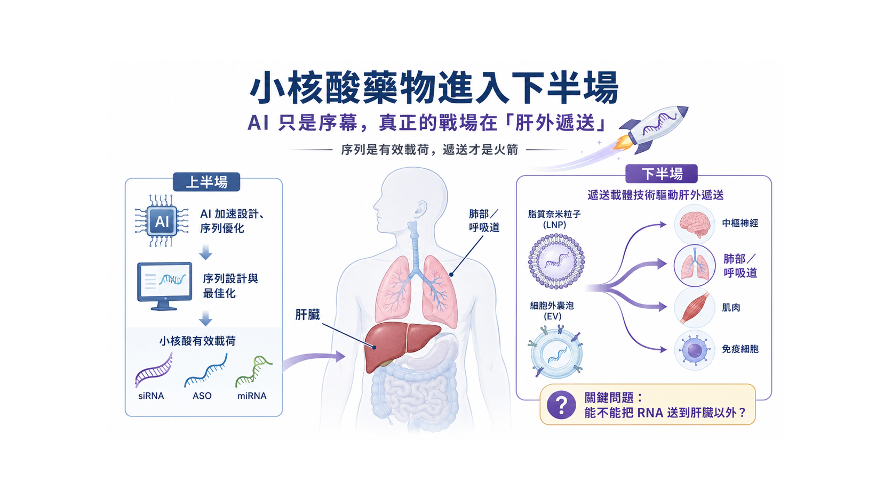
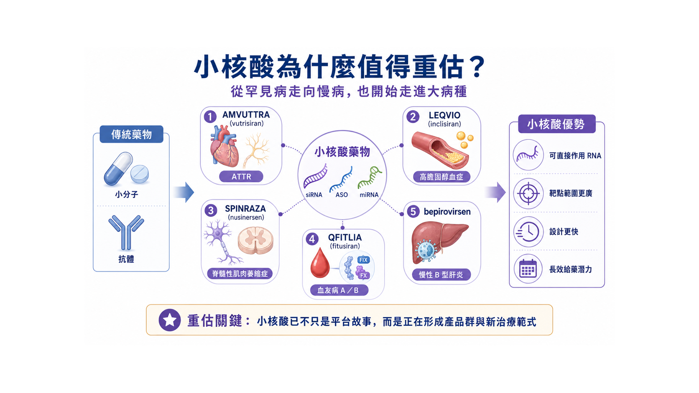
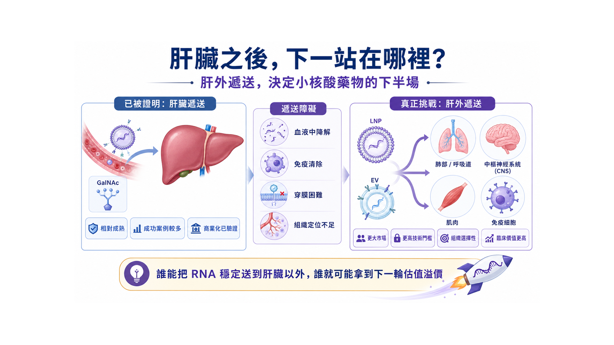
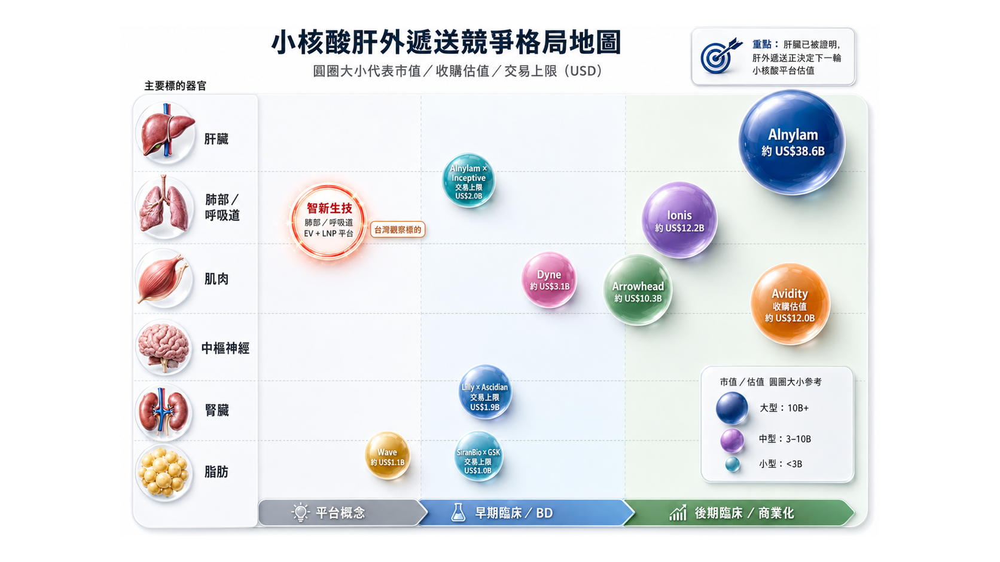
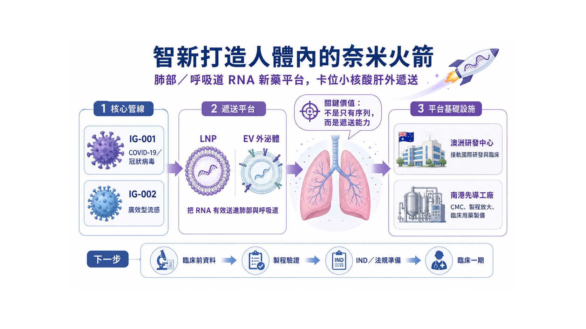

# 這家台灣Biotech正在打造人體內奈米火箭

【序列是有效載荷，遞送才是火箭；誰能把 RNA 送到肝臟以外，誰才握住下一輪小核酸估值密碼】

有些技術，剛開始像是一場科學實驗；等到大藥廠真金白銀砸下去時，才會被市場看見它其實是一條產業主線。

小核酸藥物正在走到這個位置。

今年 Alnylam Pharmaceuticals 與 AI 生技公司 Inceptive Nucleics 簽下最高 20 億美元合作，表面上是 RNAi 龍頭押注人工智慧；更深一層看，這筆交易其實在宣告：小核酸藥物的競爭，已經不只是在比誰能寫出更好的序列，而是比誰能更快、更穩、更有效地把 RNA 藥物推向臨床。Alnylam 這筆合作包含 3,000 萬美元前期對價、股權投資，以及臨床前、監管與銷售里程碑，目標是用 AI 加速 RNA 藥物候選分子的設計與篩選。

小核酸之所以特別適合 AI，不難理解。傳統小分子藥物要尋找蛋白質上的結合口袋，抗體藥物多半要鎖定細胞外或細胞膜上的蛋白；但小核酸更像是在生命訊息的上游動刀。siRNA（小干擾核酸） 可以讓目標 mRNA 被降解，ASO（反義寡核苷酸） 可以影響 mRNA 降解或剪接，miRNA（微小核糖核酸） 則有機會調節一整串基因網路。

換句話說，小核酸把藥物開發從「尋找結構」推向「設計序列」。

當藥物變得更像序列工程，AI 自然會成為加速器。它可以協助序列設計、脫靶風險預測、化學修飾優化，也可以減少過去大量濕實驗試錯的時間。可是，這只是故事的上半場。

因為 RNA 序列設計得再漂亮，也不會自己抵達病灶。

真正困難的地方在後面：它要穿過人體裡層層防線，不被分解，不被免疫系統過度攔截，最後還要進到正確器官、正確細胞，並且在安全劑量下產生足夠藥效。

這就是小核酸下半場最殘酷、也最值錢的問題：遞送。

*圖1｜小核酸藥物的上半場是序列設計，下半場是遞送能否抵達病灶*

## 01｜小核酸已經從故事，變成賣得動的藥

判斷一個新技術是不是泡沫，不能只看論文，也不能只看想像空間，最後還是要問三件事：有沒有產品？有沒有病人使用？有沒有營收？

小核酸現在已經開始交成績單。

Alnylam 是最具代表性的公司。它的 RNAi 藥物已經跨過「能不能成藥」的門檻，進入商業放量階段。AMVUTTRA（vutrisiran） 成為小核酸商業化的重要代表，ONPATTRO（patisiran） 則是 RNAi 藥物走向市場的里程碑。Alnylam 自身也把公司定位為 RNAi 治療領域的先行者，強調 RNAi 能透過沉默致病基因，從源頭減少有害蛋白產生。

其他國際藥廠也陸續把小核酸推進更大的疾病市場。

Novartis 的 LEQVIO（inclisiran） 把 siRNA 帶進高膽固醇血症市場；Biogen 的 SPINRAZA（nusinersen） 是 ASO 治療脊髓性肌肉萎縮症的重要代表；Sanofi 與 Alnylam 合作的 QFITLIA（fitusiran） 則切入血友病 A 與 B 的預防性治療。這些產品共同證明，小核酸不再只是罕見疾病裡的漂亮技術，而是可以進入慢病、遺傳疾病、血液疾病與病毒感染等更大戰場。

更具指標性的突破，來自慢性 B 型肝炎。

GSK 與 Ionis 合作開發的 bepirovirsen，在三期 B-Well 研究中，於整體族群達到 19% 功能性治癒率，在低病毒活性族群達到 26%，對照組則為 0%。GSK 也指出，目前全球有超過 2.4 億人受慢性 B 肝影響，而現行標準治療多半需要長期用藥，功能性治癒率仍低。

這個數據很有重量。

B 型肝炎過去很長一段時間，是「壓制病毒」而不是「有限療程後追求功能性治癒」。如果 bepirovirsen 最終能順利走向市場，代表小核酸不只是在罕見病裡證明自己，而是有機會改寫全球大病種的治療邏輯。

這正是小核酸被重新估值的原因。

它不是只解決一種病，而是提供了一套新的疾病干預語言。

*圖2｜小核酸藥物從商業化產品、慢性 B 肝功能性治癒訊號到肝外遞送新戰場*

## 02｜肝臟是第一個軌道，但不是最後一站

小核酸的前半場，肝臟是最重要的舞台。

原因很現實：肝臟本來就容易吸收血液循環中的核酸藥物，再加上 GalNAc 這類肝細胞導向技術成熟，讓許多 siRNA 藥物能比較順利跑出臨床與商業化成果。

但成熟，也意味著擁擠。

當肝臟路線被證明可行，市場自然會往下一個問題看：

RNA 能不能送到肝臟之外？

肺部、呼吸道、中樞神經、肌肉、脂肪、免疫細胞，這些才是下一輪小核酸平台公司真正想打開的新版圖。這些組織背後連著的，是龐大的慢病、感染症、神經疾病、自體免疫與腫瘤市場。

只是，這條路不會好走。

RNA 不是一般小分子。它脆弱、帶電、容易被核酸酶分解，也不容易自己穿過細胞膜。藥物不是設計出來就算完成，還要被保護、被運送、被釋放，最後在病灶細胞裡產生效果。

所以，小核酸的下半場，不能只談「我有序列」。

- 序列是有效載荷。
- 遞送才是火箭。
- 沒有火箭，再好的有效載荷也抵達不了目的地。

*圖3｜肝臟之外的器官遞送難度，正在重新定價 RNA 平台公司*

## 03｜市場正在用「器官難度」重新定價 RNA 平台

小核酸的下半場用「器官難度」與「驗證程度」重新定價平台公司。

如果一家公司只是在肝臟路線上做增量創新，市場會更重視適應症大小、臨床進度與商業化能力；但如果一家公司能打開肝臟以外的新器官，市場看的就不只是單一產品，而是它是否有機會建立新的遞送入口。

這也是為什麼肌肉、中樞神經、腎臟、脂肪與肺部，正在成為小核酸產業的新座標。

其中，近一年幾個重要交易特別值得注意。

Novartis 以約 120 億美元收購 Avidity，看中的不是單一肌肉疾病題材，而是 Avidity 能把寡核苷酸送進肌肉組織的 AOC 平台。Arrowhead 與 Novartis 針對 ARO-SNCA 簽下最高 20 億美元合作，指向的是更困難的中樞神經系統。Lilly 與 Ascidian 的最高 19 億美元合作，則把 RNA 藥物推向腎臟疾病與 RNA exon editing。GSK 與 SiranBio 的合作，則代表脂肪細胞導向 siRNA 也開始被大藥廠提前押注。

這些事件共同說明一件事：

小核酸下半場的競爭，不再只是「誰的 RNA 序列比較好」，而是「誰能率先打開新的器官戰場」。

肌肉已經被 Avidity 這類公司推到高價併購階段；中樞神經雖然難度最高，但神經退化疾病市場想像巨大；腎臟與脂肪正在被 RNA editing、siRNA 與新型靶向技術重新打開；而肺部與呼吸道，則是另一個尚未完全被市場定價、但一旦跑出來就會很有辨識度的方向。

*圖4｜智新生技以肺部與呼吸道為起點，打造 EV 與 LNP RNA 遞送平台*

下面這張競爭格局圖，不只是把公司放在一起比較，而是把「器官」、「成熟度」與「估值」三件事放在同一張地圖裡。

小核酸肝外遞送的格局地圖可以用三個方向來讀：

第一，看器官。

不同器官代表不同難度，也代表不同的市場想像。肝臟已經成熟，肌肉正在被高價驗證，中樞神經、腎臟、脂肪與肺部則是下一批平台公司想打開的新戰場。

第二，看位置。

越往右，代表臨床或 BD 驗證越成熟；越靠左，代表仍在平台概念或早期驗證階段。這能幫助市場區分，哪些公司已經被數據驗證，哪些公司還處在等待關鍵數據的階段。

第三，看圓圈大小。

圓圈越大，代表市場市值、收購估值或交易上限越高。這不是單純比誰現在比較大，而是用資本市場的定價，反映不同平台被驗證後可能打開的價值空間。

| 表1、肝外遞送競爭格局比較表 | 表1、肝外遞送競爭格局比較表 | 表1、肝外遞送競爭格局比較表 | 表1、肝外遞送競爭格局比較表 | 表1、肝外遞送競爭格局比較表 | 表1、肝外遞送競爭格局比較表 |
| --- | --- | --- | --- | --- | --- |
| 公司 / 事件 | 主要遞送器官 | 成熟度位置 | 市值 / 估值 / 交易上限 | 技術 / 平台 | 觀察重點 |
| Alnylam | 肝臟為主，並向多器官延伸 | 後期臨床 / 商業化 | 約 US$38.6B 市值 | RNAi / siRNA | RNAi 商業化龍頭，證明小核酸已能放量銷售。 |
| Ionis | 肝臟、CNS、罕病 / 慢病 | 後期臨床 / 商業化 | 約 US$12.2B 市值 | ASO / LICA | bepirovirsen 讓 ASO 從罕病延伸至慢性 B 肝大病種。 |
| Avidity | 肌肉 | 後期臨床 / 商業化邊緣 | 約 US$12.0B 收購估值 | AOC（抗體-寡核苷酸偶聯物） | Novartis 高價收購，代表肌肉遞送平台被戰略性驗證。 |
| Arrowhead | CNS、肺部、心代謝等 | 早期臨床 / BD | 約 US$10.3B 市值 | TRiM RNAi | 與 Novartis 的 ARO-SNCA 合作顯示肝外 RNAi 平台具授權價值。 |
| Dyne | 肌肉 | 早期至中期臨床 | 約 US$3.1B 市值 | FORCE 平台 | 常被視為 Avidity 的重要對標公司。 |
| Wave | 脂肪 / 代謝 / CNS | 平台概念至早期臨床 | 約 US$1.1B 市值 | stereopure oligonucleotide | 顯示肝外遞送仍需以臨床終點與商業定位驗證價值。 |
| Alnylam × Inceptive | 肝臟為主，偏序列設計端 | 早期臨床 / BD | 交易上限 US$2.0B | AI + RNA 設計 | 說明小核酸上半場正進入 AI 工業化設計。 |
| Lilly × Ascidian | 腎臟 | 早期臨床 / BD | 交易上限 US$1.9B | RNA exon editing | 代表 RNA 價值由沉默基因走向功能修復。 |
| SiranBio × GSK | 脂肪 | 早期臨床 / BD | 交易上限 US$1.0B | 脂肪細胞導向 siRNA | 是脂肪組織肝外靶向的代表性新交易。 |
| 智新生技 | 肺部 / 呼吸道 | 平台概念至早期臨床 | NT$69.6億新台幣 (2026.08.03數據) | EV + LNP RNA 遞送平台 | 核心看點不是現值大小，而是能否以 IND / Phase 1 / CMC 數據證明肺部 RNA遞送可行。 |

進一步把主要公司、標的器官、技術平台與交易估值拆開來看。

它要傳達的重點不是「誰已經贏了」，而是：小核酸產業正在從肝臟單一路線，走向多器官遞送競爭。每一個新器官，都可能成為下一個平台重估的入口。

也因此，真正值得關注的，不只是已經被高價收購或授權的公司，也包括那些還在早期、但正在挑戰新器官遞送的公司。

在這張肝外遞送競爭地圖裡，智新正在挑戰的肺部與呼吸道路線，是否有機會成為下一個被驗證的新器官入口？

## 04｜智新打造人體內的奈米火箭

放在這個脈絡下，智新生技（7832） 值得被重新理解。

智新真正有意思的地方，不是單純說自己也做 RNA，也不是把故事停在 COVID-19 或流感題材，而是它選擇把戰場先放在肺部與呼吸道。

公司主力管線 IG-001 鎖定 COVID-19 與冠狀病毒感染相關治療，IG-002 則朝廣效型流感治療推進。表面看，這是呼吸道病毒藥物；但深一層看，它其實是在透過這兩個傳染性疾病藥物管線的推進來加速建立一個全面的肝外靶向RNA 治療平台。

這個差別很大。

如果只把 IG-001 看成疫情後的單一產品，市場很容易用短線需求去評價它；但如果從平台角度看，智新想做的是針對呼吸道病毒中相對保守、較不容易快速變異的序列區段，設計 RNA 藥物來抑制病毒複製。

呼吸道病毒從來不是一次性問題。

COVID-19 讓世界看見新興病毒的威脅，流感則每年提醒我們，季節性病毒從未離開。高齡者、慢性病患者、免疫功能較弱族群，長期都需要更好的抗病毒工具。傳統抗病毒藥物常常會面對變異株逃脫與抗藥性問題；若 RNA 藥物能鎖定病毒較保守的序列，就有機會建立更廣效、也更能快速更新的治療策略。

這正是智新的差異化所在。

它不是選擇最成熟、最擁擠的肝臟小核酸路線，而是切入更難、也更有辨識度的肺部與呼吸道，進一步拓展到更具備戰略意義與市場價值的肝外靶向系統中。

難，代表風險。但難，也代表一旦做出來，平台價值會被看見。

## 05｜EV 外泌體：真正的門檻在製程，不在想像

如果 RNA 是有效載荷，那 EV (外泌體) 就是智新正在打造的奈米火箭。外泌體可以理解為細胞之間傳遞訊息的小型天然囊泡。智新目前揭露，外泌體約 40 至 150 奈米，能攜帶生物分子，也具備跨越細胞膜與進行細胞溝通的特性；智新同時布局 LNP（脂質奈米顆粒） 與 外泌體，並在台北生技園區的GMP先導工廠-製程研發中心推進 RNA 藥物之製程開發、放大驗證（scale-up）與 CMC 能力建立，以支援臨床前及早期臨床需求。

外泌體不是魔法。

它真正困難的地方，不在故事，而在 CMC（製程與品質管制）。

細胞來源怎麼選？培養條件怎麼固定？外泌體怎麼純化？RNA 包覆率怎麼測？每一批粒徑分布是否一致？藥物活性是否穩定？放大製造後，品質是否還能維持？

這些問題，才是 外泌體藥物 能不能走進臨床的關鍵。

很多平台公司最後不是輸在科學，而是輸在製造。實驗室做得出來，不等於臨床用藥做得出來；小批量做得漂亮，不代表放大後仍然穩定。

所以智新自己建置先導工廠-製程研發中心，這件事不能只當成硬體新聞，公司在外泌體製程上已建立一定基礎與穩定性，且先導工廠將於下半年完工並進駐設備展開試產。對早期 RNA 公司來說，製程能力就是未來談臨床、談授權、談國際合作時的底氣。

真正的「奈米火箭」，不是簡報上畫出來的箭頭，而是能不能一批一批穩定做出來，能不能通過品質驗證，能不能支撐臨床用藥。

智新的 外泌體 平台若要被市場重估，關鍵在於它能不能把外泌體變成可製造、可品管、可放大的藥物載體。

## 06｜澳洲布局：把台灣平台接上國際臨床航道

智新另一個值得觀察的點，是澳洲布局。

公司已與澳洲 Kirby Institute 簽署合作，獲得BRIDGE計畫贊助最高 500 萬澳幣（約新台幣 1億元）等同研究資源,用於核酸新藥開發 。連結澳洲研發、臨床研究與法規資源，以支持 RNA therapeutics之研究開發；智新目前也在澳洲黃金海岸的健康與知識創新園區(GCHKP)設置海外研發中心。

對早期新藥公司來說，海外據點的重點不只是掛招牌，而是能不能把研發、臨床、法規與國際合作真正串起來。

RNA 藥物若要走向國際，最後一定會面對毒理資料、臨床試驗設計、製程文件、監管溝通與潛在授權夥伴審查。越早接上國際場域，越能降低後面走彎路的機率。

智新的路徑若把台灣與澳洲合起來看，輪廓就更清楚。

台灣這邊建立製程與先導工廠，澳洲那邊接軌研發、臨床與國際合作。前者是根，後者是門；前者讓公司掌握製造與品質，後者讓技術有機會走向更大的市場。

這對一家早期生技公司來說，是很實際的布局。

## 07｜接下來，市場會看的是升空數據

當然，智新仍然是一家高研發投入、早期階段的新藥公司。它不是成熟藥廠，也不能用營收型公司的本益比去評價。

真正適合它的觀察方式，是看里程碑能不能連續兌現。

- IG-001/IG-002 能不能順利完成臨床前資料，並推進到臨床一期？
- IG-001/IG-002 能不能展現對多種新冠與流感病毒株的廣效潛力？
- EV 類候選藥物能不能真正往臨床一期前進？
- 外泌體平台能不能拿出包覆率、穩定性、遞送效率與批次一致性的數據？
- 南港的GMP先導工廠能不能完成試車、驗證並支援臨床用藥製備？
- 澳洲研發中心能不能持續轉化為臨床、法規與國際合作進展？

這些不是口號，而是可以被檢查的硬指標。

一家公司要被真正重估，不能只靠題材，也不能只靠一句漂亮標語。它必須在最困難的地方，逐步拿出資料。

對智新來說，「人體內的奈米火箭」不是為了聽起來炫，而是很貼近它正在解的問題：如何把 RNA 從實驗室裡的序列，變成能被送進肺部與呼吸道病灶的藥物。

*圖5｜智新生技的下一階段估值變數，包括臨床前資料、IND、Phase 1、CMC 與國際合作*

## 結語｜小核酸下半場，真正的價值在抵達

小核酸的故事，已經不只是未來式。

Alnylam 用 20 億美元押注 AI，說明 RNA 藥物研發正在加速工業化；Lilly 與 Ascidian 最高 19 億美元 RNA exon editing 腎病合作，說明 RNA 藥物價值正在從沉默基因，走向功能修復與肝外器官戰場；GSK 的 bepirovirsen 讓慢性 B 型肝炎看見功能性治癒希望；Avidity 被 Novartis 用約 120 億美元收購，更直接告訴市場：只要肝外 RNA 遞送能拿出臨床說服力，它就不再只是平台故事，而是大藥廠願意重金買下的戰略資產。

可是，真正精彩的下半場才剛開始。

肝臟已經被證明，接下來大家會追問：RNA 能不能送進肺？能不能送進肌肉？能不能送進中樞神經？能不能送進免疫細胞？

這些問題背後，藏著下一輪小核酸平台公司的估值密碼。

智新生技的價值，正是在這個時候變得值得討論。

它卡位的不是最成熟、最擁擠的肝臟路線，而是更難、更早期、也更具差異化的肺部與呼吸道與進一步的全方位肝外靶向遞送。它把 RNA 核酸新藥、EV 外泌體遞送、澳洲研發合作、台灣先導工廠與臨床一期推進目標串在一起，形成台灣生技市場少見的國際化平台路徑。

小核酸的上半場，市場看的是誰能寫出有效序列。

小核酸的下半場，市場會看誰能真正抵達病灶。

而智新正在挑戰的，就是打造人體內的奈米火箭。

## 參考資料

1. [Alnylam, Inceptive sign up to $2 billion AI drug discovery deal | Reuters](https://www.reuters.com/legal/litigation/alnylam-inceptive-sign-up-2-billion-ai-drug-discovery-deal-2026-06-03/)
2. [The Leading RNAi Therapeutics Company | Alnylam](https://www.alnylam.com/)
3. [Bepirovirsen achieves unprecedented functional cure rates with potential to redefine treatment for chronic hepatitis B | GSK](https://www.gsk.com/en-gb/media/press-releases/bepirovirsen-achieves-unprecedented-functional-cure-rates-with-potential-to-redefine-treatment-for-chronic-hepatitis-b/)
4. [核心技術 - Intelligene Inc. | Innovate the cures of tomorrow.](https://www.intelli-gene.com/en/research)
5. [媒體發表 - Intelligene Inc. | Innovate the cures of tomorrow.](https://www.intelli-gene.com/en/news)

## 免責聲明

本文僅為產業趨勢分析，不構成任何投資建議。生技股波動大，請自行評估風險。
