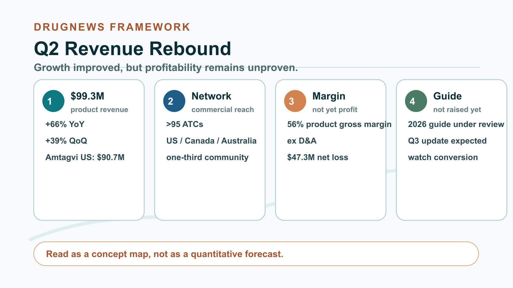
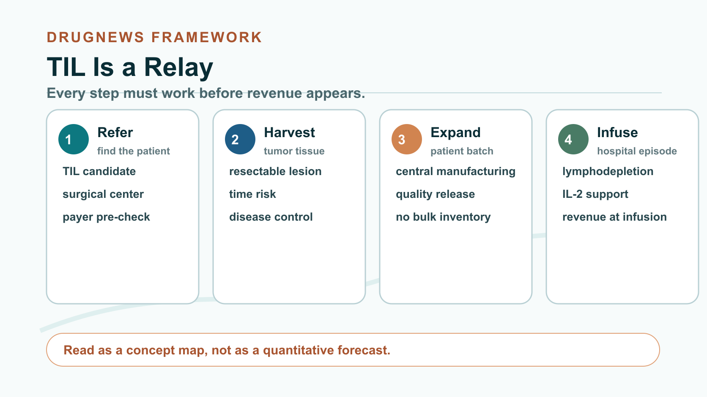
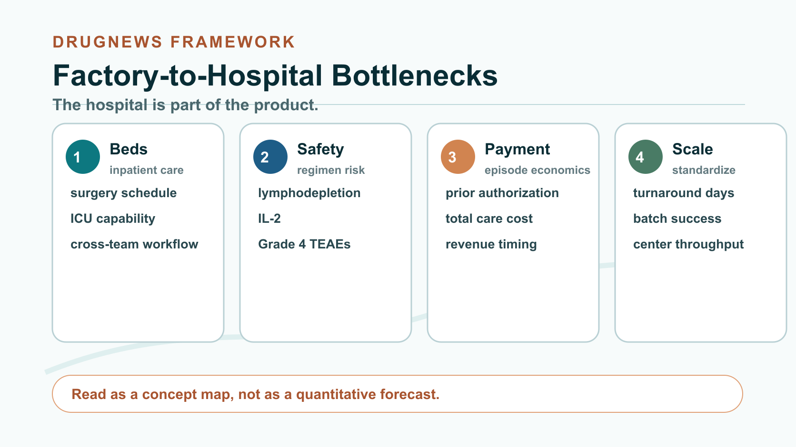
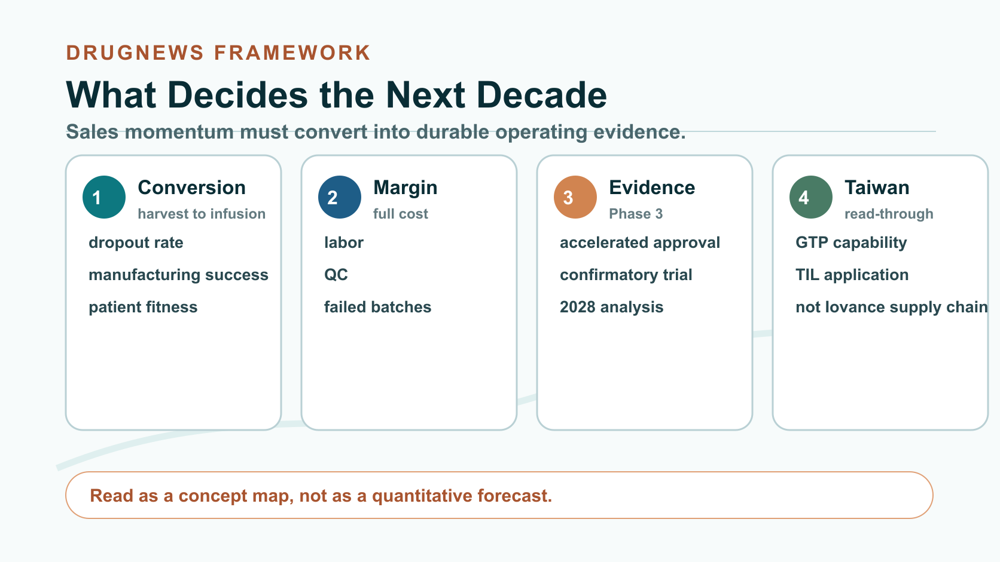

# Revenue Jumped 39%, Yet Iovance Still Lost $47 Million: Can Cancer Cell Therapy Become a Business?

A year ago, the market was still asking whether a cancer cell therapy manufactured individually for every patient could ever become a real business.

In the second quarter of 2026, Iovance gave investors a much stronger answer than before. Total product revenue reached $99.31 million, up 66% year over year and 39% sequentially. U.S. Amtagvi revenue was about $90.72 million, above the company's prior quarterly guidance range of $79 million to $81 million.

The numbers are bright. But the important question is no longer the old one: whether TIL therapy can work.

Amtagvi is already the first FDA-approved tumor-infiltrating lymphocyte therapy. The question now is whether a treatment that requires tumor resection, patient-specific cell expansion and hospital reinfusion can be turned into a stable, reproducible and reimbursable medical service.

This competition has moved far beyond the laboratory.

## 01 | This rebound is about a process that is beginning to work

Iovance disclosed that its authorized treatment center network now exceeds 95 sites across the United States, Canada and Australia, with roughly one-third of the network represented by community centers. It also reported that turnaround time from tumor receipt to product availability has been reduced to under 31 days.

Those figures need careful reading. The 95 sites are not all in the United States, and the sub-31-day turnaround is an operational disclosure, not a guarantee that every patient can complete therapy within that period.

The other key change is manufacturing. In the first quarter of 2026, Iovance centralized commercial and clinical manufacturing at its own iCTC cell therapy center. The company says the site has potential annual capacity for more than 5,000 patients. Centralized manufacturing, a broader treatment-center network and shorter turnaround time together created the conditions for the second-quarter revenue rebound.

Financially, the picture also improved. Iovance reported product gross margin of 56%. But that gross margin excludes depreciation and amortization. The company still recorded a $51.91 million operating loss and a $47.32 million net loss for the quarter. It also did not raise full-year revenue guidance after beating its prior quarterly target. Instead, it said it was reviewing its 2026 revenue guidance of $350 million to $370 million and expected to update the market in the third quarter.

So this was a rebound worth acknowledging. It was not proof that the profit model is already settled. Revenue could have been affected by surgery schedules, manufacturing release, bed availability or payer approvals that accumulated from earlier periods. Until the company discloses fuller conversion metrics, a 39% sequential increase should not be drawn as a straight line into every future quarter.

## 02 | TIL is not a bag of drug. It is a relay that cannot break

In simplified terms, physicians first remove part of a patient's tumor, identify immune cells that have already infiltrated the tumor, send those cells to a manufacturing site for expansion, prepare the patient with lymphodepleting chemotherapy, reinfuse the expanded cells and then support activation with interleukin-2.

Every step from referral, sampling, manufacturing, shipping, hospitalization and infusion can become a dropout point.

The first gate is referral. A patient has to be recognized by the treating oncologist as a potential TIL candidate and referred to a center capable of both surgery and cell therapy. A listed treatment center is not the same as a mature referral network.

The second gate is tumor harvest and waiting time. The patient must have resectable tumor tissue, and the disease must remain controlled enough during the manufacturing period for the patient to proceed to treatment. For rapidly progressing advanced cancer, time itself is clinical risk.

The third gate is manufacturing and product release. Each batch belongs to one patient. Unlike an antibody drug, it cannot be produced in bulk, stored and then distributed. A failed quality release or logistics delay may mean a lost manufacturing batch and, more importantly, a missed treatment window.

The fourth gate is hospitalization and payment. Surgery, lymphodepletion, infusion, IL-2, bed scheduling and adverse-event management all have to fit on the same timeline. If payer prior authorization is delayed, referral and tumor harvest may still fail to translate into revenue.

Iovance's 10-Q makes this funnel explicit: product revenue is recognized when the patient completes infusion. A new center, a resected tumor or a manufactured batch does not immediately become revenue. The financial statement only sees the result after the patient completes the whole path.

The FDA label also leaves a concrete historical reminder. In the registration dataset, 189 patients had tumor tissue resected, but 33 ultimately did not receive Amtagvi. Reasons included manufacturing failure, disease progression, death, adverse events from lymphodepletion and patient withdrawal or alternative treatment.

That is why manufacturing success is only one part of the story. Whether patients can survive the waiting period, hospitals can arrange surgery and beds, and payers can approve the total episode of care will all show up in revenue.

## 03 | The overlooked cost is inside the hospital

Amtagvi is not an outpatient injection. The FDA label requires administration in an inpatient hospital setting with access to intensive care support. The full treatment includes surgery, lymphodepleting chemotherapy, cell infusion, IL-2, hospitalization and adverse-event management. Payers are evaluating a full care episode, not simply the price of a cell product.

Safety cannot be hidden behind revenue growth either. The FDA used different analysis sets for different safety questions. Among 160 patients who initiated the full regimen, 12 deaths, or 7.5%, were considered by FDA to be at least possibly related to the treatment regimen. In Cohort 4, 21 of 89 infused patients, or 23.6%, required intensive care for reasons not related to the infusion itself. In the main safety population of 156 patients, 137 patients, or 87.8%, had at least one Grade 4 treatment-emergent adverse event within 30 days after infusion.

Those figures should not be lazily described as the adverse-event rate of Amtagvi alone. The submitted regimen includes lymphodepleting chemotherapy and IL-2, and FDA noted that attribution across the entire regimen is difficult.

This is why Iovance has to standardize patient selection, bed planning, multidisciplinary coordination and adverse-event management. TIL commercialization capability and hospital execution capability are effectively the same issue.

## 04 | Ninety million dollars is not the finish line. It is the entry ticket

The quarter at least demonstrated that personalized cell therapy is not destined to remain confined to a handful of academic centers. Community centers are joining, manufacturing is centralized and turnaround time is improving. That suggests the process may be capable of replication.

But three pieces remain unresolved.

First, the company has not disclosed an updated commercial manufacturing success rate or patient dropout rate. Investors still cannot see the full conversion rate from tumor resection to actual infusion.

Second, 56% product gross margin has not produced profitability, and the reported figure excludes depreciation and amortization. As volume increases, investors still need evidence that equipment, labor, quality control and failed batches can be absorbed efficiently.

Third, Amtagvi is under accelerated approval. The objective response rate supporting FDA approval was 31.5%, but continued approval depends on confirmatory evidence. The ongoing Phase 3 trial is expected to complete its primary analysis in 2028. A single quarter of better sales cannot replace long-term clinical evidence.

## 05 | Taiwan should focus on the whole chain from factory to bedside

For Taiwan, the most direct public reference point is Timing Pharma, ticker 6659 on the emerging stock market. The company discloses a GTP-compliant cell preparation center, a TAF-accredited laboratory and a TIL project with Far Eastern Memorial Hospital. The disclosed status remains under application.

This only shows that Taiwanese groups are accumulating cell manufacturing and clinical collaboration capabilities. It does not make Timing Pharma an Iovance supplier, a direct peer competitor or an automatic beneficiary of Iovance's commercial progress. Other local cell-therapy companies should not be inserted into the story unless they have direct public TIL evidence.

The metrics worth tracking are operational rather than promotional: the success rate from tumor harvest to infusion, manufacturing turnaround days, patients treated per center, reimbursement for the full treatment episode and complete gross margin after volume increases.

The meaning of Iovance's second quarter is that the market can now see a clearer possibility that personalized cancer cell therapy may become a scalable system.

Whether it can become a profitable long-term business is still not answered by this quarter's revenue. The answer lies in whether the next group of patients can move through the entire path faster, more safely and more consistently.

## References

1. [Iovance 2026 Q2 results press release](https://www.sec.gov/Archives/edgar/data/1425205/000110465926091619/tm2622322d1_ex99-1.htm)
2. [Iovance 2026 Q2 Form 10-Q](https://www.sec.gov/Archives/edgar/data/1425205/000110465926091716/iova-20260630x10q.htm)
3. [Iovance 2026 Q1 results press release](https://www.sec.gov/Archives/edgar/data/1425205/000110465926056782/tm2613648d1_ex99-1.htm)
4. [FDA Amtagvi product page](https://www.fda.gov/vaccines-blood-biologics/approved-blood-products/amtagvi)
5. [FDA approval announcement for Amtagvi](https://www.fda.gov/news-events/press-announcements/fda-approves-first-cellular-therapy-to-treat-patients-with-unresectable-or-metastatic-melanoma)
6. [Amtagvi prescribing information](https://www.fda.gov/media/176417/download)
7. [FDA Summary Basis for Regulatory Action](https://www.fda.gov/media/176951/download)
8. [ClinicalTrials.gov NCT05727904](https://clinicaltrials.gov/study/NCT05727904)
9. [ClinicalTrials.gov NCT02360579](https://clinicaltrials.gov/study/NCT02360579)
10. [TPEx emerging stock disclosure for Timing Pharma](https://wwwov.tpex.org.tw/storage/eb_data/11412/11400105781.html)
11. [Timing Pharma cell therapy services](https://www.timing-pharmacy.com/service)

Verification cutoff: August 18, 2026.

## Disclaimer

This article is for industry and business analysis only. It does not constitute medical advice, investment advice, or a recommendation to buy or sell any security. Treatment decisions should be made by qualified healthcare professionals based on individual circumstances.
