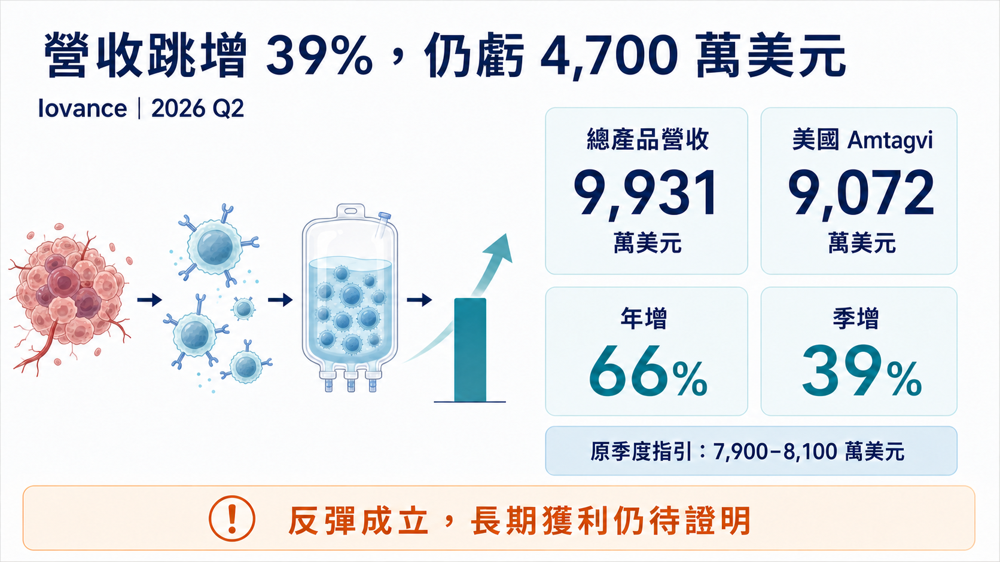
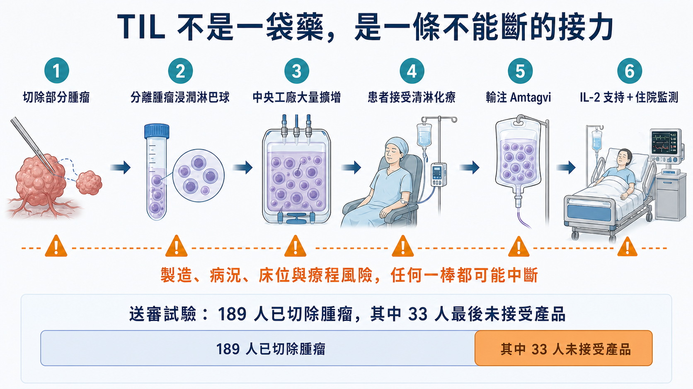
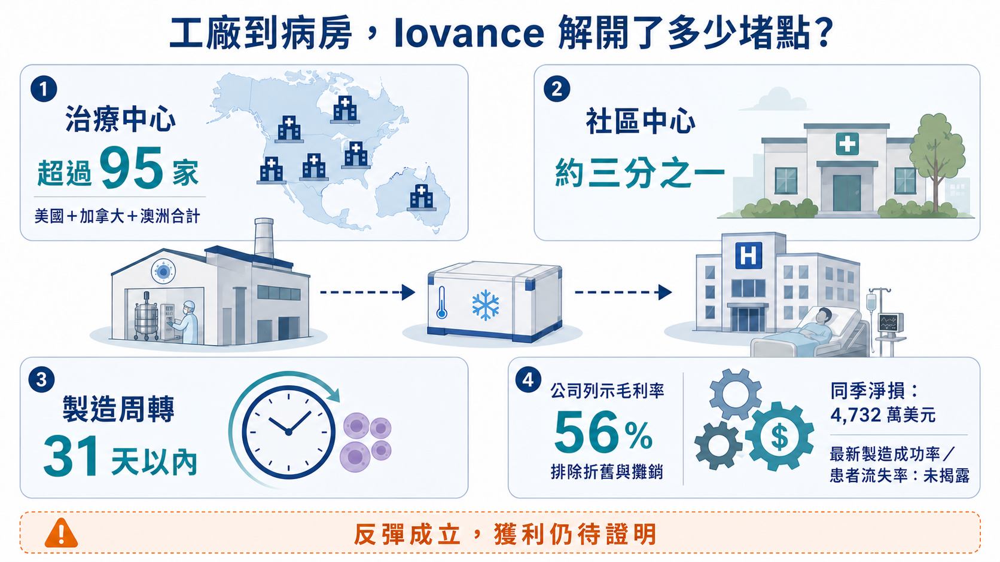
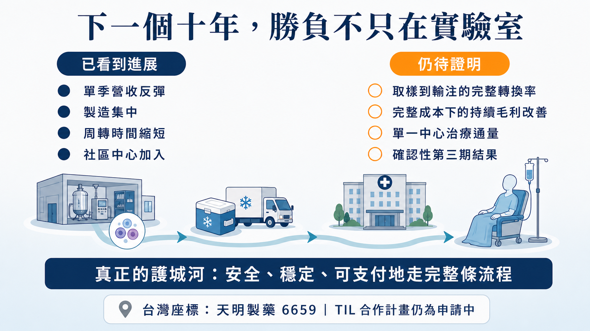

# 營收跳增 39%，還是虧了 4,700 萬美元：癌症細胞療法翻身了？

一年前，市場還在懷疑：這種每位患者都要重新製造一次的癌症細胞療法，真的能做成生意嗎？

2026 年第二季，Iovance 給出一張明顯反彈的成績單。總產品營收 9,931 萬美元，年增 66%、季增 39%；其中，美國 Amtagvi 營收約 9,072 萬美元，也高於公司先前提出的 7,900 萬至 8,100 萬美元季度指引。

數字很亮眼，真正重要的卻不是「TIL（腫瘤浸潤淋巴球）有沒有用」這個老問題。

Amtagvi 已經是 FDA 核准的第一款腫瘤浸潤淋巴球療法。現在市場要驗證的是：一個必須開刀取腫瘤、替每位患者個別培養細胞、再送回醫院輸注的療程，能不能被做成穩定、可複製、付得起錢的醫療服務？

這場競爭，勝負早已走出實驗室。

———

【01｜這次反彈，賣的是流程開始順了】📈

Iovance 第二季揭露，Amtagvi 的授權治療中心（ATC）網路已超過 95 家，約三分之一是社區型中心；從接收腫瘤組織到產品可運送的周轉時間，已壓到 31 天以內。

但有一個口徑必須說清楚：95 家是美國、加拿大與澳洲合計，不是全在美國。31 天也是公司的營運揭露，不等於每位患者都能在 31 天內完成治療。

另一個關鍵，是 Iovance 在 2026 年第一季把商業與臨床製造集中到自有細胞治療中心（iCTC）。公司表示，這座工廠潛在年產能超過 5,000 名患者。中央製造、中心擴張與周轉縮短一起發生，才讓第二季營收有條件往上跳。

財務也確實改善：公司列示的產品毛利率升至 56%。不過這個數字排除了折舊與攤銷；當季仍有 5,191 萬美元營業損失、4,732 萬美元淨損。更值得注意的是，公司沒有趁著超越季度指引就上調全年目標，而是表示正在重新檢視 3.5 億至 3.7 億美元的 2026 年營收指引，預計第三季再更新。

所以，這是一季值得肯定的反彈，還不是獲利模式已經定型。營收可能受到前一季手術排程、工廠交付、病床釋出或支付核准集中認列的影響；在公司尚未公開完整轉換率前，不能把 39% 的季增直接畫成往後每季都會延續的直線。

———

【02｜TIL 不是一袋藥，而是一條不能斷的接力】🧬

簡單說，醫師先切下一部分腫瘤，找出已經進入腫瘤內部的免疫細胞，再送到工廠大量培養；患者接受清除原有淋巴球的化療後，才把這批細胞輸回體內，並搭配介白素-2（IL-2）支持細胞活化。

從取樣、製造、運送、住院到輸注，每一棒都可能讓患者中途掉隊。

這是一個比「多開幾家中心」更難的轉換漏斗。

第一關是轉介。患者要先被原本的腫瘤科醫師認出適合 TIL，再送到能執行手術與細胞治療的中心。中心掛牌存在，不等於轉介網路已經成熟。

第二關是取樣與等待。患者必須有可切除的腫瘤組織，細胞送進工廠後，病情還要在等待期間維持到能接受後續療程。對快速惡化的晚期癌症來說，時間本身就是臨床風險。

第三關是製造與放行。每一批產品只屬於一名患者，無法像抗體藥物那樣先大量製造再分裝；品質不合格或物流延誤，報廢的可能是一批貨，錯過的則是患者的治療窗口。

第四關是住院與支付。手術、清淋化療、輸注、IL-2、病床與不良事件處理必須排在同一條時間線上；保險事前核准若拖延，前面完成的轉介與取樣也可能無法轉成收入。

Iovance 的 10-Q 也把這個漏斗寫得很清楚：產品收入要到患者真正完成輸注時才認列。換句話說，新增一家中心、取出一塊腫瘤、甚至做出一批細胞，都還不能立刻算成營收；只有患者走完整條路，財報才看得到結果。

FDA 標籤留下了一組很直觀的歷史資料：送審試驗中，189 名已完成腫瘤切除的患者，有 33 人最後沒有接受 Amtagvi。原因包括產品無法製造、疾病惡化、死亡、清淋療程不良事件，以及患者改用其他治療或退出。

這也說明，細胞做不做得出來只是其中一題。患者能否撐過等待期、醫院能否排到手術與病床、療程費用能否獲得支付，全部都會反映在最後的收入上。

———

【03｜最容易被忽略的成本，其實在醫院裡】🏥

Amtagvi 不是在門診打一針就能回家。FDA 標籤要求在住院醫院使用，現場還必須具備加護病房（ICU）照護能力。療程涉及手術、清淋化療、細胞輸注、IL-2、住院與不良事件處理，保險公司評估的也不是一袋細胞的價格，而是整套照護成本。

安全性也不能被漂亮營收掩蓋。FDA 分別使用三個不同的分析集：160 名啟動完整療程者中，有 12 人（7.5%）死亡被 FDA 判定與研究療程至少可能相關；Cohort 4 接受輸注的 89 人中，有 21 人（23.6%）因非輸注相關照護需求轉入加護病房（ICU）；主要安全性分析集 156 人中，有 137 人（87.8%）於輸注後 30 天內至少出現一項第四級（Grade 4，危及生命等級）治療後不良事件。

但這些數字不能偷懶寫成「Amtagvi 單藥副作用率」。送審療程同時包含清淋化療與 IL-2，FDA 也指出，很難把每一項風險完全拆給單一環節。

這正是 Iovance 必須把患者篩選、床位安排、跨科團隊與不良事件處理一起標準化的原因。TIL 的商業化能力，與醫院的臨床執行能力其實是同一件事。

———

【04｜9,000 萬美元不是終點，只是一張入場券】⚠️

這一季至少證明，個人化細胞療法並非注定只能停在少數學術中心。

社區中心開始加入、製造集中、周轉時間縮短，代表流程有機會被複製到更多地方。

但長期故事還缺三塊拼圖。

第一，公司沒有公開最新的商業製造成功率與患者流失率，我們還看不到從腫瘤切除到真正輸注的完整轉換率。

第二，56% 毛利率仍未帶來獲利，而且公司揭露的毛利率排除了折舊與攤銷。產量放大後，設備、人工、品質管制與失敗批次能否被有效攤薄，還要再看幾季。

第三，Amtagvi 目前是加速核准。FDA 核准時的客觀緩解率（ORR，也就是腫瘤明顯縮小的患者比例）為 31.5%，持續核准仍要等確認性第三期試驗。該研究預計 2028 年才完成主要分析，單季銷售反彈不能替代長期臨床證據。

———

【05｜台灣真正該看的是「工廠到病房」整條鏈】🔍

台灣市場若要找產業座標，目前較直接的公開案例是興櫃的天明製藥（6659）。公司官網揭露具備符合人體細胞組織優良操作規範（GTP）的細胞製備中心與 TAF 認證實驗室，也列出與亞東紀念醫院合作的 TIL 計畫，但目前狀態仍是「申請中」。

這只能說明台灣已有團隊在累積細胞製備與臨床協作能力，不能把天明寫成 Iovance 的供應鏈、同級競爭者或直接受惠者。其餘常見細胞治療公司，若沒有直接 TIL 公開證據，也不該為了湊台股名單硬塞進來。

真正值得追蹤的，不是哪家公司說自己也能做細胞，而是五個營運指標：從取樣到輸注的成功率、製造周轉天數、單一中心能治療多少人、整套照護能否順利獲得支付，以及放量後的完整毛利率。

Iovance 第二季的意義，是讓市場第一次較清楚地看到：個人化癌症細胞療法的流程，可能被做成一套可以擴張的系統。

至於它能不能成為一門長期獲利的生意，答案仍不在這一季的營收，而在下一批患者能否更快、更安全、更穩定地走完整條路。

## 參考資料

1. [Iovance 2026 Q2 results press release](https://www.sec.gov/Archives/edgar/data/1425205/000110465926091619/tm2622322d1_ex99-1.htm)
2. [Iovance 2026 Q2 Form 10-Q](https://www.sec.gov/Archives/edgar/data/1425205/000110465926091716/iova-20260630x10q.htm)
3. [Iovance 2026 Q1 results press release](https://www.sec.gov/Archives/edgar/data/1425205/000110465926056782/tm2613648d1_ex99-1.htm)
4. [FDA Amtagvi product page](https://www.fda.gov/vaccines-blood-biologics/approved-blood-products/amtagvi)
5. [FDA approval announcement for Amtagvi](https://www.fda.gov/news-events/press-announcements/fda-approves-first-cellular-therapy-to-treat-patients-with-unresectable-or-metastatic-melanoma)
6. [Amtagvi prescribing information](https://www.fda.gov/media/176417/download)
7. [FDA Summary Basis for Regulatory Action](https://www.fda.gov/media/176951/download)
8. [ClinicalTrials.gov NCT05727904](https://clinicaltrials.gov/study/NCT05727904)
9. [ClinicalTrials.gov NCT02360579](https://clinicaltrials.gov/study/NCT02360579)
10. [TPEx emerging stock disclosure for Timing Pharma](https://wwwov.tpex.org.tw/storage/eb_data/11412/11400105781.html)
11. [Timing Pharma cell therapy services](https://www.timing-pharmacy.com/service)

查證截止日：2026 年 8 月 18 日。

## 免責聲明

本文為產業資訊整理與商業分析，不構成醫療建議、投資建議或任何買賣有價證券之推薦。藥物使用與治療選擇應由合格醫療人員依個別情況評估。
