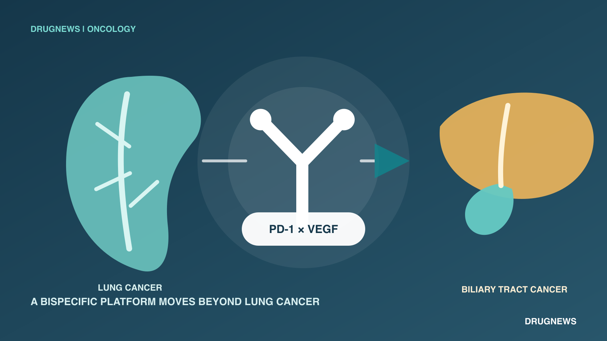
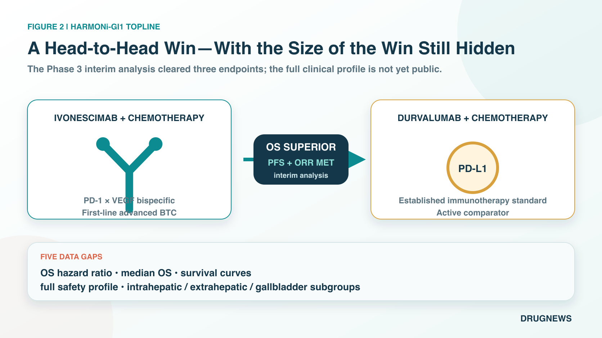
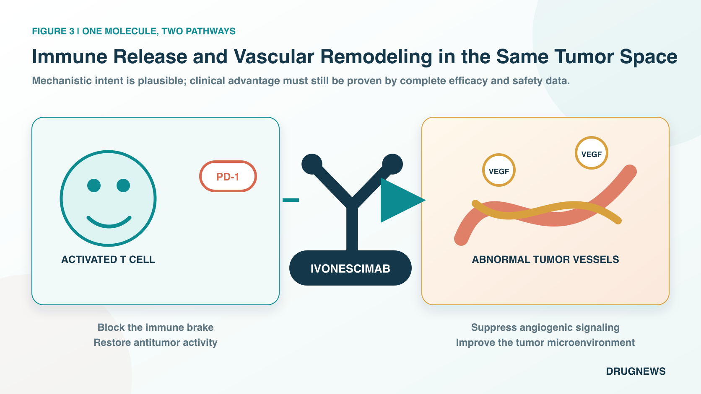
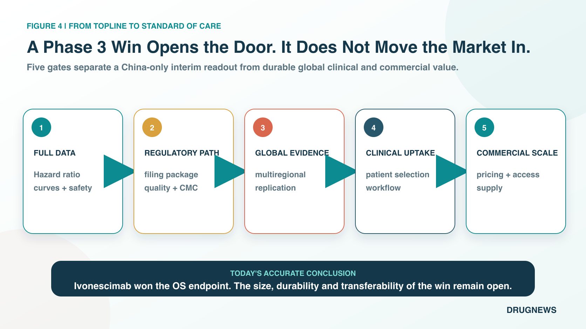

# Ivonescimab Moves Beyond Lung Cancer: Phase 3 Survival Win Against the Biliary Tract Cancer Standard

For the past several years, the most recognizable part of the ivonescimab story has been its willingness to challenge Keytruda directly in lung cancer.

Now, for the first time, that story has moved beyond lung cancer.

On August 26, 2026, Akeso announced that ivonescimab plus chemotherapy met the primary endpoint of overall survival in the prespecified interim analysis of HARMONi-GI1, a Phase 3 study in first-line advanced biliary tract cancer. The comparator was not placebo or chemotherapy alone. It was durvalumab, marketed as Imfinzi, plus chemotherapy, one of the current first-line standards of care.

In other words, ivonescimab was tested directly against an established global treatment standard. The bar was high from the outset.

Akeso also reported that the study met key secondary endpoints of progression-free survival, or PFS, and objective response rate, or ORR. PFS measures how long patients remain alive without their disease worsening, while ORR measures the proportion of patients whose tumors shrink by a predefined amount. The result gives ivonescimab its first positive Phase 3 readout in a gastrointestinal tumor and offers its first clinical evidence that the drug's development story may extend from lung cancer into another cancer type.

The numbers the market most wants to see, however, have not yet been disclosed.

The company has not reported the magnitude of the reduction in the risk of death, the difference in median overall survival between the two groups, or the point at which the survival curves separate. Complete safety results and outcomes across the different biliary tract cancer subtypes have also not been released. What can be said today is that the trial succeeded at its interim analysis. What cannot yet be said is how large, durable, or broadly applicable that success will prove to be.

This is an important win. The contest that will determine how far ivonescimab can ultimately go has only just begun.

## 1 | Why Biliary Tract Cancer Is Difficult for More Than Its Small Patient Population

Biliary tract cancer is a group of malignancies arising from the bile ducts, gallbladder, and related anatomical sites. It receives less public attention than lung or breast cancer, but it is especially difficult to treat in clinical practice. Early symptoms are often subtle, so many patients are diagnosed only after surgery is no longer possible. The biological differences among tumors arising in different locations also make it difficult for one treatment approach to benefit every patient to the same degree.

For a long time, the backbone of first-line therapy was chemotherapy with gemcitabine and cisplatin. The treatment landscape began to shift only after immunotherapy was added to that backbone.

In the Phase 3 TOPAZ-1 study, durvalumab plus chemotherapy reduced the risk of death by 20% compared with chemotherapy alone, with a hazard ratio, or HR, of 0.80. A hazard ratio compares the rate at which an event occurs between two treatment groups. Longer-term follow-up continued to show a survival benefit, and the regimen became a first-line standard adopted by guidelines in multiple countries.

The Phase 3 KEYNOTE-966 study of pembrolizumab, marketed as Keytruda, plus chemotherapy also showed a survival benefit. The regimen reduced the risk of death by 17%, corresponding to a hazard ratio of 0.83. Median overall survival was 12.7 months in the pembrolizumab group and 10.9 months in the control group.

These studies changed treatment, but the size of their gains also left substantial room for improvement. First-line immunotherapy in biliary tract cancer now has established answers, yet clinicians and patients are still waiting for an approach that can push the survival curve meaningfully higher.

That is precisely the position ivonescimab chose to challenge.

## 2 | What Did This Head-to-Head Trial Actually Compare?

HARMONi-GI1, also known as AK112-309, is a single-region, multicenter, randomized, double-blind, registrational Phase 3 trial conducted in China. Participants received either ivonescimab plus chemotherapy or durvalumab plus chemotherapy as first-line treatment for advanced biliary tract cancer. The design therefore compares two complete treatment strategies directly within the same study rather than asking readers to infer a difference from separate trials conducted in different populations and at different times.

The primary endpoint is overall survival, or OS: the time from a patient's entry into the study until death. In oncology, overall survival is one of the most clinically consequential endpoints and one of the hardest to make look better through presentation alone.

Akeso reported results from a prespecified interim analysis assessed by an independent data monitoring committee. According to the company's announcement, ivonescimab produced a statistically significant and clinically meaningful overall survival advantage. The study also met its key secondary endpoints of progression-free survival and objective response rate.

Clearing all three endpoints makes the result more persuasive than a report that tumors simply shrank more often. At least directionally, the findings indicate that patients lived longer, remained free from disease progression for longer, and achieved tumor responses more frequently. Those three measures point in a consistent direction.

But a topline announcement supplies only the outline. Five pieces of information remain essential.

First, the overall survival hazard ratio has not been disclosed. A result of 0.80, 0.70, or lower would imply materially different clinical and commercial value.

Second, median overall survival has not been reported. Statistical significance does not mean that every patient receives the same extension of life, and the absolute difference must still be expressed in months.

Third, the survival curves have not been shown. Clinicians will want to know whether the advantage appears early and continues to widen or emerges only later in follow-up, because the shape and timing of separation affect how durable the benefit appears.

Fourth, complete safety data have not been disclosed. Because ivonescimab acts on both immune and angiogenic pathways, rates of bleeding, hypertension, proteinuria, immune-related adverse events, and treatment discontinuation need to be evaluated alongside those in the control group.

Fifth, subgroup results remain unavailable. Whether patients with intrahepatic cholangiocarcinoma, extrahepatic cholangiocarcinoma, and gallbladder cancer benefit consistently will help determine how much of the broader biliary tract cancer population this regimen could realistically cover.

The most accurate conclusion at this stage is therefore narrow but meaningful: ivonescimab won the prespecified interim analysis against a strong comparator. The size and completeness of that win must await presentation at a scientific meeting and publication in a peer-reviewed paper.

## 3 | Why Might One Bispecific Antibody Differ From Combining Two Separate Drugs?

Ivonescimab is a tetravalent bispecific antibody designed to target both PD-1 and VEGF.

PD-1 functions as an immune brake on the surface of T cells. Cancer cells exploit related signaling to weaken T-cell activity. Blocking PD-1 can help the immune system recognize and attack tumors again.

VEGF, or vascular endothelial growth factor, promotes the formation of tumor blood vessels. It can also contribute to a hypoxic and disorganized tumor microenvironment that makes it harder for immune cells to enter. Inhibiting VEGF may therefore do more than reduce angiogenesis; it may also improve the conditions under which immune cells reach the tumor.

Ivonescimab places both functions within a single molecule. Its four binding sites are intended to increase binding in tumor microenvironments where PD-1 and VEGF are both abundant. The design objective is straightforward: concentrate immune release and anti-angiogenic activity in the same location, potentially increasing tumor-localized activity while reducing unnecessary exposure in normal tissues.

This architecture creates a pharmacological possibility that may differ from simply administering an immune checkpoint inhibitor and an anti-angiogenic agent as two separate medicines. It does not, by itself, prove a clinical advantage. The contribution of each mechanism, and whether the design produces a better therapeutic window, must be established by patient data rather than inferred from a diagram.

The significance of HARMONi-GI1 is that this mechanism has now produced a positive Phase 3 signal outside lung cancer while facing a strong active comparator. It is an important human efficacy signal, not a license to treat the mechanism as proven across all tumors.

## 4 | Why Does Akeso Keep Choosing the Hardest Comparators?

Many new cancer medicines first demonstrate activity against placebo or chemotherapy and only later seek a place beside an established standard. Akeso has chosen a different development path for ivonescimab: compare it directly with widely used immunotherapy regimens.

In first-line PD-L1-positive non-small cell lung cancer, HARMONi-2 tested ivonescimab monotherapy directly against Keytruda. In first-line squamous non-small cell lung cancer, HARMONi-6 compared ivonescimab plus chemotherapy with another PD-1 antibody plus chemotherapy. In biliary tract cancer, the comparator became durvalumab plus chemotherapy.

This strategy magnifies both risk and reward.

If the trial succeeds, the product does not have to rely on a narrative assembled through cross-trial comparisons. Clinicians, regulators, and payers can examine the difference between the new regimen and the existing standard in patients enrolled under the same protocol, during the same period, and under the same trial rules.

If the difference is small, however, the market can immediately focus on every hazard ratio, every subsequent data update, and every feature of the survival curves. A direct comparison leaves less room to explain away an ambiguous result.

A head-to-head trial is therefore an expensive form of self-discipline. The sponsor voluntarily removes many of the easiest arguments it could otherwise use and subjects the product's value to a common patient population and a common set of study conditions.

Ivonescimab has already built visibility in lung cancer. The importance of the biliary tract cancer result is that it is the first indication that this strategy of challenging a leading comparator may also work in another tumor category.

## 5 | Can a Lung Cancer Drug Become a Pan-Tumor Platform?

Akeso has stated that five Phase 3 studies of ivonescimab have now produced positive results. Four are in non-small cell lung cancer, while HARMONi-GI1 is the first positive Phase 3 readout in a gastrointestinal tumor.

That count changes the way the market frames the question.

When a medicine succeeds in only one lung cancer population, investors mainly estimate the commercial opportunity in that indication. When the same molecule repeatedly produces positive signals across treatment lines, comparators, and cancer types, the market begins to ask whether it could become a broader platform and whether the probability assigned to success in the next tumor type should be revised upward.

Akeso is also advancing studies in triple-negative breast cancer, head and neck cancer, small cell lung cancer, colorectal cancer, and pancreatic cancer. Summit is pursuing multiple global Phase 3 programs in its licensed territories, including studies in lung and colorectal cancer.

There are still firm limits to extrapolation across tumors and regions. HARMONi-GI1 was conducted entirely in China, and its data were generated, managed, and analyzed by Akeso. Positive results in Chinese patients cannot automatically replace the multiregional clinical evidence needed in the United States, Europe, or other jurisdictions. Tumor immune environments, treatment backbones, and patient characteristics also differ across cancers. One successful trial cannot issue an advance pass to every program in the pipeline.

Even with those limits, the result moves the question of whether ivonescimab can extend beyond lung cancer substantially closer to a clinical answer.

## 6 | What Does the Result Mean for Akeso, Summit, and AstraZeneca?

The global rights to ivonescimab are divided into two broad territories. Summit holds rights in the United States, Canada, Europe, Japan, Latin America, the Middle East, and Africa. Akeso retains rights in the remaining markets. Ivonescimab is currently approved only in China for certain lung cancer indications and remains an investigational therapy in Summit's licensed territories.

For Akeso, a positive biliary tract cancer study expands the potential breadth of the product in China and increases the credibility of its broader bispecific-antibody platform. If the complete data are sufficiently strong, the next tests will involve regulatory submission, reimbursement access, physician adoption, and commercial execution. A positive trial is the beginning of that sequence rather than its conclusion.

For Summit, the Chinese data provide meaningful clinical de-risking. The same molecule has now shown an overall survival advantage outside lung cancer, giving the platform valuation a new point of support. Summit cannot, however, convert a single-region Chinese result directly into approval in the United States or Europe. The overseas development pathway, regional regulatory requirements, and any decision to initiate a global biliary tract cancer study remain unfinished work.

For AstraZeneca, the announcement does not mean that Imfinzi has already lost its position as a standard of care. Durvalumab plus chemotherapy is supported by a mature Phase 3 dataset, longer-term follow-up, and approvals in multiple countries. Ivonescimab currently has only a topline announcement in this setting. Only after the complete data are available will it be possible to compare the magnitude of efficacy, safety, administration, and price in a way that could determine whether the first-line standard in biliary tract cancer is genuinely changing.

## 7 | If the Full Dataset Is Strong, What Could Change in Clinical Practice?

What patients with biliary tract cancer need is not an impressive press release. They need more survival time of acceptable quality.

First-line treatment is usually the starting point for the entire treatment journey. When patients begin systemic therapy, their physical condition, organ function, and ability to tolerate adverse effects are often relatively intact. If disease can be controlled longer at this stage, the consequences may extend to whether patients can receive second-line treatment and whether they can return to parts of daily life.

An overall survival advantage is therefore only the first gate. Clinicians will also ask practical questions. How frequently must patients come to the hospital? Can the adverse effects of the regimen be managed when it is combined with chemotherapy? Are bleeding or thrombotic risks concentrated in particular groups? Can patients with jaundice, biliary infection, or impaired liver function receive it safely? Does the efficacy gain come with a higher rate of treatment discontinuation?

Payers will approach the decision differently. Durvalumab and Keytruda already have established procurement, reimbursement, and treatment experience. A new regimen seeking to displace them must offer more than longer survival. It must also present a price, administration schedule, and management burden that healthcare systems can support.

This is the distance between statistical significance and a genuine change in clinical standards, and it is often underestimated by the market. A drug first wins within a trial. It must then persuade physicians to switch, fit within hospital workflows, and remain affordable for patients and health systems. Only after those steps can trial success translate into real-world market share.

For Akeso, the second half of the test will shift from development courage to commercial execution. The company will need to communicate the complete dataset clearly, identify the patients most likely to benefit, and demonstrate that manufacturing capacity and supply can support an additional indication. A head-to-head victory can open the door, but it does not automatically move the market through it.

## 8 | The Next Destination Is Not Applause but Five Complete Scorecards

Ivonescimab has met a consequential endpoint in biliary tract cancer. The study also presents a notable image for China's innovative drug industry: a new therapy is no longer being tested only against chemotherapy but is challenging an immunotherapy standard that has already been validated globally.

Investors and clinicians will now focus on five scorecards: the overall survival hazard ratio, median overall survival, the survival curves, complete safety results, and outcomes across the three principal biliary tract cancer subtypes.

If those five scorecards tell a consistent story, the opportunity for ivonescimab could extend beyond adding one more indication. PD-1/VEGF bispecific therapy would begin to move from being a lung cancer headline toward the definition of a pan-tumor platform. It would also force the next generation of immuno-oncology medicines to answer a sharper question: in a market where a PD-1 or PD-L1 standard already exists, can the new therapy defeat it directly?

If the margin of benefit is small, or if the safety cost is too high, the glow surrounding the head-to-head result could fade quickly.

The most important conclusion today is therefore not that ivonescimab has already rewritten the standard of care in biliary tract cancer.

The more accurate conclusion is that, for the first time, it has moved beyond lung cancer, stepped into the ring against an established biliary tract cancer standard, and won the overall survival point at a prespecified interim analysis.

The remaining points belong to the complete dataset.

## Primary Sources

- [Akeso | HARMONi-GI1 met its overall-survival primary endpoint](https://akesobio.com/en/media/akeso-news/260826/)
- [Summit Therapeutics | HARMONi-GI1 topline result and single-region boundary](https://smmttx.com/news/press-releases/news-details/2026/Ivonescimab-Plus-Chemotherapy-Demonstrates-Statistically-Significant-Overall-Survival-Benefit-Compared-to-Durvalumab-Plus-Chemotherapy-in-First-Line-Advanced-Biliary-Tract-Cancer-in-Single-Region-Trial-Conducted-by-Akeso-in-China/default.aspx)
- [TOPAZ-1 | Durvalumab plus chemotherapy primary analysis](https://pubmed.ncbi.nlm.nih.gov/38319896/)
- [TOPAZ-1 | Updated overall-survival analysis](https://pubmed.ncbi.nlm.nih.gov/38823398/)
- [U.S. FDA | Pembrolizumab plus chemotherapy for biliary tract cancer](https://www.fda.gov/drugs/resources-information-approved-drugs/fda-approves-pembrolizumab-chemotherapy-biliary-tract-cancer)

## Disclaimer

This article is provided for information about the pharmaceutical and biotechnology industry. It does not constitute medical advice or investment advice. Patients should consult qualified healthcare professionals when making treatment decisions.
