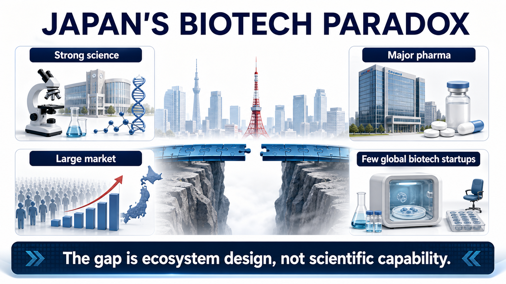
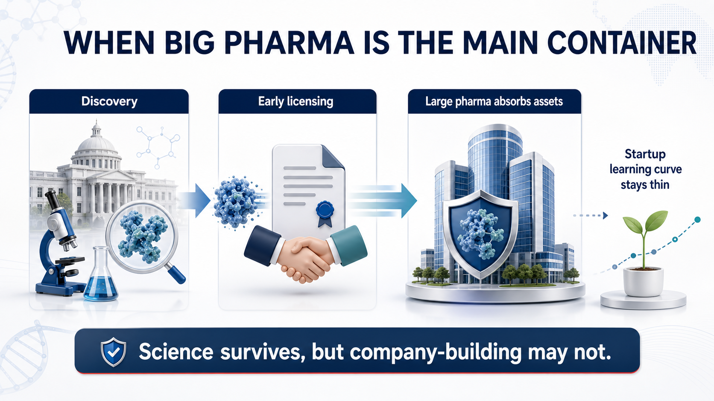
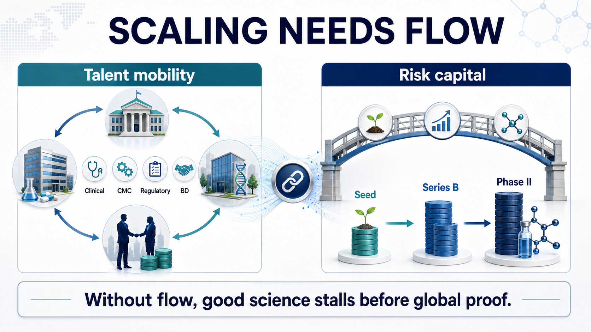
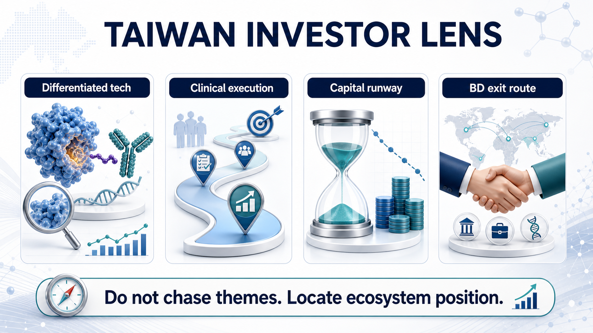

# Why Has Japan Struggled to Build Global-Scale Biotech Companies?

Japan's pharmaceutical industry contains a strange contradiction.

If we look only at large drugmakers, Japan is not weak at all. Takeda, Astellas, Daiichi Sankyo, Eisai, and Ono Pharmaceutical are all familiar names in global pharma. Japan is also a major drug market, and its life-science research base has produced world-class work in induced pluripotent stem cells, regenerative medicine, immunology, neuroscience, and other fields.

But if the question changes to a sharper one, the answer becomes much quieter:

where are Japan's globally competitive homegrown biotech companies?

That contrast is the real issue.

The United States can keep producing companies such as Moderna, Vertex, Alnylam, Regeneron, and Argenx: companies that can move from platform technology to clinical development and, in some cases, commercialization. Europe is fragmented, yet it has still produced BioNTech, Genmab, Galapagos, MorphoSys, and other biotech companies with distinct strategic routes. Korea has used Samsung Biologics, Celltrion, Alteogen, LegoChem Biosciences, and others to push CDMO, antibodies, ADCs, and platform licensing into the international market.

Japan, by contrast, has good science, a large domestic market, and powerful pharma companies. In theory, it should be fertile ground for biotech company formation.

Yet the main characters in Japanese innovative drug development remain large pharmaceutical companies. Homegrown biotech startups exist, but relatively few have become companies that can repeatedly finance themselves, advance global clinical programs, complete major BD transactions, or build commercial credibility.

The question is not whether Japan has science.

The question is whether Japan has the ecosystem that allows science to become companies.

## 01｜Japan Does Not Lack Innovation Foundations. It Lacks the Bridge From Science to Company Formation.

On paper, Japan has many of the ingredients that should support biotech formation.

It has a large pharmaceutical market, a rapidly aging population that creates clinical demand, a mature healthcare system, and long accumulated life-science research capability. Nature Index still places Japan among the important global research countries. Japan's government has also repeatedly placed university technology transfer, regenerative medicine, cell therapy, gene therapy, and innovative drug development inside national policy conversations.

But scientific output and biotech company formation do not connect automatically.

Many countries have good science. Not every country turns good science into good companies. The critical question is whether patents, talent, capital, clinical development, manufacturing, regulation, and exits can form one continuous path.

Japan's bottleneck sits in that path.

Basic research can be strong.

But if promising discoveries are absorbed by large pharmaceutical companies too early, startups struggle to build asset ownership and strategic identity.

The drug market can be large.

But if payment, clinical development, commercialization, and capital markets are conservative, startups struggle to survive the high-risk development cycle.

Large pharma can be globally capable.

But if the best development talent stays inside large corporations, startups cannot easily accumulate the people who know how to move a program into global trials.

This is the central distinction between a biotech ecosystem and a pharma-centric industry.

Large drugmakers can use existing products, cash flow, sales organizations, regulatory teams, and global development experience to absorb early science. A biotech company has to use limited capital to push an unproven scientific hypothesis to a clinical proof point that the market can believe.

If any part of that chain breaks, the company does not grow.

## 02｜When Big Pharma Is Too Dominant, Biotech May Lose Its Growth Space

Strong large pharmaceutical companies are not bad for a national drug industry.

Takeda, Astellas, Daiichi Sankyo, Eisai, and Ono all have global research, regulatory, BD, and commercialization capabilities. Daiichi Sankyo's Enhertu, trastuzumab deruxtecan, is one of the most important ADC success stories of the past decade and proves that Japan is not incapable of drug innovation.

The problem is subtler.

When large pharma dominates too much of the industry's resources, biotech's growth space can become compressed.

Many technologies emerging from universities or research institutes ultimately move into large drugmakers through joint research, licensing, co-development, or early collaboration. That may be positive for the technology itself, because large pharma has the resources to advance it. But for the startup ecosystem, it means that some of the best assets are absorbed before a company can grow around them.

The United States works differently.

Large pharma is also powerful there. But around it sits a dense system of venture capital, founder-scientists, professional management teams, CROs, CDMOs, investment banks, M&A buyers, and IPO markets. Many companies can first build clinical evidence as biotech companies, then be acquired, licensed, or partnered by pharma. In other words, large pharma is not the only container for early innovation. Biotech itself is a major R&D container.

Japan's model has often looked more like this:

large pharma becomes the main container.

The result is that science may survive, but company-building may not.

What the industry lacks is not one specific technology. It lacks enough time and support for technology to grow inside startup companies.

When biotech companies cannot accumulate clinical, financing, BD, and management experience, the next generation of founders becomes smaller, success stories become rarer, investor confidence weakens, and the ecosystem can fall into a negative loop.

## 03｜The Talent Problem Is Deeper Than It Looks

Biotech's core asset is not laboratory equipment.

It is people.

One reason the U.S. biotech ecosystem has been so durable is talent mobility. Scientists can move from universities into companies. Development leaders can leave large pharma for startups. Founders can fail and start again. Investors understand clinical development, regulatory risk, and exit paths.

That mobility turns experience into reusable ecosystem capital.

A clinical development head who has run Phase II before can save the next company years of mistakes. A regulatory executive who has dealt with the FDA can help design better endpoints. A CEO who has negotiated BD before understands what kind of data package makes a large pharma partner take a call seriously.

Japan's career culture has historically been different.

Large pharmaceutical companies offer stable income, established platforms, structured training, and clear career paths. For many researchers and development professionals, staying inside Takeda, Astellas, Daiichi Sankyo, or another major company is more rational than joining a biotech company with two years of cash runway. University researchers also face cultural and institutional frictions when they leave stable positions to form companies.

This is not a question of courage.

It is a question of incentives.

If the cost of failure is high, talent will not move.

If capital is unwilling to absorb early risk, teams will not form.

If there are too few visible success cases, the next generation of founders cannot see the path.

Biotech does not succeed with one star scientist alone. It needs scientists, clinicians, translational medicine leaders, CMC teams, regulatory experts, business development people, finance operators, and investors to form a company.

Japan has many of these people.

The issue is that too few have a strong reason to leave their existing positions and flow into startups.

## 04｜Capital Depth Is the Most Practical Bottleneck

Biotech is a capital-intensive industry.

From target discovery, lead optimization, preclinical toxicology, IND preparation, Phase I, Phase II, and Phase III, every step costs money and carries a high failure rate. More importantly, many companies must finance repeatedly without revenue before they can generate enough data for licensing, listing, acquisition, or commercialization.

That is why venture capital, crossover funds, specialist healthcare investors, and public markets matter so much in the U.S. biotech system.

Japan's domestic capital has generally been more conservative, especially toward early innovative drug programs. Money exists, but the size, continuity, and risk tolerance of that capital pool are often difficult to compare with the United States. When capital depth is insufficient, biotech companies face several direct constraints.

First, clinical development slows down.

When money is scarce, companies hesitate to run more complete trials or global multicenter studies.

Second, pipeline breadth narrows.

A company may be forced to bet on one or two programs. If those fail, the company has little room to recover.

Third, BD leverage weakens.

If the data package is not mature enough but cash is running out, the company may have to accept weaker licensing terms.

Fourth, the public market may not provide enough follow-on support.

Even if a biotech company lists, weak liquidity and limited post-IPO financing can keep it in survival mode.

Capital is not automatically good simply because it is abundant. The U.S. and Asian biotech markets have both experienced bubbles, excessive financing, crowded me-too development, and valuation resets. But in innovative drug development, the absence of risk capital is also unhealthy. Early science needs investors willing to absorb uncertainty before the asset is fully de-risked.

Japan's problem is not that there is no money.

It is that too little capital is willing to stay with biotech companies long enough for key clinical evidence to mature.

## 05｜Policy Reform Has Started, but Ecosystems Do Not Mature Overnight

Japan has seen the problem.

In 2022, the Japanese government introduced its Startup Development Five-year Plan, aiming to expand startup investment, build clusters, attract talent and capital, and create 100 unicorns and 100,000 startups over time. Deep tech, medicine, university startups, international acceleration, funding, and exit diversification are all part of the policy direction.

AMED, METI, JIC, and other public or policy-linked institutions have also tried to fill early-stage funding gaps through grants, funds, and industry collaboration. International venture investors have gradually become more interested in Japanese early-stage life-science assets as the policy environment changes.

Large pharma is not simply standing aside either.

Takeda has supported early programs through innovation centers, external partnerships, and global R&D networks. Astellas has used venture investment and external innovation platforms to search for new technology. Ono Pharmaceutical has also used corporate venture capital to invest across drug discovery, biotech, and digital health.

These are the right directions.

But biotech ecosystems do not mature the moment a policy is announced.

The hard part is turning one-time support into a continuous cycle.

It can take five to ten years for a biotech company to move from seed financing to Phase II. It can take several more years to move from Phase II to global licensing, listing, or commercialization. Investors need to see exits. Founders need to see predecessors. Large pharma needs to become comfortable buying assets from startups. Clinicians need to participate in trials. Talent needs to believe that leaving stable jobs is not irrational.

All of that takes time.

The real test for Japan is not whether it can create more startups this year.

The test is whether the next decade can produce a group of companies with credible global clinical, BD, and commercialization imagination.

## 06｜Why This Matters for Taiwan Investors

The Japanese case matters for Taiwan because the structural question is similar.

Taiwan also has scientific themes, medical centers, selected R&D capabilities, and a public equity market. But building biotech companies that can repeatedly run global clinical trials, complete international licensing deals, and develop commercialization capability remains difficult.

Taiwan investors often make one mistake:

when a theme becomes hot, they ask which stock is connected to that theme.

ADC is hot, so they look for ADC concept names.

GLP-1 is hot, so they look for GLP-1 concept names.

Cell therapy is hot, so they look for cell therapy names.

AI drug discovery is hot, so they look for AI drug discovery names.

The Japan case reminds us that the real question is not theme exposure.

The real question is ecosystem position.

Does the company own a differentiated technology that international partners can understand?

Does the team have clinical design, regulatory, and CMC capability?

Can the capital structure support the company until meaningful data arrive?

Can the company run BD in a way that connects the asset to large pharma or regional partners?

If a program fails, can talent and learning return to the next company rather than disappear?

If these questions have no answer, a hot theme may never become lasting company value.

## 07｜Conclusion: Biotech Needs an Ecosystem Patient Enough to Let Companies Grow

Japan is a useful case for Taiwan precisely because it is not an underdeveloped market.

Japan has strong science, major pharma companies, a mature healthcare system, and a large drug market. That is why its difficulty in producing more global-scale homegrown biotech companies is so instructive.

The lesson is simple but uncomfortable.

Good science does not automatically become good companies.

A large market does not automatically produce strong biotech.

Strong large pharma does not necessarily mean a strong startup ecosystem.

Conservative capital can strand innovation before key clinical proof.

Low talent mobility prevents experience from compounding.

The essence of biotech is to turn uncertain science into a company that can be tested by clinical data, regulators, capital markets, and commercial partners.

That requires capital and institutions. It requires science and markets. It requires room for failure and visible examples of success.

Japan's issue is therefore not that biotech cannot grow there.

It is that the industrial cycle has not yet become smooth enough to let enough biotech companies grow.

For Taiwan, the more important question is the mirror image:

can we build a system where good technology is not just a market theme, but the beginning of a company that the international market can recognize?

References:

1. Cabinet Secretariat, Government of Japan, [Startup Development Five-year Plan](https://www.cas.go.jp/jp/seisaku/atarashii_sihonsyugi/pdf/sdfyplan2022en.pdf), 2022.
2. Nature Index, [Japan country outputs](https://www.nature.com/nature-index/country-outputs/Japan).
3. Japan Agency for Medical Research and Development, [AMED official website](https://www.amed.go.jp/en/).
4. U.S. Food and Drug Administration, [Drug Trials Snapshot: Enhertu](https://www.fda.gov/drugs/drug-approvals-and-databases/drug-trials-snapshot-enhertu), 2019.

---

This article is for industry research and knowledge sharing only. It does not constitute investment, medical, fundraising, or stock-specific advice.
