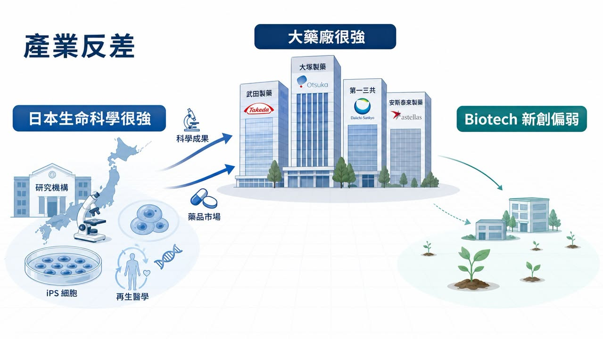
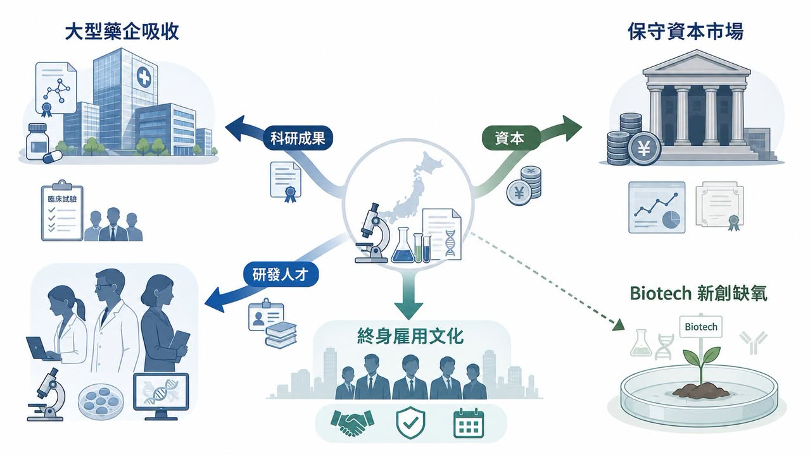
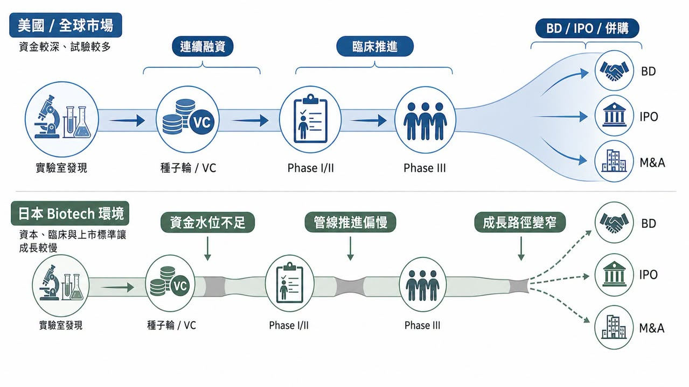
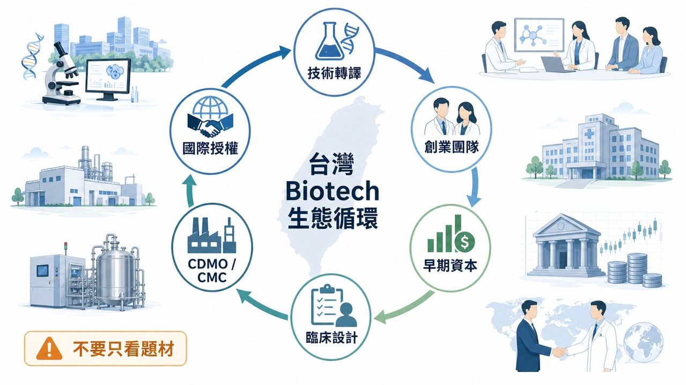

# 日本為什麼長不出全球級 Biotech？問題不在科學，而在產業生態

日本製藥業有一個很微妙的反差。

如果只看大藥廠，日本一點也不弱。Takeda（武田）、Astellas（安斯泰來）、Daiichi Sankyo（第一三共）、Eisai（衛材）、Ono Pharmaceutical（小野製藥）都是國際醫藥市場熟悉的名字。日本也長期是全球重要藥品市場，生命科學基礎研究在 iPS 細胞、再生醫學、免疫學、神經科學等領域都曾有世界級成果。

可是，如果問題換成「日本有哪些具備全球競爭力的本土 Biotech？」

答案突然就變得安靜。

這個反差，是日本創新藥產業最值得拆解問題的地方。

美國可以持續長出 Moderna、Vertex、Alnylam、Regeneron、Argenx 這類從技術平台、臨床開發到商業化都能自成體系的公司。歐洲雖然市場分散，但仍能出現 BioNTech、Genmab、Galapagos、MorphoSys 等不同路線的 Biotech。韓國近年也透過三星生物製劑、Celltrion、Alteogen、LegoChem Biosciences 等公司，把 CDMO、抗體、ADC、平台授權推向國際市場。

反觀日本，科學不差，市場不小，大藥廠也很強，理論上應該是一片適合 Biotech 生長的土壤。

但現實是：日本創新藥舞台上的主角，長期仍由大型藥企壟斷。本土初創生物技術公司不是不存在，而是很難長成真正能連續融資、推進全球臨床、完成 BD 或商業化的公司。

為什麼一個擁有強大科研與市場基礎的國家，反而長不出足夠強的新創生技公司？

答案不是單一原因，而是一整套產業生態的失衡。

## 01｜日本不是沒有創新底子，而是創新沒有長成新創公司

如果只看產業基礎，日本本來很適合做 Biotech。

它有大型藥品市場，有高齡化帶來的臨床需求，有成熟醫療體系，也有長期累積的生命科學研究能力。Nature Index 的國家研究產出中，日本仍然是全球重要生命科學研究國之一；日本政府也一直把大學技術轉譯、再生醫學、細胞治療、基因治療與創新藥研發放在政策裡。

但科學成果和 Biotech 公司之間，不是自然會接起來。

很多國家都有好科學，但不是每個國家都能把好科學變成好公司。真正關鍵的是，專利、人才、資金、臨床、製造、法規與退出市場能不能形成連續路徑。

日本卡住的地方，就在這裡。

基礎研究可以很強。

但如果研究成果太早被大型藥企吸收，新創公司就很難在資產上形成主體性。

藥品市場可以很大。

但如果支付、臨床、商業化與資本市場都比較保守，新創公司就很難承受高風險研發週期。

大藥廠可以很國際化。

但如果最好的研發人才都留在大企業內，新創公司就很難累積能把管線推進全球臨床的人。

所以，日本的問題不是缺少發現，而是缺少「把發現一路養成公司」的機制。

這就是 Biotech 和大藥廠最大的不同。

大藥廠可以靠既有產品、現金流、銷售組織、全球法規經驗去承接早期成果；Biotech 必須靠有限資金，把一個還沒有完全被證明的科學假說，推到足以讓市場相信的臨床節點。這中間任何一段資源斷掉，公司就長不起來。

## 02｜日本大藥廠太強，反而壓縮了 Biotech 的成長空間

大型藥企很強，對國家醫藥產業不一定是壞事。

Takeda、Astellas、Daiichi Sankyo、Eisai、Ono Pharmaceutical 這些公司都有全球研發、法規、BD 與商業化能力。Daiichi Sankyo 的 Enhertu（trastuzumab deruxtecan）更是近年 ADC 領域最具代表性的成功案例之一，證明日本並不是沒有創新藥能力。

但問題在於，當大藥廠過度主導產業資源，Biotech 的生長空間會被壓縮。

很多大學或研究機構產出的技術，最後會透過共同研究、授權、共同開發或早期合作進入大型藥企。這對技術本身未必不好，因為大藥廠有能力把它往後推。但對新創生態來說，這代表最好的資產很早就被吸走，少了一批能以該技術為核心長大的公司。

美國的模式不同。

美國大藥廠也很強，但周邊有大量 VC、創業科學家、專業管理團隊、CRO/CDMO、投行、併購市場與 IPO 市場共同支撐。很多公司可以先在 Biotech 階段把臨床概念做出來，再由大藥廠收購、授權或合作。換句話說，美國大藥廠不是唯一容器，Biotech 本身就是重要研發容器。

日本比較像是：大藥廠直接成為主要容器。

這會造成一個結果：科學成果沒有消失，但公司消失了。

產業真正缺的，不是某一個技術，而是讓技術在新創公司裡長大的時間。

當 Biotech 無法累積臨床、融資、BD 與管理能力，下一輪創業者也就比較少，成功案例更少，資本信心更弱，最後形成負向循環。

## 03｜人才問題更深：穩定職涯壓過創業流動

Biotech 最核心的資產不是實驗室設備，而是人。

美國 Biotech 能長期繁榮，背後有一個很重要的底層條件：人才流動非常快。科學家可以從大學進公司，研發主管可以從大藥廠跳到新創，創業者可以失敗後再創業，投資人也熟悉臨床開發、法規路徑與退出機制。

這種流動性，會讓經驗不斷被帶到下一家公司。

一個做過 Phase II 的臨床長，下一次可以幫新公司少走很多彎路；一個做過 FDA 溝通的法規主管，下一次知道臨床終點該怎麼設計；一個做過 BD 的 CEO，下一次更知道什麼資料包能讓大藥廠認真談授權。

日本的職涯文化相對不同。

大型藥企提供穩定收入、成熟平台、完整訓練與清楚職涯路徑。對許多研究人員來說，留在 Takeda、Astellas、Daiichi Sankyo 這類公司，比加入一間資金只夠燒兩年的 Biotech 更合理。大學研究者要離開穩定職位創業，也需要面對文化、制度與失敗成本。

這不是誰比較勇敢的問題，而是制度誘因的問題。

如果創業失敗成本很高，人才就不會流動。

如果資本不願承接早期風險，團隊就很難組起來。

如果沒有足夠成功案例，下一代創業者就看不到路。

Biotech 不是只靠一位明星科學家就能成功。它需要科學家、臨床醫師、轉譯醫學、CMC、法規、商業開發、財務與投資人一起形成團隊。

日本的問題，是這些人多半存在，但沒有足夠理由離開原本位置，流向新創公司。

## 04｜資本水位不足，是日本 Biotech 最大的現實瓶頸

Biotech 是非常吃資本的產業。

從靶點發現、候選藥優化、臨床前毒理、IND 申請，到 Phase I、Phase II、Phase III，每一步都要錢，而且失敗率很高。更重要的是，很多時候公司要在還沒有營收的情況下，連續融資好幾輪，才能把資料做到足以授權、上市或被併購。

這就是為什麼美國 Biotech 生態裡，VC、 crossover fund、專業醫療投資人與公開市場非常重要。

日本本土資本相對保守，尤其對早期創新藥項目更謹慎。資金不是完全沒有，但單筆規模、連續性與風險承受度，都很難跟美國相比。當資本水位不足，Biotech 就會面臨幾個很直接的問題。

第一，臨床推進變慢。

錢不夠，就不敢一次做更完整的臨床設計，也不容易同步推全球多中心試驗。

第二，管線組合變窄。

公司只能押一兩條管線，一旦失敗就很難翻身。

第三，BD 談判籌碼變弱。

資料還沒做到足夠成熟，現金就快燒完，談授權時容易被迫接受較弱條件。

第四，公開市場承接力不足。

如果 IPO 後市值、流動性與後續募資都不穩，新創公司即使上市，也不一定真正脫離生存壓力。

這裡要注意，資本不是越熱越好。

美國和亞洲其他市場也都經歷過 Biotech 泡沫、過度融資、同質化競爭與估值修正。但在創新藥產業裡，完全沒有泡沫也未必健康。因為早期科學本來就需要一部分高風險資本去承接不確定性。

日本的問題不是沒有錢，而是願意陪 Biotech 承擔早期風險、一路支持到臨床資料成熟的錢太少。

## 05｜改革已經開始，但生態不是政策一出就會長好
日本並不是沒有看見問題。

近年日本政府已把新創政策拉到更高層級，2022 年提出 Startup Development Five-year Plan，希望擴大創業投資、培養新創集群、吸引人才與資本。生物醫藥、再生醫療、基因治療、CDMO、創新藥與生物製造，也陸續被納入政策討論。

AMED、日本經濟產業省、JIC 等機構，也開始透過基金、補助與產業合作，試圖填補早期研發資金缺口。國際 VC 也逐漸被日本政策吸引，開始更積極看日本的早期生命科學項目。

大型藥企也不是完全旁觀。

Takeda 透過創新中心、外部合作與全球研發網絡支持早期項目；Astellas 透過創投與外部創新平台尋找新技術；Ono Pharmaceutical 也設立企業創投基金，投資創新藥、生物科技與數位醫療方向。

這些都是正確方向。

但 Biotech 生態不是政策一出就會馬上長好。

真正難的，是把「單次補助」變成「連續循環」。

一間 Biotech 從種子輪走到 Phase II，可能需要五年到十年；從 Phase II 走到全球授權或上市，可能又需要好幾年。投資人要看到成功退出，創業者要看到前輩案例，大藥廠要習慣從新創公司買資產，臨床醫師要願意參與試驗，人才要敢離開穩定職位。

這些都需要時間。

所以日本的改革重點，不是今天多成立幾間新創公司，而是未來十年能不能長出一批真正具備全球臨床、BD 與商業化想像的公司。

## 06｜這件事對台灣很重要：我們也不能只問誰有題材
把日本案例放回台灣，其實很有意思。

台灣生技也常面臨類似問題：有好題材、有醫學中心、有部分研發能力、有資本市場，但要長出能連續推進全球臨床、完成國際授權、建立商業化能力的 Biotech，難度仍然很高。

台灣投資人常犯的錯，是看到一個熱門方向，就急著問誰是概念股。

ADC 熱，就找 ADC 概念股。

GLP-1 熱，就找 GLP-1 概念股。

細胞治療熱，就找細胞治療概念股。

AI 製藥熱，就找 AI 製藥概念股。

但日本案例提醒我們：真正決定 Biotech 能不能長大的，不是題材，而是生態位置。

公司有沒有能被國際市場理解的差異化技術？

團隊有沒有臨床設計、法規溝通與 CMC 能力？

資本能不能支持公司撐到關鍵資料出來？

有沒有能力做 BD，讓資產接上大藥廠或區域合作夥伴？

失敗後，人才與經驗能不能重新回到下一輪創業？

如果這幾個問題都沒有答案，單一題材再熱，也很難變成長期公司價值。

## 07｜結語：Biotech 不是長不長得出來，而是生態有沒有讓它長大的耐心
日本的案例很值得台灣看。

它不是一個落後市場。相反地，日本有強大科學、有大型藥廠、有成熟醫療體系，也有全球級藥品市場。但正因為底子這麼好，卻長不出足夠多全球級本土 Biotech，問題才更有啟發性。

這件事提醒我們：

好科學不會自動變成好公司。

大市場不會自動養出強 Biotech。

大藥廠很強，不等於新創生態很強。

資本太保守，創新就會卡在臨床前後。

人才不流動，產業經驗就很難複製。

Biotech 的本質，是把不確定的科學，變成可以被臨床、法規、資本與商業市場共同驗證的公司。

這件事需要資本，也需要制度；需要科學，也需要市場；需要失敗空間，也需要成功退出案例。

所以，日本「長不出」Biotech 的問題，表面是新創公司太少，真正是產業循環還不夠順。

對台灣來說反過來問自己：我們有沒有能力讓好技術不只是變成題材，而是變成能被國際市場承認的公司？

參考資料：

1. Cabinet Secretariat, Government of Japan, [Startup Development Five-year Plan](https://www.cas.go.jp/jp/seisaku/atarashii_sihonsyugi/pdf/sdfyplan2022en.pdf), 2022.
2. Nature Index, [Japan country outputs](https://www.nature.com/nature-index/country-outputs/Japan).
3. Japan Agency for Medical Research and Development, [AMED official website](https://www.amed.go.jp/en/).
4. U.S. Food and Drug Administration, [Drug Trials Snapshot: Enhertu](https://www.fda.gov/drugs/drug-approvals-and-databases/drug-trials-snapshot-enhertu), 2019.

---

本文僅供產業研究與知識分享，不構成投資、醫療、募資或個股建議。
