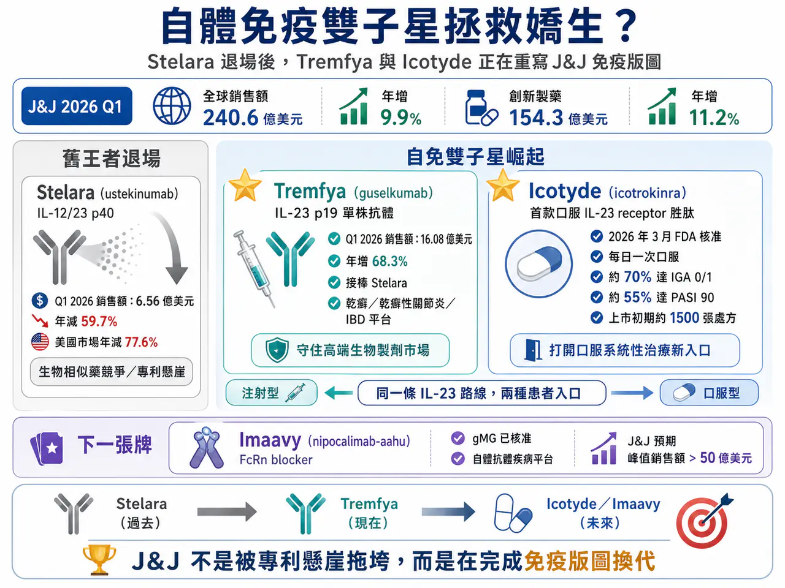
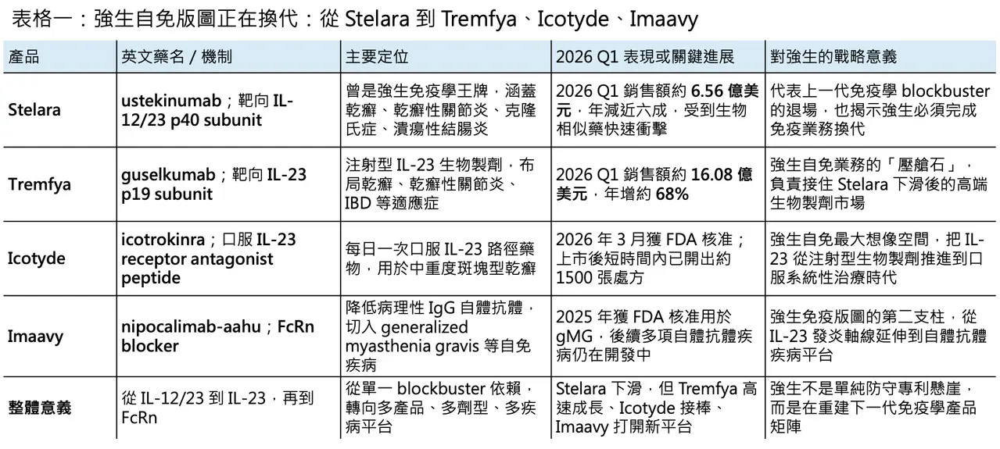
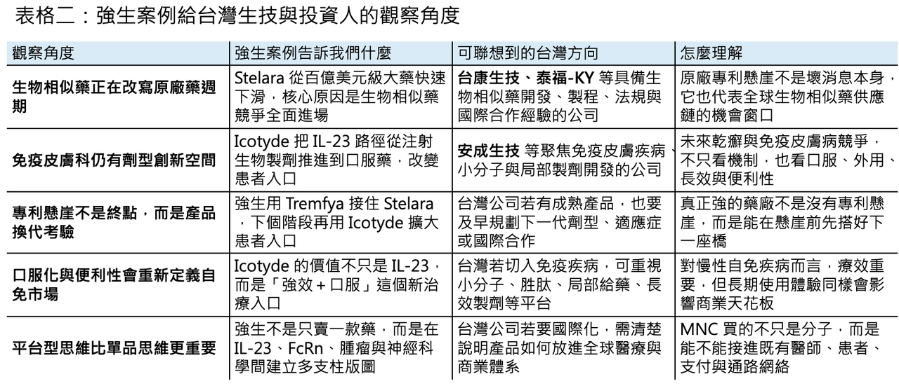

# 自體免疫 雙子星 拯救 嬌生

【Johnson & Johnson 自免「雙子星」崛起：Stelara 退場後，Tremfya 與 Icotyde 正在重寫免疫版圖】

📌 2026 年第一季，Johnson & Johnson（J&J）交出了一份很有訊號意義的財報。

表面上看，這是一份漂亮的成績單：第一季全球銷售額達 240.6 億美元，年增 9.9%；公司也上調 2026 年全年指引，預估全年銷售額將達 1003 億至 1013 億美元，中位數約 1008 億美元，年增約 7.0%。其中，創新製藥業務銷售額達 154.3 億美元，年增 11.2%，仍是公司最重要的成長引擎。

但真正值得看的，不是 Johnson & Johnson 今年能不能跨過千億美元營收，而是它如何在 Stelara（ustekinumab）專利懸崖後，重新拼出下一個免疫學成長曲線。

這是一個典型的大藥廠轉身故事：昔日百億美元級王牌快速下滑，但新一代產品已經接上。Tremfya（guselkumab）和 Icotyde（icotrokinra）這對自免「雙子星」，正在成為 Johnson & Johnson 抵抗免疫業務衰退、延續 IL-23 王朝的核心答案。

## 01｜Stelara 的時代結束了，但 Johnson & Johnson 沒有被專利懸崖拖垮

🧩 Stelara（ustekinumab）曾經是 Johnson & Johnson 免疫學板塊最重要的支柱，也是全球自體免疫市場最具代表性的 blockbuster 之一。它透過靶向 IL-12/23 p40 subunit，同時調節 IL-12 與 IL-23 相關發炎路徑，曾在乾癬、乾癬性關節炎、克隆氏症與潰瘍性結腸炎等適應症中建立長期商業壁壘。

但生物相似藥終究會來。

2025 年起，Stelara 在美國與多個主要市場面臨生物相似藥競爭，銷售快速萎縮。Johnson & Johnson 2026 年第一季財報顯示，Stelara 全球銷售額只剩 6.56 億美元，相較去年同期的 16.25 億美元，年減 59.7%；其中美國市場下滑更劇烈，年減 77.6%。免疫學整體業務也因此承壓，第一季全球銷售額為 33.8 億美元，年減 8.8%。

如果 Johnson & Johnson 只有 Stelara，這會是一場非常難看的專利懸崖事故。

但它不是。

這家公司真正厲害的地方，是很早就把免疫學下一代產品放在同一條疾病軸線上布局。Stelara 是第一代 IL-12/23 時代的代表；Tremfya 是更精準的 IL-23 p19 抗體；Icotyde 則把 IL-23 路徑推進到口服胜肽時代。這不是單純換一個產品，而是同一條免疫路徑的三代商業化演進。

## 02｜Tremfya：從 Stelara 接班人，變成 IL-23 時代的壓艙石

Tremfya（guselkumab）是 Johnson & Johnson 目前免疫學板塊最關鍵的接班產品。

它是一款全人源單株抗體，靶向 IL-23 p19 subunit。這一點很重要。Stelara 阻斷的是 IL-12/23 共用的 p40 subunit，而 Tremfya 更精準地阻斷 IL-23，而不干擾 IL-12。這讓它在抑制 Th17 軸線、降低 IL-17A、IL-17F、IL-22 等下游發炎級聯反應時，理論上可以保留更多與宿主防禦、免疫監視相關的 IL-12 功能。換句話說，Tremfya 不是簡單的 Stelara 延伸，而是更精準、更乾淨的 IL-23 時代產品。

這也是為什麼 IL-23 成為自免市場近年最成功的靶點之一。AbbVie 的 Skyrizi（risankizumab）已經成為 Humira 後時代最重要的免疫學增長引擎，2025 年銷售額已達 176 億美元等級；Johnson & Johnson 的 Tremfya 則正在複製類似路徑，從乾癬一路往乾癬性關節炎與 IBD 延伸。

Tremfya 的財報表現非常直接。2026 年第一季，Tremfya 全球銷售額達 16.08 億美元，較去年同期 9.56 億美元大增 68.3%；美國市場銷售額 10.42 億美元，年增 73.9%。在 Stelara 下滑近六成的同一季，Tremfya 反而高速成長，這正是 Johnson & Johnson 免疫學板塊沒有失速的關鍵。

從商業角度看，Tremfya 有兩個重要價值。

💉 第一，它保住了 Johnson & Johnson 在皮膚科與腸胃免疫專科的醫師網絡。

Stelara 過去打下的醫師教育、市場準入與疾病管理基礎，並沒有因專利到期完全消失，而是能被 Tremfya 延續使用。

💉 第二，它讓 Johnson & Johnson 在 IL-23 路線上繼續保有領導位置。

自免市場不是單一適應症市場，而是平台型市場。乾癬只是入口，乾癬性關節炎、克隆氏症、潰瘍性結腸炎才是長期放量空間。Tremfya 的價值，正是它已經從單一皮膚科產品，逐步變成跨免疫疾病的核心平台。

## 03｜Icotyde：如果 Tremfya 是穩定接班，Icotyde 就是 Johnson & Johnson 最大想像力

如果說 Tremfya 是「可預期的成功」，那 Icotyde（icotrokinra）就是 Johnson & Johnson 免疫學業務真正的想像空間。

2026 年 3 月，FDA 核准 Icotyde（icotrokinra）用於成人與 12 歲以上、體重至少 40 公斤、適合全身性治療或光療的中重度斑塊型乾癬患者。它是第一款、也是目前唯一一款靶向 IL-23 receptor 的口服胜肽藥物，每日一次口服。

這件事的意義很大。

過去 IL-23 藥物幾乎都是注射型生物製劑，例如 Skyrizi（risankizumab）、Tremfya（guselkumab）、Ilumya（tildrakizumab）。這些藥物療效很好，但對一部分患者而言，注射仍然是心理與使用門檻。Icotyde 把 IL-23 從抗體注射推到口服胜肽，等於給乾癬市場提供了一個新的治療入口：不必從傳統外用藥一路等到注射生物製劑，而是可以用每日口服藥更早介入系統性治療。

更關鍵的是，它不是一個「方便但弱一點」的口服藥。

Johnson & Johnson 公布的資料顯示，在涵蓋約 2500 名患者的 ICONIC Phase 3 臨床計畫中，Icotyde 達到所有主要療效終點；在頭對頭優效性試驗中，約 70% 患者於第 16 週達到皮膚清除或幾乎清除，也就是 IGA 0/1，約 55% 患者達到 PASI 90。同時，至第 16 週，不良反應率與安慰劑相差在 1.1% 以內，至第 52 週未發現新的安全性訊號。

這組資料很重要，因為乾癬口服藥市場過去一直面臨一個尷尬：方便，但療效常常不如生物製劑；如果要強效，安全性又可能變成問題。Icotyde 的定位，就是試圖填補這個空位：接近生物製劑等級的清除率，加上每日一次口服的便利性。

這也是為什麼 Johnson & Johnson 會把它視為 first-line systemic therapy 的重要候選。公司在財報會上也提到，Icotyde 在核准當天即啟動上市，短短數週已開出約 1500 張處方。

## 04｜Tremfya + Icotyde：同一條 IL-23 路線，兩種患者入口

🔀 Tremfya 和 Icotyde 看起來都和 IL-23 有關，但它們不是互相替代，而是可能形成非常強的互補。

Tremfya 是注射型 IL-23 p19 單株抗體，適合需要高效、長效、專科管理的患者。

Icotyde 是口服 IL-23 receptor antagonist，適合希望提早進入系統性治療、但還不想或不適合使用注射生物製劑的患者。

這是一個非常漂亮的產品組合策略。

過去大藥廠最怕的，是自家新產品吃掉舊產品。但在自免市場，若能把患者分層清楚，口服與注射反而可以擴大整體池子。Icotyde 可能承接那些外用藥控制不佳、但還未進入注射生物製劑的患者；Tremfya 則持續守住中重度、專科導向、需要強效長效治療的患者。兩者放在一起，Johnson & Johnson 就不只是賣一個 IL-23 藥，而是在建立一個 IL-23 治療矩陣。

這正是 Johnson & Johnson 自免「雙子星」最重要的戰略意義：用 Tremfya 防守高端生物製劑市場，用 Icotyde 打開口服系統性治療市場。

Stelara 的時代結束，不代表 Johnson & Johnson 在自免領域的時代結束。它只是把免疫學王座，從 IL-12/23 的上一代，交給更精準、更多劑型選擇的 IL-23 下一代。

## 05｜FcRn 也是下一張牌：Imaavy 讓 Johnson & Johnson 的免疫版圖不只靠 IL-23

🧬 除了 Tremfya 與 Icotyde，Johnson & Johnson 在免疫領域還有另一張重要牌：Imaavy（nipocalimab-aahu）。

Imaavy 是一款 FcRn blocker，能降低循環中的 IgG 自體抗體。2025 年 4 月，FDA 核准 Imaavy 用於 12 歲以上、AChR 或 MuSK 抗體陽性的 generalized myasthenia gravis（gMG）患者。FcRn 是近年自免領域最重要的新興靶點之一，因為它不只對單一疾病有效，而是有潛力處理多種由病理性 IgG 自體抗體驅動的疾病。

這裡可以看到 Johnson & Johnson 的免疫學策略並不單薄。IL-23 負責乾癬、乾癬性關節炎與 IBD 這類 Th17 / IL-23 軸線疾病；FcRn 則面向自體抗體驅動疾病。前者是大市場、競爭激烈但療效成熟；後者是新興平台、適應症可外溢，且已有 Vyvgart（efgartigimod）證明商業價值。

Reuters 報導指出，Johnson & Johnson 預期 Imaavy 峰值年銷售額可超過 50 億美元。

這讓 Johnson & Johnson 的自免版圖變成三層：

Stelara 是過去，Tremfya 是現在，Icotyde 與 Imaavy 是未來。

## 06｜千億美元目標，不只靠自免；腫瘤和神經科學才是真正底盤

📊 雖然這篇文章的主角是自免雙子星，但 Johnson & Johnson 之所以有底氣把 2026 年營收指引拉到千億美元以上，不只是因為 Tremfya 和 Icotyde。

真正的底盤，是腫瘤。

2026 年第一季，Johnson & Johnson 腫瘤業務收入達 69.73 億美元，年增 22.8%，幾乎貢獻創新製藥板塊近一半營收。Darzalex（daratumumab）仍是腫瘤業務的第一大產品，第一季銷售額達 39.64 億美元，年增 22.5%；Carvykti（ciltacabtagene autoleucel）銷售額達 5.97 億美元，年增 62.1%；Rybrevant（amivantamab）/ Lazcluze（lazertinib）組合則在 EGFR 突變非小細胞肺癌市場快速放量，第一季銷售額達 2.57 億美元，年增 82.7%。

Johnson & Johnson 在多發性骨髓瘤已經形成一個非常完整的治療生態：Darzalex 是 backbone，Carvykti 是 BCMA CAR-T 高端武器，Tecvayli（teclistamab）與 Talvey（talquetamab）則補上雙特異性抗體路線。這不是單點產品競爭，而是疾病全程管理的組合拳。

神經科學也在快速崛起。2026 年第一季，神經科學板塊收入達 21.75 億美元，年增 32.0%。其中 Spravato（esketamine）銷售額 4.68 億美元，年增 46.4%；透過收購 Intra-Cellular Therapies 取得的 Caplyta（lumateperone），第一季貢獻 2.70 億美元。

這些數字放在一起看，就會發現 Johnson & Johnson 現在不是靠單一產品穿越專利週期，而是靠三條主線同時發力：腫瘤維持高成長，自免完成新舊交替，神經科學透過收購與產品放量快速補位。

## 07｜台灣 Stelara 懸崖與生物相似藥能力

台灣目前沒有真正對應 Johnson & Johnson 這種 IL-23 口服胜肽或全球自免抗體平台的上市櫃公司。比較合理的觀察角度，是兩條產業線：生物相似藥機會與免疫皮膚科小分子／外用藥能力。

🌏 第一條線，是生物相似藥。

Stelara 的快速下滑，本質上就是生物相似藥專利懸崖的真實教材。對台灣來說，這會讓市場重新關注具備生物相似藥開發、CMC、國際查廠與商業合作能力的公司，例如 台康生技與 泰福-KY。它們不一定直接切入 ustekinumab，但 Johnson & Johnson 這個案例說明了一件事：一旦原廠重磅生物藥專利到期，生物相似藥可以在極短時間內改寫全球銷售結構。台灣若要在全球藥品供應鏈裡找到位置，關鍵不是口號，而是能否把製程、品質、法規與國際授權能力做到位。

🌏 第二條線，是免疫皮膚科與發炎小分子。

Icotyde 的成功提醒市場：乾癬與免疫皮膚病不是只有注射型抗體可以做，口服與局部治療仍有很大空間。台灣若要參考這條路線，可以觀察像 安成生技 這類聚焦免疫皮膚疾病與小分子藥物的公司。雖然它和 Icotyde 機制不同，但產業命題相似：如何在慢性免疫皮膚病中，用更便利、更安全、更容易長期使用的劑型，切入已被大型生物製劑教育成熟的市場。

Johnson & Johnson 給台灣市場最大的啟示是：專利懸崖會摧毀舊王者，也會創造新供應鏈；劑型創新會改變治療排序，也會重塑商業化入口。

【結語｜Johnson & Johnson 的自免故事，不是防守，而是換代】

✨ Stelara 的崩落，看起來像一場典型專利懸崖。

但 Johnson & Johnson 的財報告訴市場，這家公司並沒有停在防守。它用 Tremfya 接住 IL-23 注射型生物製劑的高端市場，用 Icotyde 切入口服系統性治療的新入口，再用 Imaavy 布局 FcRn 自體抗體疾病平台。這不是單一產品替代，而是免疫學版圖的重新分層。

更大的公司層面，Johnson & Johnson 也不只靠免疫業務支撐千億美元目標。腫瘤板塊以 Darzalex、Carvykti、Rybrevant / Lazcluze 持續高速成長；神經科學則靠 Spravato 和 Caplyta 迅速補強。這讓它在 Stelara 快速下滑的同時，仍能上調全年營收指引，並維持邁向 2030 年雙位數成長的敘事。

真正值得看懂的是：Johnson & Johnson 不是躲過了專利懸崖，而是提前準備好了下一代橋樑。

在自免市場，未來的勝負不只是誰有最強的抗體，而是誰能用不同劑型、不同病人入口、不同免疫機制，重新定義治療排序。Tremfya 與 Icotyde 的崛起，正是這場換代的開始。

------------

參考資料：

[0]:各公司官網＆公開資料

[1]:

Johnson & Johnson reports Q1 2026 results, raises 2026 outlook | Johnson & Johnson

2026 First-Quarter reported sales growth of 9.9% to $24.1 Billion with operational growth of 6.4%* and adjusted operational growth of 5.3%* 2026 First-Quarter earnings per share (EPS) of $2.14 and adjusted EPS of $2.70 Company increases 2026 guidance with

www.investor.jnj.com

"Johnson & Johnson reports Q1 2026 results, raises 2026 outlook | Johnson & Johnson"

[2]:

The top 20 pharma companies by 2025 revenue | Fierce Pharma

Boosted by a 45% increase in sales in 2025, Eli Lilly has jumped six notches in the annual top-20 revenue ranking, becoming the third-largest company in the biopharma industry.

www.fiercepharma.com

[3]:

FDA approval of ICOTYDE™ (icotrokinra) ushers in new era for first-line systemic treatment of plaque psoriasis with a targeted oral peptide

Johnson & Johnson introduces the first and only IL-23R targeted oral peptide that delivers complete skin clearance and favorable safety profile in a once-daily pill ICOTYDE offers an innovative new option for patients with moderate-to-severe plaque psoria

www.jnj.com

"FDA approval of ICOTYDE™ (icotrokinra) ushers in new era for first-line systemic treatment of plaque psoriasis with a targeted oral peptide"

[4]:

JNJ Q1-2026 Earnings Call - Alpha Spread

Johnson & Johnson (NYSE:JNJ) Q1-2026 earnings call transcript.

www.alphaspread.com

[5]:

Johnson & Johnson receives FDA approval for IMAAVYTM (nipocalimab-aahu), a new FcRn blocker offering long-lasting disease control in the broadest population of people living with generalized myasthenia gravis (gMG)

First and only FcRn blocker approved in anti-AChR and anti-MuSK antibody positive adults and pediatric gMG patients aged 12 and older IMAAVY delivered rapid and substantial reduction in immunoglobulin G (IgG) levels, one of the root causes of gMG, in both

www.jnj.com

[6]:

reuters.com

https://www.reuters.com/business/healthcare-pharmaceuticals/us-fda-approves-jjs-immune-disorder-drug-2025-04-30/

www.reuters.com

本文僅供產業研究與知識分享，不構成投資、醫療、募資或個股建議。
