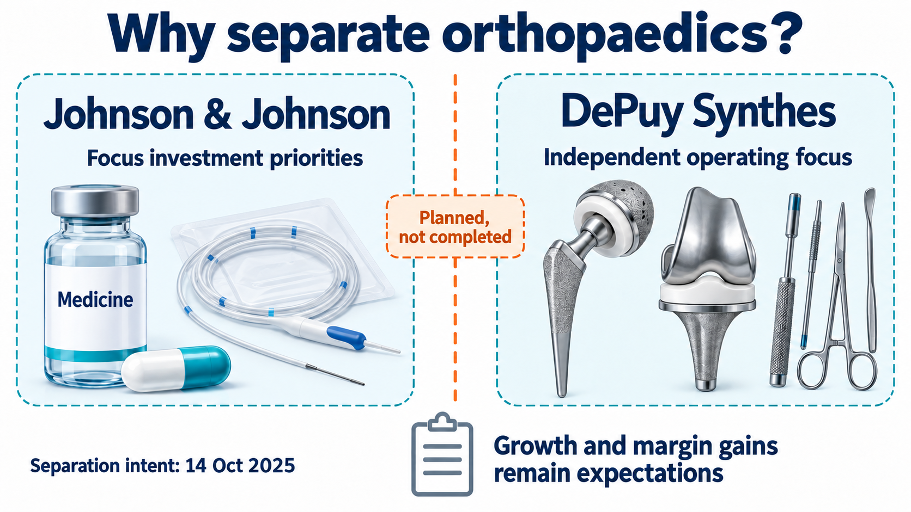
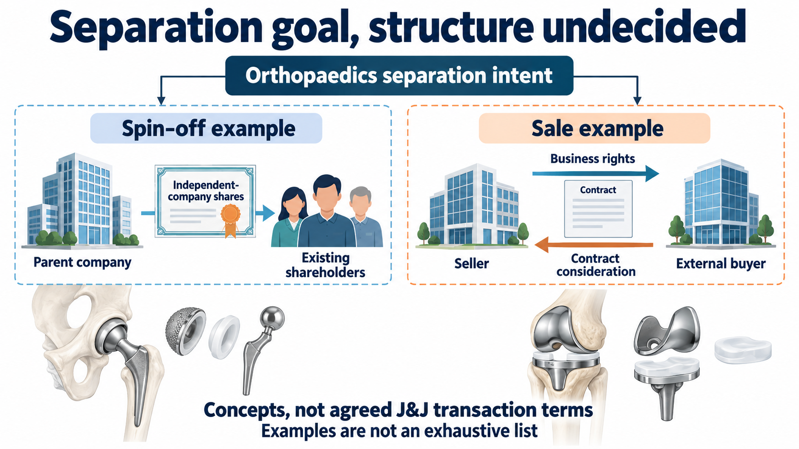
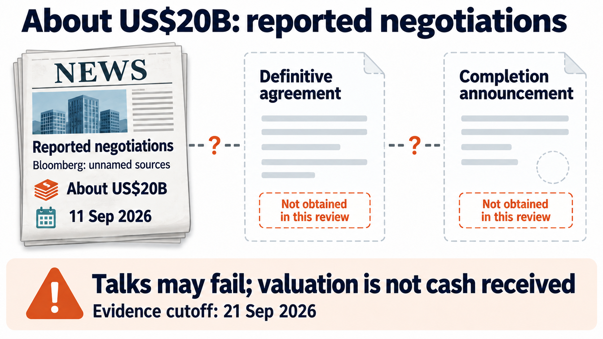
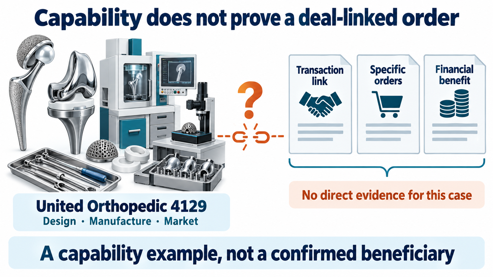

# US$9.2 Billion in Annual Sales—Why Does J&J Still Want to Separate Orthopaedics?

──────────

In 2024, Johnson & Johnson’s orthopaedics business generated approximately US$9.2 billion in sales. Yet in October 2025, the company announced a plan to separate the business so that DePuy Synthes could operate independently. Now a potential buyer has emerged for this substantial medical-device business: on September 11, Bloomberg reported, citing unnamed people familiar with the matter, that Apollo was discussing an acquisition at a potential valuation close to US$20 billion. [1][3]

The J&J and Apollo announcements and J&J second-quarter filing reviewed as of September 27 do not establish that a definitive agreement for this transaction has been signed or that it has closed. The company continues to describe multiple separation paths. The separation plan is formally documented; the US$20 billion figure comes from reporting on talks. They carry different levels of certainty. [2][3][4]

Why would a parent want to let go of a business generating more than US$9 billion in annual sales while outside capital wants to take it on? That contrast reveals more about the calculation inside a large pharmaceutical group than the reported price alone.

## 【01｜Orthopaedics Is Still Growing, but May Not Get the Next Investment】

When J&J announced the separation plan, it identified oncology, immunology and neuroscience in Innovative Medicine, and cardiovascular, surgery and vision in MedTech as its future priorities. The company wants to concentrate its portfolio on higher-growth, higher-margin markets. [1]

This year’s figures make the choice easier to understand.

📊 In the first half of 2026, J&J’s orthopaedics sales were US$4.801 billion, with operational growth excluding currency effects of 3.7%. Cardiovascular devices recorded operational growth of 6.6% over the same period. Orthopaedics has not stopped growing, but the two businesses are growing at different rates. [2]

Removing currency effects reduces the influence of changes in dollar translation and brings the comparison closer to the underlying sales trend. Growth is still only one part of capital allocation: a faster-growing business may require more upfront investment, while mature products may already have established customers and distribution. Management must consider profitability, investment needs and payback periods together. The two growth rates help explain the context for its choice; they cannot independently quantify the value a separation would create.

US$9.2 billion answers the question, “How large is this business today?” Budget decisions also ask, “Where will the next dollar produce more growth?” Stable revenue, brands and hospital relationships are valuable, while research, surgical instruments and service teams require continuing investment. Within a large group, the same pool of capital can be allocated to joint replacements, cardiovascular devices or the next generation of oncology drugs. Those uses compete with one another.

The Drugnews team’s interpretation is that orthopaedics is facing a question of investment priority within the group. J&J wants to concentrate its resources; DePuy Synthes could gain the opportunity to allocate capital around its own product cycles, research needs and customer base, without always competing with the other businesses on the same budget sheet.

One part of the calculation is easy to overlook. Removing a slower-growing business may improve the remaining group’s reported growth profile, but the group also gives up that business’s future earnings. Whether shareholders are better off depends on the cash or equity received in exchange and on subsequent operating results.

【Figure 1｜One Orthopaedics Business, Two Approaches to Capital Allocation】
J&J wants to concentrate investment across the group, while DePuy Synthes would set priorities around its own products and customers. Operating results following a separation would determine whether growth and margins improve.

## 【02｜Distributing Shares and Selling for Cash Deliver Different Assets】

J&J’s original completion target was 18–24 months from the October 2025 announcement, subject to final board approval, applicable regulatory approvals and consultations with employee representatives. Its second-quarter 2026 filing continues to describe an evaluation of multiple paths. Different arrangements can therefore be compared, but the final structure cannot yet be filled in for the company. [1][2]

🏢 A share-distribution spin-off

Under this structure, the parent distributes shares in the new company to its existing shareholders, who then directly own shares in two companies. The orthopaedics business’s future performance and share-price movements continue to affect their holdings. The parent does not receive an equivalent sale price simply by distributing the shares. [7]

💰 A sale to an outside buyer

In a cash sale, the parent receives transaction consideration while giving up the future earnings of the business sold. The proceeds could be reinvested in other businesses, used to address debt or allocated in other ways, depending on the company’s decisions. They are not automatically distributed in full to shareholders.

“Orthopaedics leaving J&J” may sound like the same outcome, but value can flow to different places. In one arrangement, shareholders continue to own an independent business; in the other, the parent exchanges future earnings for consideration today. Counting the number of companies after a separation does not establish which route is more attractive.

【Figure 2｜Follow the Value Before Focusing on the Transaction’s Name】
A share distribution and a sale allocate rights differently. The diagram illustrates structures, not terms that J&J has selected.

## 【03｜What Would Earn Back a US$20 Billion Investment?】

Dividing US$20 billion by US$9.2 billion produces approximately 2.2 times. The calculation is intuitive, but it only compares the scale of a reported valuation with 2024 sales. It is not an established transaction valuation multiple, much less a claim that the investment would pay for itself in two years: revenue must also cover manufacturing, research, sales and service costs. [1][3]

🔍 A buyer needs to estimate how much cash the business could retain each year as a standalone operation.

The accessible reporting does not fully establish which assets the near-US$20 billion figure covers, how debt would be treated or whether the figure represents enterprise value or equity value. Even at the same final price, a buyer assuming debt or J&J retaining certain obligations would change the economics for each side. Taxes, separation expenditure and transaction costs would also affect J&J’s net proceeds.

Another key issue is the cost of leaving the group. Which shared headquarters, information-system and support functions would need to be established independently? How much capital would instruments and inventory require? Those expenditures attract less attention than the acquisition price but affect the cash that can subsequently be retained.

If Apollo ultimately acquires the business, its challenge would extend beyond obtaining an inexpensive asset. Changes to the product mix, market expansion or operating efficiency all require balancing capital returns with product investment. Cutting necessary research and clinical support could also weaken future revenue.

【Figure 3｜Read the Price and the Transaction Stage Separately】
The original figure identifies a September 21 evidence cutoff. This article updates the review scope using announcements and filings accessible on September 27. The near-US$20 billion figure remains treated as anonymously sourced reporting on talks.

## 【04｜Acquiring Orthopaedics Means Acquiring a Surgical Business】

Orthopaedic devices involve much more than selling an implant to a hospital.

🦴 Consider knee replacement. The implant reconstructs damaged joint surfaces; the procedure also involves bone cuts, ligament tension and lower-limb alignment, supported by measurement and cutting instruments. A product’s adoption in the operating room depends on far more than implant materials. Associated tools, the team’s operating experience and service support are also relevant. [6]

J&J’s second-quarter filing notes that growth in its ATTUNE knee portfolio was partly supported by the VELYS robotic-assisted surgical system. Adoption of surgical tools can support implant sales. The two need to be managed together rather than treated as unrelated items on separate product lists. [2]

That is part of the value of a large orthopaedics platform. Products, hospital customers, sales teams, surgeon training and clinical support must connect over time. Improvements in a mature business can come from a better product mix and investment in markets, not only from lowering unit manufacturing costs. Apollo’s own plans would need to be established through its formal disclosures; general business analysis should not be presented as a strategy the buyer has committed to.

Viewed this way, scale in orthopaedics involves more than selling a wider range of implants. If existing products and tools continue to be adopted within the same surgical workflow, investment in research, education and local services has a business rationale. Evaluating a prospective owner therefore means asking which capabilities it intends to strengthen and which costs can genuinely be reduced without undermining product use and support. That is closer to the source of a medical-device business’s value than simply guessing whether an acquisition would bring layoffs.

## 【05｜A Direct Taiwanese Comparison: United Orthopedic】

Taiwan’s United Orthopedic Corporation (4129) has direct product-market overlap: hip and knee implants, associated surgical instruments, clinical education and customer services. Its U2 Knee AiO integrates femoral measurement and cutting functions, illustrating how an orthopaedics company connects implants with the surgical workflow. [5][6]

The relevant factors are its own product adoption, international expansion and service costs, rather than converting an international transaction directly into assumed orders for a Taiwanese stock. How margins and expenses change as revenue grows is closer to the company’s operating quality. This is a product-market comparison; no supply or partnership relationship in this transaction has been established here.

【Figure 4｜Bring the Taiwanese Comparison Back to Products and Operations】
United Orthopedic is a local example of similar products and surgical support. Its own sales and delivery costs provide operating evidence that can be followed over time.

──────────

The most revealing information will be DePuy’s standalone cash-flow profile and debt allocation. After financing, headquarters, instruments and clinical-support costs, how much could it still invest in new products?

J&J faces its own test. Where will the capital and management resources previously devoted to orthopaedics go? Can those new investments deliver a better return than continuing to hold this mature business? The price at the time of separation cannot answer that half of the question.

Once the transaction’s form is settled, who will fund the next orthopaedics development program, how much will they commit, and will that spending support surgeon adoption and product renewal? Those are the harder questions for this mature business.

## References

[1] J&J, intention to separate its orthopaedics business, October 14, 2025.
https://www.jnj.com/media-center/press-releases/johnson-johnson-announces-intent-to-separate-its-orthopaedics-business

[2] J&J, second-quarter 2026 Form 10-Q. Reporting period ended June 28, 2026; signature date in the filing: July 23, 2026.
https://www.sec.gov/Archives/edgar/data/200406/000020040626000153/jnj-20260628.htm

[3] Bloomberg, reported Apollo talks to acquire J&J’s orthopaedics business, September 11, 2026, 22:26 UTC (September 12 in Taipei). Only publicly accessible paragraphs are cited.
https://news.bloomberglaw.com/pharma-and-life-sciences/apollo-global-is-said-in-talks-to-acquire-j-js-orthopedics-unit

[4] J&J and Apollo announcement lists reviewed on September 27, 2026. Entries accessible in this review covered September 10–25 and August 11–September 17, respectively. This does not rule out unindexed pages or non-public information.
https://www.jnj.com/media-center/press-releases
https://ir.apollo.com/news-events/press-releases

[5] United Orthopedic, company profile and shareholder information. Accessed September 27, 2026.
https://tw.unitedorthopedic.com/about-us
https://tw.unitedorthopedic.com/investor/shareholder5/

[6] United Orthopedic, total knee replacement and U2 Knee AiO product pages. Accessed September 27, 2026.
https://tw.unitedorthopedic.com/total-knee-replacement/
https://tw.unitedorthopedic.com/innovation/u2-knee-aio

[7] SEC Investor.gov, Spin-Offs. Accessed September 27, 2026.
https://www.investor.gov/introduction-investing/investing-basics/glossary/spin-offs

This article provides industry information and business analysis and does not constitute individualized investment advice.

#JohnsonAndJohnson #JNJ #DePuySynthes #Apollo #Orthopaedics #MedicalDevices #MedTech #UnitedOrthopedic #4129 #Drugnews
