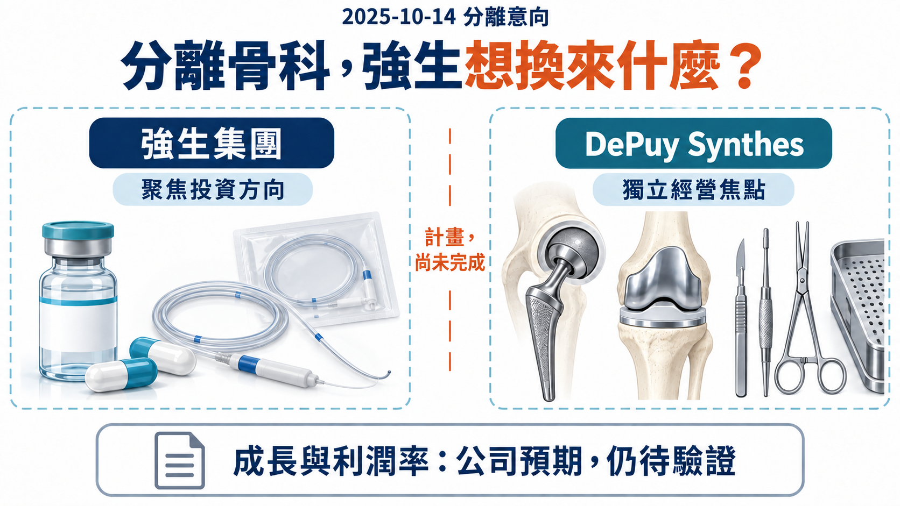
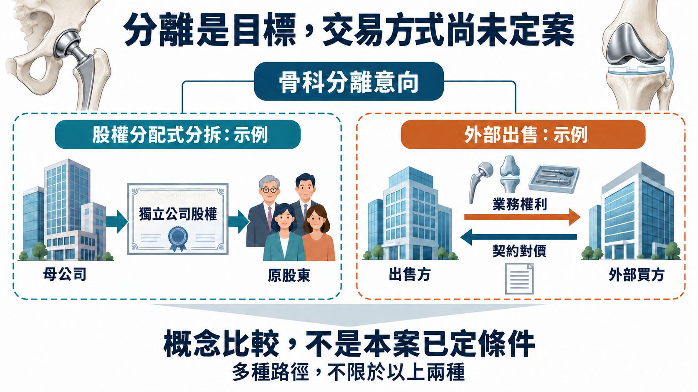
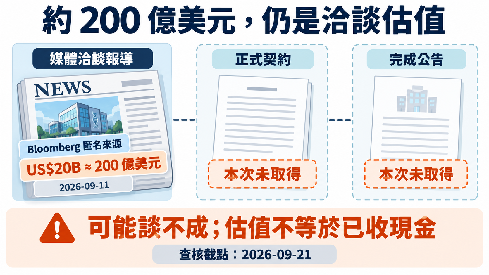
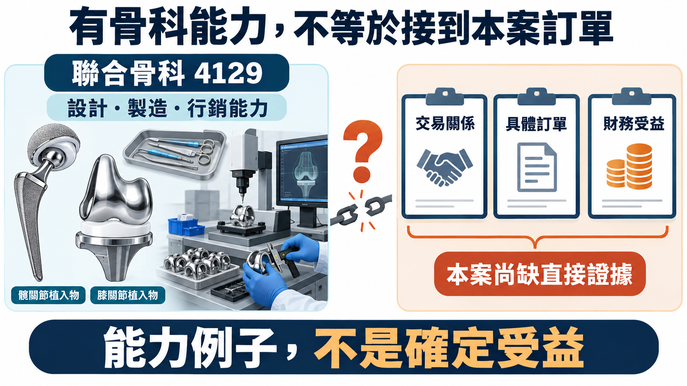

# 年營收 92 億美元，強生為什麼還想把骨科拆出去？

──────────

2024 年，強生（Johnson & Johnson，J&J）的骨科業務賣了約 92 億美元。到了 2025 年 10 月，公司仍宣布分離計畫，打算讓 DePuy Synthes 獨立經營。如今，這塊大型醫材資產又傳出買家：Bloomberg 9 月 11 日引述匿名知情人士報導，Apollo 正洽談收購，可能估值接近 200 億美元。【1】【3】

截至 9 月 27 日查閱的 J&J、Apollo 公告與 J&J 第二季財報，尚未取得本案正式簽約或交割的證據；公司仍保留多種分離途徑。分離計畫有正式文件，200 億美元則是洽談消息，兩者的確定程度不同。【2】【3】【4】

一個一年能賣 90 多億美元的事業，為什麼母公司想放手，外部資金卻想接手？這個反差，比傳聞中的價碼更能說明大型藥廠正在算哪一筆帳。

【01｜骨科還在成長，卻未必排得到下一筆資金】

J&J 在宣布分離時，把未來的重心放在創新藥的腫瘤、免疫、神經科學，以及 MedTech 的心血管、外科與視力。公司希望藉由調整組合，往成長更快、利潤率更高的市場集中。【1】

今年的數字，讓這個選擇更容易理解。

📊 2026 年上半年，J&J 骨科銷售為 48.01 億美元，排除匯率影響的營運成長為 3.7%；同期心血管醫材的營運成長為 6.6%。骨科並沒有停止成長，但兩塊業務的速度不同。【2】

排除匯率，是為了少受美元換算變動干擾，更接近業務本身的銷售走勢。不過，成長速度只是資本配置的一部分：更快的業務也可能需要更多前期投入，較成熟的產品則可能已有穩定的客戶與通路。公司還得把利潤、投資需求及回收時間放在一起看；兩個成長率能解釋這項選擇的背景，不能單獨算出拆分後多了多少價值。

92 億美元回答的是「今天這門生意有多大」，管理層分配預算時，還要問「下一美元投在哪裡，能換回更多成長」。穩定的收入、品牌與醫院關係有價值，研發、手術器械與服務團隊也要持續花錢。對大型集團來說，同一筆資金放在人工關節、心血管器材或下一代腫瘤藥物，本來就會被放在一起比較。

藥時事團隊的判讀是，骨科這次面對的是集團內部的投資順位。J&J 希望把資源集中，DePuy Synthes 則有機會依自己的產品週期、研發需求與客戶結構安排資本，而不必總在同一張預算表上與其他業務競爭。

這裡仍有一筆容易忽略的帳：移出成長較慢的業務，可能讓留下來的集團成長率變漂亮，但集團也失去了那塊業務未來的收益。要判斷股東是否更划算，得看換回的資金或股權，以及之後的經營成果。

【圖1｜同一塊骨科業務，兩種資本配置】
J&J 想集中集團投資，DePuy Synthes 則以自身產品與客戶需求決定優先順序。能否改善成長與利潤率，要由分離後的經營結果驗證。

【02｜分拆給股東，與出售換現金，拿到的東西不同】

J&J 原公告的完成目標是 18～24 個月，從 2025 年 10 月起算；仍需董事會最終批准、適用的監管批准及員工代表諮詢。2026 年第二季財報也保留評估多條路徑的說法。因此，現在可以比較不同安排，還不能替公司把交易形式填好。【1】【2】

🏢 股權分派式分拆（spin-off）

若採這種方式，母公司把新公司股份分給原股東，股東改為直接持有兩家公司。之後骨科的經營好壞、股價漲跌，仍會反映在他們持有的股份上；母公司不會只因分派股份，就收到一筆等額售價。【7】

💰 對外出售

若以現金出售，母公司取得交易對價，同時讓出所售業務的未來收益。這筆資金可以再投入其他業務、處理負債或作其他資本配置，具體用途取決於公司決定，並不是自動全部發給股東。

所以「骨科離開 J&J」看似是同一個結果，價值卻可能走向不同地方。一邊是股東繼續持有一門獨立生意，另一邊是母公司拿未來收益交換現在的對價。哪條路更划算，不能只看拆分後有幾家公司。

【圖2｜先看價值流向，再看交易名稱】
股份分派與出售的權利安排不同；圖中是結構示意，不是 J&J 已選定的條款。

【03｜200 億美元買下來，要靠什麼收回投資？】

把 200 億美元除以 92 億美元，約是 2.2 倍。這個算式很直覺，卻只是在比較傳聞估值與 2024 年銷售的量級，不是正式估值倍數，更不是「兩年就能回本」：營收還得支付製造、研發、銷售與服務的成本。【1】【3】

🔍 買方真正需要估的是：獨立經營之後，每年能留下多少現金？

目前可讀的報導，沒有完整釐清近 200 億美元究竟涵蓋哪些資產、如何處理負債，以及是企業價值還是股權價值。即使最終價格相同，買方若需承接債務，或 J&J 仍須保留部分責任，雙方得到的經濟結果也會不同。對 J&J 而言，稅務、分離費用與交易成本還會影響可留下的淨款。

另一個關鍵是離開集團後的成本。原本共用的總部、資訊系統及支援功能，哪些要獨立建立？器械與庫存需要多少資金？這些支出不如收購價醒目，卻會影響往後能留下的現金。

若 Apollo 最終接手，它面對的也不只是「買到便宜資產」的問題。調整產品組合、擴展市場或提高營運效率，都需要把資金回報與產品投資放在同一張表上；削掉必要的研發和臨床支援，可能同時削弱未來收入。

【圖3｜價碼與交易階段，分開判讀】
原圖標示 9 月 21 日的查核截點；本文已按 9 月 27 日可讀公告與財報更新查閱範圍。近 200 億美元仍以匿名媒體洽談消息處理。

【04｜接手骨科，接手的是整套手術生意】

骨科器材的生意，比「把植入物賣給醫院」複雜得多。

🦴 以人工膝關節為例，植入物用來重建受損的關節面；手術還要處理骨切面、韌帶張力與下肢力線，搭配量測及截骨器械。產品能不能進入手術室，牽涉的遠不只是植入物材料，還包括配套工具、團隊的操作經驗與服務支援。【6】

J&J 第二季財報提到，ATTUNE 膝關節產品的成長，部分受到 VELYS 機器人輔助手術系統帶動。對公司而言，手術工具的採用可以支持植入物銷售；兩者需要一起經營，而不是各自放在互不相干的產品清單裡。【2】

這也是大型骨科平台的價值所在。產品、醫院客戶、銷售團隊、醫師訓練與臨床支援，要能長期銜接。成熟業務的經營改善，可以來自更好的產品組合和市場投入，不只剩下壓低單件製造成本。至於 Apollo 如何規劃這些工作，仍要看其正式披露，不能把一般商業分析寫成買方已承諾的策略。

從這個角度看，一家骨科公司的規模，不只是多賣幾種植入物。既有產品與工具若能在同一套手術流程裡被持續採用，投入研發、教育及在地服務就有經營上的意義。評估接手方時，也就值得問：它準備把哪些能力做得更強，哪些成本確實可以降低，而不傷到產品使用與服務？這比只猜收購後會不會裁員，更接近一門醫材生意的價值來源。

【05｜台灣的直接對照：聯合骨科】

台灣的聯合骨科（4129）有直接的產品市場重疊：人工髖、膝關節與配套手術器械，也提供臨床教育和客戶服務。它的 U2 Knee AiO 整合股骨量測及截骨功能，正好說明骨科公司如何把植入物與手術流程接在一起。【5】【6】

這個例子值得看的，是自己的產品採用、海外市場拓展與服務成本，而非把國際交易直接換算成台股訂單。收入增加後，毛利與費用怎麼變，才更接近一間骨科公司的經營品質。本文採用的是產品市場的比較，沒有確認本案的供應或合作關係。

【圖4｜把台股比較放回產品與經營】
聯合骨科提供的是同類產品與手術支援的本地案例；它自己的銷售與交付成本，才是可持續追蹤的經營證據。

──────────

接下來最有辨識力的資料，是 DePuy 獨立經營後的現金流與負債配置：付完融資、總部、器械及臨床支援成本，還能投入多少新產品？

J&J 也有自己的考題。原本投入骨科的資本與管理資源，最後流向哪裡？新的投資能否做出比繼續持有這塊成熟業務更好的回報？只看分離當下的價碼，還回答不了這一半。

交易形式確定之後，下一筆骨科研發費由誰支付、願意付多少，以及能否換來醫師採用與產品更新，才是這門成熟生意更難回答的問題。

【資料來源】

【1】J&J，骨科業務分離意向公告，2025-10-14。
https://www.jnj.com/media-center/press-releases/johnson-johnson-announces-intent-to-separate-its-orthopaedics-business

【2】J&J，2026 年第二季 Form 10-Q；報告期截至 2026-06-28，正文簽署日 2026-07-23。
https://www.sec.gov/Archives/edgar/data/200406/000020040626000153/jnj-20260628.htm

【3】Bloomberg，Apollo 洽購 J&J 骨科業務報導，2026-09-11 22:26 UTC（台北 9/12）；僅引用公開可讀段落。
https://news.bloomberglaw.com/pharma-and-life-sciences/apollo-global-is-said-in-talks-to-acquire-j-js-orthopedics-unit

【4】截至 2026-09-27 查閱的 J&J、Apollo 公告列表。當次可讀範圍分別為 9/10–9/25、8/11–9/17；不是對未索引頁面或未公開資訊的排除證明。
https://www.jnj.com/media-center/press-releases
https://ir.apollo.com/news-events/press-releases

【5】聯合骨科，公司簡介與股務資訊；2026-09-27 查閱。
https://tw.unitedorthopedic.com/about-us
https://tw.unitedorthopedic.com/investor/shareholder5/

【6】聯合骨科，人工膝關節置換及 U2 Knee AiO 產品頁；2026-09-27 查閱。
https://tw.unitedorthopedic.com/total-knee-replacement/
https://tw.unitedorthopedic.com/innovation/u2-knee-aio

【7】SEC Investor.gov，Spin-Offs；2026-09-27 查閱。
https://www.investor.gov/introduction-investing/investing-basics/glossary/spin-offs

本文為產業資訊與商業分析，不構成個別投資建議。

#JohnsonAndJohnson #JNJ #DePuySynthes #Apollo #骨科 #醫療器材 #MedTech #聯合骨科 #4129 #藥時事
