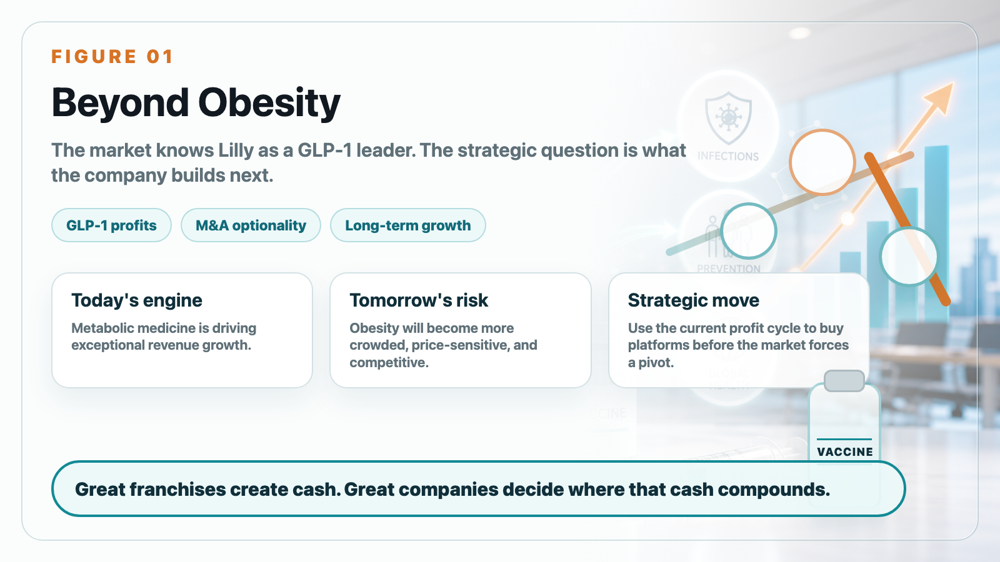
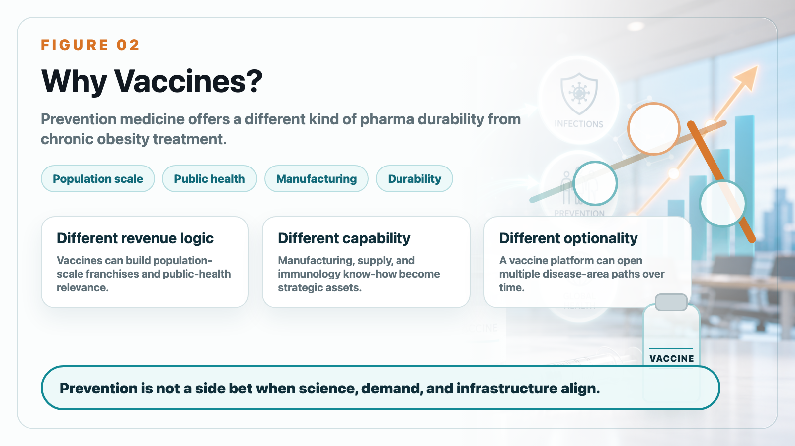
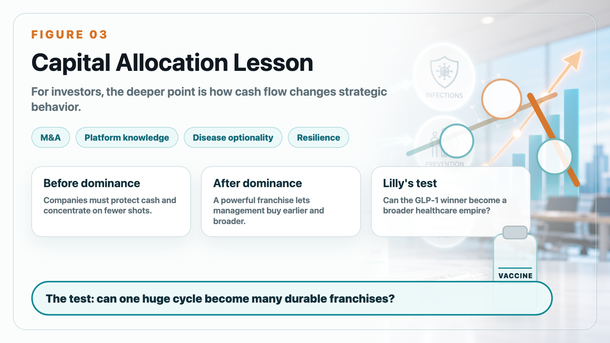

# Why Would Lilly, the Obesity-Drug Giant, Spend US$3.8 Billion on Vaccine Companies?

Eli Lilly is known today as one of the two dominant forces in obesity medicine. Mounjaro and Zepbound have turned incretin biology into one of the most important growth engines in global pharma. That is exactly why Lilly's vaccine acquisitions deserve attention.

At first glance, vaccines look far away from obesity drugs. But from a capital-allocation perspective, the logic is clearer. A company with massive cash flow from metabolic medicine can use that position to buy optionality in areas that may matter for the next decade.

The strategic question is not whether Lilly is abandoning obesity. It clearly is not. The better question is how Lilly wants to use the obesity-drug profit cycle before the market becomes more crowded, more price-sensitive, and more competitive.

Vaccines and prevention medicine can offer something different from chronic obesity treatment. They can create population-scale franchises, support public-health relevance, and diversify the company's long-term growth base. For a large pharmaceutical company, prevention is not a side topic. It can become a durable strategic pillar when science, manufacturing, and demand align.

The business logic also reflects a broader pharma pattern. When a company has one exceptionally strong franchise, investors eventually ask what comes next. Lilly's answer cannot be only "more GLP-1." The obesity market is enormous, but it will attract every major company. Novo Nordisk, Roche, Pfizer, AstraZeneca, Regeneron, Amgen, and many Asian companies are all trying to find differentiated angles.

That means Lilly needs to convert current strength into future resilience. Acquiring vaccine companies is a way to buy platform knowledge, disease-area optionality, manufacturing capabilities, and a stronger position in prevention.

For biotech investors, the lesson is that cash flow changes strategy. A company with a dominant product can become more aggressive in M&A because it can afford to buy earlier, broader, and more strategically. Lilly's vaccine moves are not random. They are part of the transition from a company winning one huge drug category to a company trying to build a broader long-term healthcare empire.

The obesity-drug cycle made Lilly stronger. The next question is whether Lilly can use that strength to build durable franchises beyond obesity.

This article is intended for industry research and knowledge sharing only. It does not constitute investment, medical, fundraising, or individual stock advice.
