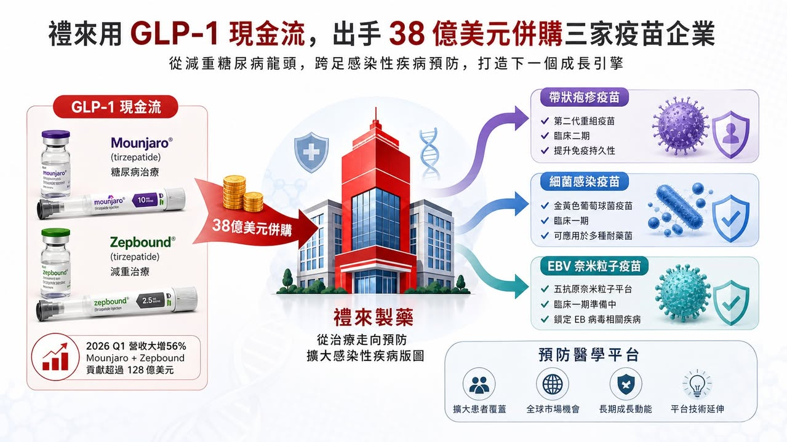
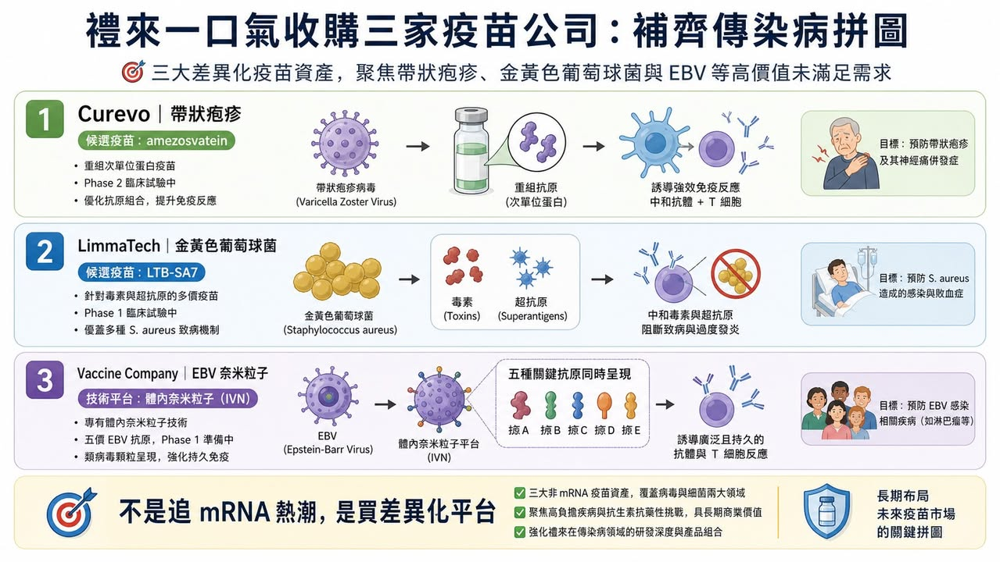
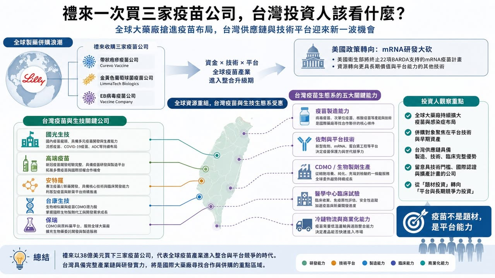

# 禮來 38 億美元買三家疫苗公司：減肥藥巨頭，為什麼突然回頭買「預防醫學」？

禮來這次的動作，看起來有點反直覺。

市場現在最熟悉的禮來，是 Mounjaro、Zepbound 背後那個 GLP-1 巨頭。2026 年第一季，禮來營收達到 198 億美元，年增 56%，主要動能還是來自 Mounjaro 與 Zepbound 的放量。簡單說，禮來現在手上最強的現金流，是減重與糖尿病藥物。

但就在這個時候，禮來一口氣宣布要買三家疫苗公司：Curevo、LimmaTech Biologics、Vaccine Company。三筆交易的潛在總金額最高大約 38.3 億美元。

這不是小錢，也不是單純補一條管線。

禮來買的不是熱門的癌症藥，也不是下一個 GLP-1，而是三個方向都很不一樣的疫苗平台：帶狀疱疹、抗藥性細菌感染、EBV 病毒。

表面上看，這像是禮來突然想回到感染症市場。可是如果把三家公司放在一起看，邏輯其實很清楚：禮來不是在追疫苗題材，而是在買「預防疾病源頭」的長線入口。

## 01｜禮來買 Curevo：不是挑戰 Shingrix，而是挑戰疫苗接種率

第一家公司 Curevo，核心資產是 amezosvatein，一款用於預防帶狀疱疹的佐劑型次單位疫苗。

帶狀疱疹不是小市場。GSK 的 Shingrix 已經是非常成功的疫苗，保護力也很強。但問題在於，Shingrix 的副作用體感不輕，很多人打完會有疲倦、發冷、注射部位疼痛，甚至因為第一劑反應太強而猶豫第二劑。

所以 Curevo 的切入點很聰明。它不是說自己一定比 Shingrix 更有效，而是想做出「保護力相近，但耐受性更好」的帶狀疱疹疫苗。根據禮來公告，amezosvatein 在第二期臨床中，和現有標準治療做頭對頭比較，主要免疫反應指標相當，同時將限制日常活動的疲倦、發冷、注射部位疼痛等副作用降低超過一半。

這個數字很重要。疫苗的商業化不是只看保護力。對已經有成熟疫苗的市場來說，真正的競爭點常常是：更多人願不願意去打？打完第一劑之後，願不願意完成第二劑？

如果一款疫苗能讓接種體驗變好，它不一定要顛覆原有產品，也可能靠提高接種率創造價值。更重要的是，帶狀疱疹現在不只被看成急性感染。越來越多研究把帶狀疱疹與中風、失智風險連在一起。這讓疫苗的價值從「避免皮膚神經痛」往「降低長期神經風險」延伸。禮來這筆收購最高可達 15 億美元，本質上買的是一個成熟大市場裡的改善型產品機會。

## 02｜買 LimmaTech：抗生素失靈後，疫苗變成下一道防線

第二家公司 LimmaTech Biologics，方向更偏長線，也更有戰略味。

LimmaTech 做的是細菌感染疫苗，管線包括金黃色葡萄球菌、淋病奈瑟菌、披衣菌等。它的核心思路，是針對細菌毒素與超級抗原設計疫苗，讓免疫系統產生更廣、更持久的防護。

這裡的關鍵字不是「疫苗」，而是「抗藥性」。

全球抗生素抗藥性越來越嚴重。很多細菌感染過去可以靠抗生素處理，但未來如果治療工具越來越少，預防就會變得更重要。當藥物治療的後門越來越窄，疫苗就變成前門。

LimmaTech 的 lead program 是 LTB-SA7，針對金黃色葡萄球菌，目前處於第一期臨床。金黃色葡萄球菌是手術部位感染的重要原因，也和醫院感染、高風險病人照護有關。如果能做出有效疫苗，商業價值不只在一般感染，而是在醫院、手術、慢性病患者、免疫低下族群的風險管理。

禮來這筆交易最高可達 7.8 億美元。相較 Curevo 的帶狀疱疹疫苗，LimmaTech 還更早期，但它指向的是另一個更大的問題：當抗生素時代的紅利逐漸消退，下一代感染症公司要做的，可能不是更多抗生素，而是更精準的預防。

## 03｜買 Vaccine Company：EBV 疫苗背後，是神經疾病與癌症風險

第三家公司名字很直，就叫 Vaccine Company。它的技術是 in vivo nanoparticle，也就是在體內形成類似病毒樣顆粒的抗原展示，希望誘發更持久的免疫反應，同時避開傳統病毒樣顆粒製造上的負擔。

它最重要的領先計劃，是針對 EBV (第四型人類皰疹病毒)，也就是 Epstein-Barr Virus 的五抗原候選疫苗，準備進入第一期臨床。

EBV 很多人都感染過，常和傳染性單核球增多症有關。但它真正讓大藥廠感興趣的地方，是越來越多證據把 EBV 和多發性硬化症、部分血液腫瘤與上皮癌症連在一起。這件事如果成立，EBV 疫苗就不只是防一場急性感染，而是在防一串多年後才可能出現的神經與腫瘤風險。

這也是禮來這次三筆收購裡最有想像力的一塊。因為它把疫苗從傳統感染症市場，往神經科學、腫瘤學、免疫學的交界推過去。禮來願意為 Vaccine Company 付出最高 15.5 億美元，代表它不是只看短期收入，而是把 EBV 當成一個可能重塑疾病預防邏輯的入口。

## 04｜這不是 mRNA 熱潮，而是疫苗投資邏輯正在換檔
這次最有趣的背景，是同時美國政策風向剛好正在轉變。

美國 HHS 宣布 BARDA 將逐步終止 mRNA 疫苗開發活動，包含取消或縮減 22 項 mRNA 疫苗投資，總金額接近 5 億美元。這個政策有爭議，也不代表 mRNA 技術沒有價值，但它確實讓市場重新思考一件事：疫情時代的 mRNA 高速敘事，正在退燒。

但「mRNA 退燒」不等於「疫苗退燒」。

禮來這次反而在這個時間點買三家疫苗公司，背後的訊號是：疫苗投資正在從平台口號，回到未被滿足的疾病需求。也就是說，下一階段疫苗公司不能只說自己是 mRNA、病毒載體、次單位、奈米粒子或佐劑平台。市場會更直接問：

你解決哪一個疾病？

現有疫苗有什麼缺口？

你的耐受性、接種率、製造成本或臨床場景有沒有明顯改善？

這個感染和長期疾病風險有沒有連結？

大藥廠買下來之後，有沒有能力放到全球商業化系統？

這才是禮來的真正盤算。

## 05｜GLP-1 現金流，正在變成禮來的併購燃料
這次交易不能只當成疫苗新聞看，也要放回禮來自己的資本配置。

禮來現在最大的優勢，是 GLP-1 現金流太強。Mounjaro、Zepbound 把禮來推上全球製藥市值第一梯隊，也讓它有能力同時做幾件事：擴產、推口服 GLP-1、投資阿茲海默症、布局免疫與癌症，還能順手買下早中期平台公司。

這就是大藥廠的恐怖之處。

當一家公司有超級現金流產品，它買的不是單一賭注，而是一整組未來選擇權。今天買疫苗，明天買 in vivo CAR-T，後天買核藥或小分子平台，背後都不是「亂買」，而是在用主力產品產生的現金流，換未來十年的成長曲線。

所以禮來這次買三家疫苗公司，真正的訊號不是「禮來看好疫苗」這麼簡單，而是：GLP-1 巨頭正在把減肥藥的現金流，轉成下一輪預防醫學、感染症與長期疾病風險管理的入口。

## 06｜台灣可以看誰？不要只看疫苗題材，要看平台能力
放回台灣，這件事很容易被簡化成：疫苗股是不是要動？

但我覺得不能這樣看。

禮來買的不是單純「疫苗概念」，而是三種能力：改善既有疫苗體驗、處理抗藥性細菌、把感染和長期疾病風險連起來。台灣公司如果要被放進這個框架，也不能只看公司名字是不是有疫苗，而是要看它有沒有平台、製造、法規、臨床和商業化能力。

國光生技（4142）是台灣最傳統也最完整的疫苗製造公司之一，強項在流感疫苗、量產、供應與公共衛生採購經驗。它的價值不是新題材，而是台灣在疫苗製造與供應鏈上最基礎的能力。

高端疫苗（6547）比較像平台型疫苗公司，過去因為 COVID 疫苗被市場高度政治化，但如果把情緒拿掉，它仍然代表台灣在蛋白質次單位疫苗、佐劑、臨床與法規路徑上累積過完整經驗。未來真正要看的是，它能不能從單一事件，轉成可持續的平台與國際合作。

安特羅（6564）則可以放在腸病毒、兒童疫苗、區域公共衛生需求的脈絡裡看。它的重點不是短期爆發，而是台灣公司能不能在亞洲常見感染症裡找到差異化市場。

台灣投資人真正要關注的：如果下一波疫苗投資不再靠疫情恐慌，而是靠長期疾病風險、抗藥性、老年化、兒童感染與公共衛生需求，台灣哪家公司有能力接住？

## 07｜疫苗股最怕的不是沒題材，而是題材沒有續航力
疫苗產業有一個特性：它很容易在事件發生時暴衝，也很容易在事件退燒後被遺忘。

COVID 時代大家都知道疫苗重要，但疫情過後，很多疫苗公司估值被打回原形。原因不是疫苗不重要，而是市場發現：沒有可持續產品線、沒有全球通路、沒有穩定採購、沒有清楚適應症延伸的公司，很難長期維持高估值。所以這次禮來買三家疫苗公司，反而給市場一個比較健康的篩選方式。真正有價值的疫苗公司，不是只會喊平台，而是要回答幾個問題：

能不能改善既有疫苗的缺點？

能不能做出現有治療無法解決的預防價值？

能不能讓感染症和長期疾病風險產生商業連結？

能不能被大藥廠放進全球臨床與商業化系統？

能不能從單一產品變成多產品平台？

這些問題，才會決定疫苗公司能不能從短線題材，變成長線資產。

## 結語｜禮來不是回頭買舊產業，而是在買下一代疾病預防入口
禮來這次 38 億美元買三家疫苗公司，不是單純復古，也不是突然懷念感染症市場。更準確地說，它是在用 GLP-1 帶來的現金流，去買下一代預防醫學的入口。帶狀疱疹疫苗買的是更好的接種體驗與老年化市場。細菌疫苗買的是抗藥性時代的前線防守。EBV 疫苗買的是感染、神經疾病與癌症之間可能被改寫的長期風險。

這三筆交易加起來，是預防醫學重新被定價。

疫情退燒後，疫苗股最難的是重新證明自己不是一次性題材。禮來這次出手，剛好提醒市場：疫苗真正值錢的地方，不是恐慌，而是長期風險管理。

參考資料：

Eli Lilly｜Lilly announces three acquisitions to build infectious disease portfolio: https://investor.lilly.com/news-releases/news-release-details/lilly-announces-three-acquisitions-build-infectious-disease

Eli Lilly｜Q1 2026 Financial Results: https://lilly.gcs-web.com/news-releases/news-release-details/lilly-reports-first-quarter-2026-financial-results-raises-full

HHS｜HHS Winds Down mRNA Vaccine Development Under BARDA: https://www.hhs.gov/press-room/hhs-winds-down-mrna-development-under-barda.html

JAMA｜HHS Ends mRNA Vaccine Development: https://jamanetwork.com/journals/jama/fullarticle/2838469

---

本文僅供產業研究與知識分享，不構成投資、醫療、募資或個股建議。
