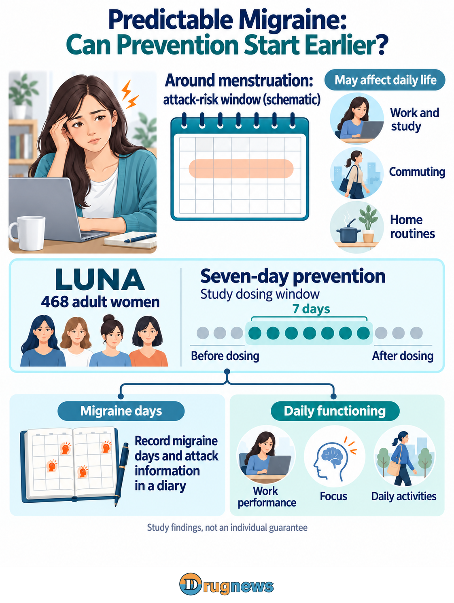
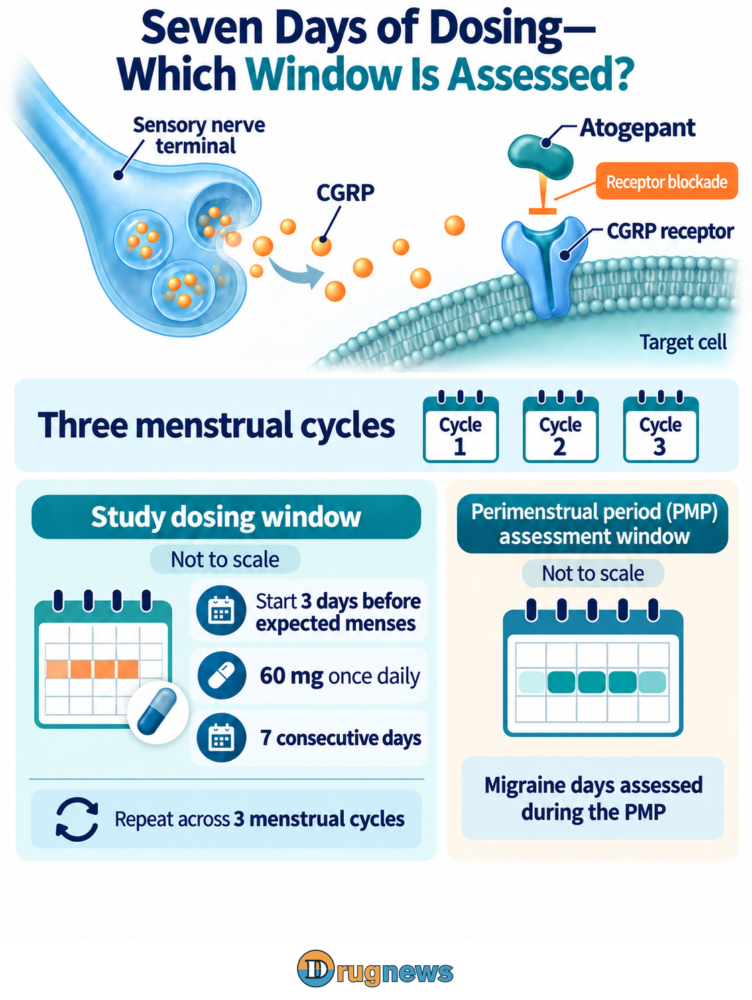
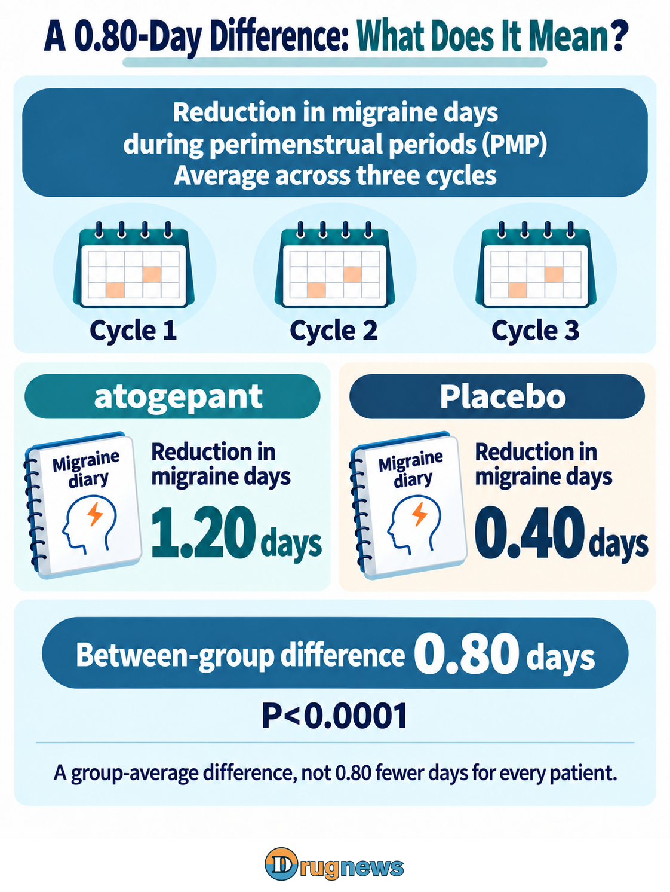

# Migraine Around Your Period? How Much Can a Seven-Day Prevention Strategy Help?

The days around menstruation can already be uncomfortable. Add migraine, sensitivity to light or nausea, and work, school pickups and carefully planned activities can be disrupted. For people whose attacks repeatedly cluster in this window, the question is straightforward: can the burden be reduced before the headache arrives?

On September 10, 2026, AbbVie announced the initial main results, or topline findings, from its Phase 3 LUNA study. The study enrolled 468 adult women and compared seven-day short-term prevention with placebo across three menstrual cycles. Perimenstrual migraine days decreased from baseline by an average of 1.20 days versus 0.40 days, a between-group difference of 0.80 fewer days, with P<0.0001.

The company also reported that secondary endpoints including functional disability were met. LUNA's appeal is to put prevention into a few days that patients can plan for: intervening before a high-risk window rather than waiting for headache to disrupt their plans. For AbbVie, that is also a route for an existing medicine to enter a new use case.

# Predictable Timing Creates Another Opportunity for Prevention

The LUNA study drug, atogepant, is the active ingredient in QULIPTA in the United States and an oral small-molecule CGRP receptor antagonist. CGRP stands for calcitonin gene-related peptide, a signaling molecule involved in migraine. Receptor antagonism can be understood as occupying the signal’s receiving site and reducing its ability to activate that pathway.

Human research offers a clue to the relationship between the menstrual cycle and this signaling pathway. In 2023, a Charité research team compared women in different hormonal states. Among those with natural menstrual cycles, women with migraine had higher CGRP concentrations during menstruation than controls without migraine. This is evidence of an association between hormonal status and CGRP, not an established single cause of every headache around menstruation.

LUNA targets a period when attack risk is more concentrated by intervening in migraine-related signaling. Its research strategy does not alter menstruation itself or use hormone replacement.

Short-term prevention also has a history. A randomized study published in 2004 evaluated frovatriptan for intermittent prevention of menstrually associated migraine. LUNA adds Phase 3 controlled evidence for atogepant’s CGRP-receptor approach; it did not directly compare different short-term preventive medicines.

This is neither a new molecule nor the first way to address menstrual migraine. What changes is the evidence and product positioning: the same medicine moves from general migraine prevention toward a predictable period of often-overlooked need. The patient's question moves beyond whether to use prevention to whether it can be concentrated in the period when it is most needed.

*Figure 1 | LUNA schedules prevention around a predictable menstrual window and separately evaluates migraine days and functional burden. *

# Seven Days Describes Dosing; the Perimenstrual Period Defines the Efficacy Window

The randomized, double-blind, placebo-controlled study enrolled adult women with pure menstrual migraine or menstrually related migraine across Europe and Asia. Before enrollment, menstrual regularity and attack patterns were assessed using medical history and electronic diaries. Chronic migraine and certain other conditions were excluded.

The Japanese public registry also lists Taiwan among the study countries. This is a direct research connection to the trial; the page does not provide Taiwan’s actual enrollment or regional efficacy, nor establish local approval or NHI reimbursement.

If cycles fluctuate substantially or headaches occur on many days throughout the month, a strategy targeting a few days may not transfer directly. The trial used diaries to identify regularity, and actual use also requires an understanding of attack patterns. When to start matters alongside which medicine is selected in determining whether this regimen can be carried out.

The study regimen was atogepant 60 mg or placebo once daily for seven consecutive days, beginning three days before anticipated menstruation and repeated across three cycles during the double-blind period. The primary endpoint counts migraine days during the perimenstrual period (PMP), defined in the registry as Day −2 through Day +3 relative to menstrual onset.

Dosing is scheduled in advance using anticipated timing, while the PMP defines the assessment period. They are not the same window. For people who also have attacks at other times, whole-month burden remains another part of the treatment decision.

*Figure 2 | Dosing starts three days before anticipated menstruation and continues for seven days. The perimenstrual period (PMP) assessment is separately defined as Day −2 through Day +3 relative to menstrual onset. The windows are shown separately and not to scale. *

# An Additional 0.80-Day Reduction: Function Has a Positive Signal, but Magnitude Matters

The primary result compares the change from baseline in PMP migraine days averaged across three menstrual cycles during the double-blind period. Accordingly, 1.20 and 0.40 days are average reductions. The 0.80-day difference is between the groups, not a three-cycle total, a count of remaining days after treatment or an identical benefit for each participant.

A difference of 0.80 days may sound small, but it belongs within a limited high-risk period, not a direct comparison with headache days across a whole month. Different levels of improvement can contribute to that average: some patients may benefit more, others less. Complete baseline data, confidence intervals and responder distributions would give the average a patient-level context. The P value supports a statistical difference; it does not answer whether treatment is worthwhile for a patient.

AbbVie reported that all eight ranked secondary endpoints were also met, covering headache burden, acute medication use, functional disability, cognitive function and responder outcomes. This already represents a company-reported signal of functional benefit. What the announcement does not provide is the complete effect size for each endpoint; the results cite company data on file.

The registered Functional Disability Scale (FDS) endpoint helps explain what was measured. Using PMP data across three menstrual cycles, it assesses the proportion of participants meeting the criterion of no disability or only mild impairment on every PMP day. The question is whether an entire high-risk period remains at a lower level of functional burden, not merely how many migraine days are avoided.

That measure is close to daily life, but it does not directly count days off work avoided or days of caregiving restored. Reporting the proportions meeting the criterion in each group and their difference would show the size of the company’s positive signal. The acute-medication endpoint separately measures days of use during the PMP.

*Figure 3 | Migraine days during the perimenstrual periods of three cycles decreased from baseline by an average of 1.20 versus 0.40 days, a between-group difference of 0.80 days, P<0.0001. PMP names the assessment period. *

# Repeated Short-Term Use Still Requires Efficacy and Tolerability to Be Considered Together

AbbVie reported no new safety signal in LUNA and described the findings as consistent with atogepant’s established profile. Assessing repeated short-term use also requires the type, severity and duration of adverse events and any treatment discontinuations. These determine how much benefit remains worthwhile to patients after the burden of treatment is considered.

The U.S. QULIPTA label lists nausea, constipation and fatigue or somnolence among common adverse reactions, with warnings concerning hypersensitivity reactions, hypertension and Raynaud’s phenomenon. These are background data for the existing product, not LUNA’s event rates. Fewer dosing days do not establish a proportional reduction in risk.

The U.S. label cited here covers migraine prevention in adults and does not include LUNA’s seven-day regimen or as-needed rescue use of atogepant. AbbVie’s September 10 announcement described plans to submit data, not a completed filing or a new approval. The dosing described above is the trial protocol; individual treatment requires clinical assessment.

Short-term does not mean one-off. If the regimen becomes part of daily life, the patient will face the same choice in the next cycle: was the previous improvement worth taking the medicine again? The full report's handling of missing diary entries and withdrawals also addresses that question; it cannot retain only people who completed dosing successfully. An adoptable regimen must account for benefit, physical burden and difficulty carrying it out together.

![A woman holding a pen sits at the center with a diary labeled “My diary”; lines connect her to four surrounding panels. Upper left, “Functional impact,” includes a laptop and house icon and states that the company reports functional secondary endpoints met while full effect sizes await disclosure. Upper right, “Acute medication use,” includes a medication record. Lower left, “Adverse events and tolerability,” includes an adverse-event record and warning symbol. Lower right, “Continued use,” includes a calendar and describes use across menstrual cycles.](images/FIG04_EN_R3.png)

*Figure 4 | The company has reported a positive functional-endpoint result. Complete effect sizes, adverse events and tolerability, continued use and regulatory information will further define the value of the short-term regimen. *

# AbbVie Has an Evidence-Supported Use Case, Not Yet a Whole New Mass Market

LUNA gives AbbVie a product entry point supported by positive Phase 3 results: patients with clustered attacks who can plan ahead but have not received adequate prevention. That is more meaningful than counting all women in a market estimate. It places the need in a use case that physicians can identify and patients can describe.

That positioning involves a trade-off. People with regular cycles, clustered attacks and previously inadequate prevention could represent new use. Those already on a preventive regimen may instead be switching. Physicians need to consider prior response and headache burden over the entire month; fewer dosing days alone do not make a seven-day regimen a natural replacement for existing treatment.

For AbbVie, an established molecule and brand offer clinical experience and product familiarity that may support an additional use case. Yet changing an existing patient to short-term use and treating an additional previously untreated patient have different revenue implications.

There is another commercial possibility: for patients previously treated only after an attack, a choice aimed at a predictable window could make prevention easier to discuss in the clinic. This is a route to expand addressable demand rather than simply increase dosing days. Education, identifying suitable patients and their willingness to return may influence adoption alongside the medicine. An established brand can provide an entry point, but new treatment experience must still retain those patients.

Seven treatment days per cycle, the number of cycles treated and the clinical settings from which new users come will jointly determine medication volume. Even with more patients, annual use per person may differ. Until the user mix and reimbursement terms are clearer, directly raising annual revenue assumptions would be premature.

For payers, the proportion meeting the FDS criterion and days of acute-medication use move the discussion from the mean reduction in migraine days toward whether the high-risk period can remain at a lower burden. The difference between groups in functional responders would be more persuasive than repeating the P value. If that improvement can persist across cycles with acceptable tolerability, AbbVie could turn a positive result into a regimen patients choose again in the following cycle.

This article provides industry information and business analysis and does not constitute individualized medical or investment advice.

# Sources

[AbbVie: Positive Phase 3 atogepant results in menstrual migraine — 2026-09-10](https://news.abbvie.com/2026-09-10-AbbVie-Extends-Migraine-Leadership-with-Positive-Phase-3-Atogepant-Results-in-Menstrual-Migraine)

 [QULIPTA U.S. Prescribing Information — Revised September 2025](https://www.rxabbvie.com/pdf/qulipta_pi.pdf)

 [ClinicalTrials.gov: NCT06806293 LUNA study record — Study registration](https://clinicaltrials.gov/study/NCT06806293)

 [Japan jRCT: jRCT2051240268 study record — Study registration](https://jrct.mhlw.go.jp/latest-detail/jRCT2051240268)

 [Japan Ministry of Health, Labour and Welfare: LUNA clinical-trial information portal — Record updated 2026-09-27](https://rctportal.mhlw.go.jp/s/detail/um?trial_id=jRCT2051240268)

 [Charité: Why migraine frequently occurs during menstruation — 2023-02-23](https://mentalhealth.charite.de/en/metas/en_meldung/artikel/detail/why_migraine_frequently_occurs_during_menstruation/)

 [A randomized trial of frovatriptan for intermittent prevention of menstrual migraine — 2004-07-27](https://pubmed.ncbi.nlm.nih.gov/15277618/)

 [AbbVie: M24-859 LUNA study overview — Undated study overview](https://www.abbvieclinicaltrials.com/study/M24-859)
