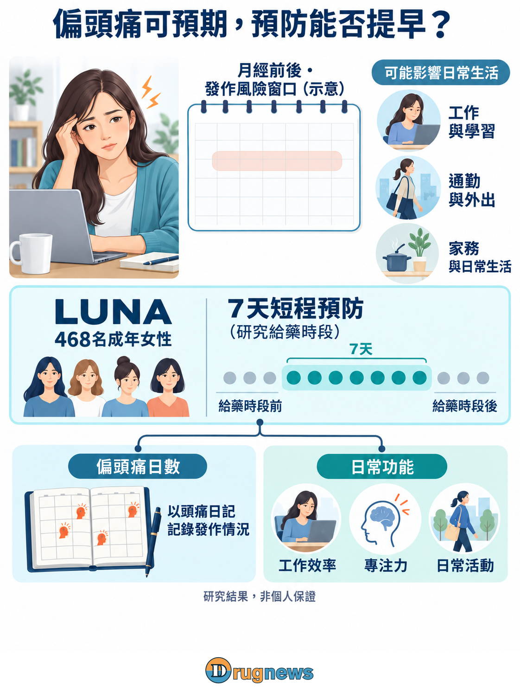
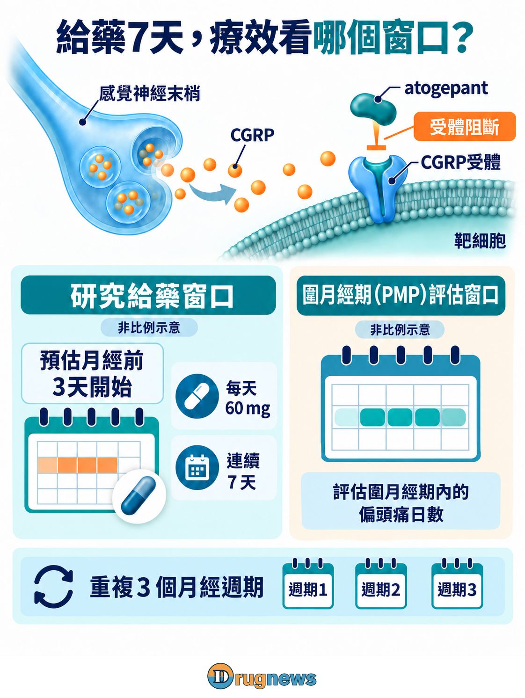
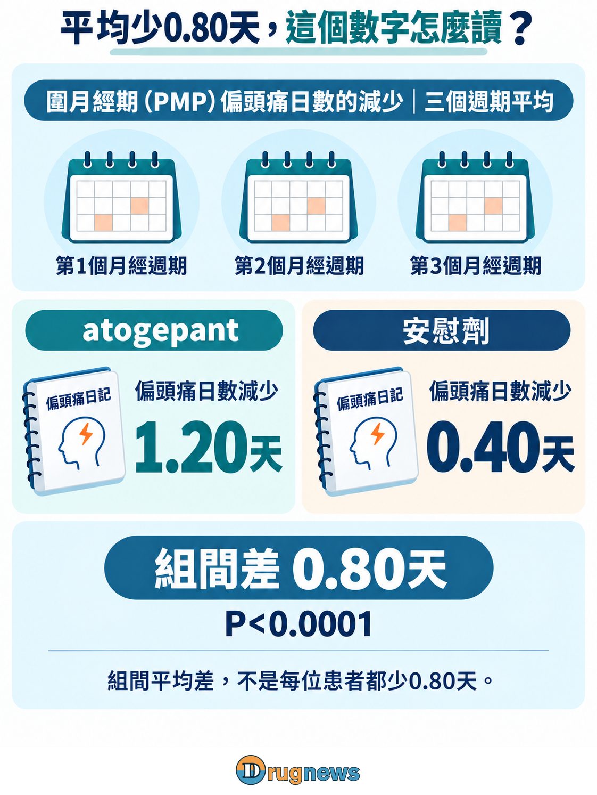

# 偏頭痛總挑月經前後來？7天預防研究，能少痛多少？

月經前後已經不好受，再碰上偏頭痛、怕光或噁心，工作、接送與原本排好的行程都可能被打亂。對發作時間反覆落在這個窗口的人，問題很直接：能不能在頭痛來之前，先降低那幾天的負擔？

2026年9月10日，AbbVie公布LUNA第三期研究的初步主要結果（topline）。研究納入468名成年女性，在三個月經週期比較7天短程預防與安慰劑；圍月經期偏頭痛日數相對基線平均減少1.20天對0.40天，組間多減少0.80天，P<0.0001。

公司也報告功能障礙等次要終點達標。LUNA的吸引力，在於把預防放進患者能預先安排的幾天：不是等頭痛打亂行程才處理，而是試著在高風險窗口之前介入。對AbbVie，這同時是一條讓既有藥物走進新使用情境的路。

# 時間可預期，讓預防多了一個切入點

LUNA研究藥物atogepant，是美國QULIPTA的有效成分，也是口服小分子CGRP受體拮抗劑。CGRP中文為降鈣素基因相關胜肽，是參與偏頭痛的訊號分子；「受體拮抗」可理解成占住訊號的接收位置，減少CGRP啟動這條路徑。

月經週期與這條訊號的關係，有人體研究提供線索。2023年Charité研究團隊比較不同荷爾蒙狀態的女性，觀察到在自然月經週期中，有偏頭痛者於月經期間的CGRP濃度高於無偏頭痛對照。這是荷爾蒙狀態與CGRP的關聯線索，尚未確立每次經期頭痛的單一原因。

LUNA利用的是發作風險較集中的時間，介入偏頭痛相關訊號。它不調整月經本身，也不以荷爾蒙補充作為研究策略。

短程預防本身也有歷史。2004年已有frovatriptan用於月經相關偏頭痛間歇預防的隨機研究。LUNA增加的是atogepant這條CGRP受體路徑的第三期對照證據；本試驗沒有直接比較不同短程預防藥物。

這裡沒有一個全新的分子，也不是月經偏頭痛突然有了第一種處理方法。改變的是證據與產品定位：同一顆藥，從一般的偏頭痛預防，走向一個時間可預期、需求卻常被忽略的情境。患者的問題因此從「要不要預防」，進一步變成「能不能只把預防放在最需要的那段時間」。

圖1｜LUNA把預防安排在可預期的月經周邊時段，並分別評估偏頭痛日數與功能負擔。

# 7天是給藥安排，圍月經期是療效評估範圍

研究在歐洲與亞洲納入純月經性或月經相關性偏頭痛成年女性，採隨機、雙盲、安慰劑對照設計。入組前先以病史與電子日誌確認月經規律及發作模式，並排除慢性偏頭痛等情況。

日本公部門登錄的研究地區也列有台灣。這是本試驗的直接研究連結，該頁未提供台灣實際收案人數或地區療效，亦非台灣核准或健保給付證據。

如果月份間波動很大，或整個月都有大量頭痛日，預先對準幾天的策略就不一定適合直接套用。研究以日誌辨認規律，實際使用時也需要能掌握自己的發作模式；「何時開始」和「選哪種藥」同樣影響這種方案能否被執行。

試驗方案為atogepant 60 mg或安慰劑每日一次，從預估月經開始前3天起連續7天，在雙盲期間重複三個週期。主要終點則計算圍月經期（perimenstrual period，PMP）的偏頭痛日數，登錄以月經開始為基準標示Day −2至Day +3。

給藥依預估時間提前安排，PMP則用來界定評估範圍，兩者不能視為同一窗口。對其他時段仍會發作的人，整月負擔仍是決定照護安排的另一部分。

圖2｜給藥自預估月經前3天起連續7天；圍月經期（PMP）評估另以月經開始為基準，定義為Day −2至Day +3。兩個窗口分開、非按比例示意。

# 平均少0.80天，功能結果已報喜，幅度還要看清楚

主要結果比較雙盲期三個月經週期的PMP偏頭痛日數相對基線變化之平均。因此，1.20天與0.40天都是平均減少量；0.80天是組間差，並非三週期合計或治療後剩餘日數，也不是每位參與者都得到同樣改善。

0.80天看起來不大，卻要放回一段有限的高風險時間來看，而不是拿去和整月頭痛日直接相比。它也可能由不同程度的改善組成：有人更受益，有人改變不多。完整基線、信賴區間與反應者分布，才會讓平均值長出患者的輪廓；P值回答差異是否有統計支持，不替患者回答值不值得用。

AbbVie表示，八個依序檢定的次要終點也達標，涵蓋頭痛負擔、急性藥物使用、功能障礙、認知功能與反應者指標。這已是公司報告的功能獲益訊號；公告尚未提供的是各項完整效應量，相關結果引用公司留存資料。

登錄中的功能障礙量表（FDS）終點尤其有助理解：它以三個月經週期的PMP資料，評估符合「PMP每一天都沒有功能障礙或僅輕度受限」的受試者比例。它關心一段高風險時間是否都維持在較低負擔，而不只計算少了幾天偏頭痛。

這種量測與患者生活很接近，但不直接等於少請幾天假或恢復幾天照顧家人的能力。若公布兩組達到這個條件的比例與差值，讀者就能判斷公司報告的正向訊號究竟有多大；急性用藥終點則另計PMP中使用藥物的日數。

圖3｜三個月經週期的圍月經期偏頭痛日數，相對基線平均減少1.20對0.40天，組間差0.80天，P<0.0001；PMP是評估期間的名稱。

# 反覆短程使用，仍要把效果與耐受性放在一起

AbbVie報告LUNA未見新安全性訊號，與atogepant既有輪廓一致。判斷反覆短程使用的負擔，還要看不良事件的種類、程度、持續時間及停藥情況；這些資料決定有多少改善是患者願意承受代價後仍能保有的。

QULIPTA美國標籤列有噁心、便祕與疲倦／嗜睡等常見不良反應，以及過敏反應、高血壓、雷諾氏現象等警示。這些是既有產品背景，不是LUNA本次發生率；少用幾天也不足以推定風險等比例降低。

目前引用的美國標籤為成人偏頭痛預防，未列入LUNA的7天短程安排或atogepant按需急救用途。AbbVie在9月10日公布的是計畫提交資料，尚不能視為已送件或取得新核准。上述服法均為試驗描述，實際治療須由醫療團隊評估。

短程不等於一次性。這個方案若進入日常，患者會在下一個週期再次面對同一個選擇：上次的改善，是否值得重複服藥？完整報告對缺失日誌與退出者的處理也在回答這件事，不能只留下順利完成服藥的人。真正可採用的方案，得把效果、身體負擔與執行難度一起交代。

圖4｜功能終點已有公司報告的正向結果；完整效應量、不良事件與耐受性、持續使用及監管資訊，將進一步界定短程方案的使用價值。

# AbbVie多了一個有證據的使用情境，還不是全新的大市場

LUNA讓AbbVie多了一個有陽性三期支撐的產品入口：找到發作集中、可以提前安排，卻還沒有獲得充分預防的患者。這比把所有女性都放進市場規模有意義；它把需求落在一個醫師能辨認、患者也能說清楚的使用情境。

這種定位也有取捨。週期規律、發作集中而原先預防不足的人，可能帶來新增使用；本來已有預防方案的人則可能是轉換。醫師需要把患者過去的反應與整月頭痛負擔一起考慮，七天方案不會只因服藥較少就自然取代既有治療。

對AbbVie，沿用既有分子與品牌，可以延伸已累積的臨床經驗與產品認知；但同一個病人改成短程使用，和多一名此前未治療的患者，對收入不是相同的變化。

商業機會還有一層：如果患者過去只有發作後才處理，針對可預期時窗的選項，可能讓預防更容易進入診間討論。這是擴大有效需求的路，而不是單純增加服藥天數；疾病教育、辨認適合人群與患者願不願意回來，可能和藥物本身同樣影響採用。現有品牌可以提供入口，卻仍要靠新的使用經驗留住人。

每個週期用7天、持續多少週期，以及新增患者來自哪一種治療情境，會共同決定用藥量。患者數增加時，每人年用藥量仍可能不同；在使用者組成與支付條件明朗前，不宜直接上調全年收入假設。

對支付方，FDS達標者比例及急性用藥日數，讓討論從「平均少痛多少」走向「那幾天能否維持較低負擔」。兩組功能達標比例相差多少，會比再次強調P值更有說服力。若這份改善能在可接受的耐受性下反覆維持，AbbVie才有機會把一份陽性結果，變成患者下個週期仍願意選擇的方案。

本文提供產業資訊與商業分析，不構成個別化醫療或投資建議。

# 參考來源

AbbVie：LUNA第三期初步主要結果（2026-09-10）
https://news.abbvie.com/2026-09-10-AbbVie-Extends-Migraine-Leadership-with-Positive-Phase-3-Atogepant-Results-in-Menstrual-Migraine

 QULIPTA美國處方資訊（Revised 2025-09）
https://www.rxabbvie.com/pdf/qulipta_pi.pdf

 ClinicalTrials.gov：NCT06806293（研究登錄入口）
https://clinicaltrials.gov/study/NCT06806293

 日本jRCT：jRCT2051240268（研究登錄入口）
https://jrct.mhlw.go.jp/latest-detail/jRCT2051240268

 日本厚生勞動省：LUNA公開試驗資訊（頁面最後更新2026-09-27；本輪查閱2026-09-28）
https://rctportal.mhlw.go.jp/s/detail/um?trial_id=jRCT2051240268

 Charité研究團隊：月經與CGRP研究說明（2023-02-23）
https://mentalhealth.charite.de/en/metas/en_meldung/artikel/detail/why_migraine_frequently_occurs_during_menstruation/

 Frovatriptan月經相關偏頭痛間歇預防隨機研究（2004-07-27）
https://pubmed.ncbi.nlm.nih.gov/15277618/

 AbbVie：M24-859官方試驗頁（頁面未標發布日；查閱2026-09-27）
https://www.abbvieclinicaltrials.com/study/M24-859
