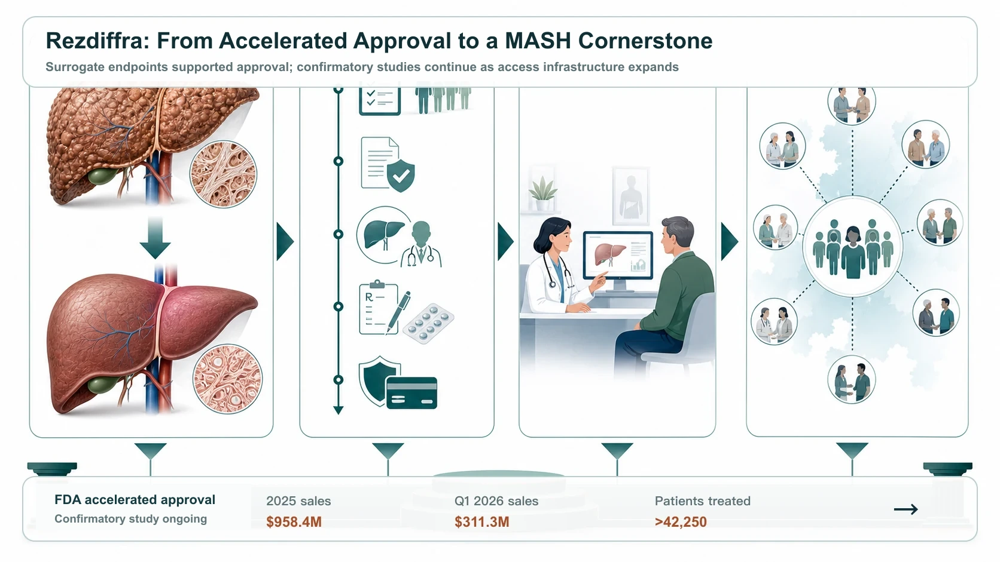
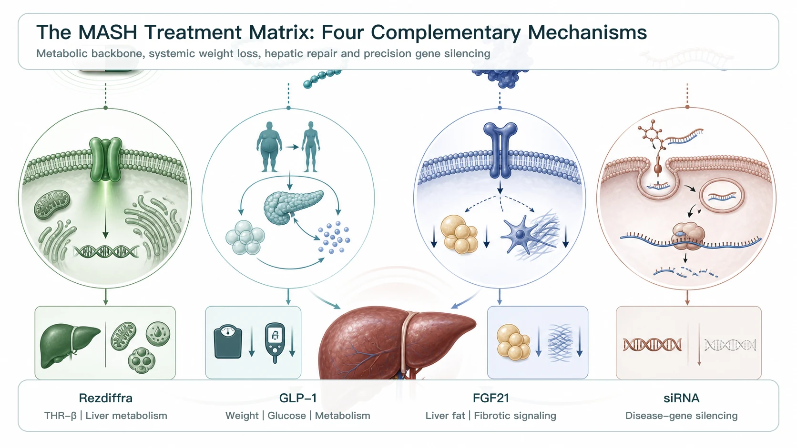
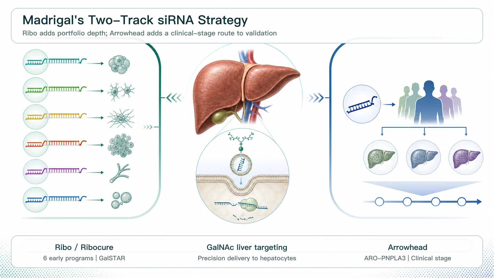
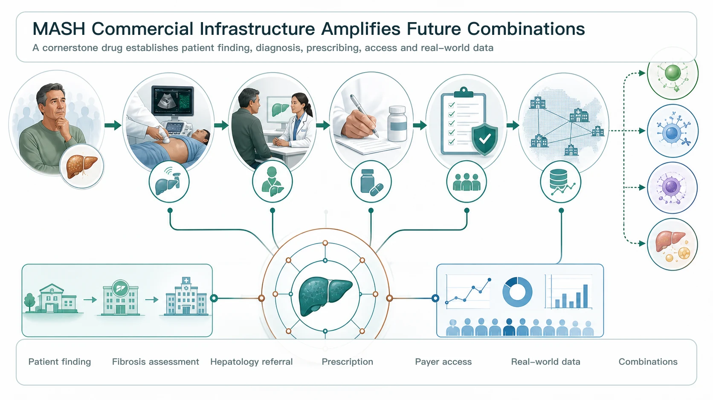

# Madrigal's MASH Platform Strategy: Rezdiffra as the Cornerstone, siRNA as the Next Growth Engine

MASH, once regarded as a drug-development graveyard where global pharmaceutical companies repeatedly failed, is being redefined.

The company that truly opened the market was Madrigal Pharmaceuticals, with Rezdiffra (resmetirom). Rezdiffra is a once-daily, oral, liver-directed THR-beta agonist. In March 2024, the FDA granted accelerated approval for adults with noncirrhotic MASH accompanied by moderate to advanced liver fibrosis, or stages F2 to F3. The decision was based on histologic surrogate endpoints; continued approval remains contingent on confirmatory studies verifying and describing clinical benefit.

It was the first FDA-approved treatment for MASH. For a vast market that had long relied on lifestyle intervention without an approved drug therapy, Rezdiffra finally created a commercial entry point.

The launch moved faster than the market had initially expected. Rezdiffra generated $958.4 million in full-year 2025 net sales. Strictly speaking, that was still just short of $1 billion, but first-quarter 2026 sales reached $311.3 million. Trailing 12-month sales exceeded $1.1 billion, officially taking the product into blockbuster territory. By the end of March 2026, more than 42,250 patients had been treated with Rezdiffra.

The significance goes beyond sales.

Madrigal is using Rezdiffra to clear a path through MASH. From clinical trials and FDA approval to physician education, patient diagnosis, insurance coverage and commercial execution, the company is building an integrated infrastructure. Once a company has successfully navigated the most difficult path in a new disease market, the usual next step is not to defend a single product. It is to turn that product into the center of a treatment matrix.

That is why Madrigal has begun making substantial bets on small interfering RNA, or siRNA.

## 01 | Rezdiffra Is Highly Successful, but It Is Not the End Point for MASH

MASH stands for metabolic dysfunction-associated steatohepatitis, formerly known as NASH. It is the inflammatory and fibrotic stage that can develop as metabolic dysfunction-associated steatotic liver disease progresses.

This is not simply an accumulation of fat. MASH can cause hepatocellular injury, chronic inflammation and liver fibrosis, and can progress to cirrhosis, liver cancer and liver failure, potentially requiring liver transplantation. Available evidence also indicates that MASH is a leading cause of liver transplantation among women in the United States, the second-leading cause overall in the United States, and one of the fastest-growing indications for liver transplantation in Europe.

Rezdiffra's success demonstrates how long the treatment needs of people with MASH had been suppressed. But it is not the final answer.

In the phase 3 MAESTRO-NASH trial, Rezdiffra met two key histologic endpoints:

- MASH resolution without worsening of fibrosis.
- Fibrosis improvement without worsening of MASH.

Published results showed that MASH resolution was achieved in approximately 25.9% of patients receiving resmetirom 80 mg and 29.9% of those receiving 100 mg, compared with approximately 9.7% in the placebo group. This was a major clinical breakthrough, but it also means that many patients still cannot achieve the desired histologic improvement with Rezdiffra alone.

That is the essence of MASH: it is not a single-pathway disease.

Lipotoxicity, insulin resistance, hepatic inflammation, fibrosis, the gut-liver axis, genetic risk and cardiometabolic dysfunction may all contribute. A single drug can open the market, but it is unlikely to address every patient.

For Madrigal, Rezdiffra's ideal position is therefore not to be the only drug, but to become the cornerstone therapy for MASH. The analogy is the role of PD-1 therapy in oncology: establish a treatment backbone, then combine it with agents that work through different mechanisms to expand the addressable patient population layer by layer.

## 02 | Why Is Madrigal Betting on siRNA?

The major competitive approaches in MASH each offer different advantages and limitations.

GLP-1 receptor agonists, including Novo Nordisk's Wegovy (semaglutide) and Eli Lilly's tirzepatide, a dual GLP-1/GIP receptor agonist, can address obesity, diabetes and systemic metabolic dysfunction. In 2025, Wegovy also received FDA accelerated approval for MASH, becoming the first drug in the GLP-1 class approved for this indication.

FGF21 analogs, including Akero's efruxifermin and 89bio's pegozafermin, are more directly focused on improving hepatic metabolism, lipid handling and fibrotic signaling. This approach is also attractive in moderate to advanced MASH. Roche's acquisition of 89bio reflected the perceived potential of pegozafermin in MASH and metabolic disease.

Madrigal's interest in siRNA follows a different logic.

Rather than simply improving the metabolic environment, siRNA uses RNA interference to silence specific disease-causing genes. That is particularly relevant in MASH because disease progression is closely associated with genetic risk. Genes such as PNPLA3, HSD17B13 and MARC1 have been linked to hepatic fat accumulation, inflammation, fibrosis or protective mechanisms.

If Rezdiffra modulates the metabolic environment, siRNA is a precision intervention at the genetic level.

- One adjusts the liver's metabolic rhythm.
- The other switches off a specific disease-driving gene.

This is the cornerstone-plus-combination model Madrigal wants to build.

## 03 | Ribo Life Science and Ribocure: Why Did Madrigal License Six siRNA Programs at Once?

In February 2026, Madrigal entered into an exclusive global licensing collaboration with Ribo Life Science and its Swedish subsidiary, Ribocure Pharmaceuticals, obtaining rights to develop, manufacture and commercialize six MASH siRNA programs. The transaction included a $60 million upfront payment and up to $4.4 billion if all milestones are achieved, as well as royalties on future sales.

This was not an ordinary early-stage licensing deal. The key number is six.

MASH is highly heterogeneous. Different patients may be driven by different combinations of genetic risk, metabolic status, fibrosis severity and comorbidities. A single siRNA target may not cover the entire population. By licensing six programs at once, Madrigal is building a MASH siRNA toolbox that can support patient segmentation, combinations and long-term expansion beyond its Rezdiffra cornerstone.

The principal attraction of Ribo and Ribocure is their proprietary GalSTAR liver-targeted siRNA platform.

The value of this type of GalNAc-conjugated siRNA lies in its ability to direct the drug preferentially to hepatocytes, reduce systemic exposure and potentially support long-acting dosing. Ribocure has also said that the collaboration will use the GalSTAR platform to develop innovative MASH therapies and could eventually extend to bispecific siRNA designs capable of silencing two disease-causing genes at the same time.

Equally important, the collaboration progressed quickly.

In July 2026, Ribo and Madrigal announced that they had reached the first development-candidate nomination milestone. The liver-targeted siRNA program will now enter IND-enabling studies, the preclinical work required to support a clinical trial application. The partnership has therefore moved beyond the press-release stage and into preparation for clinical development.

This matters to Madrigal. The company does not merely need to add pipeline assets. It needs to convert Rezdiffra's commercial lead into a clinical-development advantage for future combination programs as rapidly as possible.

## 04 | Madrigal Did Not Stop with Ribo: Arrowhead Confirms siRNA as a Second Growth Engine

If Ribo were Madrigal's only transaction, investors could still interpret it as a diversified early-stage bet.

Madrigal's subsequent acquisition of exclusive global rights to ARO-PNPLA3 from Arrowhead Pharmaceuticals makes the strategy much clearer.

ARO-PNPLA3 is a clinical-stage siRNA designed to silence PNPLA3 in hepatocytes. Madrigal has noted that the PNPLA3 I148M variant is an important genetic driver of MASH progression and is associated with hepatic fat, inflammation, fibrosis, cirrhosis and liver-cancer risk.

The transaction clarifies how the pieces fit together:

- Ribo provides a multi-target siRNA matrix that is early stage but expandable.
- Arrowhead provides a clinical-stage PNPLA3 asset with a clearly defined genetic segment.

Together, they allow Madrigal to evolve Rezdiffra from the first MASH drug into the foundation of a MASH platform company.

This is also central to Madrigal's potential progression into a mid-sized biopharma company. The opportunity does not arise simply because one product is selling well. It arises because Madrigal can build second and third layers of growth around that first product.

## 05 | Madrigal's Most Important Asset May Be Its MASH Commercial Infrastructure

Many investors look only at Rezdiffra's sales figures.

Madrigal's more formidable asset is the MASH commercialization infrastructure it has already built. The difficulty in MASH is not limited to drug discovery. Diagnosis and patient identification are also major barriers. Many patients do not know that they have MASH, and physicians need new workflows for fibrosis assessment, noninvasive testing, referrals and prescribing.

By developing and launching Rezdiffra first, Madrigal has educated the market, built a prescribing network, advanced insurance coverage and accumulated real-world patient data. More than 42,250 patients had received Rezdiffra by the first quarter of 2026. That gives Madrigal real-world treatment experience, an established physician-interaction network, patient-segmentation data and payer-access expertise.

For partners such as Ribo and Arrowhead, this infrastructure is a powerful multiplier. Future siRNA products will not need to educate the market from zero, explain the concept of MASH to physicians all over again or rebuild a liver-disease prescribing network. If the clinical data hold up, these pipeline assets can connect directly to the market access Rezdiffra has already opened.

That is the appeal of a cornerstone drug. Once the first therapy is established, every subsequent combination agent can build on its momentum.

## 06 | Several Taiwan MASH and Liver-Disease Programs Still Merit Attention

The first company to watch is TaiwanJ Pharmaceuticals (6549).

TaiwanJ has invested in liver disease and MASH for many years. Its corporate history shows that JKB-121 previously received FDA clearance to proceed into a phase 2 NASH trial. JKB-122 also made clinical progress in NAFLD, NASH and autoimmune hepatitis. The company has also disclosed a NASH licensing collaboration involving TJC-265, an autotaxin inhibitor.

This is not the same THR-beta approach used by Madrigal, nor is it an siRNA strategy. But TaiwanJ remains one of the relatively few Taiwanese companies with a long-standing focus on liver disease and steatohepatitis.

The second company is Sinew Pharma (6634).

Sinew's SNP-630 previously received clearance from Taiwan's TFDA to enter a phase 1 clinical trial for the treatment of nonalcoholic steatohepatitis, then known as NASH.

Company materials also describe SNP-630 as a second-generation product derived from SNP-610, with patents in the United States and South Africa. At the time, Sinew planned to advance clinical development and pursue international licensing discussions.

Neither company is a direct competitor to Rezdiffra, and neither should be forced into a Madrigal comparison.

## Conclusion | MASH Is Not a Single-Drug War; It Is a Battle of Cornerstone Therapies and Combination Matrices

Rezdiffra's success has begun to transform Madrigal from a liver-focused biotech into a mid-sized biopharma company.

But Madrigal understands that Rezdiffra alone is not enough. MASH is a multi-mechanism disease, and one THR-beta agonist cannot address every patient indefinitely. The outcome will ultimately be decided by the combination matrix.

- Rezdiffra is the cornerstone.
- GLP-1 therapies address obesity and systemic metabolism.
- FGF21 analogs target hepatic metabolism and fibrosis more directly.
- siRNA approaches disease-driving pathways such as PNPLA3, HSD17B13 and MARC1 at the genetic level.

That is the real significance of Madrigal's alliances with Ribo and Arrowhead. The company is not adding pipeline assets at random. It is building a precision-treatment platform for MASH.

Ribo's opportunity also comes from this platform-level position. If its GalSTAR siRNA technology can demonstrate translation, combination potential and long-acting dosing in MASH, its value could move beyond a single licensing transaction and become an important validation of a global siRNA platform.

MASH was once a graveyard for drug development, but Rezdiffra has opened the first door.

The next battle is no longer about who enters first. It is about who can build the most complete and precise treatment matrix around a cornerstone therapy, covering the widest range of patient subtypes.

## References

1. [Facebook | Original Drugnews post, July 20, 2026](https://www.facebook.com/61568446257142/posts/1371920785993874/)
2. [FDA | FDA Approves First Treatment for Patients with Liver Scarring Due to Fatty Liver Disease, March 14, 2024](https://www.fda.gov/news-events/press-announcements/fda-approves-first-treatment-patients-liver-scarring-due-fatty-liver-disease)
3. [New England Journal of Medicine | A Phase 3, Randomized, Controlled Trial of Resmetirom in NASH with Liver Fibrosis, 2024](https://www.nejm.org/doi/10.1056/NEJMoa2309000)
4. [Madrigal | 2025 Full-Year Financial Results, February 19, 2026](https://ir.madrigalpharma.com/news-releases/news-release-details/madrigal-pharmaceuticals-reports-fourth-quarter-and-full-year-0)
5. [Madrigal | 2026 First-Quarter Financial Results, May 6, 2026](https://ir.madrigalpharma.com/news-releases/news-release-details/madrigal-pharmaceuticals-reports-first-quarter-2026-financial)
6. [Novo Nordisk | Wegovy Receives FDA Accelerated Approval for MASH, August 15, 2025](https://www.novonordisk.com/news-and-media/news-and-ir-materials/news-details.html?id=916416)
7. [Roche | Agreement to Acquire 89bio and Pegozafermin, September 18, 2025](https://www.roche.com/media/releases/med-cor-2025-09-18)
8. [Madrigal | Exclusive Global License for Six Ribo siRNA Programs, February 11, 2026](https://ir.madrigalpharma.com/news-releases/news-release-details/madrigal-expands-its-mash-pipeline-exclusive-global-licensing)
9. [Ribocure | Ribo and Madrigal Reach First Major MASH siRNA Milestone, July 2, 2026](https://ribocure.com/news/)
10. [Madrigal | Global License for Arrowhead ARO-PNPLA3, May 5, 2026](https://ir.madrigalpharma.com/node/17406)
11. [TaiwanJ Pharmaceuticals | Company History and Liver-Disease Pipeline](https://www.taiwanj.com/pages/page_history_en)
12. [Sinew Pharma | SNP-630 MASH Program](https://www.sinewpharma.com/en/products-detail2-4.htm)

---

This article is an analysis of publicly available clinical and industry information. It does not constitute medical diagnosis, treatment advice, fundraising advice, securities advice or investment advice. Individual medical decisions should be made by qualified healthcare professionals based on the full clinical context.
