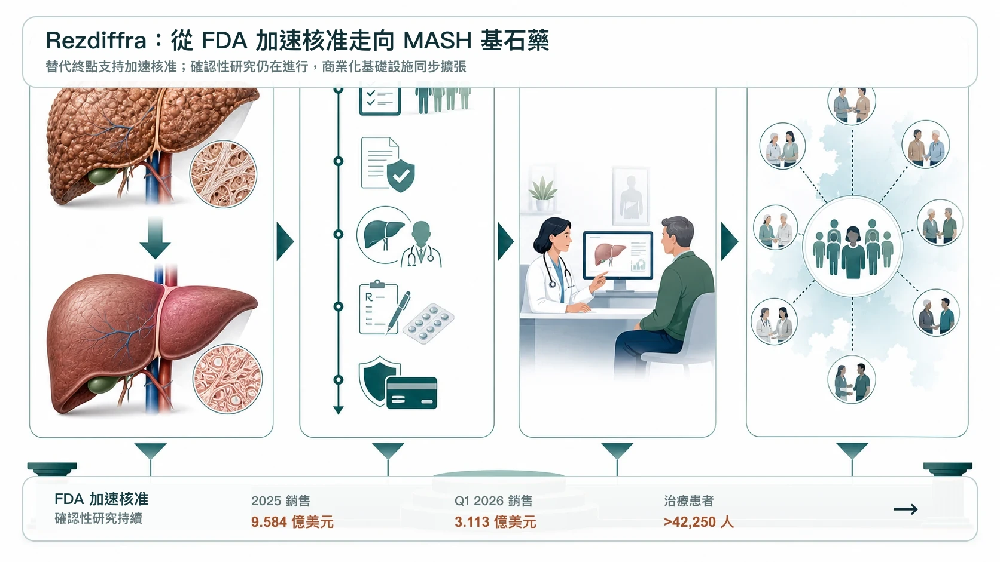
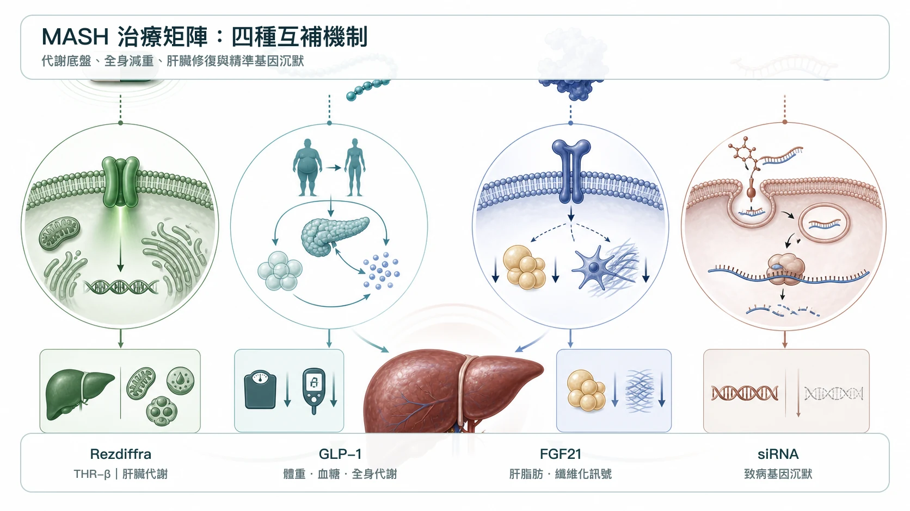
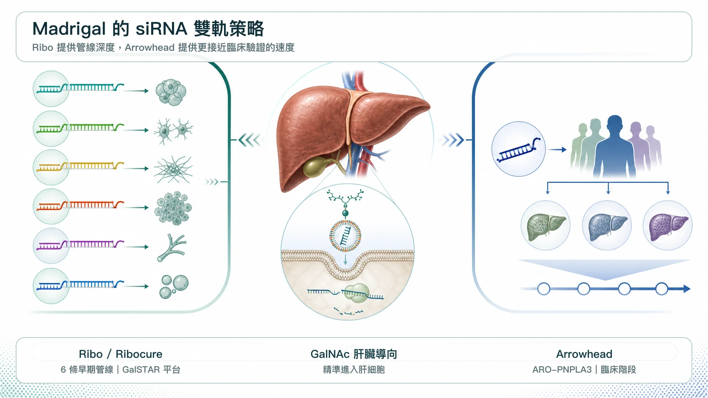
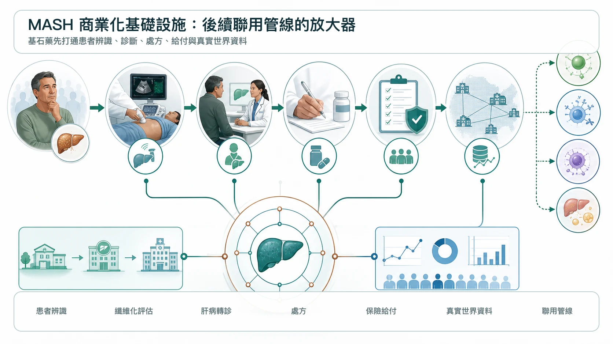

# 聯手巨頭卡位 MASH：Madrigal 把 Rezdiffra 做成基石藥，小核酸開始接棒

MASH 這個曾經讓全球藥廠屢戰屢敗的「藥物墳場」，正在被重新定義。

第一個真正把市場打開的，是 Madrigal Pharmaceuticals 的 Rezdiffra（resmetirom）。Rezdiffra 是一款每日一次口服、肝臟導向的 THR-beta agonist，也就是甲狀腺激素受體 beta 促效劑。2024 年 3 月，FDA 透過加速核准途徑，核准 Rezdiffra 用於成人非肝硬化 MASH，且已伴隨中度至重度肝纖維化，也就是 F2 至 F3 族群。這項核准依據組織學替代終點；持續核准仍取決於確認性研究能否驗證並描述臨床效益。

這是 MASH 領域第一個獲 FDA 核准的藥物，也讓一個長期只有生活型態介入、卻沒有真正藥物治療的巨大市場，終於看見商業化入口。

上市後的速度，比市場原先想像更快。Madrigal 2025 年 Rezdiffra 全年淨銷售額達 9.584 億美元，雖然嚴格來說還差一點才到 10 億美元，但到 2026 年第一季，Rezdiffra 單季銷售已達 3.113 億美元。過去 12 個月銷售額已突破 11 億美元，正式站上重磅藥門檻；截至 2026 年 3 月底，已有超過 42,250 名患者使用 Rezdiffra。

這件事的重要性不只是銷售額。

而是 Madrigal 正在用 Rezdiffra 打通 MASH 這條路。從臨床試驗、FDA 核准、醫師教育、患者診斷、保險給付到商業化落地，Madrigal 正在建立一套完整基礎設施。當一家公司先跑通這條最難的路，接下來它要做的，通常不是守著單一產品，而是把這個產品變成治療矩陣的核心。

這也是為什麼 Madrigal 開始大手筆押注 siRNA，也就是小干擾 RNA。

## 01｜Rezdiffra 很成功，但它不是 MASH 的終點

MASH，也就是 metabolic dysfunction-associated steatohepatitis，代謝功能障礙相關脂肪性肝炎，過去稱為 NASH。它是代謝功能異常相關脂肪肝病進展後的發炎與纖維化階段。

這不是單純脂肪堆積。它會造成肝細胞損傷、慢性發炎、肝纖維化，進一步走向肝硬化、肝癌、肝衰竭，甚至需要肝移植。相關資料也指出，MASH 是美國女性肝移植的主要原因，也是美國整體肝移植第二大原因，並且是歐洲成長最快的肝移植適應症之一。

Rezdiffra 的成功，證明 MASH 患者的治療需求被壓抑太久。但它不是終極答案。

在 MAESTRO-NASH 三期研究中，Rezdiffra 達到兩個關鍵組織學終點：

- MASH resolution without worsening of fibrosis，也就是 MASH 消退且纖維化未惡化。
- Fibrosis improvement without worsening of MASH，也就是纖維化改善且 MASH 未惡化。

研究整理指出，resmetirom 80 mg 與 100 mg 組的 MASH 消退率分別約 25.9% 與 29.9%，安慰劑組約 9.7%。這是非常重要的臨床突破，但也意味著仍有大量患者無法單靠 Rezdiffra 達到理想組織學改善。

這正是 MASH 的本質：它不是單一路徑疾病。

脂肪毒性、胰島素阻抗、肝臟發炎、纖維化、腸肝軸、遺傳風險、心血管代謝異常，都可能參與其中。單一藥物能打開市場，但很難吃下所有病人。

所以，Rezdiffra 對 Madrigal 來說，最理想的位置不是「唯一藥物」，而是 MASH 的基石藥。就像腫瘤領域的 PD-1，先成為治療底盤，再和不同機制藥物聯用，把患者族群一層一層擴出去。

## 02｜為什麼 Madrigal 看上 siRNA？

MASH 目前幾條主要競爭路線，各有優缺點。

GLP-1 receptor agonist，也就是 GLP-1 受體促效劑，例如 Novo Nordisk 的 Wegovy（semaglutide，司美格魯肽）與 Eli Lilly 的 tirzepatide（GLP-1／GIP 雙重受體促效劑），能處理肥胖、糖尿病與全身代謝問題。2025 年，Wegovy 也獲 FDA 加速核准用於 MASH，成為 GLP-1 類別中第一個獲准進入 MASH 的藥物。

FGF21 analog，也就是 FGF21 類似物，例如 Akero 的 efruxifermin、89bio 的 pegozafermin，則更偏向直接改善肝臟代謝、脂質與纖維化訊號。這條線對中重度 MASH 也有吸引力，Roche 先前收購 89bio，就是看中 pegozafermin 在 MASH 與代謝疾病中的潛力。

但 Madrigal 對 siRNA 的興趣，來自另一種邏輯。

siRNA 不是單純改善代謝環境，而是透過 RNA interference，也就是 RNA 干擾，直接沉默特定致病基因。對 MASH 來說，這特別有意思，因為 MASH 的進展和遺傳風險高度相關。像 PNPLA3、HSD17B13、MARC1 這些基因，都和肝脂肪堆積、發炎、纖維化或疾病保護機制有關。

如果 Rezdiffra 是代謝微環境調節，那 siRNA 就是基因層面的精準干預。

- 一個處理肝臟代謝節奏。
- 一個關掉特定疾病驅動基因。

這正是 Madrigal 想要的「基石＋聯用」模式。

## 03｜Ribo Life Science 與 Ribocure：Madrigal 為什麼一次買六條 siRNA？

2026 年 2 月，Madrigal 與 Ribo Life Science（瑞博生物）及其瑞典子公司 Ribocure Pharmaceuticals 達成全球獨家授權合作，取得六個 MASH siRNA 專案的開發、製造與商業化權利。交易首付款為 6,000 萬美元，若里程碑全部達成，總金額最高可達 44 億美元，Ribo 還可獲得未來銷售分成。

這不是一筆普通的早期授權。它的重點在於「六條」。

MASH 是高度異質性疾病。不同患者可能由不同基因風險、代謝狀態、纖維化程度與共病組合驅動。單一 siRNA 靶點未必能覆蓋所有人。Madrigal 一次拿下六個專案，等於是在 Rezdiffra 這個基石藥之外，建立一個可分型、可組合、可長期擴張的 MASH siRNA 工具箱。

Ribo／Ribocure 吸引 Madrigal 的關鍵，在於它具備自有的 GalSTAR liver-targeted siRNA platform，也就是 GalSTAR 肝臟導向 siRNA 平台。

這類 GalNAc 偶聯 siRNA 的價值，在於能把藥物高度導向肝細胞，降低全身暴露，並帶來長效給藥可能。Ribocure 也表示，雙方合作將利用 GalSTAR 平台發展 MASH 創新療法，未來甚至可擴展到雙特異性 siRNA，也就是同時沉默兩個致病基因的設計。

更值得注意的是，合作落地很快。

2026 年 7 月，Ribo 與 Madrigal 宣布達成第一個候選藥物提名里程碑，該肝臟導向 siRNA 專案將進入 IND-enabling studies，也就是支持臨床試驗申請的臨床前研究。這代表合作不是停留在新聞稿，而是已經進入臨床前申報準備。

這對 Madrigal 很重要。它需要的不只是補管線，而是快速把 Rezdiffra 的商業化領先優勢，轉化成聯用管線的臨床開發優勢。

## 04｜Madrigal 不只找 Ribo，也找 Arrowhead：siRNA 已成為第二成長曲線

如果只有 Ribo 一筆合作，市場還可以理解成分散押注。

但 Madrigal 後續又從 Arrowhead Pharmaceuticals 取得 ARO-PNPLA3 全球獨家權利，這就代表策略非常明確。

ARO-PNPLA3 是一款臨床階段 siRNA，目標是沉默肝細胞中的 PNPLA3。Madrigal 官方指出，PNPLA3 I148M 是 MASH 進展的重要遺傳因子，與肝脂肪、發炎、纖維化、肝硬化與肝癌風險有關。

這筆合作讓 Madrigal 的策略更清楚：

- Ribo 給它多靶點、早期但可擴張的 siRNA 矩陣。
- Arrowhead 給它一條臨床階段、遺傳分型明確的 PNPLA3 資產。

兩者合在一起，Madrigal 正在把 Rezdiffra 從「第一款 MASH 藥」升級成「MASH 平台公司」。

這也是它有機會進階為中型 Biopharma 的關鍵。不是因為單一產品賣得好，而是因為它能圍繞第一款產品，建出第二層、第三層成長曲線。

## 05｜Madrigal 的最大資產，其實是 MASH 商業化基礎設施

很多人只看 Rezdiffra 的銷售數字。

但 Madrigal 真正可怕的地方，是它已經建立了 MASH 商業化基礎設施。MASH 的難點不只是藥物研發，也包括診斷與患者篩選。許多患者不知道自己有 MASH，醫師也需要重新建立肝臟纖維化評估、非侵入式檢測、轉診與用藥流程。

Madrigal 先做出 Rezdiffra，等於先教育市場、建立處方網絡、推動保險給付，也累積真實世界患者資料。到 2026 年第一季，超過 42,250 名患者使用 Rezdiffra，這代表 Madrigal 手上已經有真實世界治療經驗、醫師互動網絡、患者分型資料與保險准入經驗。

這對 Ribo、Arrowhead 這類合作夥伴而言，是很強的放大器。因為未來 siRNA 不需要自己從零教育市場，不需要重新說服醫師什麼是 MASH，也不需要從頭建立肝病處方網絡。只要臨床資料成立，這些管線可以直接接上 Rezdiffra 已經打開的市場通路。

這就是「基石藥」最迷人的地方。一旦第一款藥站穩，後面每一款聯用藥都能借力。

## 06｜台灣對 MASH 與肝病仍有幾個觀察點

第一個可以看的是景凱生技（6549）。

景凱長期布局肝病與 MASH。公司沿革顯示，JKB-121 曾獲美國 FDA 核可進行 NASH 二期臨床，JKB-122 也曾在 NAFLD、NASH、自體免疫性肝炎等方向取得臨床進展。公司也有 autotaxin inhibitor，也就是 autotaxin 抑制劑 TJC-265 相關 NASH 授權合作紀錄。

這不是 Madrigal 式的 THR-beta，也不是 siRNA，但它代表台灣少數長期深耕肝病與脂肪肝炎的公司。

第二個是欣耀生醫（6634）。

欣耀的 SNP-630 曾獲 TFDA 同意進行治療非酒精性脂肪肝炎，也就是 NASH 的一期臨床試驗。

公司資料也提到，SNP-630 是 SNP-610 的第二代產品，具備美國與南非專利，當時規劃進行臨床並洽談國際授權。

這兩家公司都不是 Rezdiffra 的直接競爭者，也不該硬拿來類比 Madrigal。

## 結語｜MASH 不是單藥戰爭，而是基石藥與聯用矩陣的戰爭

Rezdiffra 的成功，讓 Madrigal 從一家專注肝病的 Biotech，開始走向中型 Biopharma。

但 Madrigal 很清楚，單靠 Rezdiffra 還不夠。MASH 是多機制疾病，不可能永遠只靠一款 THR-beta agonist 解決所有患者。未來的勝負，會在聯用矩陣裡決定。

- Rezdiffra 是基石。
- GLP-1 處理肥胖與全身代謝。
- FGF21 analog 瞄準更直接的肝臟代謝與纖維化。
- siRNA 則從基因層面切入 PNPLA3、HSD17B13、MARC1 等疾病驅動通路。

這就是 Madrigal 聯手 Ribo、Arrowhead 的真正意義。它不是隨便補管線，而是在建立一個 MASH 精準治療平台。

Ribo 的機會，也來自這個平台級位置。若它的 GalSTAR siRNA 能在 MASH 中證明可轉化、可聯用、可長效給藥，它的價值就會從單一授權案，升級為全球 siRNA 平台的一次重要驗證。

MASH 曾經是藥物研發的墳場，但現在，Rezdiffra 已經把第一道門打開。

下一場戰爭，不再是誰第一個進場，而是誰能圍繞基石藥，建立最完整、最精準、最能覆蓋不同患者分型的治療矩陣。

## 參考資料

1. [Facebook｜藥時事原始貼文，2026-07-20](https://www.facebook.com/61568446257142/posts/1371920785993874/)
2. [FDA｜FDA Approves First Treatment for Patients with Liver Scarring Due to Fatty Liver Disease，2024-03-14](https://www.fda.gov/news-events/press-announcements/fda-approves-first-treatment-patients-liver-scarring-due-fatty-liver-disease)
3. [New England Journal of Medicine｜A Phase 3, Randomized, Controlled Trial of Resmetirom in NASH with Liver Fibrosis，2024](https://www.nejm.org/doi/10.1056/NEJMoa2309000)
4. [Madrigal｜2025 Full-Year Financial Results，2026-02-19](https://ir.madrigalpharma.com/news-releases/news-release-details/madrigal-pharmaceuticals-reports-fourth-quarter-and-full-year-0)
5. [Madrigal｜2026 First-Quarter Financial Results，2026-05-06](https://ir.madrigalpharma.com/news-releases/news-release-details/madrigal-pharmaceuticals-reports-first-quarter-2026-financial)
6. [Novo Nordisk｜Wegovy Receives FDA Accelerated Approval for MASH，2025-08-15](https://www.novonordisk.com/news-and-media/news-and-ir-materials/news-details.html?id=916416)
7. [Roche｜Agreement to Acquire 89bio and Pegozafermin，2025-09-18](https://www.roche.com/media/releases/med-cor-2025-09-18)
8. [Madrigal｜Exclusive Global License for Six Ribo siRNA Programs，2026-02-11](https://ir.madrigalpharma.com/news-releases/news-release-details/madrigal-expands-its-mash-pipeline-exclusive-global-licensing)
9. [Ribocure｜Ribo and Madrigal Reach First Major MASH siRNA Milestone，2026-07-02](https://ribocure.com/news/)
10. [Madrigal｜Global License for Arrowhead ARO-PNPLA3，2026-05-05](https://ir.madrigalpharma.com/node/17406)
11. [景凱生技｜Company History and Liver-Disease Pipeline](https://www.taiwanj.com/pages/page_history_en)
12. [欣耀生醫｜SNP-630 MASH Program](https://www.sinewpharma.com/en/products-detail2-4.htm)

---

本文僅為公開臨床與產業資料整理，不構成醫療診斷、治療建議、募資、證券或投資建議。個別醫療決策應由合格醫療專業人員依完整臨床情境判斷。
