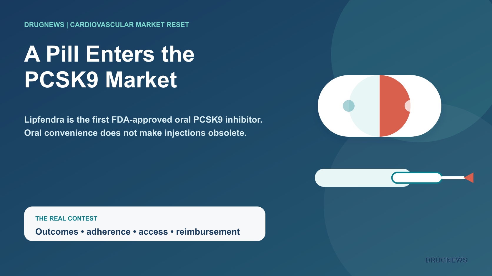
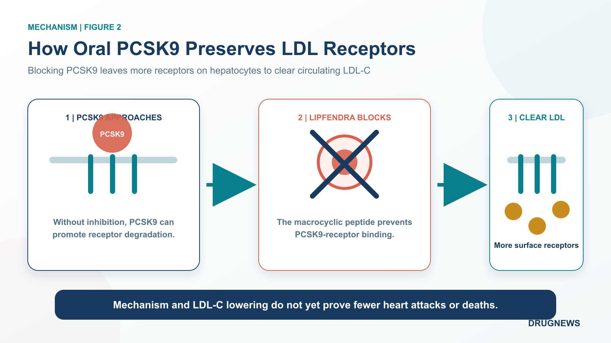
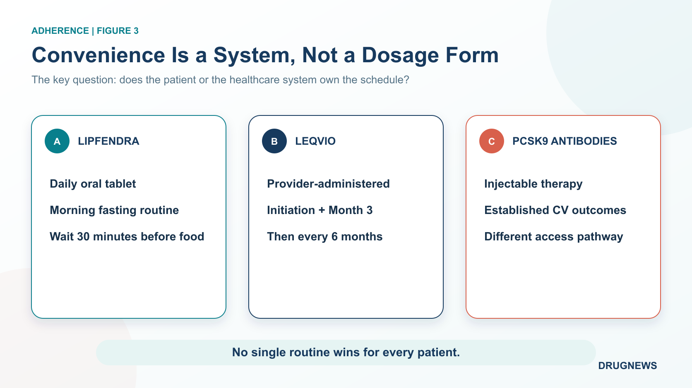
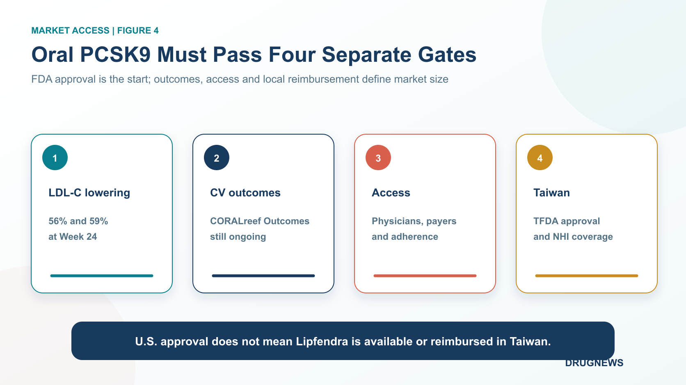

# Merck’s Oral PCSK9 Drug Enters an Injectable Market: Who Really Loses?

For the past decade, patients seeking a large LDL-cholesterol reduction through PCSK9 inhibition have generally needed an injection.

Merck has now turned that therapeutic route into a once-daily pill.

On July 15, 2026, the U.S. Food and Drug Administration approved Lipfendra, or enlicitide. It is the first FDA-approved oral PCSK9 inhibitor for adults with hypercholesterolemia, including heterozygous familial hypercholesterolemia, as an adjunct to diet and exercise.

Across two pivotal Phase 3 trials enrolling 3,207 patients, placebo-adjusted LDL-C reductions at Week 24 were 56% and 59%.

Those numbers invite an obvious commercial question: can a pill take the market away from injectable PCSK9 therapies?

Not so fast. Lipfendra has crossed an important threshold, but the real contest will depend on cardiovascular outcomes, long-term adherence, physician behavior and payer access. The doorway has changed; the competition behind it is only beginning.

## 1 | What Did the First Oral PCSK9 Inhibitor Actually Change?

PCSK9 acts like a disposal tag for hepatic LDL receptors. When PCSK9 binds the receptor, the complex is more likely to be internalized and degraded. Fewer receptors remain on the liver-cell surface to remove LDL particles from circulation, and blood LDL-C rises.

Existing approaches intervene in different ways. Amgen’s Repatha and Regeneron/Sanofi’s Praluent are antibodies that bind circulating PCSK9. Novartis’ Leqvio uses small interfering RNA to reduce PCSK9 production in the liver. All require injection.

Lipfendra is a macrocyclic peptide. Its constrained structure blocks the interaction between PCSK9 and the LDL receptor, allowing more receptors to remain on the hepatocyte surface and continue clearing LDL-C.

The FDA label keeps the two pivotal populations separate:

- CORALreef Lipids enrolled 2,904 adults with atherosclerotic cardiovascular disease or high cardiovascular risk. At Week 24, the placebo-adjusted mean LDL-C reduction was 56% (95% CI, 51% to 61% lower).
- CORALreef HeFH enrolled 303 patients with heterozygous familial hypercholesterolemia. The placebo-adjusted mean reduction at Week 24 was 59% (95% CI, 53% to 66% lower).

These results came from different populations. They should not be merged into a universal “roughly 60%” claim, and they should not be used to rank products across separate trials.

Lipfendra is also not a frictionless pill. The label specifies one 20 mg tablet every morning on an empty stomach, taken with water, black coffee or plain tea, followed by at least 30 minutes before food or other beverages. That routine may be easier to accept than an injection, but patients must remember it every day.

Safety requires the same nuance. Overall adverse-reaction frequency in the high-risk hypercholesterolemia trial was similar to placebo. In the HeFH study, diarrhea occurred in 7% versus 2% with placebo and dizziness in 9% versus 4%. Those findings do not eliminate the need for larger and longer post-launch safety data.

Convenience still carries an adherence cost.

## 2 | Daily Oral Dosing Versus Infrequent Injection

Leqvio, or inclisiran, uses a very different adherence model. A healthcare professional administers it subcutaneously at initiation, again at Month 3 and then every six months. Calling it “two injections a year” is reasonable after the loading phase, but incomplete if the initial and three-month doses disappear from the description.

Lipfendra transfers control to the patient. It avoids scheduled injection visits and could extend more easily into routine outpatient practice. The trade-off is a daily fasting routine and a 30-minute waiting period.

Leqvio transfers scheduling to the healthcare system. Patients do not need to remember a pill each day, and clinics can track completed administration. The trade-offs are return visits, product stocking and a provider-administered reimbursement pathway.

For adherent patients who dislike injections, oral dosing may be compelling. For older, high-risk patients already managing multiple medicines, a twice-yearly clinic routine may be more reliable.

This is not a simple oral-versus-injectable victory. It is a question of which adherence architecture works for a specific patient.

## 3 | Strong LDL-C Reduction Is Not Yet a Cardiovascular Outcomes Claim

Lipfendra was approved on LDL-C lowering. Its label does not claim a reduction in cardiovascular death, myocardial infarction or stroke.

The PCSK9 target itself is well validated. Repatha and Praluent have reduced major cardiovascular events in large outcomes trials, while statins have an even deeper hard-outcomes evidence base. That supports LDL-C lowering as a risk-reduction strategy. It does not allow a new product to inherit another drug’s outcome claim.

CORALreef Outcomes is designed to answer the Lipfendra-specific question. [ClinicalTrials.gov](https://clinicaltrials.gov/study/NCT06008756) lists an estimated enrollment of 14,550 high-risk participants, while Merck has said more than 14,500 patients have been enrolled. The primary endpoint is a composite of coronary heart-disease death, myocardial infarction, ischemic stroke, acute limb ischemia or major amputation, and urgent arterial revascularization. The registry currently lists November 2029 as the primary-completion date.

Leqvio is also waiting for dedicated cardiovascular-outcomes evidence. Novartis expects ORION-4 and VICTORION-2P to read out in 2027. Until then, infrequent dosing should not be described as proven to reduce cardiovascular events.

The 2026 ACC/AHA dyslipidemia guideline lowered the LDL-C target below 55 mg/dL for some very-high-risk patients. It supports adding ezetimibe and/or PCSK9 monoclonal antibodies for selected patients who remain above goal despite maximally tolerated statin therapy. Inclisiran is an option in situations such as intolerance, limited access to antibodies or a strong preference for infrequent dosing.

The guideline was released before Lipfendra’s approval. It could not have endorsed the product in advance, and it should not be summarized as a blanket recommendation for every PCSK9 approach.

## 4 | Merck and Novartis Are Selling Different Treatment Experiences

Merck listed Lipfendra's FDA approval as a key second-quarter milestone and linked new-product launches with its long-term growth trajectory. Approval alone does not guarantee a rapid ramp: physician adoption, payer access and real-world commercialization still need to be demonstrated.

That caution is realistic. A new drug must enter formularies, pharmacies and clinical workflows; payers must agree to cover it; physicians must learn when to use it; and patients must maintain the fasting routine. Novelty does not rewrite a prescribing system overnight.

Leqvio is also still expanding. Novartis reported second-quarter 2026 sales of $480 million, up 59% at constant currencies. First-half sales reached $932 million, up 64% at constant currencies. The 64% figure applies to the first half, not the quarter.

The company also reported U.S. monthly prescription growth of 49% and a 23.3% share of new prescriptions in the Medicare Part B channel, while adoption increased after national reimbursement in China. These are company-reported operating measures, not proof that an injectable will defeat or lose to an oral medicine. They do show that the provider-administered model is still gaining scale.

The market may ultimately segment rather than collapse into one winner: patients preferring daily oral dosing, patients suited to twice-yearly clinic administration, and patients prioritizing antibodies with established cardiovascular-outcomes evidence.

## 5 | What Taiwan Should Watch

Taiwan already has a National Health Insurance pathway for injectable PCSK9 therapies.

Effective September 1, 2025, reimbursement criteria for evolocumab and alirocumab were broadened for selected populations. The LDL-C threshold for initiating treatment fell from 135 to 100 mg/dL, and prior-authorization review moved from every six months to every 12 months. The National Health Insurance Administration estimated roughly 5,005 beneficiaries per year and NT$443 million in additional annual drug spending.

That improves access to intensive LDL lowering for high-risk patients. But as of August 19, 2026, the primary-source review used for this article had not identified a Taiwan approval or reimbursement announcement for Lipfendra.

U.S. approval does not mean the product can already be prescribed in Taiwan.

Four issues now matter locally: whether the Taiwan FDA accepts and approves the product, what the final label says, whether pricing fits the reimbursement system, and whether the daily fasting routine creates a new source of missed doses in real-world practice.

## Conclusion | Oral PCSK9 Opens a Door; It Does Not Sentence Injections to Death

Lipfendra’s central achievement is proving that a target dominated by injectable therapies can be addressed with a once-daily oral medicine producing substantial LDL-C reductions.

The cholesterol market, however, is not decided by one laboratory measure. Long-term adherence, prescriber uptake, payer coverage and product-specific cardiovascular outcomes will determine whether Lipfendra is mainly a convenience upgrade or a true market reset.

Injectables will not disappear tomorrow. The market has gained another option — and a more complicated comparison.

Merck has secured entry into the first round of oral PCSK9 competition. Whether Lipfendra becomes the category leader will depend on hard outcomes after 2029 and on real-world prescribing before then.

## Primary Sources

1. [FDA | Novel Drug Approvals for 2026](https://www.fda.gov/drugs/novel-drug-approvals-fda/novel-drug-approvals-2026)
2. [FDA | Lipfendra approval letter, NDA 220848](https://www.accessdata.fda.gov/drugsatfda_docs/appletter/2026/220848Orig1s000ltr.pdf)
3. [FDA | First Oral PCSK9 Inhibitor](https://www.fda.gov/news-events/press-announcements/fda-approves-first-oral-pcsk9-inhibitor-lower-ldl-cholesterol-adults-high-cholesterol)
4. [Lipfendra | FDA-approved prescribing information](https://www.merck.com/product/usa/pi_circulars/l/lipfendra/lipfendra_pi.pdf)
5. [Merck | FDA approval announcement](https://www.merck.com/news/mercks-lipfendra-enlicitide-is-the-first-and-only-once-daily-oral-pcsk9-inhibitor-approved-by-the-u-s-fda-to-reduce-ldl-c-in-adults-with-hypercholesterolemia/)
6. [Merck | Q2 2026 earnings release (SEC 8-K Exhibit 99.1)](https://www.sec.gov/Archives/edgar/data/310158/000110465926090045/tm2621496d1_ex99-1.htm)
7. [CORALreef Lipids | NCT05952856](https://clinicaltrials.gov/study/NCT05952856)
8. [CORALreef HeFH | NCT05952869](https://clinicaltrials.gov/study/NCT05952869)
9. [CORALreef Outcomes | NCT06008756](https://clinicaltrials.gov/study/NCT06008756)
10. [Novartis | Q2 2026 results](https://www.novartis.com/news/media-releases/novartis-delivered-sales-growth-q2-and-further-advanced-pipeline-full-year-guidance-reaffirmed)
11. [ACC/AHA | 2026 guideline on dyslipidemia](https://professional.heart.org/en/science-news/2026-guideline-on-the-management-of-dyslipidemia)
12. [Taiwan NHIA | Expanded reimbursement for injectable PCSK9 therapies](https://www.nhi.gov.tw/ch/cp-18857-f1abb-3255-1.html)

> Disclaimer: This article summarizes biotechnology, pharmaceutical and public-source information. It is not investment, medical or treatment advice. Lipfendra’s LDL-C reductions are placebo-adjusted results from separate trials; the products discussed were not compared in a head-to-head trial. Lipfendra’s dedicated cardiovascular-outcomes trial remains ongoing.
