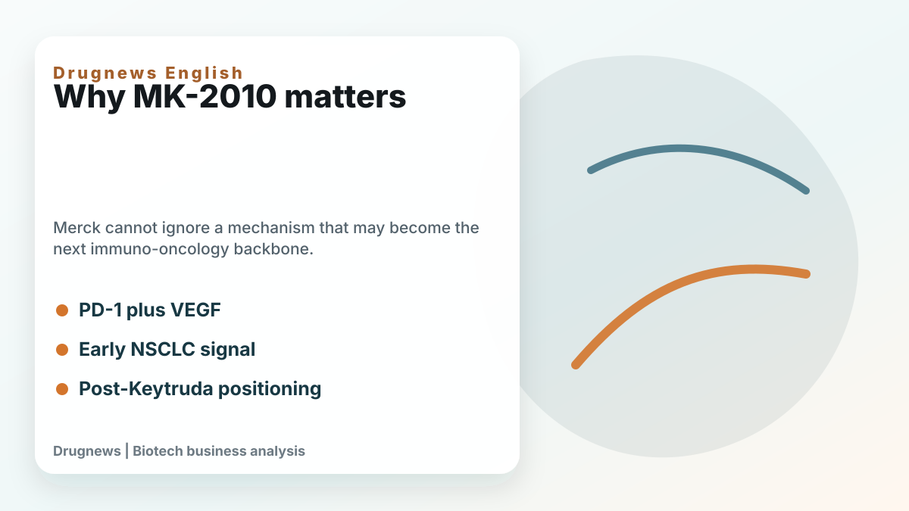
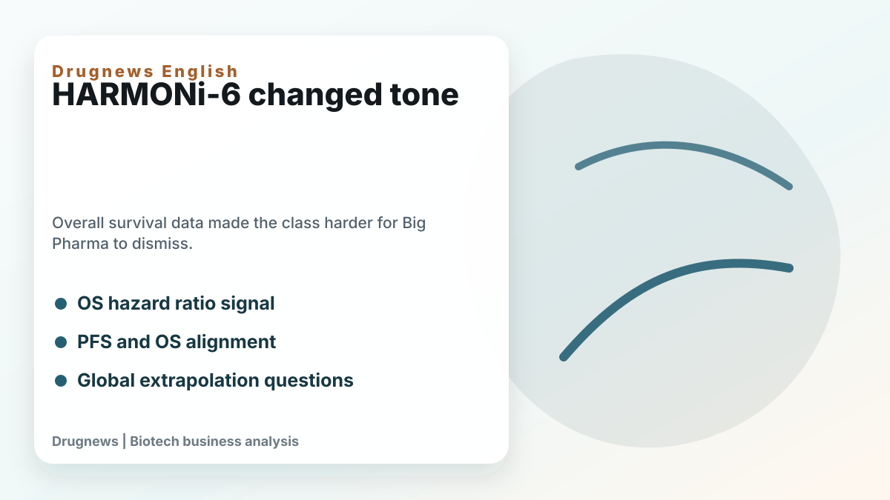
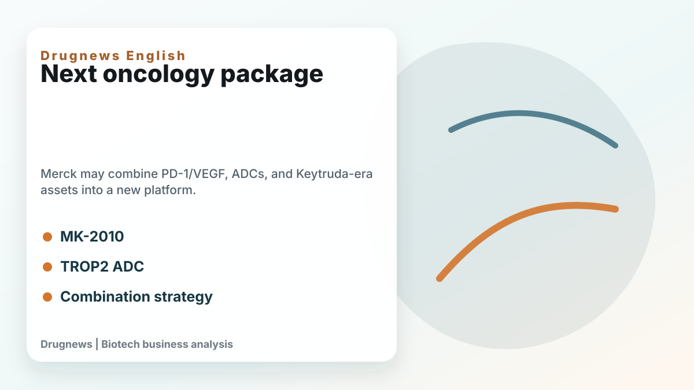

# Merck's Shift on PD-1/VEGF Bispecifics: Keytruda Still Rules, but the Next IO Backbone Is Getting Closer

Few companies understand PD-1 biology better than Merck. Keytruda has defined the modern immuno-oncology era and remains the foundation of Merck's oncology business.

That is exactly why Merck's attitude toward PD-1/VEGF bispecific antibodies matters. For a long time, the company's tone was cautious. The core question was whether the class could turn progression-free-survival improvement into overall-survival benefit. If not, Keytruda's position would remain largely protected.

After ASCO 2026, the tone looks different.

Merck has given MK-2010, formerly LM-299 from LaNova, a clearer place in its oncology narrative. The asset blocks both PD-1 and VEGF, combining checkpoint inhibition and anti-angiogenesis in one molecule. Early human data remain limited, but Merck described preliminary activity in non-small cell lung cancer and continued exploration as both monotherapy and in combinations.

The class became harder to dismiss after HARMONi-6. Ivonescimab plus chemotherapy showed an overall-survival advantage versus tislelizumab plus chemotherapy in first-line advanced squamous NSCLC. For a PD-1/VEGF bispecific, the key point was not only PFS. It was the possibility that dual-mechanism biology could produce survival benefit.

Merck still has reasonable questions. Can China data be extrapolated globally? Will elderly and comorbid patients tolerate the mechanism? Are safety risks such as hypertension, bleeding, proteinuria, thrombosis, and immune-related adverse events manageable at scale? Which tumor types and combinations are the right sweet spots?

Those questions matter. But the strategic shift is that Merck appears to be asking where and how to use the mechanism, not whether the mechanism deserves attention at all.

The other layer is Merck's broader post-Keytruda package. The company is not relying only on MK-2010. It also has sacituzumab tirumotecan, a TROP2 ADC, and other oncology assets that could be paired with immunotherapy backbones. The future may not be one successor to Keytruda, but a set of combinations: PD-1/VEGF bispecifics, ADCs, Keytruda, and other targeted or immune-modulating agents.

For investors, Merck's dilemma is simple. Keytruda is too successful to abandon, but the company cannot risk missing the next immuno-oncology backbone. MK-2010 is not yet the answer, but it has become an option Merck can no longer ignore.

That is the real meaning of Merck's shift. The Keytruda throne is still standing, but the shape of the next oncology throne is becoming visible.

This article is intended for industry research and knowledge sharing only. It does not constitute investment, medical, fundraising, or individual stock advice.
