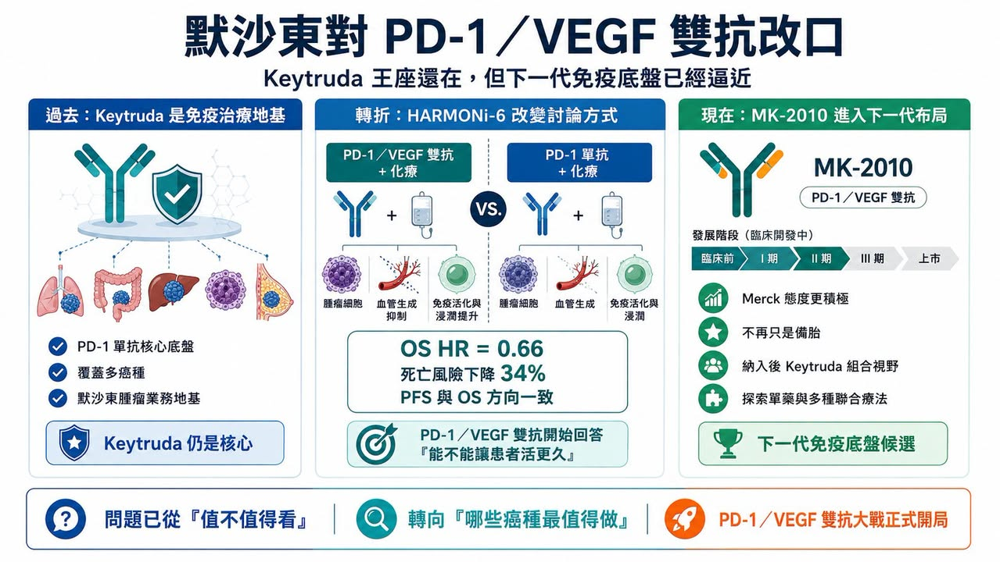
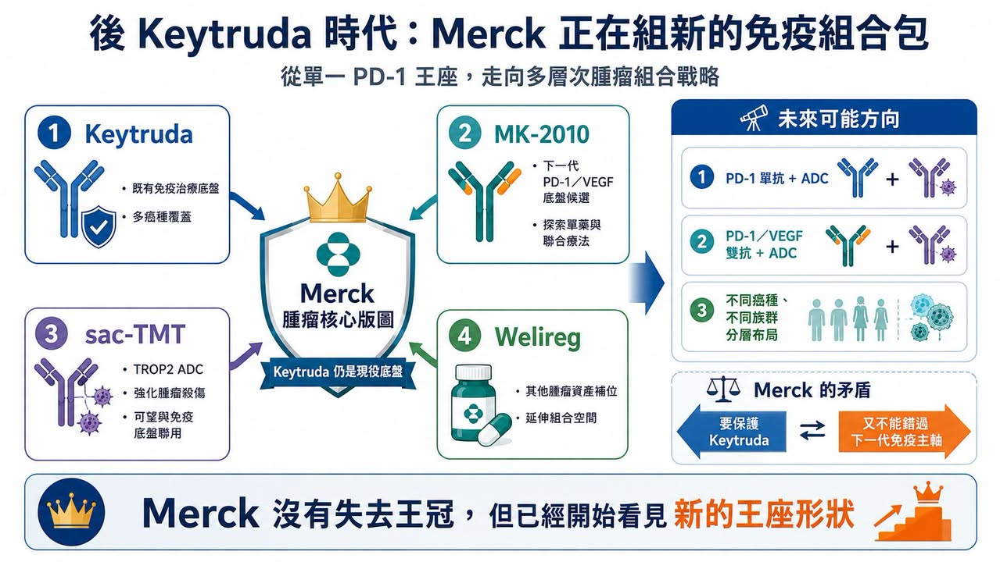
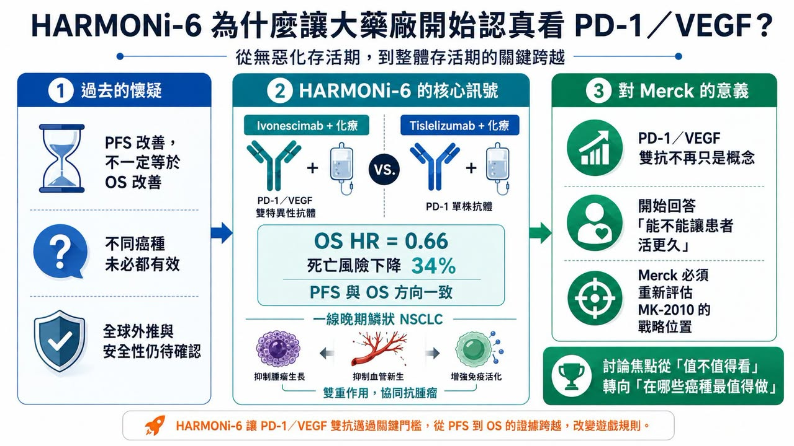
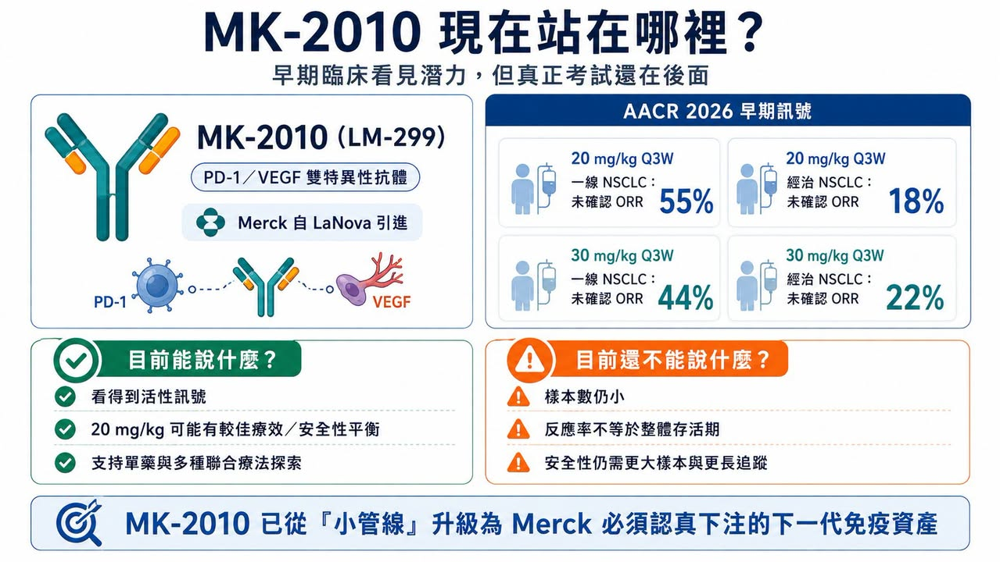

# 默沙東 對 PD-1／VEGF 雙抗改口：Keytruda 王座還在，但下一代免疫底盤已經逼近

在全球腫瘤藥市場裡，很少有一家公司比 Merck（默沙東）更懂 PD-1。

也很少有一款藥，比 Keytruda（pembrolizumab） 更能代表過去十年的腫瘤免疫治療。Keytruda 幾乎是現代腫瘤免疫療法的中心。肺癌、黑色素瘤、頭頸癌、胃癌、膀胱癌、腎癌、子宮內膜癌，太多癌種都繞不開它。對 Merck 來說，Keytruda 不只是一款產品，而是整個腫瘤事業的地基。

也正因如此，Merck 對 PD-1／VEGF 雙特異性抗體 的態度，格外值得看。過去一年，Merck 對這類藥物的語氣一直很克制。不是完全否定，但也不急著承認它會改變格局。核心疑問很簡單：PD-1／VEGF 雙抗能不能把無惡化存活期的改善，真正轉化成整體存活期的改善？

如果只能讓腫瘤晚一點進展，卻不能讓患者活得更久，那它對 Keytruda 的威脅就有限。但 2026 年 ASCO 之後，語氣開始變了。

Merck 在 ASCO 投資人簡報中，給了 MK-2010（LM-299） 這款 PD-1／VEGF 雙抗更清楚的位置。官方簡報中提到，MK-2010 在人體首次研究裡呈現鼓舞性的初步結果，20 mg/kg 每三週一次劑量下，在一線非小細胞肺癌回填隊列中未確認整體反應率為 55%，先前治療過患者為 18%；資料支持它作為單藥與多種聯合療法繼續探索。

這不是 Merck 第一次提到 MK-2010，但這次的語氣明顯不同。如果說過去 Merck 對 PD-1／VEGF 雙抗的態度是「觀察、保留、嚴格要求整體存活期」，那麼現在更像是：Keytruda 仍是核心，但 MK-2010 已經不能只是備胎。它開始被放進 Merck 下一代腫瘤免疫組合療法的視野裡。

## 01｜Merck 為什麼突然更重視 MK-2010？

MK-2010 原名 LM-299，來自 LaNova Medicines。2024 年，Merck 以 5.88 億美元首付款、最高 33 億美元總額的交易，取得 LM-299 的全球開發與商業化權利。這款藥物同時阻斷 PD-1 與 VEGF，試圖把免疫檢查點抑制與抗血管生成兩種機制放進同一個分子。

這筆交易在當時已經不小，但 Merck 之後對外談到 MK-2010 時，並沒有表現出非常激進的開發姿態。原因不難理解。

Merck 手上有 Keytruda。任何可能挑戰 Keytruda 地位的新免疫底盤，它都必須看得非常謹慎。如果太早承認 PD-1／VEGF 雙抗可能成為下一代腫瘤免疫主軸，等於某種程度承認 Keytruda 單抗時代正在走向尾聲。

但臨床資料不等人。

Ivonescimab 的 HARMONi-6 資料，把整個局面推進了一步。HARMONi-6 是 PD-1／VEGF 雙抗加化療，對比 PD-1 單抗 tislelizumab 加化療，用於一線晚期鱗狀非小細胞肺癌。研究結果顯示，ivonescimab 組死亡風險降低 34%，整體存活期風險比為 0.66。這是 PD-1／VEGF 雙抗第一次在這個場景裡用整體存活期資料，正面挑戰 PD-1 加化療方案。

這件事對 Merck 的意義很直接。如果 PD-1／VEGF 雙抗真的能把無惡化存活期優勢轉成整體存活期優勢，那它就不只是「另一種聯合療法」。它可能成為下一代腫瘤免疫骨架。而 Keytruda 最怕的，不是某一款藥在單一癌種做出一點進步。真正的威脅，是整個臨床開發邏輯從「PD-1 單抗作為基礎」轉向「PD-1／VEGF 雙抗作為基礎」。這才是 Merck 必須重新評估 MK-2010 的原因。

## 02｜HARMONi-6 為什麼讓大藥廠開始認真看 PD-1／VEGF？

過去 PD-1／VEGF 雙抗最常被質疑的地方，是整體存活期。

在很多腫瘤研究裡，無惡化存活期變好，不一定代表患者活得更久。腫瘤變慢一點，可能是影像學上的勝利；但整體存活期，才是真正最硬的終點。

HARMONi-6 的價值就在這裡。

它不是只告訴市場，PD-1／VEGF 雙抗可以讓腫瘤晚一點進展。它開始回答更尖銳的問題：這種雙機制設計，是否真的能讓患者活更久？HARMONi-6 讓人印象深刻的地方，還不只是整體存活期風險比 0.66，而是它的無惡化存活期與整體存活期方向一致。這和過去部分免疫加抗血管生成研究常見的「無惡化存活期漂亮、整體存活期不夠硬」形成差異。也因此，Merck 在最新交流裡對 HARMONi-6 的語氣不再只是冷處理。

第一，整體存活期與無惡化存活期的風險比接近，這點值得重視。

第二，安全性大致符合預期，沒有觀察到非常意外的不良事件。

第三，在某些情境下，PD-1／VEGF 雙抗的無惡化存活期改善，可能轉化成有臨床意義的整體存活期獲益。

這些話聽起來保守，但對 Merck 來說已經不算小。因為它等於承認：PD-1／VEGF 雙抗不是單純概念熱潮，而是可能在特定腫瘤場景裡形成真實臨床價值。

不過，Merck 也沒有完全放下防線。它提出了幾個質疑，尤其是 HARMONi-6 人群能否外推到更廣泛的全球患者。例如，研究入組年齡上限與美國鱗狀非小細胞肺癌高齡患者現實之間，可能存在差異。美國臨床上這類患者中位發病年齡偏高，老年患者共病也更多，因此安全性與療效外推必須謹慎。

再者，PD-1／VEGF 雙抗在不同癌種、不同研究中的曲線形態與風險比並不完全一致，表示這不是一個可以簡單套用到所有腫瘤的機制。這些質疑都合理。但更重要的是，Merck 已經從「這類藥物是否值得看」變成「這類藥物在哪些人群、哪些癌種、哪些聯合方案最值得做」。這就是態度的變化。

## 03｜MK-2010 現在的資料：看得到潛力，但還不到驚艷

MK-2010 的人體資料目前仍然很早期。

AACR 2026 公布的 MK-2010 研究顯示，在非小細胞肺癌隨機回填隊列中，20 mg/kg 每三週一次劑量，在一線患者中未確認整體反應率為 55%，在先前治療過患者中為 18%；30 mg/kg 劑量組一線與經治患者的未確認整體反應率分別為 44% 與 22%。這組資料可以說有潛力，但還不能說驚艷。原因有三個。

第一，樣本數太小。

一線 20 mg/kg 組只有十幾例患者。這種規模只能看訊號，不能下結論。

第二，反應率不等於整體存活期。

PD-1／VEGF 雙抗真正要證明的，是能不能帶來持久獲益，最好是整體存活期改善。反應率只是第一步。

第三，安全性仍需要更大樣本確認。

PD-1／VEGF 雙抗同時具有免疫與抗血管生成機制，因此蛋白尿、出血、高血壓、血栓、傷口癒合、免疫相關不良事件都需要長期觀察。

Merck 簡報中也提到，20 mg/kg 每三週一次看起來有較好的療效與安全性平衡，支援後續單藥與多種聯合設定探索。

所以，MK-2010 現在的位置很清楚：它不是已經證明自己能和 ivonescimab 或 pumitamig 正面競爭，但它也不再是 Merck 簡報裡一筆帶過的小管線。

它正在變成 Merck 必須認真下注的下一代免疫資產。

## 04｜Merck 真正想做的，不一定是複製 HARMONi-6

外界最容易問的問題是：Merck 會不會用 MK-2010 做一個類似 HARMONi-6 的大規模一線肺癌試驗？

答案可能沒有那麼直接。

從 Merck 目前語氣看，它不一定會選擇最寬泛、最燒錢、最正面對撞的策略。更可能的是，它會尋找所謂「甜蜜點」。

也就是找出哪些患者、哪些癌種、哪些聯合療法最可能從 PD-1／VEGF 雙抗中真正獲益。

這種思路其實很 Merck。Keytruda 之所以成功，不只是因為 PD-1 機制強，而是因為 Merck 用大量臨床研究，把不同癌種、不同 PD-L1 表達、不同聯合療法、不同治療線別，一層層推開。現在它也可能用同樣邏輯處理 MK-2010。問題是，這一次 Merck 沒有那麼多時間，因為競爭者已經先跑了。

Ivonescimab 已有中國 Phase 3 整體存活期資料。BioNTech 與 Bristol Myers Squibb 共同開發的 pumitamig（BNT327） 也在全球加速，BMS 甚至投入最高 111 億美元共同開發與商業化。Pfizer、Summit、Akeso、BioNTech、BMS 等玩家都在往 PD-(L)1／VEGF 方向推進。這條賽道已經不是一場小規模探索，而是下一代腫瘤免疫底盤之爭。因此，Merck 如果還是太慢，可能會錯過一個非常關鍵的轉折。

## 05｜sac-TMT 與 MK-2010：Merck 可能正在構築新的「後 Keytruda 組合包」
除了 MK-2010，Merck 手上還有另一張重要牌：sacituzumab tirumotecan（sac-TMT）。

Sac-TMT 是 TROP2 抗體藥物複合體，也就是 ADC。它由 Kelun-Biotech 開發，Merck 已取得相關權益。近期資料顯示，sac-TMT 與 Keytruda 聯合，在一線非小細胞肺癌中相較 Keytruda 單藥，降低疾病進展或死亡風險 65%，反應率也明顯較高。

這對 Merck 的意義很大。

因為它代表 Merck 的後 Keytruda 策略，不一定只有 MK-2010。它可能是多層組合：Keytruda 作為既有免疫底盤，sac-TMT 作為 ADC 彈頭，MK-2010 作為下一代 PD-1／VEGF 免疫底盤，再加上 Welireg（belzutifan） 等其他腫瘤資產，形成不同癌種、不同機制的組合策略。

Merck 官方管線資料也顯示，Welireg 正在以單藥或與 Keytruda 聯合方式開發。

這也是為什麼分析師會追問 Merck：未來會不會把 sac-TMT 與 PD-1／VEGF 雙抗搭起來？

邏輯很清楚。如果 PD-1／VEGF 雙抗能成為新免疫底盤，而 TROP2 ADC 能提供更強腫瘤殺傷，那麼兩者聯用就有可能成為下一代肺癌組合療法。

但 Merck 目前仍然沒有明確答案。

它的態度是開放，但沒有公開承諾。這種曖昧，反而說明局勢正在變化。如果 Merck 完全不重視 PD-1／VEGF，就沒有必要留這個空間。

## 06｜Kelun-Biotech 引進 CR-001，可能也在提醒 Merck：組合戰才剛開始
這裡還有一個值得注意的訊號。

Kelun-Biotech 自己也引進了 CR-001（SKB118） 的大中華區權益。CR-001 是由 Crescent Biopharma 開發的四價 PD-1／VEGF 雙抗，Crescent 官方資料將其定位為和 ivonescimab 類似機制的 PD-1 x VEGF 雙特異性抗體。

Kelun-Biotech 取得 CR-001 大中華區權益後，已獲中國 CDE 臨床試驗批准，並規劃推進 Phase 1／2 研究。

這件事很有意思。

Kelun-Biotech 一邊與 Merck 合作 sac-TMT，一邊自己引進 PD-1／VEGF 雙抗。這至少說明，TROP2 ADC 與 PD-1／VEGF 雙抗的組合邏輯，不是只有投資人想像，開發者自己也在提前佈局。

對 Merck 來說，這可能是一個提醒：如果下一代肺癌一線組合不再只是 Keytruda 加化療，而是 ADC 加雙抗、PD-1／VEGF 加 ADC，那麼它不能只守著舊底盤。它必須決定自己要在這個新組合時代扮演什麼角色。

是繼續讓 Keytruda 當核心？還是讓 MK-2010 逐步接棒？或者兩者並行，用不同癌種與不同族群分工？這些問題會決定 Merck 未來十年的腫瘤版圖。

## 07｜Merck 的矛盾：既要保護 Keytruda，也不能錯過下一代免疫主軸
Merck 現在最大的矛盾，是它太成功了。

Keytruda 太強，讓 Merck 不可能輕易承認下一代免疫底盤需要被改寫。但 Keytruda 也太大，讓 Merck 不能冒著錯過下一代療法的風險。這就是為什麼 Merck 對 PD-1／VEGF 雙抗的態度看起來有點「轉彎」，但又不是全面轉向。

它仍然強調 Keytruda 組合沒有改變。但它也開始把 MK-2010 放到更重要的位置。

它仍然質疑 HARMONi-6 是否能外推全球。但它也承認 PD-1／VEGF 雙抗在某些情況下可能帶來整體存活期獲益。

它仍然沒有公布 MK-2010 大規模 Phase 3 計畫。但它已經開始在投資人溝通裡更明確談到這個資產。

這不是簡單的改口，而是一家全球腫瘤一哥面對新機制威脅時，典型的戰略調整：先不承認對方會顛覆自己，再承認對方在某些場景有價值，接著用自己的資產卡位，最後視資料決定要不要全面進攻。

Merck 現在大概就在第二到第三步之間。

## 結語｜Merck 沒有失去王冠，但它已經開始看見新的王座形狀
Merck 對 MK-2010 的態度變化，很值得玩味。

它不是突然推翻自己過去的看法，而是 HARMONi-6 的整體存活期資料，讓 Merck 不得不重新評估 PD-1／VEGF 雙抗的份量。

Keytruda 仍然強大，但下一代免疫治療的形狀，正在改變。

它可能不再只是 PD-1 單抗，而是 PD-1／VEGF 雙抗、TROP2 ADC、HER3 ADC、雙抗、小分子、放射藥物與腫瘤疫苗共同組成的新組合。對 Merck 來說，MK-2010 也許還不是答案，但它已經不能沒有這個選項。

對整個產業來說，HARMONi-6 的價值不只是讓 ivonescimab 更有想像空間。更重要的是，它讓全球腫瘤一哥開始重新思考：下一個十年的免疫治療底盤，會不會真的不再只是 Keytruda？

這個問題現在還沒有最終答案，但 Merck 的身體已經比嘴巴誠實。它開始把 MK-2010 放上桌面。而這，可能只是 PD-1／VEGF 雙抗大戰真正開局的第一聲槍響。

參考資料：

1. [Merck product pipeline](https://www.merck.com/research/product-pipeline/)
2. [Merck Keytruda prescribing information](https://www.merck.com/product/usa/pi_circulars/k/keytruda/keytruda_pi.pdf)
3. [Summit Therapeutics: ivonescimab clinical development](https://www.smmttx.com/)
4. 各公司官網與公開資料

---

本文僅供產業研究與知識分享，不構成投資、醫療、募資或個股建議。
